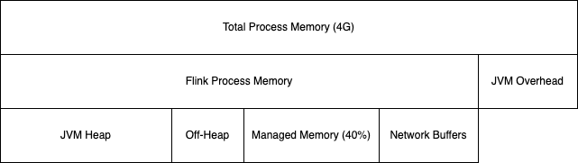
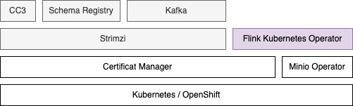
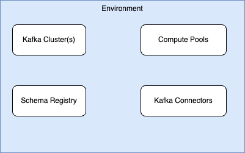
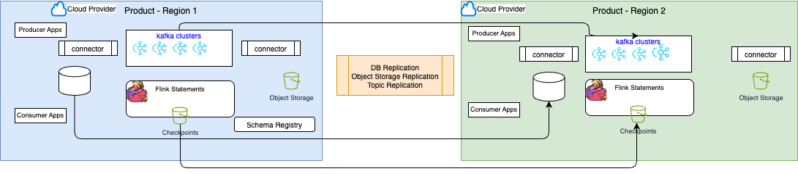
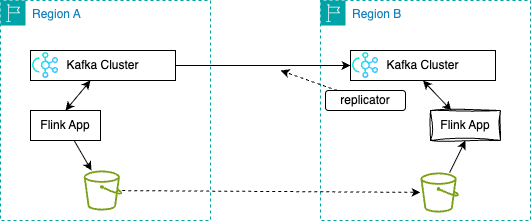

# Cluster & Environment Management

## 1- Provisioning and Scaling Clusters

### 1.0 Sizing Flink Resources

#### Context
Sizing a Flink cluster is a complex project task, influenced by many factors, including workload demands, application logic, data characteristics, expected state size, required throughput and latency, concurrency, and hardware. 

Because of those variables, every Flink deployment needs a unique sizing approach. The most effective method is to run a real job, on real hardware and tune Flink to that specific workload.

For architects seeking sizing guidance, it's helpful to consider:

* the workload semantic complexity, with the usage of aggregations, joins, windows, processing type, 
* the input throughput (MB/s or records/second), 
* the expected state size (GB), 
* the expected latency.

While Kafka sizing estimates are based on throughput and latency, this is a very crude method for Flink, as it overlooks many critical details. 

For new Flink deployments, a preliminary estimate can be provided, but it's important to stress its inexact nature. 

A simple Flink job can process approximately **10,000 records per second per CPU**. However, a more substantial job, based on benchmarks, might process closer to 5,000 records per second per CPU. Estimations may use record size, throughput, and Flink statement complexity to estimate CPU load.

Flink Task manager runs in JVM, and we should see the memory allocation as described in the figure below:

<figure markdown="span">

<figcaption>Figure 1: Task Manager Memory Allocation</figcaption>
</figure>

* **Total Process Memory**: Memory allocated to the JVM process. 
    ```yaml
    spec:
      containers:
      - name: taskmanager
        image: flink:latest
        resources:
          requests:
            memory: "4Gi"
            cpu: "2"
          limits:
            memory: "4Gi"
            cpu: "2"
        env:
        - name: FLINK_PROPERTIES
          value: |
            taskmanager.numberOfTaskSlots: 2
            taskmanager.memory.process.size: 4096m
    ```

* **Flink memory** is used by the Flink code, and is decomposed by 1/ <ins>network buffers</ins> to exchange partitions among operators, 2/ <ins>managed memory</ins> for state persistence buffering when using RockDB or ForSt, 3/ <ins>Task and Framework Off-heap</ins>, 4/ <ins>JVM Heap</ins>

* For stateful streaming workloads, **managed memory** is usually the parameter that matters most. Shrink it and RocksDB gets less off-heap room for its block cache and other structures, so hot state falls back to disk more often and end-to-end latency increases. Grow it without proportionally sizing the **JVM heap** and the heap side for user functions can be squeezed, with GC events more likely to destabilize or fail the process.

* In context of Confluent Platform for Flink, or Apache Flink, the deployment entity is an Application, which means 1 job manager and 1 to many task managers. So Kubernetes worker nodes host multiple job managers and Task managers. For most of the case the Job Manager use one core and 2GB of RAM. But when the number of keys in state grows it may be needed to go to 2-4 cores and 4-8 GB.

#### Preconditions / Checklist

Assess the following characteristics of each Flink application:

* Desired Throughput and Latency
* Message Size, data skew, number of distinct keys
* Operator types, checkpoint interval, state size, parallelism
* Concurrent Jobs

Assess Hardware constraints:

* Number of worker nodes
* Memory and CPU per worker node
* Network bandwidth

#### CP Flink Estimation

I tentatively built a [flink-estimator webapp](https://github.com/jbcodeforce/flink-estimator) with backend estimator for Apache Flink or Confluent Platform Cluster sizing.

The tool needs to be simple, so it persists the estimation as json on the local disk. 

To access this web app there is a docker image at [dockerhub - flink-estimator](https://hub.docker.com/repository/docker/jbcodeforce/flink-estimator/general). 

The approach is to clone the repository: [https://github.com/jbcodeforce/flink-estimator](https://github.com/jbcodeforce/flink-estimator) 

* use `docker-compose up -d` 
* Access via web browser [http://localhost:8002/](http://localhost:8002/)
    <figure markdown="span">
    
    </figure>

### 1.1 Bring up new cluster/environment.
#### Context
Use this when you need a new Flink environment (e.g., dev / stage / prod or a new region) backed by one of:

* Confluent Cloud environment
* A Kubernetes cluster (new or existing).
* CP Flink components installed via Helm (Flink K8s Operator + CMF).
* An existing Kafka cluster (Confluent Platform or Confluent Cloud).

Out of scope: deep infra provisioning automation, this focuses on the Flink layer once K8s and Kafka exist.

The Components to install for each deployment approach:

=== "Confluent Platform"
    In the context of a Confluent Platform deployment, the components to install are represented in the following figure from bottom to higher layer:

    

=== "Open Source Approach"
    For an equivalent open source the components are:

    

=== "Confluent Cloud"
    Confluent Cloud is a serverless SaaS. The deployment includes the following components, deployable via infrastructure as code:

    

#### Preconditions / Checklist

* kubectl, helm, confluent CLIs
* Sizing / T-shirt: from [Project estimator](https://github.com/jbcodeforce/flink-estimator): Rough T-shirt size for CMF, operator, JobManagers, TaskManagers (CPU, memory) based on expected jobs and throughput.
* Information about Kafka bootstrap endpoints, schema registry URL
* Durable Storage for State: Object store or filesystem accessible from all K8s nodes (e.g., S3/GCS/minio, HDFS) for checkpoints/savepoints.

#### Inputs / Parameters
The following potential parameters may be needed to externalize:

**For Private Deployment**

* K8S_NAMESPACE_CMF (e.g., cpf)
* K8S_NAMESPACE_FLINK (e.g., flink)
* CMF_HELM_VERSION (e.g., ~2.1.0)
* FKO_HELM_VERSION (e.g., ~1.130.0)
* CHECKPOINT_URI (e.g., s3://my-bucket/flink/checkpoints/)
* SAVEPOINT_URI (optional, e.g., s3://my-bucket/flink/savepoints/)
* ENV_NAME (e.g., development, staging, prod)

**For Confluent Cloud**

* CONFLUENT_CLOUD_API_KEY
* CONFLUENT_CLOUD_API_SECRET
* CONFLUENT_CLOUD_REST_ENDPOINT
* KAFKA_API_KEY
* KAFKA_API_SECRET
* KAFKA_CLUSTER_ID

#### Procedure

We list here the high level steps. For [dedicated chapter on Kubernetes deployment](../coding/k8s-deploy.md)

For **Apache Flink or Confluent Platform:**

1. Prepare Kubernetes Namespaces
* Install Flink Kubernetes Operator (FKO)
* Install Confluent Manager for Apache Flink (CMF) - Not need for pure Apache Flink
* Configure Durable Storage for State
* Expose CMF API for Environment Management
* Create a Flink Environment (Logical Environment)
* Smoke-Test with an Example Application

#### Gotchas
* Durable storage is not optional in production; losing it means losing consistent recovery 
* For multi-namespace or multi-cluster topologies, leverage CMF’s multi-cluster support
* Adopting a declarative configuration for all applications and infrastructure components deployed to Kubernetes clusters with ArgoCD: [see Rick Osowski's repository](https://github.com/osowski/confluent-platform-gitops) addressing a GitOps practices for Confluent Platform deployment running on Kubernetes.

### 1.2 Adjust cluster resources (more TaskManagers, more slots).

#### Context
Use this when a Flink job or compute pool is under-provisioned: sustained backpressure, growing Kafka lag, or repeated “NoRecentCheckpoints”/resource exhaustion alerts or when on Confluent Cloud the statement becomes `Degraded`. 

**Confluent Platform for Flink or Apache Flink:**

When you need to increase or decrease the cluster’s capacity by adding/removing TaskManagers, or by changing `taskmanager.numberOfTaskSlots` (slots per TM).

This recipe is primarily cluster/platform facing; job-level parallelism tuning is covered in a separate “Scale a Flink Job” recipe.

Always try to clarify the goal:

* Reduce backpressure / lag.
* Accommodate larger state (checkpoints/savepoints, RocksDB state) or Statement State becoming too big.
* Support more concurrent jobs/statements in a shared pool.

#### Preconditions / Checklist

* Have a good understanding of the performance situation with observability stack like Grafana dasboards and other metrics
* Get a clear assessment of the current number of Task managers and task slots per task manager
* Confirm current job parallelism and utilization
* Revisit current traffic pattern, versus the one used for platform sizing

#### Inputs / Parameters

* Current compute pool limits
* Current number of jobs per compute pool

#### Procedure

1. Diagnose whether you need more TMs, more Slots, or both. Check TM utilization and slot usage:
    * Are TaskManagers at or near 100% busy?
    * Are all slots occupied? Are there idle slots but backpressure at specific operators?
* Check compute-pool / CFU limits (CP Flink / CCFlink): Ensure your target TM count/size stays within declared the limit; large TMs and more slots affect costs.
* Adjust TaskManager count for horizontal scaling - (CP and OSS). 
    * Adjust max CFU per compute pool, add more compute pool in Confluent Cloud. TM count is controlled indirectly via compute pool CFU and Autopilot/DSA; horizontal scaling is typically automatic.
    * For operator-only K8s Flink, TM count commonly set via deployment/Helm values for the TaskManager deployment (e.g., replicas in K8s or CFK spec).

* Monitor - Check that:
    * Backpressure decreases.
    * Checkpoint durations stabilize or drop (CP or OSS).
    * TM CPU/memory are in a reasonable range (no massive under-utilization).

* (Optional) Scale down later (CP or OSS): Once load drops, you can scale TMs down again to save resources. In CCFlink Autopilot will handle this automatically.
* Adjust Slots Per TaskManager (Vertical Slot Scaling). Change `taskmanager.numberOfTaskSlots` to alter concurrency per TM. Get at least one core per busy slot for non-trivial jobs.

???- info "Understand slot semantics"
    Each TaskManager is a JVM process; each slot is a fixed share of that TM’s resources. More slots per TM = more tasks sharing CPU, heap, network and disk; good for many small jobs, risky for heavy jobs.

    Update slot configuration. In a FlinkApplication / K8s spec (CP Flink example):
    ```json
        "flinkConfiguration": {
        "taskmanager.numberOfTaskSlots": "2"
        }
    ```

    Changing taskmanager.numberOfTaskSlots typically requires restarting TaskManagers

    Watch for increased GC pressure and longer checkpoint times. Assess disk I/O saturation (RocksDB state, shuffle).

#### Rollback

If the change makes things worse (more instability, timeouts, cost spikes):

* Revert TM Count / Slots
* If jobs fail or degrade: Temporarily move the most critical jobs to a separate, known-good pool / cluster with conservative settings. Then investigate per-job parallelism / skew, the RocksDB / disk hot spots, the autoscaler behavior.
* Document Effective Settings

## 2- Upgrading Flink and Cluster Components

### 2.1 Upgrade Flink minor/patch versions.
#### Context
#### Preconditions / Checklist
#### Inputs / Parameters
#### Procedure
#### Rollback
#### Gotchas
### 2.2  Rolling upgrades and compatibility considerations.
#### Context
#### Preconditions / Checklist
#### Inputs / Parameters
#### Procedure
#### Rollback
#### Gotchas
## 3 Disaster Recovery & Multi-Region Strategies

Disaster recovery for Flink depends on the deployment model (Confluent Cloud, Confluent Platform, or open-source) and always requires a DR strategy for Kafka and Schema Registry first. Data and schema replication (exact replication including offsets and schemas) are prerequisites; Flink state recovery builds on that. See [Confluent Cloud Flink — Disaster Recovery](../techno/ccloud-flink.md#disaster-recovery) and [CP Flink deployment architecture](../techno/cp-flink.md#deployment-architecture) for the concepts summarized here.

### 3.1 Backup/restore of state backend

#### Context

Use this when you need to back up Flink job state for recovery, upgrades, or migration, or when designing for regional failure (disaster recovery). Flink state is captured via **checkpoints** (automatic, lightweight, Flink-managed) and **savepoints** (manual, portable, user-managed).

* **Checkpoints**: Provide automatic recovery from job failures. Flink creates, owns, and may delete them. Stored in state-backend–specific (native) format; optimized for fast restore. In production, store checkpoints in durable, shared storage (e.g. S3, GCS, HDFS, MinIO) so that JobManagers and TaskManagers can recover after process or node failure.
* **Savepoints**: User-triggered, consistent images of job state for planned operations (version upgrades, graph changes, rescaling). Stored in canonical (backend-independent) or native format; not deleted by Flink. Required when you need to restore a job in another region or after a major change.

**By deployment:**

* **Confluent Cloud**: Regional, multi-AZ service. Checkpoints run every minute for in-region fault tolerance. No user-configurable state backend; state is managed by the service. In a region loss, there is no built-in cross-region state restore—you must implement a cross-region DR strategy (see [3.2](#32-active-active--active-passive-patterns)).
* **Confluent Platform (CMF) / Kubernetes**: Checkpoints and savepoints go to object or distributed storage (e.g. S3, HDFS). [CMF supports Savepoint resources](https://docs.confluent.io/platform/current/flink/jobs/savepoints.html) (trigger, list, detach, start from savepoint) via REST API. For failover between data centers, durable storage must be accessible from both (or replicated); Kafka topics (and offsets) must be replicated; then Flink applications can be restarted from checkpoints/savepoints in the DR site.
* **Open-source Flink (e.g. K8s operator)**: Same concepts; configure `state.checkpoints.dir` and optional `state.savepoints.dir` to durable storage. Use [Kubernetes HA](https://nightlies.apache.org/flink/flink-docs-stable/docs/deployment/ha/kubernetes_ha/) with `high-availability.storageDir` for JobManager metadata.

#### Preconditions / Checklist

* Durable, shared storage for checkpoints (and savepoints) that all Flink processes can access (e.g. S3 bucket, HDFS, GCS, MinIO). For cross-DC DR, storage must be reachable from the DR site or replicated.
* Checkpointing enabled in the job (and optionally configured retention).
* For savepoints: job is running (or you have an existing savepoint path to adopt/import).
* For Confluent Cloud: no direct state-backend configuration; ensure Kafka + Schema Registry DR (e.g. [Cluster Linking](https://docs.confluent.io/cloud/current/multi-cloud/cluster-linking/dr-failover.html), [Schema Linking](https://docs.confluent.io/cloud/current/sr/schema-linking.html)) before designing Flink DR.

#### Inputs / Parameters

| Parameter | Description |
| ---------| ----------- |
| `state.checkpoints.dir` | Directory for checkpoints (e.g. `s3://bucket/flink/checkpoints/`). |
| `state.savepoints.dir` | Optional directory for savepoints. |
| `execution.checkpointing.interval` | Checkpoint interval (e.g. `1 min`). |
| `execution.checkpointing.externalized-checkpoint-retention` | `RETAIN_ON_CANCELLATION` or `DELETE_ON_CANCELLATION`. |
| Savepoint path | For restore: path returned when creating a savepoint, or CMF savepoint name/UID. |

#### Procedure

**Backup (savepoint) — Confluent Platform / CMF**

1. Trigger a savepoint via CMF API (applications or statements):
    * `POST /cmf/api/v1/environments/{env}/applications/{appName}/savepoints` or `.../statements/{stmtName}/savepoints`
    * Optional body: `spec.path`, `spec.formatType` (e.g. `CANONICAL`), `spec.backoffLimit`.
2. Poll or watch savepoint status until `status.state` is `COMPLETED`; use `status.path` as the restore path.
3. Optionally detach the savepoint (applications only) to preserve it after deleting the application: `POST .../savepoints/{savepointName}/detach`. For external/open-source savepoints, register as detached: `POST /cmf/api/v1/detached-savepoints` with `spec.path`.

**Backup (checkpoint) — self-managed (CP/OSS)**

1. Ensure `state.checkpoints.dir` points to durable storage (e.g. [enable checkpointing to S3](https://docs.confluent.io/platform/current/flink/how-to-guides/checkpoint-s3.html)).
2. Let Flink create checkpoints at the configured interval. Optionally set `execution.checkpointing.externalized-checkpoint-retention` to retain checkpoints on cancel.
3. For a consistent “backup” suitable for migration or DR, trigger a savepoint (as above) rather than relying only on the last checkpoint.

**Restore**

1. **From savepoint**: Start the application with `startFromSavepoint` set to the savepoint path, CMF savepoint name, or UID. In CMF: create/update application with `savepointName`/`uid`/`initialSavepointPath`, or `POST .../applications/{appName}/start?startFromSavepointUid={uid}`.
2. **From checkpoint (automatic)**: After a failure, Flink (and K8s HA if configured) restarts the job and restores from the latest successful checkpoint when no savepoint is specified.
3. **Confluent Cloud**: Failed statements auto-restart using the last checkpoint; there is no user-visible backup/restore of state to another region—use active-active or active-passive (see 3.2).

#### Rollback

* If a restore from savepoint fails or the job misbehaves: stop the job, fix code or state compatibility, then start again from an earlier savepoint or from scratch (no savepoint).
* If you restored with wrong parallelism or backend: take a new savepoint, adjust config, and restore from that savepoint (canonical savepoints support state backend change and rescaling; see [Flink checkpoints vs savepoints](https://nightlies.apache.org/flink/flink-docs-stable/docs/ops/state/checkpoints_vs_savepoints/)).

#### Gotchas

* Checkpoints are often incremental and backend-specific; savepoints in canonical format are portable and support state backend change and rescaling. Native savepoints are faster but have limitations (e.g. no state backend change).
* You cannot create a canonical savepoint for a job with an operator using `enableAsyncState()` (CMF/Flink).
* Deleting an attached savepoint in CMF requires the Flink cluster to be running; use `force=true` only when necessary (can leave orphaned data in blob storage).
* Confluent Cloud does not expose state backend or checkpoint/savepoint paths; DR is achieved by running Flink in the DR region against replicated Kafka/Schema Registry and accepting state rebuild or active-active/active-passive design.

### 3.2 Active-active / active-passive patterns

#### Context

Use this when you need to survive a full region or data-center failure. Flink DR options assume **Kafka and Schema Registry DR** first: exact replication of data (including consumer offsets) and schemas. On Confluent Cloud, [Cluster Linking](https://docs.confluent.io/cloud/current/multi-cloud/cluster-linking/dr-failover.html) and [Schema Linking](https://docs.confluent.io/cloud/current/sr/schema-linking.html) provide topic and schema replication. On Confluent Platform or self-managed, you replicate topics (and offsets) and schemas by your own means (e.g. MirrorMaker, cluster links, or shared storage).

Two main patterns:

* **Active/active**: Two (or more) regions run identical Flink jobs continuously, both processing the same input (with replication delay in the secondary). Best for low RTO, large state, or when you need exactly-once semantics and both regions to produce the same results.
* **Active/passive**: Flink runs only in the primary region; in the DR region, Flink jobs are started on failover. Best when state can be recreated quickly (e.g. stateless or small time windows) or when at-least-once/at-most-once is acceptable.

These patterns are described in [Confluent Cloud Flink — Disaster Recovery](../techno/ccloud-flink.md#disaster-recovery); a generic DR components view:

<figure markdown="span">

</figure>

For Confluent Platform / Kubernetes with shared durable storage and Kafka replication:
<figure markdown="span">

</figure>

#### Preconditions / Checklist

* Kafka (and Schema Registry) DR is in place: topics and consumer offsets replicated to the DR cluster; schemas replicated (e.g. Schema Linking on Confluent Cloud).
* RTO and RPO defined: how long failover can take and how much data loss is acceptable. Cluster Linking is asynchronous—RPO is bounded by mirror lag; RTO depends on client failover and (for active-passive) time to start Flink and restore state.
* For active-active: Flink jobs must be deterministic and tolerate out-of-order input; replicate only input topics and keep config (RBAC, networking) aligned across regions.
* For active-passive: Topic retention in DR must exceed the time needed to rebuild state (e.g. window size or TTL). Use event time (not processing time) for windows and aggregations so replay produces correct results.

#### Inputs / Parameters

| Parameter | Description |
| ---------| ----------- |
| Primary / DR cluster bootstrap, API keys | Stored in service discovery / vault for fast client switch on failover. |
| Cluster link config (Confluent Cloud) | Consumer offset sync, ACL sync, mirror topics (or auto-create), optional filters. |
| Flink state recreation window | For active-passive: max window/TTL and retention must allow full replay. |
| Semantics | Exactly-once (active-active with deterministic jobs), at-least-once, or at-most-once (affects duplicate handling and restore guarantees). |

#### Procedure

**Active/active (Confluent Cloud or multi-region)**

1. Replicate **only input topics** to the DR region (e.g. cluster link from primary to DR). Do not replicate Flink output topics into the other region’s input to avoid feedback loops.
2. Deploy the same Flink statements/jobs in both regions, reading from the local Kafka cluster (primary or DR copy). Ensure queries are deterministic and support out-of-order arrival.
3. Mirror configuration: same service accounts, RBAC, private networking, and table/job definitions in both regions.
4. On regional failure: direct clients (producers/consumers) to the DR cluster (bootstrap and credentials via service discovery/vault); Flink in DR is already running.

**Active/passive**

1. Set up DR cluster with mirrored topics (and consumer offsets) and schemas. Ensure retention in DR > time to rebuild Flink state (window size or TTL).
2. Keep Flink job definitions and savepoints/checkpoint config in version control or automation. Do not run Flink in DR during normal operation.
3. On failover: switch clients to the DR cluster; create/start Flink environment and statements in DR (from savepoint if available, or from earliest offset so state is rebuilt from replicated input). Prefer event-time windows so replay is correct.
4. Confluent Cloud: see [Cluster Linking DR and Failover](https://docs.confluent.io/cloud/current/multi-cloud/cluster-linking/dr-failover.html) (create DR cluster, cluster link, mirror topics, consumer offset sync, ACL sync). Provision API keys for the DR cluster in advance and store them in a vault for low RTO.

**Monitoring**

* Monitor mirror lag (Confluent Cloud Metrics API, Console, or REST) to bound RPO. Practice failover to meet RTO.

#### Rollback

* After primary region recovery: decide whether to fail back (switch clients and optionally Flink back to primary) or keep running in DR. If failing back, replicate any new data produced in DR back to primary (e.g. bidirectional cluster link) and then switch clients and Flink back to primary.

#### Gotchas

* All Flink DR depends on Kafka (and SR) DR; without replicated topics and offsets, Flink cannot recover correctly in the DR region.
* Active-passive with stateful jobs: RTO must be greater than the time to restore state from replicated input; otherwise use active-active or accept semantics/state trade-offs.
* Consumer offset sync (Confluent Cloud) is asynchronous; after failover, consumers may see a small number of duplicates—design for idempotency.
* Confluent Cloud is regional: there is no built-in cross-region state replication; you achieve DR by running Flink in the DR region and feeding it from replicated Kafka/Schema Registry.