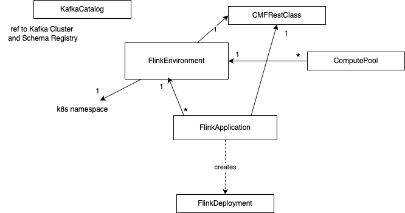

# Deployment Model and Considerations

## Deployment Models

Flink may be deployed as standalone servers, within Kubernetes and Flink Operator, YARN or as managed services. 

As seen in the architecture chapter, the components to consider are Job manager and Task managers. But in production deployment other services are very important to address.

<figure markdown="span">

<figcaption>Figure 1: Flink Components & Services</figcaption>
</figure>

* **Job Manager** in application mode runs the cluster exclusively for one application. This is the recommended mode for resource isolation and load balancing.
* **HA service:** Flink's JobManager can be run in high availability mode which allows Flink to recover from JobManager faults. In order to failover faster, multiple standby JobManagers can be started to act as backups. Such service may be Zookeeper or Kubernetes job scheduler.
* **Storage service** for checkpoints management
* **Resource service:** kubernetes or Yarn for process scheduling and resource management
* **Sink or source connectors** for read/write operators: Kafka, Object Storage (S3), ElasticSearch,

In application mode, the user jars are bundled with the Flink distribution, and most likely packaged as a container image.

### Apache Flink Standalone

The key points to work on:
* The processes presented above are executed within the host operating system.
* SREs have to restart failed processes, or allocation and de-allocation of resources during operation
* For getting HA, Zookeeper needs to be started, and the Flink configuration needs to be changed to support multiple Job Managers.
* Local directory is configured to store important information, like job state and metadata, to be used during recovery. Job identity helps to find persisted information.

<figure markdown="span">

<figcaption>Figure 2: Apache Flink Bare Metal Components for Production</figcaption>
</figure>

[See product chapter](https://nightlies.apache.org/flink/flink-docs-release-2.2/docs/deployment/resource-providers/standalone/overview/) for the scripts to use.

### Apache Flink within Kubernetes

For Kubernetes deployment, we should distinct three different mode of deployment:

1. Standalone: the barebone deployment on kubernetes
1. Native Kubernetes
1. Flink Kubernetes Operator

Apache Flink has defined a Kubernetes Operator (FKO) to deploy and manage custom resources for Flink deployments.

[Apache Flink Kubernetes Operator](https://nightlies.apache.org/flink/flink-kubernetes-operator-docs-main/)(FKO) acts as a control plane to manage the complete deployment lifecycle of Apache Flink applications. 

<figure markdown="span">

<figcaption>Figure 3: Apache Flink Kubernetes Operator to manage Flink Job and Task managers</figcaption>
</figure>

The [operator](https://nightlies.apache.org/flink/flink-kubernetes-operator-docs-main/) takes care of submitting, savepointing, upgrading and generally managing Flink jobs using the built-in Flink Kubernetes integration. The operator fully automates the entire lifecycle of the job manager, the task managers, and the applications. A FlinkDeployment is a manifest to define what needs to be deployed, and then the FKO manages the deployment by using Kubernetes deployments, pods... It supports query on the custom resources it manages. 

Failures of Job Manager pod are handled by the Deployment Controller which takes care of spawning a new Job Manager.

As any Kubernetes operators, FKO can run **namespace-scoped**, to get multiple versions of the operator in the same Kubernetes cluster, or **cluster-scoped** for highly distributed  deployment. The operator maps its custom resources to existing Kubernetes resources of deployments, replica sets, config maps, secrets, service accounts...

The following figure represents a simple deployment view of a Flink Cluster, in parallel of a Kafka cluster running on a Kubernetes platform:

<figure markdown="span">

<figcaption>Figure 4: Flink and Kafka OSS - K8S deployment</figcaption>
</figure>

The FKO may have two instances running in parallel. A Flink application may run on its own namespace and will be one job manager and n task managers. 
The Kafka cluster runs in its own namespace. PVC or File services are needed for Flink to persist checkpoints and savepoints. 

#### Apache Flink Custom Resources

Once the Flink for Kubernetes Operator is running, we can submit jobs using  `FlinkDeployment` (for Flink Application or for Job manager and task manager for session cluster) and `FlinkSessionJob` for Flink Session. The following figure represents those concepts: 

<figure markdown=span>

<caption>FKO main Custom Resources Definitions</capture>
</figure>

On the left, a `FlinkSessionJob` references an existing FlinkDeployment as multiple session jobs can run into the same Flink cluster. The `job` declaration specifies the code to run with its specific configuration. While on the right, the application mode, has the job definition as part of the FlinkDeployment, as the JobManager and TaskManager mininum resource requirements.

The [Apache Flink FlinkDeployment spec is here](https://nightlies.apache.org/flink/flink-Kubernetes-operator-docs-main/docs/custom-resource/reference/) and is used to define Flink application (will have a job section) or session cluster (only job and task managers configuration).

The custom resource definition that describes the schema of a FlinkDeployment is a cluster wide resource. The Operator continuously tracks cluster events relating to the `FlinkDeployment` and `FlinkSessionJob` custom resources. [The operator control flow is described in this note.](https://nightlies.apache.org/flink/flink-kubernetes-operator-docs-main/docs/concepts/controller-flow/). The important points to remember are:

* The operator control flow is: 1/ Observes the status of the currently deployed resource. 2/ Validates the new resource spec, 3/ Reconciles any required changes based on the new spec and the observed status.
* The **Observer** module assesses the current stateus of any deployed Flink resources. 
* Observer is responsible for application upgrade.
* The job manager is validated via a call to its REST api and the status is recorded in the `jobManagerDeploymentStatus`
* A Job cannot be in running state without a healthy jobmanager.

A **Flink Application** is any user's program that spawns one or multiple Flink jobs from its `main()` method and is deploying a JobManager and n Task managers. They may run in their own namespace. 


The **Flink Kubernetes Operator** is looking at different `Flink Deployment`, so it can be isolated within its own namespace.

???- info "Practices"
     When deploying the FKO it is important to **specify the namespaces to watch** for future deployments. The following command modify this list:
    ```sh
    helm upgrade --install cp-flink-Kubernetes-operator --version "~1.130.0"  confluentinc/flink-Kubernetes-operator --set watchNamespace="{flink, confluent, el-demo, rental}" -n flink
    ```

    It is important to delete the operator pod and let Kubernetes restarts the FKO pod with the new config.


It is important to note that `FlinkDeployment` and `FlinkApplication` CRDs have a podTemplate, so ConfigMap(s) and Secret(s) can be used to configure environment variables for the Flink app. (Be sure to keep the container name as `flink-main-container`)

```yaml
spec:
  podTemplate:
    spec:
      containers:
        - name: flink-main-container
          envFrom:
            - configMapRef:
                name: flink-app-cm
```


### Confluent Cloud - Manager Services


### Confluent Manager for Flink

The deployments for [Confluent Platform](https://docs.confluent.io/operator/current/overview.html) and Confluent Manager for Flink, may look like in the following figure:

<figure markdown="span">

<figcaption>Figure 3: K8S deployment</figcaption>
</figure>

[Confluent for Kubernetes Operator (CFK)](https://docs.confluent.io/operator/current/overview.html) is the control plane for deploying and managing Confluent in your Kubernetes private cloud environment. It defines custom resource definitions to support Kafka based resources like brokers, kraft controllers, topics, schema registry, connectors, cmfrestclass,...

[Confluent Manager for Apache Flink®](https://docs.confluent.io/platform/current/flink/installation/overview.html#install-and-upgrade-cmf-long) (CMF) is a Kubernetes operator, to manage Confluent Flink Applications, Environments, Compute pools, SQL Catalogs, we will detail those in a later section. CMF integrates with FKO to support Flink native custom resources.

The following figure illustrates the relationships between those kubernetes operators:

<figure markdown="span">

<figcaption>Figure 4: The operators playing together</figcaption>
</figure>

It is important to note that all Kubernetes Custom Resource deployments via `kubectl` go to the CFK with the `apiVersion: platform.confluent.io/v1beta1`. CRs touching Flink resources are delegated to the CMF operator. While deploying Flink components via the Confluent CLI or via REST API, the CMF CRDs use different apiVersion. Therefore it is possible to run CMF without CFK. Any CR with `cmf.confluent.io/v1` as apiVersion needs to be created with confluent CLI, as using `kubectl` will not work because the CRDs are not known by Kubernetes.


Confluent Platform Console (also named C3) is integrated with CMF. CMF exposes a REST API and cli integration for managing Flink statements.


 The following figure illustrates the current (Oct 2025) configuration of Flink solution deployment using the different CRs apiVersion.

<figure markdown="span">

<figcaption>Figure 5: CFK, CMF and CKO</figcaption>
</figure>

* Confluent **FlinkEnvironments** may be created with Manifests and uploaded via the Confluent CLI. Confluent Flink Environment differs from the Apache Flink Environment: it specifies which kubernetes namespace to use, which cmf REST class to connect to.

* The metadata are persisted in an embedded database. 
* The 'Environment' concept is to group multiple Flink applications together. This is an isolation layer for RBAC, and used to define Flink Configuration cross compute pools and applications deployed within an environment. Flink Configuration may include common observability and checkpointing storage (HDFS or S3) definitions. [See one definition of FlinkEnvironment](https://github.com/jbcodeforce/flink-studies/blob/master/deployment/k8s/cmf/flink-dev-env.yaml).
* a REST API supports all the external integration to the operator. **Confluent Control Center** and  the `confluent` cli are using this REST end point.
* CMF manages FlinkDeployment resources internally


It is still possible to do pure OSS FlinkDeployment CRs but this strongly not recommended to leverage the full power of Confluent Platform and get Confluent Support.

???+ info "Versioning"
    There is a Confluent [version and interoperability document](https://docs.confluent.io/platform/current/flink/installation/versions-interoperability.html) that should be updated at each release. But each time there is a new release you need to be sure to modify the references for:

    * Confluent Platform (e.g. 8.1)
    * Confluent Flink image (e.g. confluentinc/cp-flink-sql:1.19-cp4) in compute pool manifests


#### Confluent Flink Specific CRs

[First an important document to read: The Confluent Operator API references.](https://docs.confluent.io/operator/current/co-api.html)

Confluent Managed for Flink only manages Flink application mode and is using its own CRDs to define `FlinkEnvironment` and `FlinkApplication`. [The CRDs are defined here](https://docs.confluent.io/operator/current/co-manage-flink.html#create-a-af-application). To be complete, it also define KafkaCatalog and ComputePool CRDs to defne SQL catalog, and other components introduced by Confluent Cloud.

* The new CRs for Environment, Application,  Compute pool, and Flink Catalog:

<figure markdown=span>

<caption>Confluent Manager for Flink - Custom Resources Definitions</capture>
</figure>

* An [FlinkEnvironment CRD](https://docs.confluent.io/operator/current/co-manage-flink.html#create-a-af-environment) define access control to flink resources and may define FlinkConfigurations cross applications. Environment level has precedence over Flink configuration for individual Flink applications. See [one example in deployment/k8s/cmf](https://github.com/jbcodeforce/flink-studies/blob/master/deployment/k8s/cmf/flink-dev-env.yaml). 
  ```yaml
  apiVersion: platform.confluent.io/v1beta1
  kind: FlinkEnvironment
  metadata:
    name: dev-env
    namespace: confluent
  spec:
    kubernetesNamespace: el-demo
    flinkApplicationDefaults: 
      metadata:
        labels:
          env: dev-env
      spec:
        flinkConfiguration:
          taskmanager.numberOfTaskSlots: '1'
          state.backend.type: rocksdb
          state.checkpoints.dir: 's3a://flink/checkpoints'
          state.savepoints.dir: 's3a://flink/savepoints'
          state.backend.incremental: 'true'
          state.backend.rocksdb.use-bloom-filter: 'true'
          state.checkpoints.num-retained: '3'
          ...
        podTemplate:
          metadata:
            name: flink-pod-template
          spec:
            containers:
            - name: flink-main-container
              env:
              - name: S3_ENDPOINT
                valueFrom:
                  secretKeyRef:
                    name: minio-s3-credentials
                    key: s3.endpoint
            ...
    cmfRestClassRef:
      name: default
      namespace: confluent
  ```

  Some important elements to consider are: 
  
  * `kubernetesNamespace` is the namespace where the Flink deployment(s) will be deployed. So one environment establishes foundations for those Flink applications. It can define default Flink configuration for all applications and add common labels, like specifying the environment name they run in. `FlinkApplication` is referencing back the Flink Environment which is not what Flink OSS Application does. The last piece is the `cmfRestClassRef` to reference the Kubernetes object/resource used to define access point to the CMF REST api.

* `CMFRestClass` defines the client configuration to access CMF Rest APIs. This resource is referenced by other CMF resources (ex FlinkEnvironment, FlinkApplication) to access CMF Rest APIs. It alos supports security configuration, like the authentication mechanism and mTLS to access the REST api.
  ```yaml
  apiVersion: platform.confluent.io/v1beta1
  kind: CMFRestClass
  metadata:
    name: default
    namespace: confluent
  spec:
    cmfRest:
      endpoint: http://cmf-service.confluent.svc.cluster.local
  ```

* [`FlinkApplication`](https://docs.confluent.io/platform/current/flink/get-started/get-started-application.html#step-2-deploy-af-jobs), in the context of Confluent Manager for Flink, is the same as Apache Flink but adds references to Environment and to the CMFRestClass. Every application runs on its own cluster, providing isolation between all applications.
* **Service Account**: Service accounts provide a secure way for applications (like Flink jobs deployed via CMF) to interact with Confluent platform resources (e.g., Kafka clusters, Schema Registry) without relying on individual user credentials. Service accounts are central to the RBAC system. Need one service account per application or most likely per environment. The SA, cluster role, role and the role bindings need to be defined in the target namespace where the Flink app will be deployed. [See this example for one application](https://github.com/jbcodeforce/flink-studies/blob/master/e2e-demos/external-lookup/flink/k8s/rbac.yaml) or [the rental demo based on Table API app.](https://github.com/jbcodeforce/flink-studies/blob/master/e2e-demos/json-transformation)
* **[KafkaCatalog](https://docs.confluent.io/platform/current/flink/configure/catalog.html#create-a-catalog)** is used to expose Kafka Topics as Tables for Flink. This CRD defines a Kafka Catalog object to connect to a Schema Registry. See [catalog definition for the rental demo](https://github.com/jbcodeforce/flink-studies/blob/master/e2e-demos/json-transformation/k8s/kafka-catalog-cmf.json):
  ```json
  {
    "apiVersion": "cmf.confluent.io/v1",
    "kind": "KafkaCatalog",
    "metadata": {
      "name": "rental"
    },
    "spec": {
      "srInstance": {
        "connectionConfig": {
          "schema.registry.url": "http://schemaregistry.confluent.svc.cluster.local:8081"
        }
      }
    }
  }
  ```
* Create a database to reference a Kafka cluster: See [product documentation](https://docs.confluent.io/platform/current/flink/configure/catalog.html#create-a-database), [one example of database definition](https://github.com/jbcodeforce/flink-studies/blob/master/e2e-demos/json-transformation/k8s/database.json)
* **[ComputePools](https://docs.confluent.io/platform/current/flink/configure/compute-pools.html)** are used in the context of Flink SQL to execute SQL queries or statements.  The ComputePool will only be used when the statement is deployed which happens after the compilation. It is a second level of Flink configuration for Flink cluster settings. See [the kafka catalog example in external lookup demo](https://github.com/jbcodeforce/flink-studies/blob/master/e2e-demos/external-lookup/flink/k8s/compute-pool-cmf.json). One important element is to specify the `image` attribute to referent a flink with SQL like `confluentinc/cp-flink-sql:1.19-cp4`. [See docker hub for last tags available.](https://hub.docker.com/u/confluentinc)

The configuration flexibility:

* FlinkConfiguration defined  at the environment level can apply to all compute pools of this environment, and applications
* Compute pool configuration can apply to all SQL statements executed within the compute pool
* Flink Application has its own configuration, knowing that an application can be done with DataStream, or TableAPI.

#### Source of information
The [examples in Confluent github](https://github.com/confluentinc/confluent-Kubernetes-examples) provides scenario workflows to deploy and manage Confluent on Kubernetes including Flink and [this article: How to Use Confluent for Kubernetes to Manage Resources Outside of Kubernetes](https://www.confluent.io/blog/resource-management-with-confluent-for-Kubernetes/) covers part of the deployment. 

## High Availability

With Task managers running in parallel, if one fails the number of available slots drops, and the JobManager asks the Resource Manager to get new processing slots. 
<figure markdown="span">

<figcaption>Figure : Task Manager host failure - HA </figcaption>
</figure>

The application's restart strategy determines how often the JobManager restarts the application and how long it waits between restarts.

Flink OSS uses Zookeeper to manage multiple JobManagers and select the leader to control the execution of the streaming jobs. 

<figure markdown="span">

<figcaption>Figure : Job Manager host failure - HA </figcaption>
</figure>

Application's tasks checkpoints and other states are saved in a local and remote storages, but metadata are saved in Zookeeper. When a JobManager fails, all tasks that belong to its application are automatically cancelled. A new JobManager that takes over the work by getting information of the storage from Zookeeper, and then restarts the process with the JobManager.


## State Backends and Storage

## SLOs

* SLOs for latency, availability, recovery time.
* Definition of “critical job,” “non-critical job.”
* Naming conventions and tagging for jobs and clusters.

