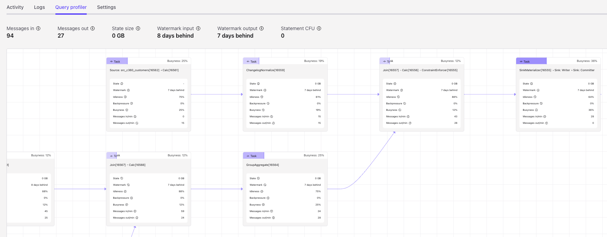
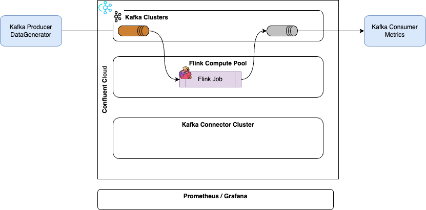
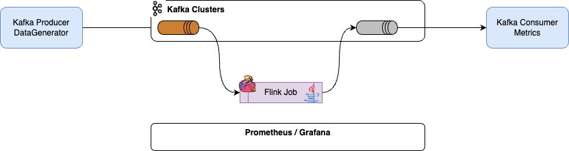
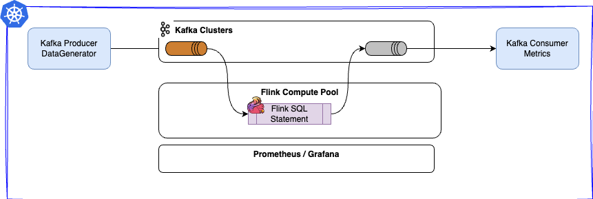
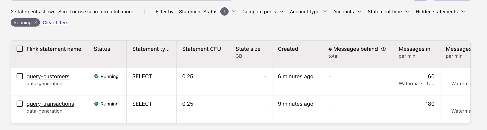
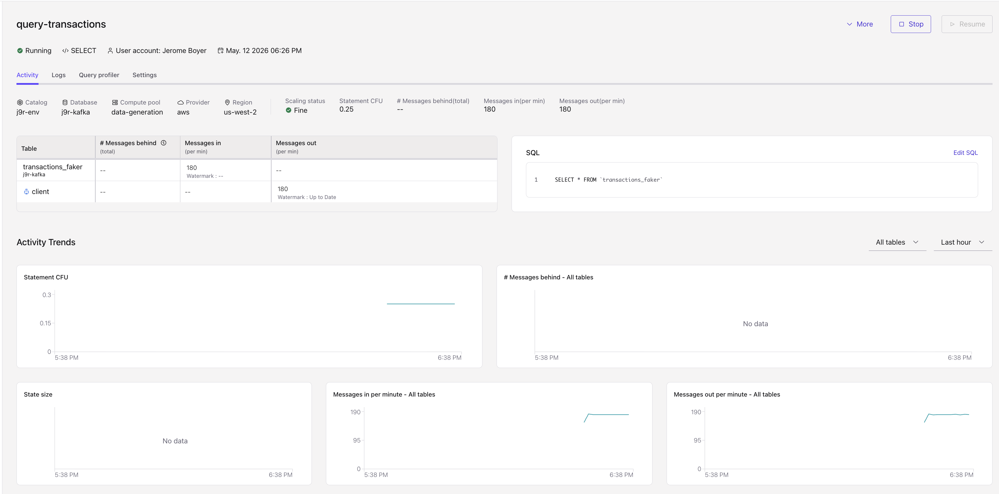

# Job Lifecycle & State Management (App Owners + Platform)


## 1- Deploying New Jobs

*From zero to running: required configs, resource requests, restart strategies.*

There two types of Jobs/Flink application to consider for deployment: 

* the java/python application (DataStream or TableAPI)
* the SQL Statements. 

Then the target platform will have different mechanism and packaging depending if it is:

* Confluent Cloud for Flink
* Confluent Platform for Flink
* Apache Flink OSS

### 1.1 Packaged Application Deployment (OSS or CP-Flink)

#### Context
The deployment of java packaging is the same between OpenSource and Confluent Platform Flink. So any existing DataStream application will run the same way.

There is only yaml manifest to deploy application that will take into account environment, as applications are grouped within environment.

### 1.2 SQL Query Deployment on CP-Flink

#### Context


#### Preconditions / Checklist

* Be sure to have access to the CMF REST end point: [could be localhost](http://localhost:8084/cmf/api/v1/environments)
* An environment is defined. ([See this note](../coding/k8s-deploy.md/#4-create-an-environment-for-flink))
* A Catalog is defined - [See this note](../coding/k8s-deploy.md/#5-define-a-sql-catalog), and [see example from this repository]()

#### Inputs / Parameters

#### Procedure

* Define a database - A database is created within a catalog and references a Kafka cluster. [See product documentation](https://docs.confluent.io/platform/current/flink/configure/catalog.html#create-a-database)


#### Rollback
#### Gotchas

* For end-to-end validation of CP Flink with the employee demo, see [code/flink-sql/00-basic-sql](https://github.com/jbcodeforce/flink-studies/tree/master/code/flink-sql/00-basic-sql#readme.md#confluent-platform-for-flink-on-kubernetes) and run `cp_flink_employees_demo.py`.

## 2- Understanding the Flink UI

#### Context
The Flink Web UI helps to debug misbehaving jobs. 

The Flink Web UI is  well described [in Confluent David Anderson's article](https://developer.confluent.io/courses/apache-flink/web-ui-exercise/), The Apache Flink doc for Web UI, and link to the important [execution plan understanding with EXPLAIN](https://nightlies.apache.org/flink/flink-docs-stable/docs/dev/table/sql/explain/).

#### Preconditions / Checklist
With OSS the Web UI is accessible when the `start_cluster.sh` is started. Local URL is [http://localhost:8081](http://localhost:8081). 
#### Procedure
The Web UI offers the following important features:

* Task Managers View: Shows the number of TaskManagers (the worker nodes executing your jobs) and available Task Slots.
* Navigating to get the running Jobs, the view is updated periodically. The job graph, which matches the EXPLAIN output, presents the tasks running one or more operators of the DAG.
* Task metrics are **backpressure, busyness, and data skew**.
    * **backpressure:** percentage of time that the subtask was unable to send output downstream because the downstream subtask had fallen behind, and (temporarily) couldn't receive any more records. `Backpressured max` is the maximum backpressure across all of the parallel subtasks for a given period.
    * **busy** reports percentage of time spent doing useful work, aggregated at the task level for a time period.
    * **data skew** measures the degree of variation in the number of records processed per second by each of the parallel subtasks. 100% is max skew.
* Examining the history of checkpoints
* Monitoring for any potential backpressure
* Analyzing watermarks
* Retrieving the job logs

Network metrics (Bytes Received / Records Received ) are inside the Flink cluster, not for source and sink to external systems.

In Concluent Cloud the Query Profiler has the same capability then the Flink UI and accessible at the Statement View level:


## 3- Upgrading Jobs Safely

With compatible changes (resume from savepoint).
#### Context
#### Preconditions / Checklist
#### Inputs / Parameters
#### Procedure
#### Rollback
#### Gotchas
### 3.1- Recipe: Safely Upgrade a Flink Job Using Savepoints

Upgrade a Production Flink Job with Savepoint (Minimal Downtime)

#### Context

Use this when you need to:

* Deploy a new version of an existing job that must preserve state (e.g., aggregations, keyed state).
* Make compatible changes to the job graph (e.g., logic changes without breaking state schemas).

#### Preconditions / Checklist

* You understand whether the change is state compatible:
    * No removal/renaming of stateful operators or registered state names.
    * No incompatible serialization changes for keyed state / operator state.
* You have:
    * Access to Flink’s Web UI and/or CLI (or corresponding managed-service UI).
    * Permissions to trigger savepoints and cancel/start jobs.
* Checkpointing is healthy:
    * Latest checkpoints successful.
    * Checkpoint duration and size stable.

#### Inputs / Parameters

* JOB_ID or stable job name.
* SAVEPOINT_DIR (e.g., s3://my-bucket/flink/savepoints/...).
* New artifact reference (e.g., Docker image tag, jar path).
* Desired parallelism for the new version.

#### Procedure

1. Trigger a Savepoint
    * From UI/CLI, trigger a savepoint for the running job, specifying SAVEPOINT_DIR if required.
    * Wait until the savepoint finishes successfully and record the savepoint path.
1. Cancel the Job with Savepoint (Optional Depending on Platform)
    * Either:
        Cancel-with-savepoint in one operation, or
        After savepoint completion, cancel the job gracefully.
    * Confirm the job is no longer running.
1. Deploy New Job Version from Savepoint
    * Configure the new deployment with: Same job name (if your infra relies on it).
    * fromSavepoint <savepoint-path> (or equivalent UI option).
    * Updated artifact version.
    * Make sure parallelism choices are valid for the state (e.g., beware of keyed state repartitioning).

1. Monitor Startup
    * Watch logs and the Flink UI:  The job transitions to RUNNING.  No StateMigrationException or deserialization errors.
    * Confirm that checkpointing restarts successfully.
1. Post-Deploy Validation: For at least 10–30 minutes (depending on SLAs):
    * Check key metrics: input rate, end-to-end latency, checkpoint status, backpressure.
    * Validate downstream data (sanity checks, dashboards, or data-quality rules).

#### Rollback

If you detect errors, anomalies, or instability:
* Cancel the new job.
* Restart the previous version from the same savepoint (or the last known good one).
* Confirm successful restore and checkpointing before considering a new upgrade attempt.
#### Gotchas

* Incompatible changes to keyed state serialization often only show up at restore time; always test in staging with a copy of prod state before running this recipe in production.
* If your platform supports “upgrade in place” semantics (e.g., via an operator or managed UI), integrate those flows but preserve this mental model: take consistent state → deploy new logic from that state → validate → rollback if needed.

### 3.2 With incompatible state changes (state migration strategies).
#### Context
#### Preconditions / Checklist
#### Inputs / Parameters
#### Procedure
#### Rollback
#### Gotchas

## 4- Scaling Jobs

### 4.1- Recipe: Scale a Flink Job to Handle Increased Load

#### Context
You see sustained backpressure in the Flink UI or high operator utilization, and the job is falling behind (increasing end-to-end latency, growing Kafka lag, etc.).

#### Preconditions / Checklist

Check that:

* The upstream system can support higher parallelism (e.g., Kafka topic partition count).
* The Flink cluster has or can get enough resources (TaskManagers, CPU/memory).
* Be sure to get telemetry on the Flink Cluster for CPU, network and disk I/O. 

#### Inputs / Parameters

* Current job parallelism.
* Target parallelism.
* Environment details (e.g., Kubernetes deployment spec or managed configuration).

#### Procedure

1. Identify Bottleneck Operators. In Flink UI, look at:
    * Backpressure tab (which subtasks are under pressure).
    * Operator utilization and busy time.
    * How much state does this pipeline have? 
    * Confirm where the bottleneck actually is (source, transformation, sink).
    * Verify checkpoint frequency, backend system performance.

1. Verify External Constraints
    * For Kafka sources:
        * Ensure partitions ≥ desired parallelism.
    * For sinks (databases, external systems) (Apache Flink, CP Flink):
        * Check they can handle increased concurrency.

1. Plan Parallelism Change. Because job state is keyed, changing parallelism will usually require restart-from-savepoint:
    * Trigger a savepoint.
    * Cancel job (if required by your environment).
    * Redeploy job with higher parallelism, restoring from that savepoint.

1. Adjust Cluster Resources
    * If needed, scale out TaskManagers or underlying nodes/pods so that the job’s new parallelism can be scheduled.
    * Update resource requests/limits to avoid CPU starvation or frequent OOMs.
1. Deploy and Monitor
    * Start the job from the savepoint with increased parallelism.
    * Watch:
        * Backpressure metrics.
        * Throughput and lag.
        * Checkpoint times (may change).

#### Validation

* Backpressure should reduce or disappear on the previously hot operators.
* End-to-end latency should drop or stabilize within target limits.
* No new bottleneck should appear elsewhere (e.g., sinks).

#### Rollback

If errors appear or performance worsens:

* Cancel the new deployment.
* Restore the previous parallelism from the same savepoint.
* Reevaluate resource allocation or code hot spots before attempting scale-out again.


### 4.2  Handling backpressure and hot keys.
#### Context
#### Preconditions / Checklist
#### Inputs / Parameters
#### Procedure
#### Rollback
#### Gotchas
## 5- Backfills and Reprocessing
### 5.1- Recipe: Replaying Kafka topics from older offsets.
#### Context

You need to recompute results for a historical period (e.g., due to a code bug or schema issue), typically from Kafka-based sources.

#### Preconditions / Checklist
* Kafka (or equivalent) retains the data for the desired backfill window.
* Downstream systems can accept re-ingestion or you have a separate backfill sink.
* You know whether: Backfill should coexist with prod job, or should stop prod job, run backfill, then resume.

#### Inputs / Parameters
* Source topics and partitions.
* Time/offset range for backfill.
* Desired output location (same sinks or separate backfill tables/topics).
* Expected data volume and runtime.
#### Procedure

1. Choose Backfill Strategy
    * Separate backfill job: Same code base but different job name, reading from earlier offsets and writing to separate sinks.
    * Repoint prod job: Temporarily rewind offsets and run against main sinks (riskier, requires idempotent sinks or dedupe).

1. Configure Source Start Position
    * For Kafka, configure a start offset or timestamp (e.g., “start from timestamp T0”).
    * Ensure the backfill job won’t auto-reset to latest if it hits errors.
1. Isolate or Protect Downstream
    * Use dedicated output topics/tables for backfill where possible.
    * If writing to prod sinks, ensure: Idempotency or deduplication and clear communication with consumers.
1. Deploy Backfill Job
    * Use a job configuration tuned for throughput (more parallelism, possibly looser latency constraints).
    * Ensure checkpointing is still enabled (for large backfills) to allow restart.
1. Monitor Runtime
    * Monitor progress via Kafka lag and job metrics.
    * Ensure not to starve the production job’s resources.
1. Finalize
    * When backfill completes: Either swap backfill data into prod tables (if using separate sinks) or mark backfilled period as complete.
    * Turn off the backfill job.
#### Validation

* Check target sinks: Row counts, key distributions, and sample records match expectations.
* Check that no prolonged performance impact occurred on prod clusters.
#### Rollback / Contingency
* If backfill misbehaves (e.g., wrong logic), stop job and discard backfill outputs if isolated.
* For shared sinks, you may need a corrective cleanup step (e.g., delete or overwrite bad window).

### 5.2- Running temporary backfill jobs vs. reusing production pipelines.
#### Context
#### Preconditions / Checklist
#### Inputs / Parameters
#### Procedure
#### Rollback
#### Gotchas

## 6- Monitoring & Alerting

### 6.1- Key metrics to watch (checkpointing, backpressure, task failures, JVM).


#### What to monitor in a custom Flink dashboard

* Throughput / backlog: io.confluent.flink/num_records_in, io.confluent.flink/num_records_out, io.confluent.flink/num_records_in_from_topics, io.confluent.flink/pending_records.  
* Latency / timeliness: current_input_watermark_milliseconds, current_output_watermark_milliseconds, max_input_lateness_milliseconds.  
* Failures / health: io.confluent.flink/statement_status.  
* Compute pool saturation: compare current CFUs vs CFU limit for the pool; docs call this out as a best-practice alert. 


### 6.2 Baseline dashboards and alerts.

#### Context

[Confluent Cloud Flink metrics](https://docs.confluent.io/cloud/current/flink/operate-and-deploy/monitor-statements.html) can be exported to any [third-party tools](https://docs.confluent.io/cloud/current/monitoring/third-party-integration.html) like Prometheus and Grafana. [See also the Metrics REST API](https://api.telemetry.confluent.cloud/docs/descriptors/datasets/cloud)

[confluent-cloud-flink-workshop/flink-monitoring](https://github.com/confluentinc/confluent-cloud-flink-workshop/tree/master/flink-monitoring) includes a Grafana dashboard for Confluent Cloud for Apache Flink and local Grafana + Prometheus setup you can run with Docker. [See this repository deployment](https://github.com/jbcodeforce/flink-studies/tree/master/deployment/cc-flink-monitoring)

#### Preconditions / Checklist

* Deploy statements into one to many compute pool
* Get a service account, and API key to access metrics
* Configure Prometheus with your Confluent Cloud API key/secret and Flink resource IDs, or copy the config from the Confluent Cloud Metrics integration UI.

#### Inputs / Parameters

#### Procedure

1. [Define new integration](https://confluent.cloud/settings/metrics/integrations?integration=prometheus) to monitoring platform. 
1. For Metrics REST API access, build a bearer token from the Key ID as the username and the Key Secret as the password.
1. [Locally] Start docker compose.

#### Gotchas

## 7- Performance Testing

### 7.1 Establish a Performance Testing Platform
#### Context
Load testing Apache Flink applications requires a shift from traditional request-response testing to a stream-centric approach. Instead of testing concurrent users, you are testing **sustained throughput, event-time latency, and state stability** under pressure.

As any performance test, it is very import to decide what you’re optimizing for. Pick a primary goal per test run, which could be:

* Throughput (RPS / MBps) per Flink Application and per Kafka topic
* End‑to‑end latency: from source event time to sink
* Resource efficiency: CPU utilization state size, disk IO, network IO 

If we take a classical shift left real-time processing architecture where Kafka topics and Flink jobs are used for building bronze, silver and gold records, it is possible to measure timestamps at different level:

<figure markdown="span">

</figure>

This diagram is important to support discussions about what latency means, and what and where to measure.

* Throughput Testing
    * As a baseline, the current benchmark, gave us that Flink can process ~10,000 records per second per CPU core. This baseline may decrease with larger messages, bigger state, key skew, or high number of distinct keys.
    * Measure maximum processing rate (events/second)
    * Evaluate parallel processing capabilities

* Latency Testing

    * Measure end-to-end processing latency

* Scalability Testing

    * Test horizontal scaling by assessing CFU increase up to the limit, control those statements to assess if we need to split them.
    * Evaluate job manager performance
    * Test with increasing data volumes
    * Monitor resource utilization

**Some Metrics to consider:**

* Get time stamp when the Flink job is created
* Time stamp when the Flink SQL statement deployment is started and finished
* Time stamp when the LAG is processed
* Number of message per second processed per Flink statement
* Time stamp from source to destination for a given transaction

The following figures represents the different component for performance testing to deploy according to the target platform:

=== "Confluent Cloud"
    For Confluent Cloud the network may be part of the equation, depending on where you run the producer and consumer to measure performance. 

    

=== "Apache Flink/ Confluent Platform Java App"
    

=== "Confluent Platform/ Flink OSS - SQL"
    


#### The following baseline abacus are used

* Typical Flink node configuration:
    * 4 CPU cores with 16GB memory
    * Should process 20-50 MB/s of data
    * Jobs with significant state benefit from more memory
* Scaling Strategy: Scale vertically before horizontally
* Latency Impact on Resources: Lower latency requirements significantly increase resource needs:
    * Sub-500ms latency: +50% CPU, frequent checkpoints (10s), boosted parallelism
    * Sub-1s latency: +20% CPU, extra buffering memory, 30s checkpoints
    * Sub-5s latency: +10% CPU, moderate buffering, 60s checkpoints
    * Relaxed latency (>5s): Standard resource allocation

[See the Flink Estimator tool](https://github.com/jbcodeforce/flink-estimator)

#### Preconditions / Checklist

You need to have access to:

* **Kafka cluster** with 1-3 topics, 42 partitions - Kafka cluster size is a minimum of 3 nodes.
* **Data generator**  producer apps able to send 1-7kb messages at a 40-500k messages / sec. The goal is to have a lot of unique keys (30G) to generate big 210GB of state. As part of the testing, there will be joins operator, so the schema should include foreign keys. For platform test, a schema may look like:
    ```json
    timestamp: long - unix timestamp
    record_id: long - incrementing record number
    user_id: long - for something to key by
    cat_id: long – for something else to key by
    group_id: long – for more to key by
    payload: string – to make a record big or large. 
    ```

* Some Flink job to use as benchmark, for platform sizing purpose, or the real production flink job for job performance asssessment. Use a small set of canonical queries that mirror real jobs and map to known internal benchmarks:
    * Stateless 1:1 transform: baseline max throughput; typically Kafka IO/partitions are the bottleneck, not Flink 
    * CPU‑heavy stateless transform (e.g., string/JSON/UDF heavy): traditionally it is CPU bound 
    * Joins & aggregations with realistic key cardinality and state size: state access pattern dominates throughput.
    * If you use remote UDFs, include a UDF‑heavy workload; be aware that batching and RPC overhead dominate there 

* Be sure to have metrics and dashboard in place.

#### Procedure

1. Create Kafka Topics for Test
1. Calibrate data generator
1. Launch benchmarking job
    * Example of SQL query for stateful processing:
        ```sql
         INSERT INTO SinkTable
                SELECT
                    `user_id`,
                    COUNT(*) AS `event_count`,
                    ROW(
                        LAST_VALUE(`timestamp`),
                        LAST_VALUE(`record_id`),
                        LAST_VALUE(`cat_id`),
                        LAST_VALUE(`group_id`),
                        LAST_VALUE(CAST(`payload` AS VARCHAR))
                    ) AS `last_record`
                FROM TABLE(
                    TUMBLE(TABLE SourceTable, DESCRIPTOR(proc_time), INTERVAL '5' MINUTES)
                )
                GROUP BY `user_id`, `window_start`, `window_end`;
        ```

1. Use Flink Console to assess job metrics
1. Use Grafana dashboard
1. Validating the disk speed for worker node

#### Gotchas

* [See performance tuning Flink chapter](https://nightlies.apache.org/flink/flink-docs-stable/docs/dev/table/tuning/)
* [See the end-to-end demonstration for perf testing in this repo.](https://github.com/jbcodeforce/flink-studies/tree/master/e2e-demos/perf-testing)

### 7.1- Identifying bottlenecks (sources, network, RocksDB).
#### Context

Use this recipe when throughput or latency SLOs are missed and the root cause is unclear. Symptoms include sustained backpressure, growing checkpoint duration, or single subtasks at 100% utilization while others are idle.

The full symptom-to-diagnosis playbook with observability stack guidance is in [Flink Tuning on Kubernetes §9](k8s_tuning.md#9--identifying-bottlenecks--backpressure-gc-pressure-checkpoint-lag).

#### Preconditions / Checklist

* Flink Web UI or Prometheus metrics available.
* Baseline checkpoint history and consumer lag recorded.

#### Procedure

1. Open Flink UI → Backpressure tab; note red operators and subtask skew.
2. Check Checkpoints → History for duration vs interval.
3. Use the bottleneck table in [k8s_tuning.md §9](k8s_tuning.md#9--identifying-bottlenecks--backpressure-gc-pressure-checkpoint-lag) to map symptoms to first tuning knob.
4. Apply one change; re-measure before proceeding.

#### Rollback

Revert the last configuration change; redeploy from savepoint if stateful.

#### Gotchas

* Scaling parallelism before fixing hot keys wastes resources.
* See [Architecture cookbook](../architecture/cookbook.md) for metric definitions.

### 7.2- GC/memory tuning, network/shuffle tuning.
#### Context

Use when TaskManagers show GC pauses, OOMKilled events, or shuffle-related backpressure with low CPU. These issues often trace to misaligned Flink process memory, managed memory, or network buffer settings on Kubernetes.

Detailed recipes and configuration keys are in [Flink Tuning on Kubernetes §3, §7, and §8](k8s_tuning.md#3--memory-model--heap-managed-network-and-metaspace).

#### Preconditions / Checklist

* JVM GC metrics or logs available (`Status.JVM.GarbageCollector.*`).
* Pod memory limits and `taskmanager.memory.process.size` documented.

#### Procedure

1. For GC pressure: rebalance heap vs managed memory (§3); align pod limits with process size (§2).
2. For direct buffer OOM or shuffle backpressure: tune `taskmanager.network.memory.*` (§7).
3. For RocksDB disk thrashing: increase managed memory and block cache (§3, §6).

#### Rollback

Revert memory and network settings; redeploy from savepoint if required.

#### Gotchas

* Network memory increases reduce heap or managed memory unless total process size grows.
* See [Cluster management §1.0](cluster_mgt.md#10-sizing-flink-resources) for the TaskManager memory diagram.

## 8- Common Incident Recipes

See Confluent Product documentation for [troubleshoot Flink SQL statements](https://docs.confluent.io/cloud/current/flink/operate-and-deploy/query-profiler.html#troubleshoot-flink-sql-statements).

### 8.1 Job stuck in “restarting” or “failing” loop.
#### Context

A job repeatedly fails and auto-restarts due to its restart strategy, causing instability and potentially thrashing external systems.

#### Preconditions / Checklist
* You can modify job configuration or redeploy.
* You have access to logs and metrics.
#### Inputs / Parameters

* JOB_ID.
* Recent error stack traces.
* Restart strategy configuration.

#### Procedure

1. Pause/Limit Damage if Needed
    * If the job is causing harm (e.g., hammering a DB, producing corrupt data), consider:
        * Lowering restart frequency temporarily (update restart strategy), or
        * Cancelling the job until you understand the issue.
1. Identify Root Error
    * From Flink UI or logs, capture the exception causing the failure.
        * Is it data-related (bad record)?
        * External system (timeout, 429/500 responses)?
        * Program bug (NPE, etc.)?
1. Classify Incident
    * Data/record issue: maybe a single poison pill message.
    * Infrastructure issue: external system down/slow.
    * Code bug: deterministic exception for some input.
1. Choose Temporary Mitigation
    * Data/record issue: Implement dead-letter queue mechanism or filtering, redeploy job.
    * Infrastructure issue: Throttle load, increase timeouts, or temporarily disable sink.
    * Code bug: Hotfix code in staging → redeploy from last savepoint.
1. Redeploy from Last Known Good State
    * Use the most recent successful checkpoint or savepoint before the incident.
    * Ensure that the new version handles the problematic condition.

#### Validation
* Job stays in RUNNING state over your defined stability window.
* Alerts for repeated failures clear.
#### Rollback

If hotfix fails, roll back to last known good version with a mitigation that avoids the triggering condition (e.g., filtering the offending key).

### 8.2- Recipe: Handling Persistent Checkpoint Failures
#### Context

You’re seeing alerts that a job’s checkpoints are failing for several consecutive attempts, or the Flink UI shows repeated checkpoint failures. Prolonged failure threatens your ability to recover reliably and meet recovery SLOs.

#### Preconditions / Checklist
Access to:
* Flink Web UI.
* Logs for JobManager and TaskManagers.
* State backend storage system (e.g., S3/GCS/HDFS).
* Know the job’s criticality and tolerated downtime (can you pause input or not?).

#### Inputs / Parameters

* Job name / JOB_ID.
* Time window of failures.
* Checkpoint directory URI (from job config).
#### Procedure

1. Inspect Failure Reason in Flink UI:  In the job’s Checkpoints tab, open a failed checkpoint and note the error:
    * Storage-related (e.g., permission denied, quota exceeded).
    * Timeout / slow I/O.
    * Operator-specific errors during snapshot.
    * Serialization errors.
1. Check Storage Health: If errors mention the state backend or filesystem:
    * Attempt a small write/read manually to the checkpoint directory from a node or pod with similar permissions.
    * Verify IAM/ACLs, quotas, and recent infra changes.
1. Check Operator Logs
    * Look for stack traces near checkpoint failure times.
    * If a specific operator is failing snapshot, note which one (e.g., custom sink, third-party connector).

1. Validate Checkpointing Configuration
    * Are you trying to checkpoint too frequently for your workload?
    * Compare: 1/ Checkpoint interval vs. average checkpoint duration. 2/ Size of checkpoints (state size growth trend).
1. Immediate Stabilization Options. Depending on what you found:
    * Storage issue: fix permissions/quotas; once resolved, checkpointing should resume without job restart.
    * Timeout / too heavy:
        * Temporarily increase checkpoint timeout.
        * Increase interval to reduce pressure.
    * Operator-specific bug:
        * Decide whether to temporarily disable that operator, hotfix its code, or deploy a version that bypasses the failing path.
1. When Job is Unstable: Consider taking a manual savepoint (if still possible) or stopping ingest (e.g., pausing Kafka consumer, if your environment supports it), then restarting from the last successful checkpoint/savepoint.

#### Validation

* Check that new checkpoints complete successfully over at least a few consecutive attempts.
* Monitor checkpoint duration and size for stability.

#### Rollback / Contingency

If your configuration changes worsen things:

* Revert checkpoint interval/timeout to previous values.
* If no quick fix is available, escalate: consider pausing job input or taking it offline with communication to downstream consumers.

#### Gotchas

* Changes in upstream schema or data volume spikes can indirectly cause checkpoint issues (e.g., bigger state, slower snapshots).
* If using a shared object store, another workload may have changed performance characteristics.


### 8.3 State corruption or version mismatch.
#### Context
#### Preconditions / Checklist
#### Inputs / Parameters
#### Procedure
#### Rollback
#### Gotchas

### 8.4 Flink SQL debugging

#### Context

With a higher level of abstraction, the tools to assess SQL statements executions are different then pure Java based streaming processing. In this section we will review the practices and tools to assess Flink SQL statement in the context of Confluent Cloud in general and self-managed Flink deployment when relevant.

##### Statement Lifecycle

| State | Meaning | Action |
| --- | --- | --- |
| **PENDING** | Waiting for CFUs | Check compute pool utilization |
| **RUNNING** | Actively processing | Monitor lag, watermarks, state size, throughput |
| **COMPLETED** | Finished (DDL/bounded) | Normal for one-time operations |
| **FAILED** | Unrecoverable error | Check logs, fix root cause |
| **DEGRADED** | Checkpointing failing | Investigate state growth or resources |
| **STOPPED** | Manually stopped | Resume or delete |

#### Preconditions / Checklist

* For Confluent Cloud: access to the console and being able to use Flink workspace

#### Inputs 

The following components are used for assessing Flink statement issues

* Cloud Console -> Flink for Statements list and status per statement. In this view the important columns are:
    * Status: Current state
    * Messages Behind: Consumer lag (0 = healthy, growing = problem)
    * Messages In/Out: Throughput + source/sink watermarks
    * CFU: Resource consumption
    * Time Created: How long it's been running

    

* Cloud Console -> Flink Detail panel to assess current metrics for a given statement. Same metrics as above with time plotting figures.
    

    * Assess the watermark progression
    * Review the CFU consumption over time to assess scaling capability. When there is high CFU usage with low throughput, it demonstrates a query ineffiency. 

* Query Profiler (real-time visual monitoring)
* Run `EXPLAIN `query to get the execution plan: Flink shows the Physical Plan of the query, which comprises all the operators Flink will use to execute your query. Look at operators with  potentially state-intensive which has no TTL applied, like joins:
    ```
    [8] StreamJoin
    Changelog mode: append
    State size: high
    State TTL: never
    ```


* Metrics API
* Snapshot queries for state inspection

#### Procedure
* Identify the common patterns:
    
#### Rollback
#### Gotchas