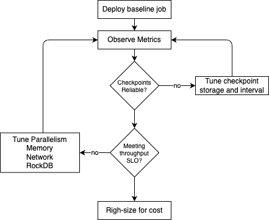

# Flink Tuning on Kubernetes

???- info "Chapter Version"
    * Creation 05/2026

This chapter covers Day-2 tuning for Flink jobs running on Kubernetes: resource sizing, memory layout, parallelism, checkpointing, RocksDB, network shuffle, and K8s-specific configuration. It complements [Cluster management](cluster_mgt.md) (sizing philosophy) and [Job Lifecycle](job_lifecycle.md) (operational recipes). Deployment mechanics are in [FKO & CMF Deployment](../coding/k8s-deploy.md).

## 1- Tuning philosophy — what to tune and when

### Context

Tuning without measurement leads to wasted resources or masked bottlenecks. Every Flink deployment is workload-specific; the effective approach is to run the real job on real hardware, observe metrics, and change one knob at a time.

### Measure first

Before changing configuration, collect baseline data from:

* **Flink Web UI:** Backpressure tab, operator busyness, data skew, checkpoint history, watermarks.
* **Prometheus / Grafana:** JVM CPU, GC, checkpoint duration, consumer lag (when Kafka is the source).
* **Kubernetes:** Pod CPU/memory usage, OOMKilled events, scheduling delays.

See [Flink metrics interpretation](../architecture/cookbook.md) for metric definitions and [Job Lifecycle §5](job_lifecycle.md#51--key-metrics-to-watch-checkpointing-backpressure-task-failures-jvm) for operational thresholds.

### Tune in order

Apply changes in this sequence:

1. **Correctness and checkpoint reliability** — durable checkpoint storage, timeout/interval alignment, state backend configured.
2. **Throughput and latency** — parallelism, memory, network buffers, RocksDB cache.
3. **Cost and right-sizing** — reduce over-provisioned TM replicas or memory after SLOs are met.

<figure markdown="span">

<caption>Monitoring Flow</caption>
</figure>

### Workload-driven sizing

Use the [flink-estimator](https://github.com/jbcodeforce/flink-estimator) for preliminary CPU/memory estimates, then validate with the [perf-testing demo](https://github.com/jbcodeforce/flink-studies/tree/master/e2e-demos/perf-testing). 

Estimates are starting points; state size, operator complexity, and checkpoint interval change the answer.

### Anti-patterns

* Increasing parallelism before fixing hot keys or data skew.
* Shrinking managed memory to free heap without measuring RocksDB block cache hit rate.
* Setting checkpoint interval shorter than typical checkpoint duration.
* Using `emptyDir` for checkpoint storage on production K8s clusters.
* Setting pod memory limits lower than `taskmanager.memory.process.size`.

### Gotchas

* Tuning on a dev cluster with different node types or network latency than production may not transfer.
* Changing multiple parameters in one deployment makes root-cause analysis difficult.

---

## 2- JobManager and TaskManager resource sizing

### Context

On Kubernetes, Flink process memory (`jobmanager.memory.process.size`, `taskmanager.memory.process.size`) must fit within pod resource limits. The CRD fields `jobManager.resource` and `taskManager.resource` control what the operator requests from the scheduler.

For general sizing philosophy and the flink-estimator tool, see [Cluster management §1.0](cluster_mgt.md#10-sizing-flink-resources).

### JobManager sizing

Typical starting point: **1 CPU, 1–2 GB memory**. Scale up when:

* State metadata is large (many keyed state partitions).
* The job graph has many operators or complex coordination.
* Checkpoint alignment time grows with operator count.

=== "Confluent Platform"

    ```yaml
    # e2e-demos/dedup-demo/cp-flink/flink-table-api/k8s/flink-application.yaml
    flinkConfiguration:
      jobmanager.memory.process.size: "1024m"
    jobManager:
      resource:
        memory: "1024m"
        cpu: 1
      replicas: 1
    ```

=== "Open Source Approach"

    ```yaml
    # deployment/k8s/flink-oss/basic_flink_deployment.yaml
    jobManager:
      resource:
        memory: "2048m"
        cpu: 1
    ```

=== "Confluent Cloud for Flink"
    There is no control for the fine tuning of the Job Manager. Recall that JM runs in compute pool. The max CFU is the only parameter to tune. There will be one Job Manager per statement deployed.

### TaskManager sizing

Set `taskmanager.memory.process.size` to match (or slightly under) the pod memory limit. Leave headroom for JVM metaspace and off-heap overhead that Flink accounts for inside process memory.

Rule of thumb for slots vs CPU:

* **CPU-bound** workloads: 1 slot per CPU core.
* **I/O-bound** workloads (Kafka, JDBC lookups): fewer slots per core (e.g., 1 slot per 2 cores).

=== "Confluent Platform"

    Environment defaults from staging:

    ```json
    "taskManager": { "resource": { "memory": "2048m", "cpu": "1.5" } },
    "jobManager":  { "resource": { "memory": "1024m", "cpu": 0.5 } }
    ```

    Application-level override (dedup demo):

    ```yaml
    flinkConfiguration:
      taskmanager.memory.process.size: "1024m"
      taskmanager.numberOfTaskSlots: "2"
    taskManager:
      resource:
        memory: "1024m"
        cpu: 1
      replicas: 1
    ```

=== "Open Source Approach"

    ```yaml
    flinkConfiguration:
      taskmanager.numberOfTaskSlots: "2"
    taskManager:
      resource:
        memory: "2048m"
        cpu: 1
    ```

=== "Confluent Cloud for Flink"
    There is no control for the fine tuning of the Task Manager. Task Managers run in compute pool. The max CFU is the only parameter to tune. 

### Recipe: Align pod limits with Flink process memory

#### Context

TaskManager pods out of memory during checkpoints or heavy shuffle usually means the K8s limit is below Flink's configured process memory.

#### Preconditions / Checklist

* Access to `kubectl describe pod` for TM pods.
* Flink configuration visible in FlinkApplication/FlinkDeployment spec.

#### Procedure

1. Read `taskmanager.memory.process.size` from `flinkConfiguration`.
2. Set `taskManager.resource.memory` to the same value or slightly higher (e.g., +256m for sidecar overhead if any).
3. Set `resources.requests.memory` equal to `resources.limits.memory` for TaskManagers to avoid eviction mid-checkpoint.
4. Redeploy and verify no OOMKilled events: `kubectl get events -n flink --field-selector reason=OOMKilling`.

#### Validation

TM pods stay Running under peak load; no OOMKilled in events.

#### Rollback

Revert resource block to previous values and redeploy.

#### Gotchas

* CMF and FKO may inject additional containers; account for their memory in the pod limit.
* CPU requests below actual need cause throttling that looks like backpressure.

---

## 3- Memory model — heap, managed, network, and metaspace

### Context

Flink 1.19+ uses a structured memory model inside the JVM process. On Kubernetes, the pod memory limit must cover all of it. Misallocating managed vs heap memory is a common cause of RocksDB disk thrashing or GC instability.

<figure markdown="span">

<figcaption>Figure 1: Task Manager memory allocation (see also Cluster management §1.0)</figcaption>
</figure>

### Memory components

| Component | Config key | Purpose |
|-----------|------------|---------|
| Total process | `taskmanager.memory.process.size` | Upper bound for the JVM process; must fit pod limit |
| JVM heap | Derived from total minus off-heap | User functions, framework objects |
| Managed memory | `taskmanager.memory.managed.fraction` | RocksDB block cache, hash tables, spill buffers |
| Network memory | `taskmanager.network.memory.fraction`, `.min`, `.max` | Shuffle buffers between operators |
| JVM metaspace / overhead | Implicit in process memory | Class metadata, JVM native overhead |

JobManager follows the same pattern with `jobmanager.memory.process.size`.

### Managed memory and RocksDB

Managed memory is the primary budget for RocksDB's off-heap block cache. Shrinking it forces more reads from disk and increases end-to-end latency. Growing managed memory without adjusting total process size squeezes the JVM heap and can increase GC pressure.

Example from a development environment:

```yaml
# deployment/k8s/cmf/flink-dev-env.yaml
state.backend.type: rocksdb
state.backend.rocksdb.block-cache-size: '1024m'
state.backend.rocksdb.use-bloom-filter: 'true'
```

The block cache size must fit within the managed memory budget derived from `taskmanager.memory.managed.fraction` × Flink memory.

### Network memory

Network buffers carry shuffle data between TaskManagers. Defaults usually suffice for light shuffle; heavy joins or aggregations may need explicit tuning (see §7).

```yaml
# e2e-demos/external-lookup/cp-flink/flink-app/k8s/configmap.yaml
taskmanager.network.memory.fraction: 0.1
taskmanager.network.memory.min: 64mb
taskmanager.network.memory.max: 1gb
```

### Recipe: Increase managed memory when RocksDB cache misses rise

#### Context

Checkpoint duration grows and state access latency increases, but CPU is not saturated. Prometheus or RocksDB metrics suggest cache pressure.

#### Preconditions / Checklist

* Job uses RocksDB state backend.
* Baseline checkpoint duration and p99 latency recorded.

#### Procedure

1. Increase `taskmanager.memory.process.size` and the pod memory limit by the same amount (e.g., +512m).
2. Optionally increase `taskmanager.memory.managed.fraction` (default 0.4) if heap headroom allows.
3. Set `state.backend.rocksdb.block-cache-size` to a value ≤ managed memory budget.
4. Redeploy and re-measure checkpoint duration and state access latency.

#### Validation

Checkpoint p99 stable or reduced; no TM OOMKilled; GC pause time unchanged or lower.

#### Rollback

Revert memory settings and block-cache-size; redeploy from last savepoint if state compatibility requires it.

#### Gotchas

* Setting `block-cache-size` larger than managed memory causes ineffective caching or OOM.
* Increasing process memory without updating K8s limits has no effect — the pod is still capped.

---

## 4- Parallelism and slot configuration

### Context

Job parallelism, TaskManager replica count, and slots per TaskManager must satisfy:

```
parallelism ≤ total_slots = taskManager.replicas × taskmanager.numberOfTaskSlots
```

Each slot runs one parallel pipeline of operators. Under-provisioned slots leave parallelism unused; over-provisioned slots share CPU and can cause contention.

### When to scale what

| Symptom | First lever |
|---------|-------------|
| Backpressure, low CPU per TM | Increase job parallelism and TM replicas |
| High CPU, low throughput per slot | Reduce slots per TM (more CPU per slot) |
| Kafka lag growing, operators idle | Source parallelism or partition count mismatch |
| Single hot subtask | Fix skew before scaling |

### Autoscaler (FKO)

The Flink Kubernetes Operator supports reactive scaling when enabled:

```yaml
flinkConfiguration:
  job.autoscaler.enabled: true
```

The autoscaler monitors pending records and adjusts operator parallelism within configured bounds. See [FKO autoscaler configuration](https://nightlies.apache.org/flink/flink-kubernetes-operator-docs-main/docs/operations/configuration/#autoscaler-configuration) and [k8s-deploy.md](../coding/k8s-deploy.md).

=== "Confluent Platform"

    ```yaml
    # e2e-demos/dedup-demo/cp-flink/flink-table-api/k8s/flink-application.yaml
    flinkConfiguration:
      taskmanager.numberOfTaskSlots: "2"
    taskManager:
      replicas: 1
    job:
      parallelism: 2
    ```

=== "Open Source Approach"

    ```yaml
    flinkConfiguration:
      taskmanager.numberOfTaskSlots: "2"
    taskManager:
      resource:
        cpu: 1
    job:
      parallelism: 2
    ```

### Recipe: Scale under backpressure

#### Context

Sustained backpressure in the Flink UI, growing Kafka consumer lag, increasing end-to-end latency.

#### Preconditions / Checklist

* Confirmed skew is not the root cause (one subtask at 100% while others are idle).
* Cluster has capacity for additional TM pods.

#### Procedure

1. Identify backpressured operators in Flink UI → Backpressure tab.
2. Increase `job.parallelism` (or operator max parallelism for Flink SQL).
3. Increase `taskManager.replicas` so `replicas × slots ≥ new parallelism`.
4. Redeploy; for stateful jobs use savepoint upgrade mode.
5. Monitor lag and backpressure for 10–15 minutes.

For the full operational procedure, see [Job Lifecycle §3.2](job_lifecycle.md#32--handling-backpressure-and-hot-keys).

#### Validation

Backpressure reduced on previously hot operators; consumer lag stable or decreasing.

#### Rollback

Restore previous parallelism and TM replica count; redeploy from savepoint.

#### Gotchas

* Scaling past Kafka partition count does not increase source throughput.
* Stateful operator rescaling triggers repartitioning; expect temporary checkpoint delay.

---

## 5- Checkpointing and savepoint tuning

### Context

Checkpoints provide fault tolerance. On Kubernetes, checkpoint storage must survive pod restarts — use S3/MinIO or PVC, not ephemeral local storage for production.

### Key parameters

| Parameter | Purpose | Starting point |
|-----------|---------|----------------|
| `execution.checkpointing.interval` | Recovery point objective vs overhead | 30s–5min depending on state size |
| `execution.checkpointing.timeout` | Fail stuck checkpoints | 2–10× typical checkpoint duration |
| `execution.checkpointing.max-concurrent-checkpoints` | Overlap control | 1 |
| `execution.checkpointing.mode` | Exactly-once vs at-least-once | `EXACTLY_ONCE` for most streaming jobs |
| `execution.checkpointing.unaligned` | Reduce backpressure during checkpoint | `false` unless latency-critical |
| `state.checkpoints.dir` | Durable storage URI | S3/MinIO on K8s |
| `state.savepoints.dir` | Manual recovery points | Same storage class as checkpoints |
| `state.backend.incremental` | Smaller RocksDB checkpoints | `true` with RocksDB |

### Storage options on Kubernetes

=== "S3 / MinIO (recommended for production)"

    ```yaml
    # e2e-demos/json-transformation/cp-flink/k8s/compute_pool.yaml
    execution.checkpointing.interval: "10s"
    state.checkpoints.dir: "s3://flink/stateful-flink/checkpoints"
    state.savepoints.dir: "s3://flink/stateful-flink/savepoints"
    s3.endpoint: "http://minio.e2e.svc.cluster.local:9000"
    s3.path.style.access: "true"
    ```

    Setup guide: [MinIO S3 setup](https://github.com/jbcodeforce/flink-studies/blob/master/deployment/k8s/MinIO/MINIO_S3_SETUP.md).

=== "PVC (dev / single-node)"

    ```yaml
    # e2e-demos/dedup-demo/cp-flink/flink-table-api/k8s/flink-application.yaml
    state.checkpoints.dir: "file:///flink-data/checkpoints"
    state.savepoints.dir: "file:///flink-data/savepoints"
    execution.checkpointing.interval: "30s"
    execution.checkpointing.mode: "EXACTLY_ONCE"
    execution.checkpointing.timeout: "600s"
    ```

    Mount `/flink-data` via `podTemplate` volumes (see §8).

### Recipe: Checkpoint duration exceeds interval

#### Context

Checkpoint history shows durations consistently longer than `execution.checkpointing.interval`, or checkpoints fail with timeout.

#### Preconditions / Checklist

* Access to Flink UI → Checkpoints → History.
* Checkpoint storage reachable from all TM pods.

#### Procedure

1. Increase `execution.checkpointing.interval` to at least 1.5× current p99 checkpoint duration.
2. Enable `state.backend.incremental: true` if using RocksDB.
3. Move checkpoint dir to S3/MinIO if currently on slow local disk.
4. Reduce backpressure (§4) so operators are not stalled during alignment.
5. Consider `execution.checkpointing.unaligned: true` for high-latency-sensitive pipelines (trade storage overhead).

#### Validation

Checkpoints complete within interval; no timeout failures in logs.

#### Rollback

Revert interval and checkpoint settings; previous checkpoints remain in storage unless retention policy deletes them.

#### Gotchas

* Shorter intervals with large state increase I/O and can cause cascading backpressure.
* `state.checkpoints.num-retained` controls how many completed checkpoints are kept; low values limit recovery options.

---

## 6- RocksDB state backend tuning

### Context

RocksDB stores keyed state off-heap with a block cache backed by Flink managed memory. On Kubernetes, local disk performance depends on the node's storage class; prefer S3 for checkpoint data and size managed memory for hot state.

### Enable RocksDB with incremental checkpoints

```yaml
flinkConfiguration:
  state.backend.type: rocksdb
  state.backend.incremental: 'true'
  state.backend.rocksdb.use-bloom-filter: 'true'
  state.checkpoints.num-retained: '3'
```

### Block cache and bloom filters

```yaml
# deployment/k8s/cmf/flink-dev-env.yaml
state.backend.rocksdb.block-cache-size: '1024m'
state.backend.rocksdb.block-size: '1024m'
state.backend.rocksdb.block-size-multiplier: '10'
state.backend.rocksdb.use-bloom-filter: 'true'
```

Bloom filters reduce disk reads for point lookups. Block cache size must remain within the managed memory budget (§3).

### Advanced tuning

Compaction threads, write buffer size, and incremental restore settings are documented in the [Flink RocksDB state backend guide](https://nightlies.apache.org/flink/flink-docs-stable/docs/ops/state/state_backends/#the-embeddedrocksdbstatebackend). Change advanced settings only after baseline metrics show disk I/O as the bottleneck.

### Gotchas

* `block-cache-size` larger than managed memory fraction → ineffective cache or OOM.
* Local SSD node affinity (§8) helps when RocksDB working set exceeds cache and spills to local disk frequently.
* Incremental checkpoints require RocksDB; do not enable on HashMapStateBackend jobs.

---

## 7- Flink network and shuffle performance

### Context

Flink uses credit-based flow control for shuffle data between TaskManagers. When network buffers are exhausted, downstream operators show backpressure even if CPU is available.

See [Architecture — backpressure](../architecture/index.md) for the mechanism.

### Key configuration

```yaml
taskmanager.network.memory.fraction: 0.1
taskmanager.network.memory.min: 64mb
taskmanager.network.memory.max: 1gb
```

Fraction controls the share of Flink memory allocated to network buffers. Min and max cap the range regardless of total memory.

### Symptoms

* Backpressure on downstream operators with low CPU utilization.
* `OutOfMemoryError: Direct buffer memory` in TaskManager logs.
* High `outPoolUsage` in network metrics.

### Recipe: Increase network buffers for shuffle-heavy jobs

#### Context

Join or aggregation pipeline shows sustained backpressure; CPU is not saturated; checkpoint alignment is slow.

#### Preconditions / Checklist

* Confirmed bottleneck is shuffle (network) rather than state access or external I/O.
* Total process memory has headroom or can be increased.

#### Procedure

1. Increase `taskmanager.network.memory.max` (e.g., from 512mb to 1gb).
2. If needed, increase `taskmanager.memory.process.size` and pod limit proportionally.
3. Redeploy and observe backpressure tab and throughput.

#### Validation

Backpressure reduced on shuffle edges; no direct buffer OOM.

#### Rollback

Revert network memory settings.

#### Gotchas

* Network memory comes from total Flink memory; increasing it reduces heap or managed memory unless process size grows.
* Very large buffers increase latency for small messages.

---

## 8- Kubernetes-specific tuning

### Context

Flink configuration alone does not cover pod scheduling, volume mounts, JVM container awareness, or metrics export. These K8s-layer settings determine whether Flink tuning survives restarts and scales with the cluster.

### Pod sizing

* Set **requests = limits** for TaskManager pods to prevent eviction during checkpoints.
* JobManager pods can use lower CPU requests if they are not on the critical latency path, but memory must fit metadata.
* Align `taskmanager.memory.process.size` with `taskManager.resource.memory`.

### podTemplate — volumes and environment

Mount checkpoint and HA directories on persistent storage:

```yaml
podTemplate:
  spec:
    containers:
      - name: flink-main-container
        volumeMounts:
          - mountPath: /flink-data
            name: flink-volume
    volumes:
      - name: flink-volume
        persistentVolumeClaim:
          claimName: flink-pvc
```

Example with env vars for S3 credentials: [flink-dev-env.yaml](https://github.com/jbcodeforce/flink-studies/blob/master/deployment/k8s/cmf/flink-dev-env.yaml).

HA metadata directory:

```yaml
flinkConfiguration:
  high-availability.type: Kubernetes
  high-availability.storageDir: file:///flink-data/ha
```

See [k8s-deploy.md](../coding/k8s-deploy.md) for PVC patterns and HA setup.

### Node affinity and tolerations

Pin TaskManagers to nodes with local SSD or higher network bandwidth when RocksDB working set exceeds cache:

```yaml
podTemplate:
  spec:
    affinity:
      nodeAffinity:
        requiredDuringSchedulingIgnoredDuringExecution:
          nodeSelectorTerms:
            - matchExpressions:
                - key: cfk-cr
                  operator: In
                  values:
                    - flink
```

Use tolerations to schedule on dedicated Flink node pools without mixing with batch workloads.

### JVM flags

Flink sets container-aware JVM options automatically on Java 11+. Override only when GC logs show a clear problem:

```yaml
podTemplate:
  spec:
    containers:
      - name: flink-main-container
        env:
          - name: FLINK_ENV_JAVA_OPTS
            value: "-XX:+UseG1GC -XX:MaxGCPauseMillis=200"
```

Tune GC after observing `Status.JVM.GarbageCollector.*` metrics, not preemptively.

### Prometheus metrics reporter

Expose Flink metrics for scraping by Prometheus:

=== "Open Source Approach"

    ```yaml
    # e2e-demos/e-com-sale/k8s/oss_app_deployment.yaml
    flinkConfiguration:
      metrics.reporter.prom.factory.class: org.apache.flink.metrics.prometheus.PrometheusReporterFactory
      metrics.reporter.prom.port: 9249-9250
    ```

=== "Confluent Platform"

    ```yaml
    metrics.reporters: prom
    metrics.reporter.prom.factory.class: org.apache.flink.metrics.prometheus.PrometheusReporterFactory
    metrics.reporter.prom.port: 9249
    ```

Install Prometheus and Grafana on the cluster following [CMF deployment README — Monitoring](https://github.com/jbcodeforce/flink-studies/blob/master/deployment/k8s/cmf/README.md).

### Gotchas

* `podTemplate` is the base for both JM and TM pods; use `taskManager.podTemplate` for TM-specific overrides.
* Prometheus port range `9249-9250` avoids collisions when multiple reporters bind on the same pod network namespace.
* Without persistent HA storage, JobManager restarts lose running job metadata.

---

## 9- Identifying bottlenecks — backpressure, GC pressure, checkpoint lag

### Context

This section is the observability playbook for tuning decisions. It consolidates guidance for [Job Lifecycle §6.1 and §6.2](job_lifecycle.md#61--identifying-bottlenecks-sources-network-rocksdb).

### Symptom → diagnosis → first knob

| Symptom | Where to look | Likely cause | First knob |
|---------|---------------|--------------|------------|
| Backpressure (red operators) | Flink UI → Backpressure tab | Hot key, slow sink, insufficient parallelism | Scale parallelism; fix skew (§4) |
| High busyness, low throughput | Flink UI → Metrics | CPU-bound operators | Add slots or TM replicas (§2) |
| Checkpoint duration > interval | Checkpoints → History | Large state, slow storage, alignment stall | §5 interval, incremental CP, S3 |
| Long GC pauses | TM logs, `Status.JVM.GarbageCollector.PS_MarkSweep.time` | Heap too small vs managed memory | Rebalance heap/managed (§3) |
| TM OOMKilled | `kubectl describe pod`, K8s events | Process memory > pod limit | Align limits (§2, §8) |
| Direct buffer OOM | TM logs | Network buffers too large for process memory | Adjust network memory (§7) |
| RocksDB slow reads | Checkpoint size growth, high disk I/O | Block cache too small | Managed memory, block-cache-size (§3, §6) |
| Single subtask at 100% | Flink UI → Subtasks | Data skew | Key salting, rebalance before scaling |

### Observability stack

1. **Flink Web UI** (port-forward JobManager service): backpressure, checkpoints, watermarks.
2. **Prometheus**: scrape TM/JM metrics when reporter is enabled (§8).
3. **Grafana**: dashboard for checkpoint duration, lag, JVM CPU/GC.
4. **kubectl**: pod events, resource usage (`kubectl top pods`).

Cross-references:

* [Architecture cookbook — metric definitions](../architecture/cookbook.md)
* [Job Lifecycle §5 — key metrics](job_lifecycle.md#51--key-metrics-to-watch-checkpointing-backpressure-task-failures-jvm)
* [perf-testing demo](https://github.com/jbcodeforce/flink-studies/tree/master/e2e-demos/perf-testing)

---

## 10- Lab overview — Tune and Observe a FlinkApplication

### Context

Hands-on exercise applying §1–9: deploy a stateful Flink job on Kubernetes, generate load, observe bottlenecks, apply one tuning change, and re-measure.

### Prerequisites

* Kubernetes cluster with Kafka and Flink operator installed (CMF or OSS FKO).
* `kubectl` access and Flink Web UI reachable (port-forward or ingress).
* Optional: Prometheus and Grafana ([CMF monitoring setup](https://github.com/jbcodeforce/flink-studies/blob/master/deployment/k8s/cmf/README.md)).
* Tools built: Java 17+, Maven.

### Lab assets

| Asset | Path | Role |
|-------|------|------|
| Stateful FlinkApplication (CMF) | [dedup-demo/flink-application.yaml](https://github.com/jbcodeforce/flink-studies/tree/master/e2e-demos/dedup-demo/cp-flink/flink-table-api/k8s/flink-application.yaml) | Baseline manifest: RocksDB, checkpoints, 1024m TM |
| Load generator | [perf-testing/producer](https://github.com/jbcodeforce/flink-studies/tree/master/e2e-demos/perf-testing/producer) | Configurable Kafka throughput |
| OSS deployment | [perf-testing/oss-flink](https://github.com/jbcodeforce/flink-studies/tree/master/e2e-demos/perf-testing/oss-flink) or [e-com-sale OSS manifest](https://github.com/jbcodeforce/flink-studies/tree/master/e2e-demos/e-com-sale/k8s/oss_app_deployment.yaml) | OSS FlinkDeployment with Prometheus reporter |

### Procedure

#### Step 1 — Deploy baseline (intentionally under-provisioned)

=== "Confluent Platform"

    ```bash
    kubectl apply -f e2e-demos/dedup-demo/cp-flink/flink-table-api/k8s/flink-application.yaml
    kubectl get flinkapplication -n flink -w
    ```

    Baseline: TM 1024m, 2 slots, parallelism 2, 30s checkpoint interval, local PVC checkpoints.

=== "Open Source Approach"

    ```bash
    # Build and deploy perf-testing job
    mvn -f e2e-demos/perf-testing/flink-jobs/sql-executor clean package -DskipTests
    kubectl apply -f e2e-demos/perf-testing/oss-flink/
    ```

#### Step 2 — Generate load

```bash
mvn -f e2e-demos/perf-testing/producer clean package -DskipTests
./e2e-demos/perf-testing/scripts/create-topics.sh
export BOOTSTRAP_SERVERS=<kafka-bootstrap>:9092
./e2e-demos/perf-testing/scripts/run-producer.sh
# Ramp: increase rate env var or run with higher --rate (1000 → 5000 msg/s)
```

#### Step 3 — Observe (before tuning)

Record baseline metrics:

* Flink UI → Backpressure: which operators are red?
* Flink UI → Checkpoints → History: p99 duration vs 30s interval.
* Kafka consumer lag (if applicable).
* Prometheus (if enabled): `flink_taskmanager_Status_JVM_CPU_Load`, checkpoint duration metrics.
* K8s events: `kubectl get events -n flink --sort-by='.lastTimestamp'`.

#### Step 4 — Apply one tuning change

Pick **one** change from the table below:

| Change | Section | Example |
|--------|---------|---------|
| Increase TM memory + managed fraction | §3 | TM 2048m, managed fraction 0.5 |
| Increase parallelism + TM replicas | §4 | parallelism 4, replicas 2, slots 2 |
| Move checkpoints to S3/MinIO | §5 | `state.checkpoints.dir: s3://...` |
| Enable incremental checkpoints | §5–6 | `state.backend.incremental: true` |
| Add Prometheus reporter | §8 | `metrics.reporter.prom.*` |
| Increase network buffers | §7 | `taskmanager.network.memory.max: 1gb` |

Apply via updated FlinkApplication/FlinkDeployment spec and wait for rolling restart or savepoint redeploy.

#### Step 5 — Re-measure

Repeat Step 3 measurements under the same load profile. Compare:

* Checkpoint p99 duration.
* Consumer lag trend.
* Backpressure percentage on hot operators.
* TM pod restarts / OOMKilled events.

#### Step 6 — Rollback

Revert the spec change or redeploy from savepoint with previous configuration. Document which change improved which metric.

### Validation checklist

* [ ] Checkpoints complete within configured interval.
* [ ] No sustained backpressure at target throughput (or documented acceptable level).
* [ ] No TaskManager OOMKilled events during the test window.
* [ ] Consumer lag stable or decreasing after tuning change.

### Gotchas

* Changing load generator rate between before/after runs invalidates comparison.
* Stateful rescaling triggers repartitioning; allow 10–15 minutes after deploy before judging.
* PVC-backed checkpoints on a single node do not survive node loss; use S3 for production-like tests.

### Further reading

* [perf-testing README](https://github.com/jbcodeforce/flink-studies/tree/master/e2e-demos/perf-testing)
* [dedup-demo README](https://github.com/jbcodeforce/flink-studies/tree/master/e2e-demos/dedup-demo)
* [Flink Table API tuning (official)](https://nightlies.apache.org/flink/flink-docs-stable/docs/dev/table/tuning/)
