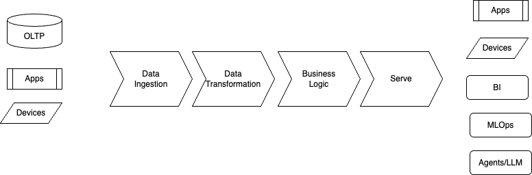
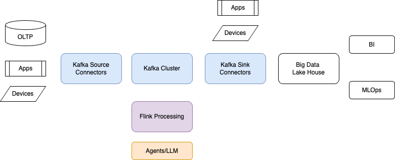

# Flink Project Management

When doing a project to deliver real-time processing there are a set of factors to consider. New project versus migration projects are not scoped the same, even if most of the time it is better for a migration project to start from the existing / updated business requirements, and leverage the lessons learned during the previous project to build a better solution.

At a high-level there are some mandatory components we need to consider when designing a data streaming processing solution:

<figure markdown="span">

</figure>

* Source of data: Apps, Databases, Transactional Systems, Devices
* Ingestion: get data into landing zone
* Processing: with data transformation and business rule implementation to prepare valuable analytical data product
* Serve: the data product to external consumers
* Consumers: Apps, Business Intelligence dashboard, Devices, MLops to prepare for machine learning model, and Agents/LLM

To support the scoping of those different sources and processing components, this chapter lists project activities and review questions by stage. Detailed event-level questions sit under **Design**; bounded vs unbounded data under **Migrating from Batch Processing**. 

## Target Architecture

As the data streaming processing will be done with Apache Flink and the Ingestion will be supported by Apache Kafka, we propose the following components in scope of supporting the solution. This is important to have this in mind to drive the interview sessions and the design tasks.

<figure markdown="span">

</figure>

## Scope Discovery

Even if we embrace building by iterations, and tune the scope over time, address these early; some stay recurrent across releases.

* What kind of solution is it (greenfield, migration, extension)?
* Who owns the data product and who consumes it (roles, not only systems)?
* Data loading patterns: snapshot, incremental, frequency of change; volume per source and frequency of new or updated records
* Data structure (structured vs unstructured); who owns schema definition and change approval
* Business logic to apply; state and time semantics of each pipeline (see **Design**)
* Source semantics and data update pattern at origin

Use **Per-stage review questions** for workshop-style coverage by diagram component. Use **Data mesh alignment** and **Generic streaming review** when architecture spans domains or platforms.

## Per-stage review questions

Questions below map to the diagram: Sources, Ingestion, Processing, Serve, Consumers. Each stage implies **contracts**: schema/registry, SLAs, and ownership of changes.

### Source of data

Apps, databases, transactional systems, devices.

* Who owns each source domain and who can approve schema or behavior changes?
* CDC vs application events vs files/APIs: which pattern per source, and why?
* Ordering guarantees at source (per key, per partition, none)? See **Design** → Event semantic.
* Idempotency and retry behavior of producers; risk of duplicates or gaps?
* Initial load vs ongoing change capture: full snapshot needed? Retention of source logs or binlog?
* Network and security path to ingestion (VPC, private link, credential rotation).

### Ingestion (landing zone)

* What is the landing contract: raw vs lightly normalized, format, partitioning, retention?
* Topic or stream naming, environment isolation, and access control model.
* Schema registration strategy: who registers, compatibility rules, subject or topic layout.
* Dead-letter or quarantine path for poison messages; replay from landing vs re-source.
* Ingestion SLAs (lag, completeness) and how they are measured. See **Design** → Scalability.

### Processing

Transformations, business rules, analytical data product.

* Clear definition of the data product: granularity, keys, refresh semantics, intended consumers.
* Stateful vs stateless operations; state TTL and cleanup; changelog vs upsert outputs.
* Joins across streams: watermark strategy, allowed lateness, handling late data. See **Design** → Event semantic.
* Versioning of business rules and safe rollout (feature flags, backfill strategy). See **Migrating from Batch Processing** for bounded recompute.
* Tests for pipelines: unit and integration, contract tests against schemas. See **Design** → Data Integrity.

### Serve

Expose the data product to consumers.

* Interface model: Kafka topic, API, warehouse sync, feature store, or other.
* Consumer onboarding: documentation, sample access, SLAs, breaking-change policy.
* Access patterns: batch pull vs streaming push and cost implications.
* Freshness and completeness SLOs advertised to consumers.

### Consumers

Apps, BI, devices, MLOps, agents/LLM.

* Latency and freshness requirements per consumer class.
* BI: materialized views vs direct stream subscribe; snapshot intervals.
* MLOps: training vs online features; point-in-time correctness if applicable.
* Agents and LLM: PII handling, grounding and source of truth, rate limits and cost controls. See **Design** → Privacy.

## Data mesh alignment

Use when multiple domains or teams own data and platforms.

* **Domain ownership**: Which bounded context owns each source and each derived data product? Who is the accountable product owner?
* **Data as a product**: Product sheet or equivalent: purpose, schema, SLAs, sample access, support channel.
* **Self-serve platform**: What the platform provides (ingestion patterns, Flink or SQL standards, catalog, observability) vs what domains build.
* **Federated computational governance**: Global policies (PII, retention, naming) vs local decisions; how exceptions are approved.
* **Discoverability**: Catalog and metadata, lineage from source to served product, ownership tags.
* **Mesh and streaming**: Stream and topic boundaries aligned with domain boundaries, or shared pipelines that blur ownership.

## Generic streaming review

Cross-cutting items that complement **Design** (per-stream detail).

* **Delivery semantics**: At-least-once vs exactly-once end-to-end; where idempotent sinks are required. Ties to **Design** → Event semantic.
* **Time semantics**: Processing time vs event time; clock skew; business definition of on-time delivery.
* **State and recovery**: Checkpoint interval, expected recovery time, savepoint strategy for upgrades.
* **Backfill and reprocessing**: Historical recompute without double-counting or inconsistent downstream state.
* **Schema evolution**: Forward and backward compatibility, consumer upgrade order, emergency rollback. Ties to **Design** → Data Integrity.
* **Observability**: Lag, throughput, error rate; data quality checks in-stream vs offline.
* **Capacity and cost**: Peak vs steady state; autoscaling limits; growth of state, topics, and logs.
* **Multi-region and DR**: RPO and RTO for the streaming path; active-active vs failover.

## Migrating from Batch Processing

*Some important elements: Flink can run batch or streaming. Connectors will not be the same, and most likely the business logic may differ too.*

* Assess if data is unbounded or bounded. Per-stage **Source of data** and **Processing** questions apply differently when data is bounded.
* For bounded data, how often is a new record added or an existing one modified?

## Design

Design is embedded in development. For each stream of records, assess the following (see also **Per-stage review questions** and **Generic streaming review**).

### Event semantic

* What are the business entity, and primary key?
* What the event time, and who initiate it?
* Will it be out-of-order events? (As part of a producer's retry)
* Do correlated events come with time gap and lateness?
* Is there any potential duplicate, also on retry or reload?
* Do the source of event in append, or already provide upsert semantic?
* Do we need to support exactly-once delivery?

### Scalability

* what is the data volume Bps and # of msg/s?
* What is the expected latency expected end-to-end?
* Do you expect bursty workload? How frequently? And why?
* How are you handling backpressure?
* What would be the risk if this system goes down by the minute/hour?

### Privacy

* How are you handling PII data end-to-end?
* Is PII detected/tagged pre-ingestion into the pipeline?
* Do you need to handle "Right To Be Forgotten" (GDPR/CCPA) requests?
* What would be the ideal tagging strategy?

### Data Integrity

* what is the current data governance practices? and tools?
* What does it look like when new data sources are added from an engineering standpoint?
* How relevant are the risks of schema changes creating disruption across the end-to-end solution? What are the consequences? How would you figure it out?
* Have you identified bad quality data downstream and identified root causes?

## Resources

* [Moving to a Data as a Product Architecture Chapter](https://jbcodeforce.github.io/flink-studies/methodology/data_as_a_product/)
* [Data topology methodology](https://jbcodeforce.github.io/data/data-topology/)
* [Data Mesh summary](https://jbcodeforce.github.io/data/#data-mesh)
* [EDA adoption assessment questions](https://jbcodeforce.github.io/eda-studies/methodology/ddd/eda_assessment/)
