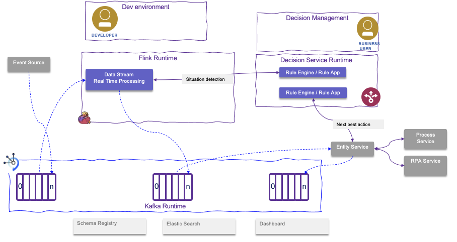
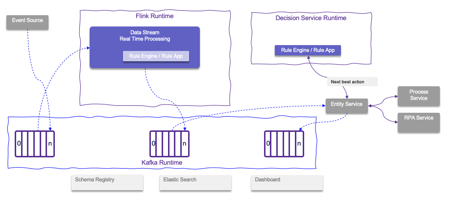

# Fit for purpose

## Difference between Kafka Streams and Flink

* Flink is a complete streaming computation system that supports HA, Fault-tolerance, self-monitoring, and a variety of deployment models.
* Kafka Streams within k8s will provide horizontal scaling. But it is bounded by the number of partitions. Resilience is ensured with Kafka topics.
* Flink has Complex Event Processing capabilities to search for pattern of event occurences.
* Flink supports data at rest or in motion, and multiple sources and sinks, no need to be only Kafka.
* Flink needs a custom implementation of `KafkaDeserializationSchema<T>` to read both key and value from Kafka topic.
* Kafka streams is easier to define a pipeline for Kafka records and to do the `consume - process - produce` loop. In Flink we need to code producer and consumer.
* KStreams uses the Kafka Record time stamp, while with Flink we need to implement how to deserialize the KafkaRecord and get the timestamp from it.
* Support of late arrival is easier with KStreams, while Flink uses the concept of side output stream.

## When to use rule engine versus Flink

By rule engine, we are talking about libraries / products that are implementing the [Rete Algorithm](https://en.wikipedia.org/wiki/Rete_algorithm) and extends from there. 
Some of those engines are also supporting time windowing operators. 
The major use case is to implement prescriptive logic based on `if ... then ...else` constructs and define the knowledge base as a set of rules. 
This is the base of expert systems and it was part of the early years of Artificial Intelligence. 
Expert systems have still their role in modern IT and AI solution. They help to:

* automate human's decisions as an expert will do. In fact it is better to say like a worker will apply his/her decisions on data
and still be involved in addressing the more difficult decisions.
* have a clear understanding of the logic executed behind a decision, which is a real challenge in AI and deep learning models.
* reprocess rules when new facts are added so rule engine can be used to maintain a conversation with the client application 
to enrich facts and take decision
* externalize the business logic from code:  it is easier to test and help to develop what-if scenarios with champion and challenger decision evaluation methodology

Flink can do Complex Event Processing and Stream processing with time windowing.

The technologies are indeed complementary: if we consider to get a stream of events from a event backbone like Kafka and then 
process those events with Flink we can also call a remote decision service via REST end point within the flink flow. 

The figure above illustrates a generic processing, where event sources are injecting events to Kafka topics, 
Flink application processes the events as part of a situation detection pattern. 
The situation detection is supported by the Flink processing and the rule engine: the responsability to implement 
the complex time windowing logic is assigned to a Developer, 
while the business logic to support scoring or assessing best action, may be done by business analysts using a high level rule language and a decision management platform. 
It is important to note that once a situation is detected, it is important to publish it as a fact in a Kafka topic, 
to adopt an event sourcing and event-driven architecture approach. 
The down stream processing is to compute the next best action. This component can enrich the data from the situation event received, so the best action decision can consider more data elements. This is a classical approach to develop rule based application. 
Once the action is decided, it is publish to a topic too, and this orchestration service (named here "entity service") may call different external services, like a business process execution environment, and robot process automation,...

Another effective way is to embed the rule engine and the ruleset inside the Flink application:

The goal is to reduce latency and avoid unnecessary remote calls which adds complexity with retries, circuit breaker and fail over.