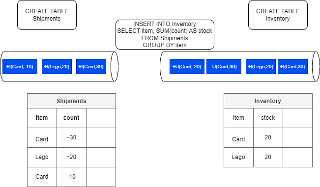

# Flink SQL and Table API

Flink SQL is a compliant standard SQL engine for processing batch or streaming data on top of distributed computing of Flink.

Flink’s SQL support is based on [Apache Calcite](https://calcite.apache.org/) to support SQL based streaming logic implementation. It is using the [Table API](https://nightlies.apache.org/flink/flink-docs-release-1.19/docs/dev/table/tableapi/) which is a language-integrated query API for Java, Scala, and Python that allows the composition of queries from relational operators such as selection, filter, and join.

The Table API can deal with bounded and unbounded streams in a unified and highly optimized ecosystem inspired by databases and SQL.

Table and SQL are implemented on top of low level stream operator API, which itself runs on the dataflow runtime:

{ width=400}

It is possible to code the SQL and Table API in a Java, Scala or Python or use SQL client, which is an interactive client to submit SQL queries to Flink and visualize the results.

Stream or bounded data are mapped to Table, the following command will load data from a csv file and create a dynamic table in Flink:

```sql
CREATE TABLE car_rides (
    cab_number VARCHAR,
    plate VARCHAR, 
    cab_type VARCHAR,
    driver_name VARCHAR, 
    ongoing_trip VARCHAR, 
    pickup_location VARCHAR, 
    destination VARCHAR, 
    passenger_count INT
) WITH ( 
    'connector' = 'filesystem',
    'path' = '/home/flink-sql-quarkus/data/cab_rides.txt',
    'format' = 'csv'
);
```

They are dynamic, because they change overtime, and some tables are more a changelog stream than static tables. Grouping statement creates tables with update row semantic.

The following diagram illustrates the main concepts: the `shipments` table keeps track of good shipments while the `inventory` keeps the current quantity of each item. The insert statement is the stream processing to update the inventory from the new shipment records. This SQL statement uses the sum aggregator operation on the count for each item. The items are shuffled to group them by item.



The SQL is applied to the stream of data, data is not stored in Flink. The events can be insert, update or delete record in the table. The diagram illustrates that on the sink level a first event is created to remove the Card item stock and send a new message with the new count. 


Dynamic Table can also being persisted in Kafka Topic, so table definition includes statement on how to connect to Kafka. When doing batch processing the sink can be a table in database or a csv file on the filesystems.

Note that SQL Client executes each INSERT INTO statement as a single Flink job. `STATEMENT SET` can be used to group insert statements. It executes statements asynchronously, the job manager schedules the job to the task managers. While for batch processing; developer can set `set table.dml-sync option to true` 

With streaming, the "ORDER BY" is one time ascending order, with batch it can apply to anything.

SQL client can intract in interactive mode or [using a SQL file)(https://nightlies.apache.org/flink/flink-docs-release-1.19/docs/dev/table/sqlclient/#execute-sql-files) to process to the server. 

## Programming model

* Start Flink server using docker ([start with docker compose](./firstapp/#docker-compose-for-dev-environment))
* If not done yet, create the SQL client docker image ([]())
* Start by creating a java application (quarkus create app for example or using maven) and a Main class. See code in [flink-sql-quarkus](https://github.com/jbcodeforce/flink-studies/blob/master/flink-sql-quarkus/) folder.
* Add dependencies in the pom

```xml
      <dependency>
        <groupId>org.apache.flink</groupId>
        <artifactId>flink-table-api-java-bridge</artifactId>
        <version>${flink-version}</version>
      </dependency>
        <dependency>
        <groupId>org.apache.flink</groupId>
        <artifactId>flink-table-runtime</artifactId>
        <version>${flink-version}</version>
        <scope>provided</scope>
      </dependency>
      <dependency>
        <groupId>org.apache.flink</groupId>
        <artifactId>flink-table-planner-loader</artifactId>
        <version>${flink-version}</version>
        <scope>provided</scope>
      </dependency>
```

The `TableEnvironment` is the entrypoint for Table API and SQL integration. See [Create Table environment](https://nightlies.apache.org/flink/flink-docs-release-1.19/docs/dev/table/common/#create-a-tableenvironment)

```java

public class FirstSQLApp {
 public static void main(String[] args) {
        StreamExecutionEnvironment env = StreamExecutionEnvironment.getExecutionEnvironment();
        StreamTableEnvironment tableEnv = StreamTableEnvironment.create(env);
```

A TableEnvironment maintains a map of catalogs of tables which are created with an identifier. Each identifier consists of 3 parts: catalog name, database name and object name.

```java
    // build a dynamic view from a stream and specifies the fields. here one field only
    Table inputTable = tableEnv.fromDataStream(dataStream).as("name");

    // register the Table object in default catalog and database, as a view and query it
    tableEnv.createTemporaryView("clickStreamsView", inputTable);
```


Tables may either be temporary, and tied to the lifecycle of a single Flink session, or permanent, and visible across multiple Flink sessions and clusters.

Queries such as SELECT ... FROM ... WHERE which only consist of field projections or filters are usually stateless pipelines. However, operations such as joins, aggregations, or deduplications require keeping intermediate results in a fault-tolerant storage for which Flink’s state abstractions are used.


### ETL with Table API

See code: [TableToJson](https://github.com/jbcodeforce/flink-studies/blob/master/flink-sql-quarkus/src/test/java/org/acme/TableToJson.java)

```java
public static void main(String[] args) throws Exception {
        StreamExecutionEnvironment streamEnv = StreamExecutionEnvironment.getExecutionEnvironment();
        StreamTableEnvironment tableEnv = StreamTableEnvironment.create(streamEnv);

        final Table t = tableEnv.fromValues(
                
            row(12L, "Alice", LocalDate.of(1984, 3, 12)),
            row(32L, "Bob", LocalDate.of(1990, 10, 14)),
            row(7L, "Kyle", LocalDate.of(1979, 2, 23)))
        .as("c_id", "c_name", "c_birthday")
        .select(
                jsonObject(
                JsonOnNull.NULL,
                    "name",
                    $("c_name"),
                    "age",
                    timestampDiff(TimePointUnit.YEAR, $("c_birthday"), currentDate())
                )
        );

        tableEnv.toChangelogStream(t).print();
        streamEnv.execute();
    }
```

### Join with a kafka streams

Join transactions coming from Kafka topic with customer information.

```java
    // customers is reference data loaded from file or DB connector
    tableEnv.createTemporaryView("Customers", customerStream);
    // transactions come from kafka
    DataStream<Transaction> transactionStream =
        env.fromSource(transactionSource, WatermarkStrategy.noWatermarks(), "Transactions");
    tableEnv.createTemporaryView("Transactions", transactionStream
    tableEnv
        .executeSql(
            "SELECT c_name, CAST(t_amount AS DECIMAL(5, 2))\n"
                + "FROM Customers\n"
                + "JOIN (SELECT DISTINCT * FROM Transactions) ON c_id = t_customer_id")
        .print();
```

## SQL Client

The SQL Client aims to provide an easy way of writing, debugging, and submitting table programs to a Flink cluster without a single line of code in any programming language. See [this note](./firstapp.md/#sql-client) for how to use an SQL client with docker.

As a quick tests on the car_rides table 
## Challenges

* We cannot express everything in SQL but we can mix Flink Stream and Table APIs

## Read more

* [SQL and Table API overview](https://nightlies.apache.org/flink/flink-docs-release-1.15/docs/dev/table/overview/)
* [Table API](https://nightlies.apache.org/flink/flink-docs-release-1.15/docs/dev/table/tableapi/)
* [Flink API examples](https://github.com/twalthr/flink-api-examples) presents how the API solves different scenarios:

    * as a batch processor,
    * a changelog processor,
    * a change data capture (CDC) hub,
    * or a streaming ETL tool