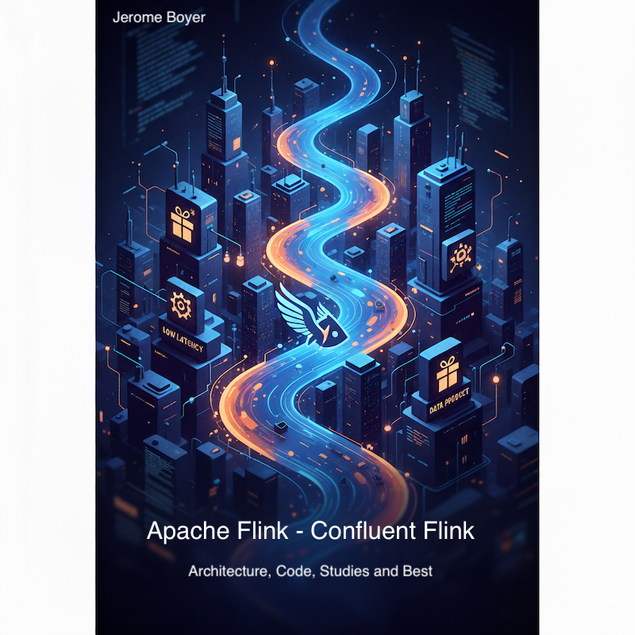

# 🚧 The Complete Guide to Apache Flink and Confluent Flink

Welcome to **"A Guide to Apache Flink and Confluent Flink"** - a comprehensive, hands-on resource for mastering stream processing with Apache Flink and its enterprise distributions. I started this living book, in 2018 while working as IBM Distinguished Enginer / CTO for [Event-Driven Architecture](https://jbcodeforce.github.io/eda-studies/), and continue to enhance it while working at AWS and Confluent. It addresses practical implementations, methodologies and best practices I can share with my customers. In 2024 and 2025 I am focusing on Confluent Flink and Data mesh. All this content come from public content, articles, youtube, product documentations, git repositories.

To make it fun, here is the book cover! Very imaginative for a book that will never go to press.

<figure markdown="span">
  
  <figcaption>A virtual book about Apache Flink - 2018 to 2025</figcaption>
</figure>

???- info "Site updates"
    * Created 2018 
    * Updates 10/2024: Reorganized content, separated SQL vs Java, added Confluent Cloud/Platform integration
    * Updates 01/25: Added Terraform deployment examples, expanded SQL samples
    * Updates 07/25: Added e2e demos, Flink estimator webapp, Data mesh
    * update 09/2025: Work on new demonstration, code samples, improve deployment for Confluent Platform for Flink

## What You'll Discover

This site is designed to share studies of the Flink ecosystem, covering everything from fundamental concepts to advanced real-world implementations:

### **Foundations & Architecture**
- Core Flink concepts and runtime architecture
- Stream processing fundamentals and event time semantics
- Fault tolerance, checkpointing, and exactly-once processing
- State management and stateful stream processing patterns

### **Programming with Flink**
- **Flink SQL**: From basic queries to complex analytical pipelines
- **DataStream API**: Building robust streaming applications in Java
- **Table API**: Bridging SQL and programmatic approaches
- **PyFlink**: Stream processing with Python

### **Deployment**
- Kubernetes-native deployments with Flink Operator
- Infrastructure as Code
- Monitoring, alerting, and performance optimization
- High availability and disaster recovery patterns

### **Real-World Streaming Architectures**
- **Change Data Capture (CDC)** pipelines with Debezium
- **Apache Kafka** integration and event-driven architectures
- **Data Lake** integration with Apache Iceberg
- **Real-time Analytics** with complex event processing

---

> 🚧 **This guide is still under heavy development. Content, examples, and structure may change frequently. Check back often for updates!** 🚧

---

## Enterprise-Ready with Confluent

This book provides extensive coverage of **Confluent Platform for Apache Flink** and **Confluent Cloud Flink**, including:

- **Confluent Cloud Flink** compute pools and managed services
- **Confluent Platform** on-premises deployment patterns
- **ksqlDB to Flink** migration strategies and best practices
- Integration with Confluent's Schema Registry and Connect ecosystem

## Hands-On Learning Approach

Every concept is reinforced with practical implementations:

### **Code Examples** 
- **20+ Java applications** demonstrating DataStream patterns
- **50+ SQL scripts** covering joins, aggregations, and window functions
- **Python Table API** examples and integration patterns
- Complete **end-to-end demonstrations** with multiple components

### **End-to-End Demonstrations**
- **E-commerce Analytics Pipeline**: Real-time user behavior analysis
- **CDC Deduplication**: Change data capture with transformation patterns
- **Financial Transaction Processing**: Complex event processing for fraud detection
- **IoT Data Processing**: Time-series analysis and alerting

### **Deployment-Ready Infrastructure**
- Docker Compose environments for local development
- Kubernetes manifests for production deployment
- Terraform modules for cloud infrastructure
- Monitoring stack with Prometheus and Grafana

## Who This Guide Is For

Whether you're a **data engineer** building streaming pipelines, a **software architect** designing event-driven systems, or a **platform engineer** deploying Flink clusters, this guide provides the depth and breadth you need.

**Prerequisites**: Basic familiarity with distributed systems, SQL, and Java or Python programming.

## Learning Path

This book is structured to support both **linear reading** and **focused deep-dives**:

=== "**Quick Start Track** (1-2 weeks)""
    1. [Getting Started](coding/getting-started.md) - Your first Flink application
    2. [Flink SQL Basics](coding/flink-sql.md) - Stream processing with SQL
    3. [Local Deployment](coding/k8s-deploy.md) - Running Flink on Kubernetes

=== "**Foundation Track** (3-4 weeks)""
    1. [Architecture Deep Dive](architecture/index.md) - Understanding Flink internals
    2. [State Management](architecture/index.md#state-management) - Stateful stream processing
    3. [Fault Tolerance](architecture/index.md#fault-tolerance) - Exactly-once guarantees

=== "**Advanced Track** (4-6 weeks)"
    1. [DataStream Programming](coding/datastream.md) - Complex stream processing logic
    2. [Kafka Integration](architecture/kafka.md) - Event-driven architectures
    3. [Production Deployment](techno/ccloud-flink.md) - Enterprise deployment patterns

=== "**Production Track** (6-8 weeks)"
    1. [Performance Tuning](architecture/cookbook.md) - Optimization techniques
    2. [Monitoring & Observability](techno/fk-k8s-monitor.md) - Production operations
    3. [End-to-End Projects](labs/index.md) - Real-world implementations

## What Makes This Guide Unique

### **Living Documentation**
- **Continuously Updated**: Content evolves with Flink releases and best practices
- **Community Driven**: Open source with contributions from practitioners
- **Practical Focus**: Every concept backed by working code examples

### **Production Tested**
- All examples are **tested and validated** in real environments
- **Performance benchmarks** and optimization guidelines
- **Troubleshooting guides** based on real-world challenges

### **Multi-Platform Coverage**
- **Apache Flink OSS** - Complete open-source implementation
- **Confluent Cloud** - Fully managed cloud service
- **Confluent Platform** - Enterprise on-premises deployment

--- 

> 💡 **Tip**: This guide is designed to be read online at [https://jbcodeforce.github.io/flink-studies/](https://jbcodeforce.github.io/flink-studies/) with full navigation, search, and interactive examples. You can also clone the [GitHub repository](https://github.com/jbcodeforce/flink-studies) to run all examples locally.
