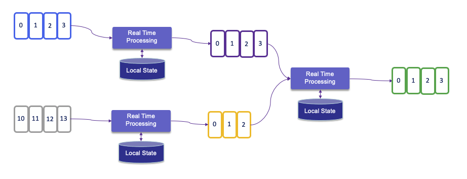

# Apache Flink Studies

## The why

In classical IT architecture, we can see two types of data processing: transactional and analytics. With 'monolytics' application design, the database system serves multiple applications which sometimes access the same database instances and tables. This approach cause problems to support evolution and scaling. Microservice architecture addresses part of those problems by isolating data storage per service. 

To get insight from the data, the traditional approach is to develop data warehouse and ETL jobs to copy and transform data from the transactional systems to the warehouse. ETL process extracts data from a transactional database, transforms data into a common representation that might include validation, value normalization, encoding, deduplication, and schema transformation, and finally loads it into the target analytical database. They are batchs and run periodically.
From the datawarehouse, the analysts build queries, metrics, and dashboards / reports to address a specific business question. Massive storage is needed, which uses different protocol such as: NFS, S3, HDFS...

Today, there is a new way to think about data by seeing they are created as continuous streams of events, which can be processed in real time, and server as the foundation for stateful stream processing application: the analytics move to the real data stream.

We can define three classes of applications implemented with stateful stream processing:

1. Event-driven applications: to adopt the reactive manifesto for scaling, resilience, responsive application, leveraging messaging as communication system.
1. Data pipeline applications: replace ETL with low latency stream processing.
1. Data analytics applications: immediately act on the data and query live updated reports. 

For more real industry use cases content see the [Flink Forward web site.](https://www.flink-forward.org/)

## The What 

[Apache Flink](https://flink.apache.org) (2016) is a framework and **distributed processing** engine for stateful computations over unbounded and bounded data streams. Flink supports batch (data set )and graph (data stream) processing. It is very good at:

* Very low latency processing event time semantics to get consistent and accurate results even in case of out of order events
* Exactly once state consistency 
* Millisecond latencies while processing millions of events per second
* A lot of connectors to integrate with Kafka, Cassandra, Elastic Search, JDBC, S3...
* Support container and deployment on Kubernetes
* Support updating the application code and migrate jobs to different Flink clusters without losing the state of the application
* Also support batch processing

The figure below illustrates those different models combined with [Zepellin](https://zeppelin.apache.org/) as a multi purpose notebook to develop data analytic projects on top of Spark, Python or Flink.

 

## Stream processing concepts

In [Flink](https://ci.apache.org/projects/flink/flink-docs-release-1.12/learn-flink/#stream-processing), applications are composed of streaming dataflows that may be transformed by user-defined operators. These dataflows form directed graphs that start with one or more sources, and end in one or more sinks. The data flows between operations. 
The figure below, from product documentation, summarizes the simple APIs used to develop a data stream processing flow:

 
 
 *src: apache Flink product doc*

Stream processing includes a set of functions to transform data, to produce a new output stream. Intermediate steps compute rolling aggregations like min, max, mean, or collect and buffer records in time window to compute metrics on finite set of events. 
To properly define window operator semantics, we need to determine both how events are assigned to buckets and how often the window produces a result. Flink's streaming model is based on windowing and checkpointing, it uses controlled cyclic dependency graph
 as its execution engine.

The following figure is showing integration of stream processing runtime with an append log system, like Kafka, with internal local state persistence and continuous checkpoint to remote storage as HA suport:

As part of the checkpointing process, Flink saves the 'offset read commit' information of the append log, so in case of a failure, Flink recovers a stateful streaming application by restoring its state from a previous checkpoint and resetting the read position on the append log.

The evolution of microservice is to become more event-driven, which are stateful streaming applications that ingest event streams and process the events with application-specific business logic. This logic can be done in flow defined in Flink and executed in the clustered runtime.

A lot of predefined connectors exist to connect to specific source and sink. Transform operators can be chained. Dataflow can consume from Kafka, Kinesis, Queue, and any data sources. A typical high level view of Flink app is presented in figure below:

 

 *src: apache Flink product doc*

Programs in Flink are inherently parallel and distributed. During execution, a stream has one or more stream partitions, and each operator has one or more operator subtasks.

 

 *src: apache Flink site*

A Flink application, can be stateful, run in parallel on a distributed cluster. The various parallel instances of a given operator will execute independently, in separate threads, and in general will be running on different machines.
State is always accessed local, which helps Flink applications achieve high throughput and low-latency. You can choose to keep state on the JVM heap, or if it is too large, saves it in efficiently organized on-disk data structures.

 

This is the Job Manager component which parallelizes the job and distributes slices of [the Data Stream](https://ci.apache.org/projects/flink/flink-docs-stable/dev/datastream_api.html) flow, you defined, to the Task Managers for execution. Each parallel slice of your job will be executed in a **task slot**.

 

Once Flink is started (for example with the docker image), Flink Dashboard [http://localhost:8081/#/overview](http://localhost:8081/#/overview) presents the execution reporting of those components:

 

The execution is from one of the training examples, the number of task slot was set to 4, and one job is running.

Spark is not a true real time processing while Flink is. Flink and Spark support batch processing too. 

## Statefulness

When using aggregates or windows operators, states need to be kept. For fault tolerant Flink uses checkpoints and savepoints. 
Checkpoints represent a snapshot of where the input data stream is with each operator's state. A streaming dataflow can be resumed from a checkpoint while maintaining consistency (exactly-once processing semantics) by restoring the state of the operators and by replaying the records from the point of the checkpoint.

In case of failure of a parallel execution, Flink stops the stream flow, then restarts operators from the last checkpoints. When doing the reallocation of data partition for processing, states are reallocated too. 
States are saved on distributed file systems. When coupled with Kafka as data source, the committed read offset will be part of the checkpoint data.

Flink uses the concept of `Checkpoint Barriers`, which represents a separation of records, so records received since the last snapshot are part of the future snapshot. Barrier can be seen as a mark, a tag in the data stream that close a snapshot. 

 

In Kafka, it will be the last committed read offset. The barrier flows with the stream so can be distributed. Once a sink operator (the end of a streaming DAG) has received the `barrier n` from all of its input streams, it acknowledges that `snapshot n` to the checkpoint coordinator. 
After all sinks have acknowledged a snapshot, it is considered completed. Once `snapshot n` has been completed, the job will never ask the source for records before such snapshot.

State snapshots are save in a state backend (in memory, HDFS, RockDB). 

KeyedStream is a key-value store. Key match the key in the stream, state update does not need transaction.

For DataSet (Batch processing) there is no checkpoint, so in case of failure the stream is replayed.

## Difference between Kafka Streams and Flink

* Flink is a complete streaming computation system that supports HA, Fault-tolerance, self-monitoring, and a variety of deployment modes.
Kafka Streams within k8s will provide horizontal scaling. Resilience is ensured with Kafka topics.
* Flink has CEP capabilities
* Flink supports data at rest or in motion, and multiple source and sink, no need to be Kafka.
* Flink needs a custom implementation of `KafkaDeserializationSchema<T>` to read both key and value from Kafka topic.
* Kafka streams is easier to define a pipeline for Kafka records and do the consumer - process - produce loop. In Flink we need to code producer and consumer.
* KStreams uses the Kafka Record time stamp, with Flink we need to implement how to deserialize the KafkaRecord and get the timestamp from it.
* Support of late arrival is easier with KStreams, while Flink uses the concept of side output stream.

## Resources

* [Product documentation](https://flink.apache.org/flink-architecture.html). 
* [Official training](https://ci.apache.org/projects/flink/flink-docs-release-1.12/learn-flink/)
* Base docker image is: [https://hub.docker.com/_/flink](https://hub.docker.com/_/flink)
* [Flink docker setup](https://ci.apache.org/projects/flink/flink-docs-master/ops/deployment/docker.html) and the docker-compose files in this repo.
* [FAQ](https://wints.github.io/flink-web/faq.html)
* [Cloudera flink stateful tutorial](https://github.com/cloudera/flink-tutorials/tree/master/flink-stateful-tutorial): very good example for inventory transaction and queries on item considered as stream
* [Building real-time dashboard applications with Apache Flink, Elasticsearch, and Kibana](https://www.elastic.co/blog/building-real-time-dashboard-applications-with-apache-flink-elasticsearch-and-kibana)
* Udemy Apache Flink a real time hands-on. (But a 2 stars enablement for me)