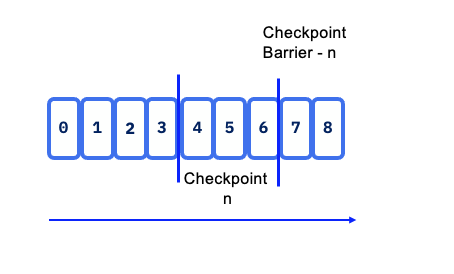

# Apache Flink Studies

## The What 

[Apache Flink](https://flink.apache.org) (2016) is a framework and **distributed processing** engine for stateful computations over unbounded and bounded data streams. It is considered to be superior to spark and hadoop. It supports batch and graph processing. 

Here is simple diagram of Flink architecture.

 

The run time can run on any common resource manager like hadoop Yarn, Mesos, or kubernetes. It can run on its own with two majors cluster types: Job manager and task manager. Two types of processing: data set or data stream. For development purpose we can use the docker images to deploy a **Session** or **Job cluster** in a containerized environment.

Flink's streaming model is based on windowing and checkpointing, it uses controlled cyclic dependency graph as its execution engine.

[Zepellin](https://zeppelin.apache.org/) is a multi purpose notebook to develop data analytic projects on top of Spark, Python or Flink.

### Clusters

Use **session** cluster to run multiple jobs: we need a JobManager container. Job cluster is for a single job: the cluster and the job are deployed together.

Different [deployment models](https://ci.apache.org/projects/flink/flink-docs-release-1.11/ops/deployment/) are supported:

* Deploy on executing cluster, this is the **session mode**. (There is a trade off to run multiple concurrent jobs in session mode).
* **Per job** mode, spin up a cluster per job submission. More k8s oriented. This provides better resource isolation.
* **Application mode** creates a cluster per app with the main() function executed on the JobManager. It can include multiple jobs but run inside the app. It allows for saving the CPU cycles required, but also save the bandwidth required for downloading the dependencies locally.

### Useful links

* [Product documentation](https://flink.apache.org/flink-architecture.html). 
* Base docker image is: [https://hub.docker.com/_/flink](https://hub.docker.com/_/flink)
* [Flink docker setup](https://ci.apache.org/projects/flink/flink-docs-master/ops/deployment/docker.html) and the docker-compose on this repo.
* [FAQ](https://wints.github.io/flink-web//faq.html)

## Batch processing

Process all the data in one job with bounded dataset. It is used when we need all the data for assessing trend, develop AI model, and with more throughput concern than latency.

Hadoop was designed to do batch processing.

## Stream processing concepts

In [Flink](https://ci.apache.org/projects/flink/flink-docs-release-1.11/learn-flink/#stream-processing), applications are composed of streaming dataflows that may be transformed by user-defined operators. These dataflows form directed graphs that start with one or more sources, and end in one or more sinks.

 

Dataflow can consume from Kafka, kinesis, queue, and any data source. A typical high level view of Flink app is presented as:

 
 *src: apache flink site*

Programs in Flink are inherently parallel and distributed. During execution, a stream has one or more stream partitions, and each operator has one or more operator subtasks.

 
 *src: apache flink site*

A Flink application, can be stateful, run in parallel on a distributed cluster. The various parallel instances of a given operator will execute independently, in separate threads, and in general will be running on different machines.
State is always accessed local, which helps Flink applications achieve high throughput and low-latency. You can choose to keep state on the JVM heap, or if it is too large, in efficiently organized on-disk data structures.

 

This is the Job Manager component which parallelizes the job and distributes slices of [DataStream](https://ci.apache.org/projects/flink/flink-docs-stable/dev/datastream_api.html) flow you defined, to the Task Managers for execution. Each parallel slice of your job will be executed in a **task slot**.

 

Once flink is started (for example with the docker image), Flink Dashboard [http://localhost:8081/#/overview](http://localhost:8081/#/overview) presents the execution reporting of those components:

 

The execution is from one of the training examples, the number of task slot was set to 4, and one job is running.

Spark is not a true real time processing while Fink is. Spark supports batch processing. 

## First app

The goal is to develop a [Java main function with the process flow definition](https://ci.apache.org/projects/flink/flink-docs-release-1.11/dev/datastream_api.html#anatomy-of-a-flink-program). Build a jar and then send the jar as a job to the Job manager. For development we can use docker-compose to start a simple Flink session cluster or use a docker compose that starts a standalone job manager to execute one unique job, which has the application jar mounted inside the docker image. 

* Start Flink session cluster using the following command: 

  ```shell
  docker-compose up -d
  ```

  The docker compose mounts the local folder to /home in both the job manager and task manager containers so we can submit the job from the job manager (accessing the compiled jar) and access the data files in the task manager container.
* Create a Quarkus app: `mvn io.quarkus:quarkus-maven-plugin:1.10.3.Final:create -DprojectGroupId=jbcodeforce -DprojectArtifactId=my-flink`

* Add the following [maven dependencies](https://mvnrepository.com/artifact/org.apache.flink) into pom.xml

```xml
<!-- https://mvnrepository.com/artifact/org.apache.flink/flink-java -->
<dependency>
    <groupId>org.apache.flink</groupId>
    <artifactId>flink-java</artifactId>
    <version>1.12.0</version>
</dependency>
<dependency>
    <groupId>org.apache.flink</groupId>
    <artifactId>flink-streaming-java_2.12</artifactId>
    <version>1.12.0</version>
    <scope>provided</scope>
</dependency>
```

* Build the main function with the following code structure:

    * get execution context
    * defined process flow
    * start the execution

```java
// Get execution context
  ExecutionEnvironment env = ExecutionEnvironment.getExecutionEnvironment();
  ParameterTool params = ParameterTool.fromArgs(args);
  env.getConfig().setGlobalJobParameters(params);
  // Define data flow processing...

  env.execute();
```

* package the jar with `mvn package`
* Every Flink application needs an execution environment, `env` in previous example. To submit a job to a Session cluster use the following commands:

```shell
# One way with mounted files to task manager and job manager containers.
CNAME="jbcodeforce.p1.WordCountMain"
JMC=$(docker ps --filter name=jobmanager --format={{.ID}})
docker exec -ti $JMC flink run -d -c $CNAME /home/my-flink/target/my-flink-1.0.0-SNAPSHOT.jar --input file://home/my-flink/data/wc.text --output file://home/data/out.csv 
```

In previous execution, `flink` is a CLI.

The file needs to be accessible from the Task manager container: so mounting the same filesystem to both container helps to access the jar for the java class and the potential file to be used to process the data.

See [this programming note](#programming.md) for other dataflow examples. [Operators](https://ci.apache.org/projects/flink/flink-docs-stable/dev/stream/operators/)) transform one or more DataStreams into a new DataStream. Programs can combine multiple transformations into sophisticated dataflow topologies.

## Example of standalone job compose file

Change the parameter of the standalone-job command:

```yaml
version: "2.2"
services:
  jobmanager:
    image: flink:1.11.2-scala_2.11
    ports:
      - "8081:8081"
    command: standalone-job --job-classname com.job.ClassName [--job-id <job id>] [--fromSavepoint /path/to/savepoint [--allowNonRestoredState]] [job arguments]
    volumes:
      - /host/path/to/job/artifacts:/opt/flink/usrlib
    environment:
      - |
        FLINK_PROPERTIES=
        jobmanager.rpc.address: jobmanager
        parallelism.default: 2

  taskmanager:
    image: flink:1.11.2-scala_2.11
    depends_on:
      - jobmanager
    command: taskmanager
    scale: 1
    volumes:
      - /host/path/to/job/artifacts:/opt/flink/usrlib
    environment:
      - |
        FLINK_PROPERTIES=
        jobmanager.rpc.address: jobmanager
        taskmanager.numberOfTaskSlots: 2
        parallelism.default: 2
```

## Statefulness

When using aggregates or windows operators states need to be kept. For fault tolerant Flink uses checkpoints and savepoints. Checkpoints represent a snapshot of where the input data stream is with the each operator's state. A streaming dataflow can be resumed from a checkpoint while maintaining consistency (exactly-once processing semantics) by restoring the state of the operators and replaying the records from the point of the checkpoint.

In case of failure of a parallel execution Flink stops the stream flow, then restarts operators from the last checkpoints. When doing the reallocation of data partition for processing, states are reallocated too. States are saved on distributed file systems. When coupled with Kafka as data source, the committed read offset will be part of the checkpoint data.

Flink uses the concept of `Checkpoint Barriers`, which represents a separation of records so records received since the last snapshot are part of the new snapshot. It can be seen as a mark, a tag in the data stream that close a snapshot. 

 

In Kafka it will be the last committed read offset. The barrier flows with the stream so can be distributed. Once a sink operator (the end of a streaming DAG) has received the barrier n from all of its input streams, it acknowledges that snapshot n to the checkpoint coordinator. After all sinks have acknowledged a snapshot, it is considered completed. Once snapshot n has been completed, the job will never ask the source for records before such snapshot.

State snapshots are save in a state backend (in memory, HDFS, RockDB). 

KeyedStream is a key-value store. Key match the key in the stream, state update does not need transaction.

For DataSet (Batch processing) there is no checkpoint, so in case of failure the stream is replayed.


## Resources

* Flink site with tutorial
* Udemy Apache Flink a real time hands-on on flink. (2 stars for me)