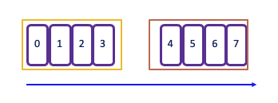

# Apache Flink Studies


???- info "Site updates"
    * Created 2018 
    * Updated 10/2024: reorganize the content, separate SQL versus Java, add Confluent Cloud and Platform contents in technology chapters.

???- info "This chapter updates"
    * Created 2018 
    * 10/24: rework intro and stream processing description. Move fault tolerance to architecture

## Why Flink?

In classical IT architecture, we can observe  two types of data processing: **1/** transactional and **2/** analytics. 

1. **Transactional** processing: In a 'monolithic' application, the database system serves multiple applications that may access the same database instances and tables. This approach can create challenges in supporting evolution and scalability. Microservice architecture addresses some of these issues by isolating data storage per service.

1. **Analytics**: To gain insights from the data, the traditional approach involves developing a data warehouse and ETL jobs to copy and transform data from transactional systems to the warehouse. ETL processes extract data from a transactional database, transform it into a common representation (including validation, normalization, encoding, deduplication, and schema transformation), and then load the new records into the target analytical database. These processes are run periodically in batches.

From the data warehouse, the analysts build queries, metrics, and dashboards / reports to address specific business questions. Data may be at stale. Massive storage is needed, and often the same data is replicated in multiple places, increasing cost and energy consumption.

Today, there is a new way to think about data by considering them as continuous streams of events that can be processed in real time. These event streams form the basis for stateful stream processing applications where **analytics are brought to the data**.

We can categorize applications implemented with stateful stream processing into three classes:

1. **Event-driven applications**: These applications follow the reactive manifesto for scaling, resilience, and responsiveness, utilizing messaging as a communication system. Microservice applications produce events, and consume them.
1. **Data pipeline applications**: These applications aim to replace ETL or ELT with low-latency stream processing for data transformation, enrichment, deduplication, etc...
1. **Data analytics applications**: These applications focus on computing aggregates and taking immediate action on data, as well as querying live, or creating reports.

## Overview of Apache Flink

[Apache Flink](https://flink.apache.org) (established in 2016) is a powerful framework and distributed processing engine designed for stateful computations over both unbounded and bounded data streams. It excels in batch processing and graph processing, becoming a standard in the industry due to its impressive performance and comprehensive feature set.

Flink's functionality is built upon four core capabilities:

* Streaming
* State Management
* Time Handling
* Checkpointing

Key characteristics of Flink include:

* **Low Latency Processing:** Offers event time semantics for consistent and accurate results, even with out-of-order events.
* **Exactly-Once Consistency:** Ensures reliable state management to avoid duplicates and not loosing message.
* **High Throughput:** Achieves millisecond latencies while processing millions of events per second.
* **Powerful APIs:** Provides APIs for operations such as map, reduce, join, window, split, and connect.
* **Fault Tolerance and High Availability:** Supports failover for task manager nodes, eliminating single points of failure.
* **Multilingual Support:** Enables streaming logic implementation in Java, Scala, Python, and SQL.
* **Extensive Connectors:** Integrates seamlessly with various systems, including Kafka, Cassandra, Pulsar, Elasticsearch, File system, JDBC complain Database, HDFS and S3.
* **Kubernetes Compatibility:** Supports containerization and deployment on Kubernetes with dedicated k8s operator to manage session job or application as well as job and task managers.
* **Dynamic Code Updates:** Allows for application code updates and job migrations across different Flink clusters without losing application state.
* **Batch Processing:** Also transparently support traditional batch processing workloads as reading at rest table becomes a stream in Flink.

## Stream processing concepts

A Flink application is executed as a **job**, representing a processing pipeline known as a Dataflow.

* **Dataflows** can be modified using user-defined operators. Each step of the pipeline is handled by an operator.
* These dataflows are structured as directed acyclic graphs (DAGs), beginning with one or more sources and concluding with one or more sinks.
* **Sources** retrieve data from streams, such as Kafka topics or partitions.

{ width=600 }

* The **source operator** forwards records to downstream operators.
* The graph can run in parallel, consuming data from different partitions.
* Operators can filter records from the streams or perform enrichments.
* Some operators can run in parallel after data redistribution.
* Operators like **Group By** may require reshuffling or repartitioning of data, or rebalancing to merge streams.

### Bounded and unbounded data

A Stream is a sequence of events, bounded or unbounded:


### Dataflow


In [Flink](https://ci.apache.org/projects/flink/flink-docs-release-1.12/learn-flink/#stream-processing), applications are composed of streaming dataflows. Dataflow can consume from Kafka, Kinesis, Queue, and any data sources. A typical high level view of Flink app is presented in figure below:

 

 *src: apache Flink product doc*

The figure below, from the product documentation, summarizes the APIs used to develop a data stream processing flow:

 
 
 *src: apache Flink product doc*


Stream processing includes a set of functions to transform data, and to produce a new output stream. Intermediate steps compute rolling aggregations like min, max, mean, or collect and buffer records in time window to compute metrics on a finite set of events. 

### Distributed platform

To improve throughput the data is partitioned so operators can run in parallel. Programs in Flink are inherently parallel and distributed. During execution, a stream has one or more stream partitions, and each operator has one or more operator subtasks.

 

 *src: apache Flink site*

Some operations, such as GROUP BY or COUNT, may require reshuffling or repartitioning the data. This can be a costly operation, involving serialization and network transmission. Ultimately, events can be assigned to a single sink through rebalancing from multiple streams.

```sql
INSERT INTO results
SELECT key, COUNT(*) FROM events
WHERE color <> blue
GROUP BY key;
```

In this example, the SQL statement can be executed in parallel. During the grouping phase, the streams are repartitioned, followed by rebalancing to send the results to one sink.

The following figure is showing integration of stream processing runtime with an append log system, like Kafka, with internal local state persistence and continuous checkpointing to remote storage as HA support:


Using a local state persistence, improves latency, while adopting a remote backup storage increases fault tolerance.

## Stateless

Stateless applications are designed to tolerate data loss and prioritize rapid recovery following failures. They continuously process the most recent incoming data, making them ideal for scenarios where only low-latency alerts are valuable. This category includes alerting systems and applications that only require the latest data point to function effectively.

When checkpointing is disabled, Apache Flink does not provide built-in guarantees against failures. As a result, you may encounter issues such as data loss, duplicate messages, and a complete loss of application state. This lack of reliability necessitates careful consideration when designing stateless systems, particularly in environments where data integrity is crucial.


## Stateful Processing

Stateful applications require the retention of state information, particularly when using aggregate or window operators. To ensure fault tolerance, Flink employs checkpoints and savepoints.

**Checkpoints** are snapshots of the input data stream, capturing the state of each operator at a specific point in time. This allows a streaming dataflow to be resumed from a checkpoint while maintaining consistency through exactly-once processing semantics. When a failure occurs, Flink can restore the state of the operators and replay the records starting from the checkpoint.

In the event of a failure in a parallel execution, Flink halts the stream flow and restarts the operators from the most recent checkpoints. During data partition reallocation for processing, the associated states are also reallocated. States are stored in distributed file systems, and when Kafka is used as the data source, the committed read offsets are included in the checkpoint data.

Flink utilizes the concept of **Checkpoint Barriers** to delineate records. These barriers separate records so that those received after the last snapshot are included in the next checkpoint, ensuring a clear and consistent state transition.

Barrier can be seen as a mark, a tag, in the data stream that closes a snapshot. 

 { width=600 }

In Kafka, the last committed read offset is utilized as part of the state management process. Checkpoint barriers flow with the stream, allowing them to be distributed across the system. When a sink operator — located at the end of a streaming Directed Acyclic Graph (DAG) — receives `barrier n` from all its input streams, it acknowledges `snapshot n` to the checkpoint coordinator.

Once all sink operators have acknowledged a snapshot, it is considered complete. After snapshot n is finalized, the job will not request any records from the source prior to that snapshot, ensuring data consistency and integrity.

State snapshots are stored in a state backend, which can include options such as in-memory storage, HDFS, or RocksDB. This flexibility allows for optimal performance and scalability based on the application’s requirements.

In the context of a KeyedStream, Flink functions as a key-value store where the key corresponds to the key in the stream. State updates do not require transactions, simplifying the update process.

For DataSet (Batch processing) there is no checkpoint, so in case of failure the stream is replayed from tHe beginning.

When addressing exactly once processing it is crucial to consider the following steps:

* **Read Operation from the Source**: Ensuring that the data is read exactly once is foundational. Flink's source connectors are designed to handle this reliably through mechanisms like checkpointing.
* **Apply Processing Logic** which involves operations such as window aggregation or other transformations, which can also be executed with exactly-once semantics when properly configured.
* **Generate Results to a Sink** introduces more complexity. While reading from the source and applying processing logic can be managed to ensure exactly-once semantics, generating a unique result to a sink depends on the target technology and its capabilities. Different sink technologies may have varying levels of support for exactly-once processing, requiring additional strategies such as idempotent writes or transactional sinks to achieve the desired consistency.


{ width=800 }

After reading records from Kafka, processing them, and generating results, if a failure occurs, Flink will revert to the last committed read offset. This means it will reload the records from Kafka and reprocess them. As a result, this can lead to duplicate entries being generated in the sink:

{ width=800 }

Since duplicates may occur, it is crucial to assess how downstream applications handle idempotence. Many distributed key-value stores are designed to provide consistent results even after retries, which can help manage duplicate entries effectively.

To achieve end-to-end exactly-once delivery, it is essential to utilize a sink that supports transactions and implements a two-phase commit protocol. In the event of a failure, this allows for the rollback of any output generated, ensuring that only successfully processed data is committed. However, it's important to note that implementing transactional outputs can impact overall latency.

Flink takes checkpoints periodically — typically every 10 seconds — which establishes the minimum latency we can expect at the sink level. This periodic checkpointing is a critical aspect of maintaining state consistency while balancing the need for timely data processing.

For Kafka Sink connector, as kafka producer, we need to set the `transactionId`, and the delivery guarantee type:

```java
new KafkaSinkBuilder<String>()
    .setBootstrapServers(bootstrapURL)
    .setDeliverGuarantee(DeliveryGuarantee.EXACTLY_ONCE)
    .setTransactionalIdPrefix("store-sol")
```

With transaction ID, a sequence number is sent by the kafka producer API to the broker, and so
the partition leader will be able to remove duplicate retries.

{ width=800 }

When the checkpointing period is set, we need to also configure `transaction.max.timeout.ms`
of the Kafka broker and `transaction.timeout.ms` for the producer (sink connector) to a higher
timeout than the checkpointing interval plus the max expected Flink downtime. If not the Kafka broker
will consider the connection has fail and will remove its state management.

## Windowing

[Windows](https://ci.apache.org/projects/flink/flink-docs-release-1.12/dev/stream/operators/windows.html) are buckets within a Stream and can be defined with times, or count of elements.

* **Tumbling** window assigns events to non-overlapping buckets of fixed size. Once the window boundary is crossed, all events within that window are sent to an evaluation function for processing. 

    * **Count-based tumbling** windows define how many events are collected before triggering evaluation. 
    * **Time-based** tumbling** windows define time interval (e.g., n seconds) during which events are collected. The amount of data within a window can vary depending on the incoming event rate. 
    
    ```java
    .keyBy(...).window(TumblingProcessingTimeWindows.of(Time.seconds(2)))
    ```

{ width=500 }

* **Sliding** windows allows for overlapping periods, meaning an event can belong to multiple buckets. This is particularly useful for capturing trends over time. The window sliding time parameter defines the duration of the window and the interval at which new windows are created. For example, in the following code snippet defines a new 2-second window is created every 1 second:

    ```java
    .keyBy(...).window(SlidingProcessingTimeWindows.of(Time.seconds(2), Time.seconds(1)))
    ```

    As a result, each event that arrives during this period will be included in multiple overlapping windows, enabling more granular analysis of the data stream.

{ width=500 }

* **Session** window begins when the data stream processes records and ends when there is a defined period of inactivity. The inactivity threshold is set using a timer, which determines how long to wait before closing the window.

    ```java
    .keyBy(...).window(ProcessingTimeSessionWindows.withGap(Time.seconds(5)))
    ```
    
    The operator creates one window for each data element received.  If there is a gap of 5 seconds without new events, the window will close. This makes session windows particularly useful for scenarios where you want to group events based on user activity or sessions of interaction, capturing the dynamics of intermittent data streams effectively.

{ width=500 }

* **Global** window: one window per key and never close. The processing is done with Trigger:

    ```java
    .keyBy(0)
	.window(GlobalWindows.create())
	.trigger(CountTrigger.of(5))
    ```

## Event time

**Time** is a central concept in stream processing and can have different interpretations based on the context of the flow or environment:

* **Processing Time** refers to the system time of the machine executing the task. It offers the best performance and lowest latency since it relies on the local clock.
* **Event Time** is the timestamp embedded in the record at the event source level. Using event time ensures consistent and deterministic results, regardless of the order in which events are processed. This is crucial for accurately reflecting the actual timing of events.
* **Ingestion Time** denotes the time when an event enters the Flink system. It captures the latency introduced during the event's journey into the processing framework.

In any time window, the order may not be guarantee, and some events with an older timestamp may fall outside of the time window boundaries. To address this challenge, particularly when computing aggregates, it’s essential to ensure that all relevant events have arrived within the intended time frame.

The watermark serves as a heuristic for this purpose.


### Watermarks

Watermarks are special markers that indicate the progress of event time in the stream. They help manage late arrivals by allowing the system to understand when it can safely close a window, ensuring that all necessary events have been accounted for before processing the aggregate.

[Watermarks](https://ci.apache.org/projects/flink/flink-docs-release-1.20/dev/event_timestamps_watermarks.html) are generated in the data stream at regular intervals and serve as indicators of the progression of time. Each watermark carries a timestamp that is calculated by subtracting an estimate of out-of-orderness from the largest timestamp encountered so far. This mechanism allows the stream processing system to make informed decisions about when to close windows and process aggregates, ensuring that all relevant events are considered while still accommodating the inherent variability in event arrival times.


Late arrived events are ignored as the complete information window is already gone. Within a window,states are saved on disk and need to be cleaned once the window is closed. The watermark is the limit from where the garbage collection can occur.

he out-of-orderness estimate serves as an educated guess and is defined for each individual stream. Watermarks are essential for comparing timestamps of events, allowing the system to assert that no earlier events will arrive after the watermark's timestamp.

Watermarks are crucial for effectively processing out-of-order events, especially when dealing with multiple sources. In scenarios involving IoT devices and network latency, it’s possible to receive an event with an earlier timestamp even after the operator has already processed events with that timestamp from other sources. Importantly, watermarks are applicable to any timestamps and are not limited to window semantics.

When working with Kafka topic partitions, the absence of watermarks can present challenges. Watermarks are generated independently for each stream and partition. When two partitions are combined, the resulting watermark will be the oldest of the two, reflecting the point at which the system has complete information. If one partition stops receiving new events, the watermark for that partition will not progress. To ensure that processing continues over time, an idle timeout configuration can be implemented.

The watermark generator operates within the Kafka consumer before the events are injected into the Flink stream or table, ensuring that the event time semantics are preserved throughout the processing pipeline.

When using open source Flink, developers need to define 1/ the watermark delay, 2/ the idle timeout, 3/ the max allowed watermark drift to control the pipeline efficiency.

With the windowing operator, event timestamps are utilized, but the windows themselves are defined based on elapsed time—such as a 10-minute duration. Watermarks are crucial for tracking the point in time beyond which no more delayed events are expected to arrive.

When using processing time, the watermark advances at regular intervals, typically every second. Events within the window are emitted for processing once the watermark surpasses the end of that window.

The Flink API requires a `WatermarkStrategy`, which  consists of  both a `TimestampAssigner` and `WatermarkGenerator`. A `TimestampAssigner` s a simple function that extracts a timestamp from a specific field in each event. Flink provides several common strategies as static methods within the `WatermarkStrategy` class.

Additionally, it is possible to configure the system to accept late events by specifying an `allowed lateness` period. This defines how late an element can arrive before it is discarded. Flink maintains the state of the window until the allowed lateness time has expired, allowing for flexible handling of late-arriving data while ensuring that the processing remains efficient and accurate.

--- 

#### Some examples 

Parallel watermarking is an example of getting data from 4 partitions with 2 kafka consumers and 2 windows:


Shuffling is done as windows are computing some COUNT or GROUP BY operations. Event A arriving at 3:13, and B[3:20] on green partitions, and are processed by Window 1 which considers 60 minutes time between 3:00 and 4:00. 

The connector sends a Watermark for each partition independently. If the out-of-orderness is set to be 5 minutes, so a watermark is created with a timestamp 3:08 = 3:13 - 5 (partition 0) and at 3:15 for partition 1. The generator sends the minimum of both. The timestamp reflects how complete the stream is so far: it could not be no more complete than the further behind which was event at 3:13, 

In the case of a partition does not get any events, as there is no watermark generated for this partition, it may mean the watermark does no advance, and as a side effect it prevents windows from producing events. To avoid this problem, we need to balance kafka partitions so none are empty or idle, or configure the watermarking to use idleness detection.

* See example [TumblingWindowOnSale.java](https://github.com/jbcodeforce/flink-studies/blob/master/flink-java/my-flink/src/main/java/jbcodeforce/windows/TumblingWindowOnSale.java) in my-fink folder and to test it, do the following:

```shell
# Start the SaleDataServer that starts a server on socket 9181 and will read the avg.txt file and send each line to the socket
java -cp target/my-flink-1.0.0-SNAPSHOT.jar jbcodeforce.sale.SaleDataServer
# inside the job manager container started with 
`flink run -d -c jbcodeforce.windows.TumblingWindowOnSale /home/my-flink/target/my-flink-1.0.0-SNAPSHOT.jar`.
# The job creates the data/profitPerMonthWindowed.txt file with accumulated sale and number of record in a 2 seconds tumbling window
(June,Bat,Category5,154,6)
(August,PC,Category5,74,2)
(July,Television,Category1,50,1)
(June,Tablet,Category2,142,5)
(July,Steamer,Category5,123,6)
...
```

### Trigger

A [Trigger](https://ci.apache.org/projects/flink/flink-docs-release-1.20/dev/stream/operators/windows.html#triggers) in Flink, determines when a window is ready to be processed. 

Each window has a default trigger associated with it. For example, a tumbling window might have a default trigger set to 2 seconds, while a global window requires an explicit trigger definition.

You can implement custom triggers by creating a class that implements the Trigger interface, which includes methods such as onElement(..), onEventTime(..), and onProcessingTime(..).


Flink provides several default triggers::

* **EventTimeTrigger** fires based upon progress of event time
* **ProcessingTimeTrigger** fires based upon progress of processing time
* **CountTrigger** fires when # of elements in a window exceeds a specified parameter.
* **PurgingTrigger** is used for purging the window, allowing for more flexible management of state.

### Eviction

**Evictor** is used to remove elements from a window either after the trigger fires or before/after the window function is applied. The specific logic for removing elements is application-specific and can be tailored to meet the needs of your use case.

The predefined evictors: 

* **CountEvictor** removes elements based on a specified count, allowing for fine control over how many elements remain in the window.
* **DeltaEvictor** evicts elements based on the difference between the current and previous counts, useful for scenarios where you want to maintain a specific change threshold.
* **TimeEvictor** removes elements based on time, allowing you to keep only the most recent elements within a given time frame.


## Resources

* [Product documentation](https://flink.apache.org/flink-architecture.html). 
* [Official training](https://ci.apache.org/projects/flink/flink-docs-release-1.12/learn-flink/)
* Base docker image is: [https://hub.docker.com/_/flink](https://hub.docker.com/_/flink)
* [Flink docker setup](https://ci.apache.org/projects/flink/flink-docs-master/ops/deployment/docker.html) and the docker-compose files in this repo.
* [FAQ](https://wints.github.io/flink-web/faq.html)
* [Cloudera flink stateful tutorial](https://github.com/cloudera/flink-tutorials/tree/master/flink-stateful-tutorial): very good example for inventory transaction and queries on item considered as stream
* [Building real-time dashboard applications with Apache Flink, Elasticsearch, and Kibana](https://www.elastic.co/blog/building-real-time-dashboard-applications-with-apache-flink-elasticsearch-and-kibana)
