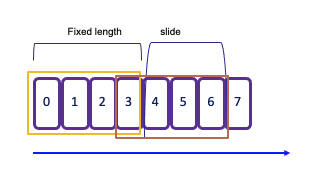

# Apache Flink - Core Concepts

???- info "Site updates"
    * Created 2018 
    * Updates 10/2024: Reorganized content, separated SQL vs Java, added Confluent Cloud/Platform integration
    * Updates 01/25: Added Terraform deployment examples, expanded SQL samples

## Quick Reference

- [Core Concepts](#overview-of-apache-flink)
- [Stream Processing](#stream-processing-concepts)
- [State Management](#stateful-processing)
- [Time Handling](#event-time)

## Why Flink?

Traditional data processing architectures face two key challenges:

1. **Transactional Systems**: Monolithic applications with shared databases create scaling and evolution challenges. Microservices help, but introduce data consistency issues.

2. **Analytics Systems**: Traditional ETL pipelines create stale data, require massive storage, and often duplicate data across systems. ETL processes extract data from a transactional database, transform it into a common representation 
(including validation, normalization, encoding, deduplication, and schema transformation), and then load the new records into the target analytical 
database. These processes are run periodically in batches.

Flink addresses these challenges by enabling **real-time stream processing** with three key application patterns:

1. **Event-Driven Applications**: Reactive systems using messaging for communication
2. **Data Pipelines**: Low-latency stream processing replacing ETL/ELT, for data transformation, enrichment, 
deduplication,
3. **Real-Time Analytics**: Immediate aggregates computation and action on streaming data

## Overview of Apache Flink

[Apache Flink](https://flink.apache.org) (established in 2016) is a distributed stream processing engine for stateful computations over bounded and unbounded data streams. It's become an industry standard due to its performance and comprehensive feature set.

Key Features:

* **Low Latency Processing:** Offers event time semantics for consistent and accurate results, even with out-of-order events.
* **Exactly-Once Consistency:** Ensures reliable state management to avoid duplicates and not loosing message.
* **High Throughput:** Achieves millisecond latencies while processing millions of events per second.
* **Powerful APIs:** Provides APIs for operations such as map, reduce, join, window, split, and connect.
* **Fault Tolerance and High Availability:** Supports failover for task manager nodes, eliminating single points of failure.
* **Multilingual Support:** Enables streaming logic implementation in Java, Scala, Python, and SQL.
* **Extensive Connectors:** Integrates seamlessly with various systems, including Kafka, Cassandra, Pulsar, Elasticsearch, File system, JDBC complain 
Database, HDFS and S3.
* **Kubernetes Compatibility:** Supports containerization and deployment on Kubernetes with dedicated k8s operator to manage session job or application as 
well as job and task managers.
* **Dynamic Code Updates:** Allows for application code updates and job migrations across different Flink clusters without losing application state.
* **Batch Processing:** Also transparently support traditional batch processing workloads as reading at rest table becomes a stream in Flink

## Stream Processing Concepts

A Flink application runs as a **job** - a processing pipeline (Dataflow) structured as a directed acyclic graph (DAG).

Key Components:

* **Sources**: Read from streams (Kafka, Kinesis, etc.)
* **Operators**: Transform, filter, enrich data
* **Sinks**: Write results to external systems

These dataflows are structured as directed acyclic graphs (DAGs), beginning with one or more sources and concluding with one or more sinks.

<figure markdown="span">
{ width=600 }
<figcaption>Data flow as directed acyclic graph</figcaption>
</figure>


* The **source operator** forwards records to downstream operators.
* The graph can run in parallel, consuming data from different partitions.
* Operators can filter records from the streams or perform enrichments.
* Some operators can run in parallel after data redistribution.
* Operators like **Group By** may require reshuffling or repartitioning of data, or rebalancing to merge streams.

### Bounded and unbounded data

A Stream is a sequence of events, bounded or unbounded:

<figure markdown="span">
{ width=600 }
<figcaption>FBounded and unbounded event sequence</figcaption>
</figure>


### Dataflow


In [Flink](https://ci.apache.org/projects/flink/flink-docs-release-1.12/learn-flink/#stream-processing), applications are composed of streaming dataflows. Dataflow can consume from Kafka, Kinesis, Queue, and any data sources. A typical high level view of Flink app is presented in figure below:

<figure markdown="span">

<figcaption>A Flink application -  src: apache Flink product doc</figcaption>
</figure>

The figure below, from the product documentation, summarizes the APIs used to develop a data stream processing flow:

<figure markdown="span">
{ width=600 }
<figcaption>Streaming Dataflow  src: apache Flink product doc</figcaption>
</figure>


Stream processing includes a set of functions to transform data, and to produce a new output stream. Intermediate steps compute rolling aggregations like min, max, mean, or collect and buffer records in time window to compute metrics on a finite set of events. 

### Distributed platform

To improve throughput the data is partitioned so operators can run in parallel. Programs in Flink are inherently parallel and distributed. During execution, a stream has one or more stream partitions, and each operator has one or more operator subtasks.

<figure markdown="span">
{ width=600 }
<figcaption>Distributed processing  src: apache Flink product doc</figcaption>
</figure>

Some operations, such as GROUP BY or COUNT, may require reshuffling or repartitioning the data. This can be a costly operation, involving serialization and network transmission. Ultimately, events can be assigned to a single sink through rebalancing from multiple streams.

Example SQL with parallel execution: During the grouping phase, the streams are repartitioned, followed by rebalancing to send the results to one sink.

```sql
INSERT INTO results
SELECT key, COUNT(*) FROM events
WHERE color <> blue
GROUP BY key;
```

The following diagram shows stream processing with Kafka integration, local state persistence, and remote checkpointing:

<figure markdown="span">
{ width=600 }
<figcaption>Flink and Kafka working hand-to-hand</figcaption>
</figure>

Using a local state persistence, improves latency, while adopting a remote backup storage increases fault tolerance.

## Stateless

Stateless applications are designed to tolerate data loss and prioritize rapid recovery following failures. They continuously process the most recent incoming data, making them ideal for scenarios where only low-latency alerts are valuable. This category includes alerting systems and applications that only require the latest data point to function effectively.

When checkpointing is disabled, Apache Flink does not provide built-in guarantees against failures. As a result, you may encounter issues such as data loss, duplicate messages, and a complete loss of application state. This lack of reliability necessitates careful consideration when designing stateless systems, particularly in environments where data integrity is crucial.

The following queries are stateless:

* INSERT INTO, 
* FROM (reading and writing to Kafka)
* WHERE (filters)
* CROSS JOIN UNNEST & LATERAL
* SELECT (projection)
* scalar and table functions


## Stateful Processing

Stateful applications require the retention of state information, particularly when using aggregate or window operators. The following operations lead to stateful queries:

* JOIN (except CROSS JOIN UNNEST & LATERAL)
* GROUP BY windowed or non-windowed aggregation
* OVER aggregation
* for pattern matching: MATCH_RECOGNIZE

To ensure fault tolerance, Flink employs [checkpoints](https://nightlies.apache.org/flink/flink-docs-release-1.20/docs/ops/state/checkpoints/) and savepoints. [See the checkpointing section for details](./architecture/index.md#checkpointing)

## Windowing

[Windows](https://ci.apache.org/projects/flink/flink-docs-release-1.12/dev/stream/operators/windows.html) are buckets within a Stream of finite size and can be defined with times, or count of elements. Flink provides several window table-valued functions (TVF) which are invoked inside a FROM clause of a SELECT: Timbling, Hop, Cumulate, session.

The results include all columns of original relation and the `window_start`, `window_end`, `window_time` columns to indicate the assigned window.

* **Tumbling** window assigns events to non-overlapping buckets of fixed size. Records are assigned to the window based on an event-time attribute field, specified by the DESCRIPTOR() function. Once the window boundary is crossed, all events within that window are sent to an evaluation function for processing. 

    * **Count-based tumbling** windows define how many events are collected before triggering evaluation. 
    * **Time-based** tumbling** windows define time interval (e.g., n seconds) during which events are collected. The amount of data within a window can vary depending on the incoming event rate. 
    
    ```java
    .keyBy(...).window(TumblingProcessingTimeWindows.of(Time.seconds(2)))
    ```

    in SQL:

    ```sql
    -- computes the sum of the price in the orders table within 10-minute tumbling windows
    SELECT window_start, window_end, SUM(price) as `sum`
    FROM TABLE(
        TUMBLE(TABLE `examples`.`marketplace`.`orders`, DESCRIPTOR($rowtime), INTERVAL '10' MINUTES))
    GROUP BY window_start, window_end;
    ```

<figure markdown="span">
{ width=500 }
<figcaption>Tumbling window concept</figcaption>
</figure>

* **Sliding** windows allows for overlapping periods, meaning an event can belong to multiple buckets. This is particularly useful for capturing trends over time. The window sliding time parameter defines the duration of the window and the interval at which new windows are created. For example, in the following code snippet defines a new 2-second window is created every 1 second:

    ```java
    .keyBy(...).window(SlidingProcessingTimeWindows.of(Time.seconds(2), Time.seconds(1)))
    ```

    As a result, each event that arrives during this period will be included in multiple overlapping windows, enabling more granular analysis of the data stream.

<figure markdown="span">
{ width=500 }
<figcaption>Sliding window concept</figcaption>
</figure>


* **Session** window begins when the data stream processes records and ends when there is a defined period of inactivity. The inactivity threshold is set using a timer, which determines how long to wait before closing the window.

    ```java
    .keyBy(...).window(ProcessingTimeSessionWindows.withGap(Time.seconds(5)))
    ```
    
    The operator creates one window for each data element received.  If there is a gap of 5 seconds without new events, the window will close. This makes session windows particularly useful for scenarios where you want to group events based on user activity or sessions of interaction, capturing the dynamics of intermittent data streams effectively.

<figure markdown="span">
{ width=500 }
<figcaption>Session window concept</figcaption>
</figure>


* **Global** window: one window per key and never close. The processing is done with Trigger:

    ```java
    .keyBy(0)
	.window(GlobalWindows.create())
	.trigger(CountTrigger.of(5))
    ```

[See Windowing Table-Valued Functions details in Confluent documentation](https://docs.confluent.io/cloud/current/flink/reference/queries/window-tvf.html).

## Event time

**Time** is a central concept in stream processing and can have different interpretations based on the context of the flow or environment:

* **Processing Time** refers to the system time of the machine executing the task. It offers the best performance and lowest latency since it relies on the local clock. But it may lead to no deterministic results due to factors like ingestion delays, parallel execution, clock synch, backpressure...
* **Event Time** is the timestamp embedded in the record at the event source level. Using event-time ensures consistent and deterministic results, regardless of the order in which events are processed. This is crucial for accurately reflecting the actual timing of events.
* **Ingestion Time** denotes the time when an event enters the Flink system. It captures the latency introduced during the event's journey into the processing framework.

In any time window, the order of arrival may not be guarantee, and some events with an older timestamp may fall outside of the time window boundaries. To address this challenge, particularly when computing aggregates, it's essential to ensure that all relevant events have arrived within the intended time frame.

The watermark serves as a heuristic for this purpose.

### Watermarks

Watermarks are special markers that indicate the progress of event time in the stream. This is the core mechanims to trigger computation at  event-time. They help manage late arrivals by allowing the system to understand when it can safely close a window, ensuring that all necessary events have been accounted for, before processing the aggregate.

[Watermarks](https://ci.apache.org/projects/flink/flink-docs-release-1.20/dev/event_timestamps_watermarks.html) are generated in the data stream at regular intervals and serve as indicators of the progression of time. They are special messages intermingled with other data records. Each watermark carries a timestamp that is calculated by subtracting an estimate of out-of-orderness from the largest timestamp encountered so far. This timestamp are always increasing. All records following a watermark should have a higher timestamp than the watermark, if not they are considered late records, and will be discarded. This mechanism allows the stream processing system to make informed decisions about when to close windows and to process aggregates, ensuring that all relevant events are considered while still accommodating the inherent variability in event arrival times.

<figure markdown="span">

<figcaption>Watermark concept/figcaption>
</figure>

Late arrived events are ignored as the complete information window is already gone. Within a window, states are saved on disk and need to be cleaned once the window is closed. The watermark is the limit from where the garbage collection can occur.

The out-of-orderness estimate serves as an educated guess and is defined for each individual stream. Watermarks are essential for comparing timestamps of events, allowing the system to assert that no earlier events will arrive after the watermark's timestamp.

Watermarks are crucial when dealing with multiple sources. In scenarios involving IoT devices and network latency, it's possible to receive an event with an earlier timestamp even after the operator has already processed events with that timestamp from other sources. Importantly, watermarks are applicable to any timestamps and are not limited to window semantics.

When working with Kafka topic partitions, the absence of watermarks may represent some challenges. Watermarks are generated independently for each stream and partition. When two partitions are combined, the resulting watermark will be the oldest of the two, reflecting the point at which the system has complete information. If one partition stops receiving new events, the watermark for that partition will not progress. To ensure that processing continues over time, an idle timeout configuration can be implemented.

The watermark generator operates within the Kafka consumer before the events are injected into the Flink stream or table, ensuring that the event time semantics are preserved throughout the processing pipeline.

When using open source Flink, developers need to define 1/ the watermark delay, 2/ the idle timeout, 3/ the max allowed watermark drift to control the pipeline efficiency.

With the windowing operator, event timestamps are utilized, but the windows themselves are defined based on elapsed time—such as a 10-minute duration. Watermarks are crucial for tracking the point in time beyond which no more delayed events are expected to arrive.

When using processing time, the watermark advances at regular intervals, typically every second. Events within the window are emitted for processing, once the watermark surpasses the end of that window.

The Flink API requires a `WatermarkStrategy`, which  consists of  both a `TimestampAssigner` and a `WatermarkGenerator`. A `TimestampAssigner` is a simple function that extracts a timestamp from a specific field in each event. Flink provides several common strategies as static methods within the `WatermarkStrategy` class. The `WatermarkGenerator` has two important methods: 1/ `onEvent(T event, long evt_time, WatermarkOutput output)` that is called for each produced event, that may update internal state and may emit a new watermark or not. 2/ `onPeriodicEmit(WatermarkOutput output)` to emit a watermark at specific period, configured via a job or Flink config. Developers may implement their own generator in the stream source operator. Operator broadcasts the watermarks to all its out going connection. 

<figure markdown="span">

<figcaption>Watermark propagation</figcaption>
</figure>


Each task has its own watermark, and at the arrival of a new watermark, it checks if it needs to advance its own watermark. When it is advanced, the task performs all triggered computations and emits all result records. The watermark is broadcasted to all output of the task.

The watermark of a task is the mininum of all per-connection watermarks. Task with multiple input, like JOINs or UNIONs maintains a single watermark, which is the minimum between the input watermarks.

Additionally, it is possible to configure the system to accept late events by specifying an `allowed lateness` period. This defines how late an element can arrive before it is discarded. Flink maintains the state of the window until the allowed lateness time has expired, allowing for flexible handling of late-arriving data while ensuring that the processing remains efficient and accurate.

#### Some watermark processing examples 

Parallel watermarking is an example of getting data from 4 partitions with 2 kafka consumers and 2 windows:

<figure markdown="span">

<figcaption>Parallel watermarking</figcaption>
</figure>


Shuffling is done as windows are computing some COUNT or GROUP BY operations. Event A arriving at 3:13, and B[3:20] on green partitions, and are processed by Window 1 which considers 60 minutes time between 3:00 and 4:00. 

The source connector sends a Watermark for each partition independently. If the out-of-orderness is set to be 5 minutes, a watermark is created with a timestamp 3:08 = 3:13 - 5 (partition 0) and at 3:15 (3:20 - 5) for partition 1. The generator sends the minimum of both. The timestamp reflects how complete the stream is so far: it could not be no more completed than the further behind which was event at 3:13, 

In the case of a partition does not get any events, as there is no watermark generated for this partition, it may mean the watermark does no advance, and as a side effect it prevents windows from producing events. To avoid this problem, we need to balance kafka partitions so none are empty or idle, or configure the watermarking to use idleness detection.

* See example [TumblingWindowOnSale.java](https://github.com/jbcodeforce/flink-studies/blob/master/flink-java/my-flink/src/main/java/jbcodeforce/windows/TumblingWindowOnSale.java) in my-fink folder and to test it, do the following:

```shell
# Start the SaleDataServer that starts a server on socket 9181 and will read the avg.txt file and send each line to the socket
java -cp target/my-flink-1.0.0-SNAPSHOT.jar jbcodeforce.sale.SaleDataServer
# inside the job manager container started with 
`flink run -d -c jbcodeforce.windows.TumblingWindowOnSale /home/my-flink/target/my-flink-1.0.0-SNAPSHOT.jar`.
# The job creates the data/profitPerMonthWindowed.txt file with accumulated sale and number of record in a 2 seconds tumbling window
(June,Bat,Category5,154,6)
(August,PC,Category5,74,2)
(July,Television,Category1,50,1)
(June,Tablet,Category2,142,5)
(July,Steamer,Category5,123,6)
...
```

#### Monitoring watermark

The following metrics are used at the operator and task level:

* `currentInputWatermark`: the last watermark received by the operator in its n inputs.
* `currentOutputWatermark`: last emitted watermark by the operator
* `watermarkAlignmentDrift`: current drift from the minimal watermakr emitted by all sources beloging to the same watermark group.

Watermarks can be seen in Apache flink Console. 

### Trigger

A [Trigger](https://ci.apache.org/projects/flink/flink-docs-release-1.20/dev/stream/operators/windows.html#triggers) in Flink, determines when a window is ready to be processed. 

Each window has a default trigger associated with it. For example, a tumbling window might have a default trigger set to 2 seconds, while a global window requires an explicit trigger definition.

You can implement custom triggers by creating a class that implements the Trigger interface, which includes methods such as onElement(..), onEventTime(..), and onProcessingTime(..).


Flink provides several default triggers::

* **EventTimeTrigger** fires based upon progress of event time
* **ProcessingTimeTrigger** fires based upon progress of processing time
* **CountTrigger** fires when # of elements in a window exceeds a specified parameter.
* **PurgingTrigger** is used for purging the window, allowing for more flexible management of state.

### Eviction

**Evictor** is used to remove elements from a window either after the trigger fires or before/after the window function is applied. The specific logic for removing elements is application-specific and can be tailored to meet the needs of your use case.

The predefined evictors: 

* **CountEvictor** removes elements based on a specified count, allowing for fine control over how many elements remain in the window.
* **DeltaEvictor** evicts elements based on the difference between the current and previous counts, useful for scenarios where you want to maintain a specific change threshold.
* **TimeEvictor** removes elements based on time, allowing you to keep only the most recent elements within a given time frame.


## Source of knowledge

* [x] [Product documentation](https://flink.apache.org/flink-architecture.html). 
* [x] [Official training](https://ci.apache.org/projects/flink/flink-docs-release-1.20/learn-flink/).
* [x] [Confluent "Fundamentals of Apache Flink" training- David Andersion](https://developer.confluent.io/courses/apache-flink/intro/).
* [x] [Anatomy of a Flink Cluster - product documentation.](https://nightlies.apache.org/flink/flink-docs-master/docs/concepts/flink-architecture/#anatomy-of-a-flink-cluster)
* [x] [Jobs and Scheduling - product documentation.](https://nightlies.apache.org/flink/flink-docs-master/docs/internals/job_scheduling/)
* Base docker image is: [https://hub.docker.com/_/flink](https://hub.docker.com/_/flink)
* [Flink docker setup](https://ci.apache.org/projects/flink/flink-docs-master/ops/deployment/docker.html) and the docker-compose files in this repo.
* [FAQ](https://wints.github.io/flink-web/faq.html)
* [x] [Cloudera flink stateful tutorial](https://github.com/cloudera/flink-tutorials/tree/master/flink-stateful-tutorial): very good example for inventory transaction and queries on item considered as stream
* [Building real-time dashboard applications with Apache Flink, Elasticsearch, and Kibana](https://www.elastic.co/blog/building-real-time-dashboard-applications-with-apache-flink-elasticsearch-and-kibana)
 