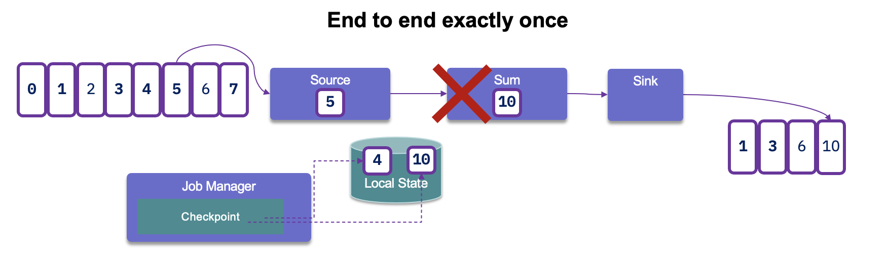
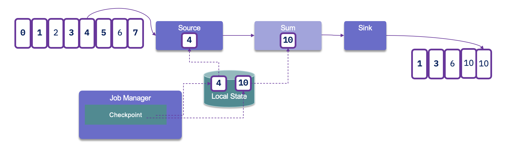
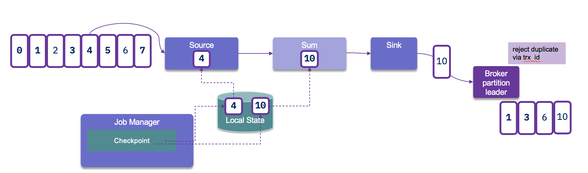

# Integration with Kafka

Flink has [a Kafka connector](https://ci.apache.org/projects/flink/flink-docs-release-1.14/dev/connectors/kafka.html) for consuming and producing messages. 
We need the connector jar, define Kafka server properties and then define the source for the stream.


## Consuming from Kafka

So the product documentation is wrong (03/2021): here are some notes and read the code under kafka-flink-demo folder and the [TelemetryAggregate class](https://github.com/jbcodeforce/flink-studies/blob/master/kafka-flink-demo/src/main/java/jbcodeforce/kafka/TelemetryAggregate.java).

The major change is to implement a DeserializerSchema to process the event as java bean: ([See code](https://github.com/jbcodeforce/flink-studies/blob/master/kafka-flink-demo/src/main/java/))

```java
public class TelemetryDeserializationSchema implements DeserializationSchema<TelemetryEvent> {

    private static final long serialVersionUID = -3142470930494715773L;
    private static final ObjectMapper objectMapper = new ObjectMapper();

    @Override
	public TelemetryEvent deserialize(byte[] message) throws IOException {
		return objectMapper.readValue(message, TelemetryEvent.class);
	}

	@Override
	public boolean isEndOfStream(TelemetryEvent nextElement) {
		return false;
	}

	@Override
	public TypeInformation<TelemetryEvent> getProducedType() {
		return TypeInformation.of(TelemetryEvent.class);
	}
    
}
```

Three serializers exist: TypeInformationSerializationSchema, JsonDeserializationSchema, AvroDeserializationSchema.

The creation of the Kafka data source uses the traditional Kafka properties, and the following construct:

```java
// better to use a separate class for config to be injected via CDI
KafkaConfiguration configuration = new KafkaConfiguration();
    
Properties kafkaProperties = configuration.getConsumerProperties("telemetryAggregators");

FlinkKafkaConsumer<TelemetryEvent> kafkaConsumer = new FlinkKafkaConsumer<TelemetryEvent>(configuration.mainTopicName, new TelemetryDeserializationSchema(), kafkaProperties);
kafkaConsumer.setStartFromEarliest();

DataStream<TelemetryEvent> telemetryStream = env.addSource(kafkaConsumer);
```

If no checkpointing is enabled then the consumer will periodically commit the offsets to Kafka (set `enable.auto.commit` and `auto.commit.interval.ms`) . It **does not rely on the committed offsets for fault tolerance guarantees**.

With Flink’s checkpointing enabled, the Flink Kafka Consumer will consume records from a topic and periodically checkpoint all its Kafka offsets, together with the state of other operations. 
When the checkpoints are completed then it will commit offsets to kafka.
In case of a job failure, Flink will restore the streaming program to the state of the latest 
checkpoint and re-consume the records from Kafka, starting from the offsets that were stored 
in the checkpoint.



But when it reprocesses the records again it will generate duplicate at the consumer level. 



Therefore the Sink connector needs to support transactional producer, and
uses the producer API to support avoid duplication with transaction id, idempotence
and acknowledge on all replicas:



Partition discover should be enable by properties so Flink job can discover newly added partitions.

### TimeStamp and Watermark

Timestamp can be in the ConsumerRecord or in the payload itself. so the app needs to specify how to extract the timestamp to be used for time window logic.
