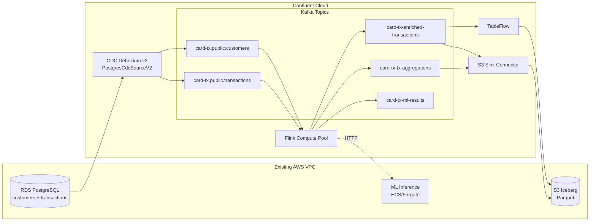
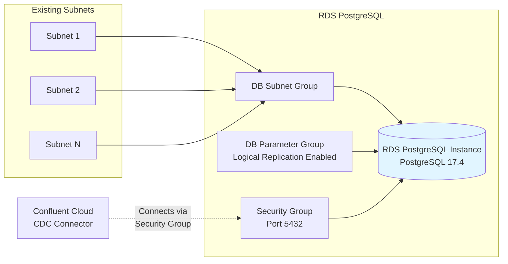

# Local labs / demos and other public demonstrations

This section lists the current demonstrations and labs in this git repository or the interesting public repositories about Flink

## Local demonstrations and end-to-end studies

All the local demonstrations run on local Kubernetes, some on Confluent Cloud. Most of them are still work in progress.

See the [e2e-demos](https://github.com/jbcodeforce/flink-studies/tree/master/e2e-demos) folder for a set of available demos based on the Flink local deployment or using Confluent Cloud for Flink.

Those demos are not finalized yet:

* [ ] [Record deduplication](https://github.com/jbcodeforce/flink-studies/tree/master/e2e-demos/dedup-demo) using Flink SQL or Table API deployed on Confluent Platform for Flink
* [ ] [Change Data Capture with Postgresql](https://github.com/jbcodeforce/flink-studies/tree/master/e2e-demos/cdc-demo), CDC Debezium, Confluent Platformm v8.0+, Cloud Native for Postgresql Kuberneted Operator
* [ ] [CDC from RDS Postgresql, CC Debezium v2, Flink processing](https://github.com/jbcodeforce/flink-studies/tree/master/e2e-demos/cc-cdc-tx-demo) with ML scoring:



* [ ] [e-commerce sale](https://github.com/jbcodeforce/flink-studies/tree/master/e2e-demos/e-com-sale)
* [ ] [Transform json records](https://github.com/jbcodeforce/flink-studies/tree/master/e2e-demos/json-transformation)
* [ ] [Qlik CDC emulated to Flink dedup, filtering, transform logic](https://github.com/jbcodeforce/flink-studies/tree/master/e2e-demos/cdc-dedup-transform)
* [ ] [External lookup](https://github.com/jbcodeforce/flink-studies/tree/master/e2e-demos/external-lookup)
* [ ] Flink to JDBC Sink connector
* [ ] Savepoint demonstration
* [ ] SQL Gateway demonstration
* [ ] Terraform deployment
* [ ] GitOps with Openshift, ArgoCD and Tekton

```mermaid
graph TB
    subgraph VPC["Existing VPC"]
        subgraph Subnets["Existing Subnets"]
            Subnet1[Subnet 1]
            Subnet2[Subnet 2]
            SubnetN[Subnet N]
        end
        
        subgraph RDS["RDS PostgreSQL"]
            RDSInstance[(RDS PostgreSQL Instance<br/>PostgreSQL 17.4)]
            RDSSubnetGroup[DB Subnet Group]
            RDSParamGroup[DB Parameter Group<br/>Logical Replication Enabled]
            RDSSG[Security Group<br/>Port 5432]
        end
        
        subgraph ECS["ECS/Fargate ML Inference"]
            ECSCluster[ECS Cluster]
            ECSTask[ECS Task Definition]
            ECSService[ECS Service]
            ECSSG[Security Group<br/>Ports 8080, 443]
            ECRRepo[ECR Repository<br/>ML Inference Container]
            CloudWatchLogs[CloudWatch Log Group]
        end
        
        subgraph Redshift["Redshift Serverless (Optional)"]
            RedshiftNS[Redshift Namespace]
            RedshiftWG[Redshift Workgroup]
            RedshiftSG[Security Group<br/>Port 5439]
        end
    end
    
    subgraph S3["S3 Storage"]
        S3Bucket[(S3 Bucket<br/>Iceberg Sink)]
        S3Versioning[S3 Versioning]
        S3Encryption[S3 Encryption<br/>AES256]
    end
    
    subgraph IAM["IAM Resources"]
        S3User[IAM User<br/>S3 Sink User]
        S3AccessKey[IAM Access Key]
        S3UserPolicy[IAM User Policy<br/>S3 Access]
        ECSTaskExecRole[ECS Task Execution Role]
        ECSTaskRole[ECS Task Role<br/>S3 Access]
        RedshiftSpectrumRole[Redshift Spectrum Role<br/>S3 & Glue Access]
    end
    
    %% VPC relationships
    Subnet1 --> RDSSubnetGroup
    Subnet2 --> RDSSubnetGroup
    SubnetN --> RDSSubnetGroup
    RDSSubnetGroup --> RDSInstance
    RDSParamGroup --> RDSInstance
    RDSSG --> RDSInstance
    
    %% ECS relationships
    Subnet1 --> ECSService
    Subnet2 --> ECSService
    SubnetN --> ECSService
    ECSSG --> ECSService
    ECRRepo --> ECSTask
    ECSTask --> ECSService
    ECSCluster --> ECSService
    CloudWatchLogs --> ECSTask
    ECSTaskExecRole --> ECSTask
    ECSTaskRole --> ECSTask
    
    %% Redshift relationships
    Subnet1 --> RedshiftWG
    Subnet2 --> RedshiftWG
    SubnetN --> RedshiftWG
    RedshiftSG --> RedshiftWG
    RedshiftNS --> RedshiftWG
    RedshiftSpectrumRole --> RedshiftNS
    
    %% S3 relationships
    S3Versioning --> S3Bucket
    S3Encryption --> S3Bucket
    S3UserPolicy --> S3User
    S3AccessKey --> S3User
    S3User --> S3Bucket
    ECSTaskRole --> S3Bucket
    RedshiftSpectrumRole --> S3Bucket
    
    %% External connections
    ConfluentCloud[Confluent Cloud<br/>CDC Connector] -.->|Connects via<br/>Security Group| RDSSG
    Flink[Flink SQL<br/>Statements] -.->|HTTP/HTTPS| ECSSG
    
    style RDSInstance fill:#e1f5ff
    style S3Bucket fill:#fff4e1
    style ECSCluster fill:#e8f5e9
    style RedshiftNS fill:#f3e5f5
    style IAM fill:#fff9c4
```







## Public repositories with valuable demonstrations


* [Managing your Confluent Cloud Flink project at scale with a shift_left CLI](https://github.com/jbcodeforce/shift_left_utils)
* [Personal Flink demo repository](https://jbcodeforce.github.io/flink_project_demos/) for Data as a product, ksql to Flink or Spark to Flink automatic migration test sets.
* [Confluent Flink how to](https://docs.confluent.io/cloud/current/flink/reference/sql-examples.html#)
* [Confluent demonstration scene](https://github.com/confluentinc/demo-scene): a lot of Kafka, Connect, and ksqlDB demos
* [Confluent developer SQL training](https://developer.confluent.io/courses/flink-sql/overview/)
* [Confluent Quick start with streaming Agents](https://github.com/confluentinc/quickstart-streaming-agents)
* [lab 3- Agentic Fleet Management Using Confluent Intelligence](https://github.com/confluentinc/quickstart-streaming-agents/blob/master/LAB3-Walkthrough.md)

* [Demonstrate Flink SQL test harness tool for Confluent Cloud Flink](https://jbcodeforce.github.io/shift_left_utils/coding/test_harness/#usage-and-recipe).

* [Shoes Store Labs](https://github.com/jbcodeforce/shoe-store)  to run demonstrations on Confluent Cloud. 
* [Confluent Cloud and Apache Flink in EC2 for Finserv workshop](https://github.com/vdeshpande-confluent/finserv-flink-workshop.git)
* [Online Retailer Stream Processing Demo using Confluent for Apache Flink](https://github.com/confluentinc/online-retailer-flink-demo)


* [Shift Left End to End Demonstration](https://github.com/confluentinc/online-retailer-flink-demo/blob/gko-2026/Shiftleft/README.md)

## Interesting Blogs

* [Building Streaming Data Pipelines, Part 1: Data Exploration With Tableflow](https://www.confluent.io/blog/building-streaming-data-pipelines-part-1/)
* [Building Streaming Data Pipelines, Part 2: Data Processing and Enrichment With SQL](https://www.confluent.io/blog/streaming-etl-flink-tableflow/)

## Quick personal demo for Confluent Cloud for Flink

Using the data generator and the `confluent flink shell`

* Login to Confluent using cli
* Be sure to use the environment with the compute pool: 

```sh
confluent environment list
confluent environment use <env_id>
confluent flink compute-pool list
# get the region and cloud and the current max CFU
confluent flink compute-pool use <pool_id>
```

* Once in Flink Workspace use the markeplace tables
