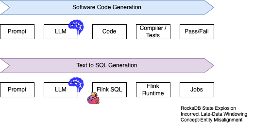
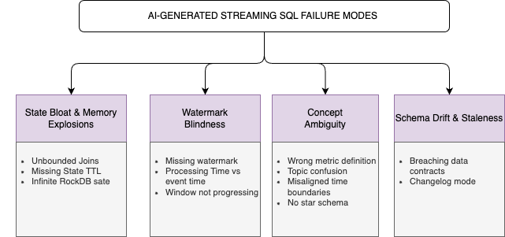

# Leveraging AI for Shift Left Analytics
*From Legacy Batch Bottlenecks to Real-Time Streaming Data Products*

## Executive Summary & Presentation Thesis

* **Core Thesis:** AI accelerates the transition from traditional, downstream batch data warehousing to upstream, real-time "Shift Left Analytics." However, because **data is not software**, pointing naive AI agents at data streams causes severe hallucination, state explosions, and semantic failures. Successfully scaling real-time analytics requires pairing stream engines like Apache Flink on Confluent Cloud with explicit Data Contracts, canonical streaming data models, and curated AI Skills.
* **Key Real-World Anchor:** Integrating our project experiences and Anthropics's battle-tested framework for AI analytics—where they automated **95% of business analytics queries with ~95% accuracy** by fixing data foundations, context retrieval, and semantic governance.
* **Target Audience:** Data Architects, Lead Data Engineers, Analytics Engineering Managers, and CTO/VP of Data.
* **Duration:** ~30–45 minutes.


---

## The Problem with AI-Generated SQL in Streaming Contexts

### Principles
* **The Core Reality: Data is Not Software**
Most AI coding assistants (e.g., Claude Code, GitHub Copilot) excel at software engineering because software development has a deterministic feedback loop: code compiles, tests pass or fail, and types are validated. Those provide instant guardrails against hallucinations.

In data analytics—and specifically stream processing—SQL generation faces a fundamentally different challenge.There is no simple compiler check to prove if a SQL query’s business logic is actually correct. A syntactically valid SQL query will execute happily on Apache Flink while producing completely erroneous business results or slowly eating cluster memory.

<figure markdown='span'>

<caption>**Verification Gap**</caption>
</figure>

LLMs are overwhelmingly trained on batch SQL dialects (ANSI SQL, Snowflake, BigQuery, PostgreSQL). They treat all tables as finite, static arrays rather than infinite, append-only or changelog event streams.

### The Four Fundamental Failure Modes
When an LLM attempts to generate stream transformations without domain-specific streaming guardrails, it consistently falls into four architectural failure modes:

<figure markdown='span'>

<caption>**SQL Failure Modes**</caption>
</figure>

1. **State Bloat & Memory Explosions** (The "Infinite Table" Assumption)
    * The Pitfall: In batch SQL, SELECT * FROM Orders O JOIN Payments P ON O.id = P.id scans two finite files and completes. In Flink SQL, an unbounded inner/outer join forces the engine to retain every key from both streams in memory (RocksDB State Backend) forever, waiting for potential future matches.
    * The Consequence: State size grows linearly $O(N)$ with event volume. Without explicit State Time-To-Live (TTL) configuration (table.exec.state.ttl or /*+ STATE_TTL(...) */ hints), the cluster eventually exhausts disk/memory capacity and crashes.
    * What AI Writes: Standard JOIN or GROUP BY without state bound parameters.
    * What Flink Requires: Temporal Table Joins, Interval Joins (P.pay_time BETWEEN O.order_time AND O.order_time + INTERVAL '1' HOUR), or explicit State TTL SQL hints.

1. **Concept-to-Entity Ambiguity:** 
    * The Pitfall: As [Anthropic documented](https://claude.com/blog/how-anthropic-enables-self-service-data-analytics-with-claude), standard LLMs struggle with mapping natural language concepts to explicit database entities. In streaming, this is amplified: 
        * What constitutes an "Active Customer"? Is it an event in the user_clicks Kafka topic, or an upsert-kafka record in account_status?.
        * What is a 'completed transaction'? In a stream, does it include late-arriving events? Does it apply a 5-minute tumbling window or a sliding window?
        * What is the event boundary? Should late-arriving events within 10 minutes be included in the revenue calculation?
    * The Consequence: The AI builds syntactically correct queries that select from the wrong Kafka topic or join against raw event streams instead of curated, deduplicated streams.
1. **Watermark & Event-Time Blindness:**
    * The Pitfall: Stream processing relies on event-time watermarks to handle out-of-order data and determine when a window (Tumbling, Hopping, Cumulate) can be closed and emitted downstream.
    * The Consequence: AI models frequently write GROUP BY TUMBLE(PROCTIME(), ...) using processing time rather than event time, making outputs non-deterministic and impossible to replay backfills. Alternatively, they omit the WATERMARK FOR clause in CREATE TABLE DDLs, leaving tumbling windows permanently open because the stream engine never advances event time.
    * What AI Writes: Windowing based on CURRENT_TIMESTAMP or raw wall-clock time.
    * What Flink Requires: Explicit watermark definitions (WATERMARK FOR event_time AS event_time - INTERVAL '5' SECOND) and stream heartbeats.

1. **Schema Drift & Changelog Mismatches**
    * The Pitfall: Flink Tables carry underlying semantics (append-only vs. upsert/changelog). AI agents usually treat every kafka topic as a plain relational table.
    * The Consequence: Generating a query over an upsert-table without accurately define primary keys forces Flink to inject a heavy ChangelogNormalize operator in the execution graph, doubling state overhead and CPU utilization.

???+ example "Naive AI SQL Generated"
    To illustrate this for the presentation, consider a request: "Calculate total revenue per user over 1-hour windows from orders and payments."
    * Naive AI-Generated Query (Fails in Production)
    ```SQL
    -- Generated by standard Text-to-SQL LLM
    SELECT 
        O.user_id,
        SUM(P.amount) AS total_revenue,
        DATE_TRUNC('hour', O.order_time) AS order_hour
    FROM orders O
    JOIN payments P ON O.order_id = P.order_id
    GROUP BY O.user_id, DATE_TRUNC('hour', O.order_time);
    ```

    Why it fails:

        1. Unbounded Join: JOIN payments keeps all order and payment IDs in state indefinitely.
        1. Batch Windowing: DATE_TRUNC is a batch function. In Flink, it causes continuous retractions and infinite state retention per user/hour combination.
        1. No Watermarks: Flink cannot bound memory or guarantee event ordering.


    * Production-Grade Flink SQL (Engineered for Confluent Cloud)
    ```SQL
        -- Enforce State Retention Rule
        SET 'table.exec.state.ttl' = '12 h';

        -- Structured Stream Processing with Cumulate Window & Interval Join
        SELECT 
            O.user_id,
            SUM(P.amount) AS total_revenue,
            window_end AS order_hour
        FROM (
            SELECT order_id, user_id, order_time
            FROM orders
        ) O
        JOIN payments P ON O.order_id = P.order_id
        -- Interval Join bounds state retention to 15 minutes around the order
        AND P.payment_time BETWEEN O.order_time AND O.order_time + INTERVAL '15' MINUTE
        GROUP BY 
            O.user_id,
            -- Native Flink CUMULATE windowing for deterministic event-time emission
            CUMULATE(TABLE orders, DESCRIPTOR(order_time), INTERVAL '15' MINUTE, INTERVAL '1' HOUR);
    ```

### Empirical Validation: Why "Dumping Query Logs" Does Not Work
A common instinct when building text-to-SQL agents is to retrieve historical query logs from a vector database (RAG over past SQL). Anthropic tested this exact pattern and found that giving an LLM raw access to thousands of historical queries yielded less than a 1% improvement in query accuracy.

* Why Unstructured Query Logs Fail for Streaming AI:
    1. Noise Amplification: Historical query logs contain stale schemas, deprecated topic names, and anti-patterns written by past developers.
    1 Context Misalignment: An agent cannot deduce why a query used a specific interval join just by looking at the raw code.
    1. The Solution: Instead of unstructured RAG, the CoE must provide curated, structured skills (like those in jbcodeforce/migration-to-flink-skills), explicit Data Contracts, and a governed Semantic Layer.

### Architectural Guardrails: How to Fix AI-Generated Streaming SQL

To safely deploy AI-assisted SQL generation in a Shift-Left architecture, companies must construct a three-tier guardrail system:

```sh
+-------------------------------------------------------------------------------+
|                      AI AGENT STREAMING GUARDRAIL STACK                       |
+-------------------------------------------------------------------------------+
| 1. FOUNDATION LAYER (Data Contracts & Schema Registry)                        |
|    - Protobuf/Avro Schemas define valid event types.                           |
|    - Topic metadata explicitly tags primary keys, event times, and watermarks. |
+-------------------------------------------------------------------------------+
                                       |
                                       v
+-------------------------------------------------------------------------------+
| 2. KNOWLEDGE LAYER (Curated Skills & Semantic Routing)                        |
|    - Structured AI Skills (.md files) map Spark batch patterns to Flink SQL.   |
|    - AI agents are structurally restricted from raw topics without approval.  |
+-------------------------------------------------------------------------------+
                                       |
                                       v
+-------------------------------------------------------------------------------+
| 3. VERIFICATION LAYER (CI/CD Static Analysis Linters)                         |
|    - AST Analysis enforces presence of `STATE_TTL` or Interval Joins.        |
|    - Rejects queries containing unbounded `PROCTIME()` operations.           |
+-------------------------------------------------------------------------------+
```

1. Foundations (Confluent Schema Registry & Data Contracts): Enforce strict typing, canonical metric definitions, and topic ownership at the stream source. If an AI agent searches for "orders," it should resolve to exactly one governed topic.
1. Curated AI Skills: Codify Flink-specific transformations (windowing, joins, watermarking) into version-controlled prompt templates and AST transformation rules instead of feeding raw SQL dumps.
1. Automated Static Analysis (CI Linters): Run every AI-generated query through a Flink SQL parser before execution to verify that:
    * State TTL parameters or interval join conditions exist.
    * Watermarks are referenced properly.
    * No unbounded regular joins exist without explicit overrides.

---
2. **Data Staleness:** Upstream schemas drift or topics change, leading to silently incorrect Flink SQL queries that compile but produce wrong results.


* **The Streaming Engine Hazards:**
    * **Batch Assumption Trap:** LLMs and AI coding assistants are overwhelmingly trained on batch SQL dialects (ANSI SQL, Snowflake, BigQuery, Postgres). They default to unbounded batch SQL (`SELECT * FROM A JOIN B ON A.id = B.id`), unpartitioned joins, and `GROUP BY` clauses without time bounds. In Apache Flink, an unbounded join without State Time-To-Live (TTL) or interval bounds causes infinite state growth in RocksDB, eventually crashing production clusters.
    * **Watermark Blindness:** AI agents frequently omit event-time watermarks, converting deterministic streaming windows into nondeterministic processing-time guesses. The concept of watermark is dropped.

### 

---

## Shifting from Spark Batch to Real-Time Flink SQL on Confluent Cloud via AI
* **The Legacy Debt:** Organizations spend millions maintaining multi-hop Spark batch pipelines (e.g., nightly bronze/silver/gold medallion architecture runs), causing data staleness, duplicate compute costs, and delayed decision-making.
* **The AI-Accelerated Migration Strategy (Powered by `jbcodeforce/migration-to-flink-skills`):**
  * **Why Raw Query Logs Fail:** Anthropic’s empirical testing proved that giving LLMs raw access to thousands of historical SQL queries improved accuracy by *less than 1%*. Unstructured query dumps introduce noise and outdated logic.
  * **The Solution — Curated AI Migration Skills:** Translating legacy Spark batch logic to Flink SQL requires structured, domain-specific AI skills (Abstract Syntax Tree / pattern mappers) that explicitly translate:
    * Spark `groupBy().window()` -> Flink `TUMBLE`, `HOP`, or `CUMULATE` window functions.
    * Spark micro-batch stateful operations -> Flink SQL Temporal Table Joins & `MATCH_RECOGNIZE`.
    * State Management -> Explicit injection of `table.exec.state.ttl` configurations into every generated statement.
  * **Automated Data Contract & Schema Registration:** Mapping Spark Schema definitions directly into Confluent Schema Registry definitions (Avro/Protobuf/JSON Schema) to guarantee upstream compatibility.
  * **Sizing & Estimations:** Integrating tools like the Flink Resource Estimator to determine memory/CPU overhead
---

## Confluent Intelligence Integrated in "Data as a Product" Methodology
* **Shift Left Defined:** Moving data validation, governance, and enrichment upstream to the point of event generation, rather than cleaning dirty data downstream in lakehouse platform.
* **Data as a Product (DaaP) Primitives:**
    * **Canonical Datasets / Streams:** Eliminating the "40 versions of revenue" problem by establishing governed, single-source-of-truth Kafka topics enforced by Confluent Data Contracts.
    * **Metadata as a First-Class Product:** AI needs context to write correct streaming queries. Topic schemas, column descriptions, event SLAs, and stream lineage must be maintained with software-grade rigor.
* **Confluent Intelligence & FLIP-437:** Utilizing Flink AI to run ML model inferences directly within streaming queries (`CREATE MODEL` and `ML_EVALUATE` / inference calls directly inside Flink SQL statements).
* **Unified Stream & Table Topology (Tableflow & Iceberg):** Writing enriched real-time streams once using Flink SQL, serving operational microservices directly as streams, while automatically materializing Apache Iceberg tables for downstream batch analytics without extra ETL pipelines.

---

## Knowledge Management for a Streaming Center of Excellence (CoE)
* **The CoE Bottleneck:** Streaming expertise (Flink, Kafka, CDC, state management) is rare compared to batch SQL knowledge. The CoE’s role shifts from writing queries for teams to building the guardrail infrastructure for AI agents.
* **The Agentic Knowledge Architecture:**
  * **Colocated Artifacts in Git:** Storing Flink SQL transformations, Confluent Schema definitions, and AI prompt skills in a single repository. CI/CD pipelines validate that if a streaming schema changes, the corresponding AI skill updates in the same Pull Request.
  * **Structural Routing & Semantic Layers:** Structurally forcing AI agents to query defined Flink metrics/views first before allowing them to access raw Kafka topic streams.
  * **Business Context Injection:** Feed business context (roadmaps, domain definitions, team ownership) into the agent's context window so it understands *intent*, not just raw text.
  * **Architecture Decision Records (ADRs) as Agent Context:** Vectorizing internal streaming design patterns, watermark strategies, and incident post-mortems for AI agents to query.
  * **Agentic Guardrails:** Implementing continuous integration (CI) linters that scan AI-generated Flink SQL against CoE rules (e.g., enforcing TTLs, requiring event-time watermarks).

---

## Day-in-the-Life of a Data Engineer in 2026
* **The Paradigm Shift:**
    * *2021:* Writing ETL glue code, tuning Spark JVM parameters, debugging broken night runs, manually fixing bad data in BigQuery/Snowflake.
    * *2026:* Architecting Data Products, defining Data Contracts, orchestrating AI Migration Agents, reviewing AI-translated Flink SQL, and monitoring real-time streaming SLAs on Confluent Cloud.
* **Core Competencies:** AI Prompting/Skill Curation, Event-Driven Domain Modeling, Governance & Contract Design, Real-Time Observability.
