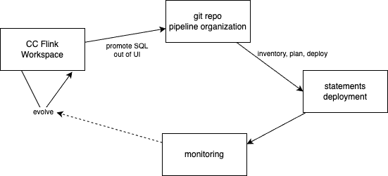
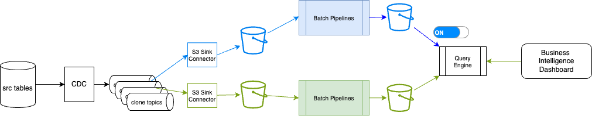
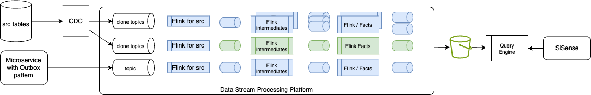
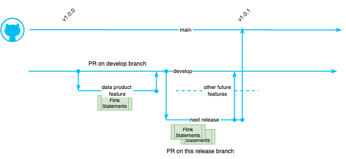
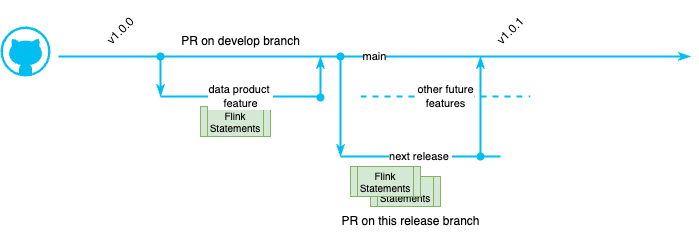
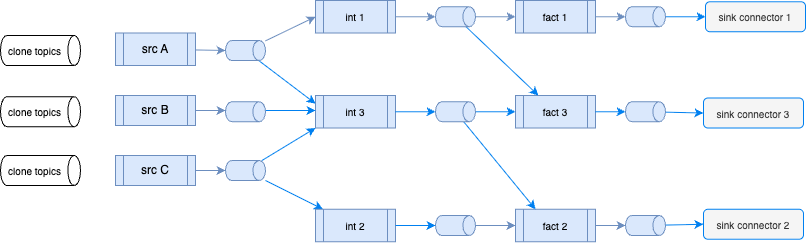
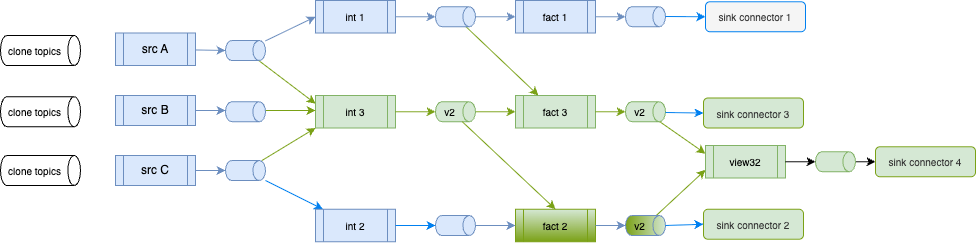

# Day-to-day data engineering on Confluent Cloud for Flink

???- info "Version"
    Created 08/2026

This chapter describes how a data engineer works day to day on Confluent Cloud for Apache Flink. The operating model rests on three surfaces that must not be confused: the Flink Workspace, the git-based project layout, and controlled statement deployment. Mixing those surfaces is the most common source of fragile streaming pipelines.

The concepts here synthesize practices from [shift_left](https://jbcodeforce.github.io/shift_left_utils/) project and pipeline management, [blue/green deployment for streaming](https://jbcodeforce.github.io/shift_left_utils/blue_green_deploy/), and the layering habits familiar from [dbt](../coding/dbt.md). For product scoping and architecture ownership, start from [Data as a product](./data_as_a_product.md) and [Flink project management](../cookbook/pm.md).

## Three surfaces of day-to-day work

A Confluent Cloud Flink solution is not “SQL in the console.” It is a continuous graph of statements whose definitions live in git, whose dependencies are known, and whose deploys are planned.




| Surface | Purpose | Durability | Who owns it | When to use |
|---------|---------|------------|-------------|-------------|
| Flink Workspace | Explore data, sketch SQL, inspect sinks | Ephemeral or ad-hoc statements | Individual DE / shared explore space | Discovery, debugging, validating joins on sample rows |
| Git project (`pipelines/`) | Source of truth for DDL, DML, tests, metadata | Versioned, reviewable, CI-ready | Team / data-product owners | Any SQL that should survive a laptop wipe or a teammate onboarding |
| Statement deployment | Create or restart continuous jobs in dependency order | Runtime state on compute pools | DE for iteration; SRE/CI for shared envs | After SQL is in git; before consumers rely on output |

Anti-pattern: production logic that exists only as a Workspace statement. That query has no review trail, no inventory entry, no unit tests, and no safe upgrade path when schemas or joins change.

## Working in a Workspace

A [Flink Workspace](https://www.confluent.io/blog/flink-sql-workspaces/) is the Confluent Cloud SQL editor. Developers use it to write, run, and monitor queries against live topics and tables. Workspaces are optional: the same statements can be submitted through the Confluent CLI or REST API. Product details live in [Confluent Cloud Flink](../techno/ccloud-flink.md).

### To use for

- Ad-hoc `SELECT` to learn shapes, keys, and changelog modes of landing topics
- Trying join predicates and filters on a slice of real-time data
- Inspecting sink tables after a background `INSERT INTO … SELECT` is running
- Snapshot-style checks when you need a point-in-time answer rather than a forever job

### Evolve from 

- A Workspace is not the source of truth. Persist valuable SQL into the git project before treating it as a pipeline.
- Once a background statement is running, you cannot edit it in place. Stop, replace, and redeploy. Restarting often means reprocessing from earliest (or a chosen offset) and rebuilding operator state.
- Complex foreground `SELECT`s with many joins can time out while the plan is built or while results stream back. For real workloads, deploy `INSERT INTO sink SELECT …` and use the Workspace to query the sink, not to hold the heavy join as a foreground query.

### Query promotion rule

When a query is valuable enough to keep:

1. Capture the schema as DDL and the continuous logic as DML in the project tree.
2. Add or regenerate inventory and pipeline metadata.
3. Add unit-test fixtures for the joins and filters you just proved in the Workspace.
4. Deploy through the controlled path (Makefile for a single table, or execution plan for a subgraph).


## Code organization

Git is the source of truth for pipeline definitions. Tools such as [shift_left utils](https://jbcodeforce.github.io/shift_left_utils/) and [dbt with the Confluent adapter](../coding/dbt.md) assume a structured project; the Cloud console does not invent that structure for you.

### Project layout: layers and data products

Two common project types appear in practice:

- Kimball-oriented trees: tables under dimensional layers
- Data-product-oriented trees: the same layers, grouped by product name (`c360`, `sdp`, …)

Under `pipelines/`, a typical layout is layer × product × table:

```text
pipelines/
├── sources/
│   ├── c360/
│   │   ├── src_customers/
│   │   └── src_transactions/
│   └── sdp/
│       └── src_shipments/
├── dimensions/
│   └── c360/
│       └── dim_customer_transactions/
├── facts/
│   └── c360/
│       └── fct_customer_360_profile/
├── views/
│   └── c360/
│       └── customer_analytics_c360/
└── seeds/                  # synthetic or raw feeds for tests
```

Sources often deduplicate or lightly filter CDC / `*_raw` topics into upsert tables. Dimensions and facts implement business grain. Views (or mart-style sinks) serve analytics consumers. Seeds hold synthetic or static feeds when CDC is unavailable in a lab environment.

For how this layout supports ownership and mesh-aligned products, see [Data as a product](./data_as_a_product.md). For project scoping questions, see [Flink project management](../cookbook/pm.md).

### Table folder contract

Each table lives in its own folder with a stable contract:

| Artifact | Role |
|----------|------|
| `sql-scripts/ddl.<table>.sql` | Create table (and thus topic/schema on Confluent Cloud). Finite statement. |
| `sql-scripts/dml.<table>.sql` | Continuous `INSERT INTO … SELECT …`. Runs until stopped. |
| `tests/` | Fixture DDLs, inserts, and validation queries for unit tests |
| `Makefile` | Local deploy helpers (DDL then DML) for that table on top of confluent cli|
| `pipeline_definition.json` | Parent/child metadata for this table (tool-generated) |
| `tracking.md` | Human notes on intent, decisions, open issues |

Humans own SQL and tests. Inventory files, pipeline metadata, and folder scaffolding are tool-generated; avoid hand-editing them.

### DDL versus DML

On Confluent Cloud, DDL and DML are different life cycles:

- DDL creates the table definition. It completes when the table exists. Changing DDL later is a schema and deploy decision, not a Workspace tweak.
- DML is a continuous statement that writes into that table. It holds state for joins, aggregations, windowing, and upserts. It is the unit you stop, replace, and restart during evolution.

Naming conventions keep layers readable at a glance, for example `src_`, `int_`, and product-prefixed `fct` / `dim` / mart-style view names. Exact templates vary by project; consistency inside one repo matters more than matching another team’s prefixes.

### Inventory and pipeline metadata

Two metadata layers make dependency-aware operations possible:

1. Inventory — a project-level catalog of every table (name, product, type, paths to DDL/DML, folder). Tables not in inventory are invisible to pipeline tooling. Rebuild after add, rename, or pull; commit the result.
2. Pipeline definition — per-table parent and child sets, usually built by walking from sinks toward sources. Sources have children and no parents; sinks have parents and no children. Metadata often records whether the statement is stateful or stateless.

Together they answer: what exists, what depends on what, and what must start or restart when you deploy a change.

### dbt 

If you come from warehouse dbt, the mental map is close:

| dbt habit | Flink project habit |
|-----------|---------------------|
| Staging / sources | `sources/` (and seeds) |
| Intermediate models | `intermediates/` |
| Marts (facts / dims) | `facts/`, `dimensions/`, `views/` |
| `ref()` / lineage | Pipeline parent/child metadata + inventory |
| `dbt test` | Table unit-test harness under `tests/` |

The runtime difference is sharp. On Confluent Cloud for Flink, `dbt run` deploys or updates continuous jobs; it does not batch-process a warehouse slice. You run it when SQL definitions change. Incremental and ephemeral materializations from classic dbt are not the model here; continuous upsert / changelog tables and stateful statements replace them. Adapter details and materialization mapping are in [dbt](../coding/dbt.md).

## Statement deployment

Deploying is not “run it again in the Workspace.” A Flink DAG is effectively immutable once started: operators build state, and source/sink schemas are pinned at deploy time. Changing logic means replace-and-swap, not edit-in-place. See Confluent’s [query evolution](https://docs.confluent.io/cloud/current/flink/concepts/schema-statement-evolution.html#query-evolution) guidance and the [job lifecycle](../cookbook/job_lifecycle.md) cookbook.

### Two paths

| Path | Audience | Scope | Use when |
|------|----------|-------|----------|
| Table Makefile / Confluent CLI | DE | One table: DDL then DML | Local iteration on a new or isolated table |
| Execution plan → dependency-aware deploy | DE / SRE / CI | Subgraph: ancestors, layer, product, or list of tables | Shared stage/prod, or any change that touches parents or children |

The controlled path builds a plan before acting: which ancestors must start, which can be skipped because they already run, which children must restart, whether upgrade is stateful or can reuse offsets, and whether the compute pool has capacity.

### Deploy order and scopes

Deploy walks sources toward sinks so parents exist before children consume them. Useful scopes:

- Single table
- Table plus ancestors
- Descendants (restart consumers after a parent change)
- Directory / layer (for example all seeds, or all sources under a product)
- Whole data analytic product

Navigation heuristics that matter in practice:

- Walk parents depth-first when discovering what must be up for a sink.
- Restart children breadth-first so siblings recover in waves after a parent recreate.
- Strongly prefer not to redeploy large-state jobs that did not change.

### Stateful versus stateless changes

Not every redeploy is equal:

- Changing a stateful intermediate often means recreate its output table (commonly a new version) and cascade restarts to children that read it. If not semantic of the downstream process will be impacted. 
- A stateless child may be stoppable with offset capture and restart from that offset, avoiding a full historical rebuild.
- Adding columns, removing fields, or changing aggregation dimensions each raise different questions: keep old output records, backfill from earliest, or cut over only for new events?

Assess before deploy: does the change alter grain or meaning? Does the new schema break consumers? Must history be recomputed?

### Unit tests on the promote path

Before shared-environment deploy, validate the table in isolation. A practical pattern:

1. Derive test inputs from the DML’s `FROM` / `JOIN` sources.
2. Provide fixture DDLs and inserts under `tests/`.
3. Run the statement logic against fixtures and assert on the sink validation query.
4. Keep tests next to the table so schema drift is caught with the SQL change.

This is the streaming equivalent of “dbt test before merge”: prove the join and filters without relying on full production lag recovery.

Command-level recipes live in [shift_left recipes](https://jbcodeforce.github.io/shift_left_utils/recipes/) and the [DE lab](https://jbcodeforce.github.io/shift_left_utils/tutorial/de_lab/). Ops depth for start/stop/monitor is in [job lifecycle](../cookbook/job_lifecycle.md).

## Evolving pipelines: blue-green for streaming

Classical batch blue-green rebuilds a parallel stack (reload, reprocess bronze/silver/gold, switch storage).  The following figure illustrates this approach at a high level:

<figure markdown="span">

<caption>**Figure 1**: Blue-Green for batch processing</caption>
</figure>
*Blue is the **production**, Green is the new logic to deploy*

???- info "Classical B/G process"
    The processing includes:

    * reloading the data from the CDC output topics, 
    * create a new S3 Sink Connector to write to new bucket folders
    * re-run the batch processing to create the bronze, silver and gold records for consumption by the query engine to serve data to the business intelligence dashboard. 

    When the green data set is ready the query engine switches to the new object storage location.

Streaming on a data streaming platform should not duplicate Kafka clusters, connectors, and every statement. Keep raw CDC topics stable; version and redeploy only the impacted Flink subgraph.

In real-time processing the concept of blue-green deployment should only be limited to the Flink pipeline impacted. The following figure illustrates the Flink statements are processing data across source, intermediate, and fact tables. 

<figure markdown="span">

<caption>**Figure 2**: Real-time processing with Apache Flink within a Data Stream Plarform</caption>
</figure>

On the left side, Raw data originates from Change Data Capture of a transactional database or from event-driven microservices utilizing the [transactional outbox pattern](https://jbcodeforce.github.io/eda-studies/patterns/#transactional-outbox). Given the volume of data injected into these raw topics and the need to retain historical data for extended periods, these topics should be rarely re-created.

*To simplify the diagram above the sink Kafka connectors to the object storage buckets with Iceberg or Delta Lake format are not presented, but it is assumed that those connectors support upsert semantic.* 

On right side, Iceberg or Delta Lake tables, stored in Apache Parquet format, are directly queried by the query engine.

### Git-driven candidate set

1. List SQL files modified since a tag, date, or branch point.
2. Run impact analysis: children that did not change in git may still need a new version because their inputs move.
3. Apply version postfix rules (`_v2`, then `_v3`, …) to tables in the impacted set; rewrite descendant DMLs to read the new parents until leaf sinks/views.
4. Build an execution plan for the versioned set; deploy to stage.
5. Validate lag, lineage, counts, and freshness; run synthetic integration checks.
6. Swap consumers (downstream statements, sink connectors, or query paths) from blue topics to green.
7. Keep a rollback path: leave blue running until green is trusted; do not delete old tables on day one.

Statement names need not carry the same version postfix as table names; table/topic identity is what consumers bind to.

???+ info "Git details"
    The general strategy for query evolution involves replacing the existing statement and its corresponding tables with a new statement and new tables. A straightforward approach is to use a release branch, for a short time period, modify the Flink statements, and then deploy those statements to the staging environments. Once validated, these statements can be merged into the `main` branch where production deploymment may be done. 

    The gitflow process may look like:

    * **main branch**: This branch always reflects the production-ready, stable code. Only thoroughly tested and finalized code is merged into `main`. Commits are tagged in `main` with version numbers for easy tracking of releases.
    * **develop branch**: This branch serves as the integration point for all new features and ongoing development. * **Feature branches** are created from the `develop` branch and merged back into it after completion and PR review.
    * Creating a **Release Branch**: When a set of features in develop is deemed ready for release, a new release branch is created from `develop`. This branch allows for final testing, bug fixes, and release-specific tasks without interrupting the ongoing development work in `develop`.
    * **Finalizing the Release**: Only bug fixes and necessary adjustments are made on the `release` branch. New feature development is strictly avoided.
    * **Merging and Tagging**: Once the release branch is stable and ready for production deployment, it's merged into two places:

        * `main`: The release branch is merged into main, effectively updating the production-ready code with the new release.
        * `develop`: The release branch is also merged back into develop to ensure that any bug fixes or changes made during the release preparation are incorporated into the ongoing development work.

    * **Tagging**: After merging into main, the merge commit is tagged with a version number (e.g., v1.0.0) to mark the specific release point in the repository's history.
    * **Cleanup**: After the release is finalized and merged, the release branch can be safely deleted

    <figure markdown="span">
    
    <caption>**Figure 3**:GitFlow branching for Flink Statement updates</caption>
    </figure>

    An alternate approach is to work directly to the `main` branch:

    <figure markdown="span">
    
    <caption>**Figure 3-bis**: Branching from main, for Flink Statement updates</caption>
    </figure>

### What to avoid

- Redeploying unchanged large-state jobs “for consistency”
- Recreating high-volume raw landing topics as part of every release
- Treating Workspace edits as the release vehicle


### Flink pipelines deployment

To illustrate the process, we will start by this flink pipeline topology, running in production:

<figure markdown="span">
{ width=800 }
<caption>**Figure 4**: Current Flink Statements in production</caption>
</figure>

The process starts by getting the list of changed flink statements from a given tag or date, on a given git branch. The shift left tool can get the list of statements modified, in a given branch, from a given date:
    
```sh
# At the project folder level do:
shift_left project list-modified-files --project-path . --file-filter sql --since 2025-09-10 main
```

The above command may list that the tables: `int 3`, `fact 3` were modified and `view 1` was added. Looking at the impact of those changes, the tool needs to redeploy the following tables with a new version:

<figure markdown="span">
{ width=800 }
<caption>**Figure 5**: Flink logic update and impacted statements</caption>
</figure>

The above figure illustrates those new tables:

| Blue Table name | Green Table name | Statement name | <div style="width:600px">Triggered Change</div> | 
| --------------- | ---------------- |----------------|----------------- |
|    int_3        |     int_3_v2     |  dml.int_3     | User modified content, tool adds _v2 |
|    fact_3       |     fact_3_v2    |  dml.fact_3    | User modified content, tool adds _v2 |
|    fact_2       |     fact_2_v2    |  dml.fact_2    | tool adds _v2 for output as it modified input(s). fact_2 was not modified in the git, this is a side effect of the relationship|
|                 |     view32   |  dml.view32   | User created this new content - no extension |

Also as a side effect the sink connectors configuration need to be modified to go to _v2 topics and even add one new connector because of the new view32, table.

The command creates two files under the $HOME/.shift_left folder: 

| File name | Type |<div style="width:600px">Content</div> |
| --- | --- | --- |
| modified_flink_files.txt | json | contains a filelist with element like: <code>{"table_name": "p1_dim_c2",</br>"file_modified_url": "...pipelines/dimensions/p1/dim_c2/sql-scripts/ddl.dim_c2.sql",</br>"same_sql_content": false,"running": false }</code> |
| modified_flink_files_short.txt | txt | list of table name only |

With this, it will be possible to assess the execution plan with:

```sql
shift_left pipeline build-execution-plan --table-list-file-name  ~/.shift_left/modified_flink_files_short.txt
```

The DDL Flink statements need to have a new table name with the next version postfix (e.g. int_3_v2). 

```sql
--- DDL intermediate table
create table int_3_v2 (
    --- all columns, new columns, ...
)
```
The DML with the `insert into` table name also needs to be modified.

```sql
-- DML intermediate table
insert into int_3_v2 
select 
...
from src_a ...
join src_b ... 
join src_c  ...
```

Any children of the modified statement needs to take into account the new table name of it input tables. For example the fact table needs to use the new versioned intermediate table:

```sql
--- DML Fact table
insert into fact_3_v2
select 
...
from int_3_v2  -- ATTENTION 
join int_1
```

For the 'view' creation, the Flink statement may be impacted as one of its source table is modified. So the same renaming logic applies.

During the tuning on the impacted statements, the pipeline dependencies can help assessing which statements to change. (e.g. `shift_left pipeline build-execution-plan --table-name <flink-intermediate> --may-start-descendants`).

The list of impacted table can be specified in a text file and specified as parameter to the deployment:

```sh
shift_left pipeline deploy --table-list-file-name statement_list.txt --may-start-descendants
```


## A day-to-day loop

The following loop is enough to operate without leaving this mental model. Hands-on commands and a C360 walkthrough are in the [DE lab](https://jbcodeforce.github.io/shift_left_utils/tutorial/de_lab/).

1. Explore in the Workspace (or read existing table SQL in git) to learn shapes and prove a join.
2. Add or change the table folder and DDL/DML in git; open a reviewable change.
3. Rebuild inventory and pipeline metadata when structure changes (new table, rename, new parent/child edge).
4. Unit-test the table with fixtures derived from its sources.
5. Build an execution plan; deploy the table or subgraph to the target environment.
6. Monitor statement status and lag; use the Workspace to inspect sink contents, not to redefine production SQL.
7. On schema or logic change: list modified files → list impacted tables → version the subgraph → plan → stage → validate → swap consumers.

### What success looks like

- Every production statement has a git home under `pipelines/` with DDL, DML, and tests.
- Inventory and pipeline metadata match the tree; deploy tooling and humans agree on what exists.
- Workspace use is deliberate: explore and inspect, then promote.
- Deploys are planned: parents before children, stateful recreate only when required, blue-green limited to the impacted subgraph.
- Schema evolution is a release concern (compatibility, impact, version), not an afternoon console edit.

### Where to go next

| Need | Document |
|------|----------|
| Data product ownership and mesh framing | [Data as a product](./data_as_a_product.md) |
| Project scoping and architecture questions | [Flink project management](../cookbook/pm.md) |
| Start, stop, upgrade, monitor statements | [Job lifecycle](../cookbook/job_lifecycle.md) |
| Confluent Cloud product surface and Workspace notes | [Confluent Cloud Flink](../techno/ccloud-flink.md) |
| dbt adapter and materializations on Flink | [dbt](../coding/dbt.md) |
| Streaming blue-green procedure | [Blue/green deployment](https://jbcodeforce.github.io/shift_left_utils/blue_green_deploy/) |
