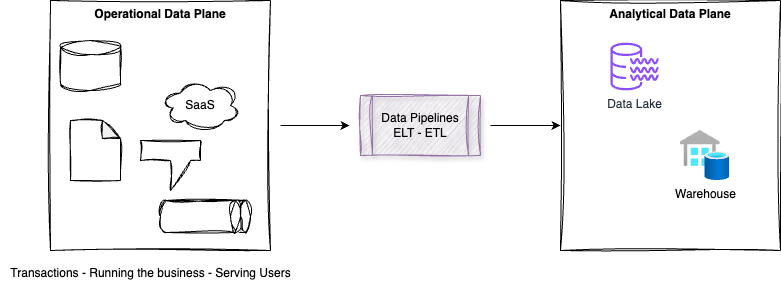
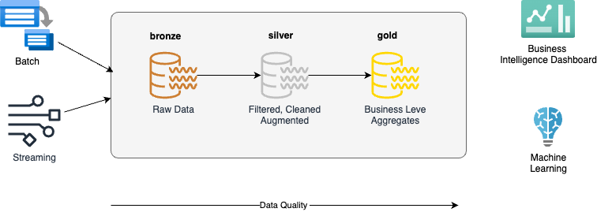
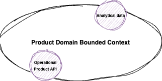
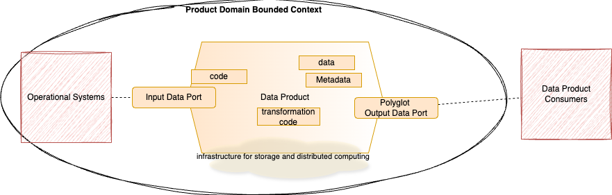
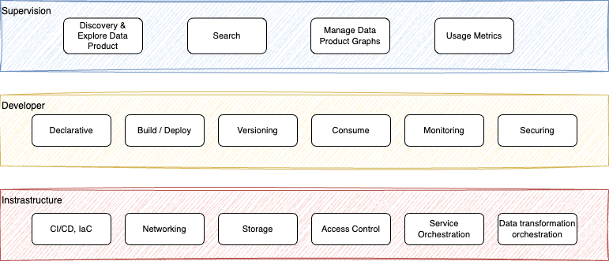
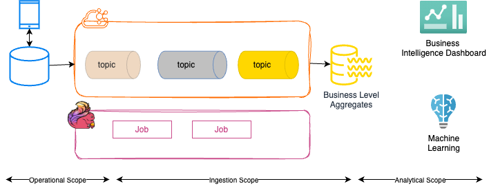
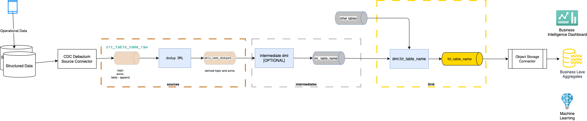
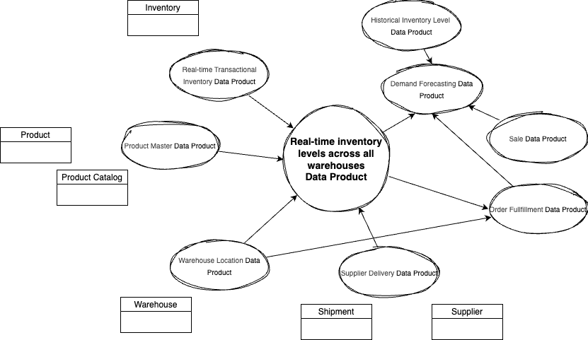
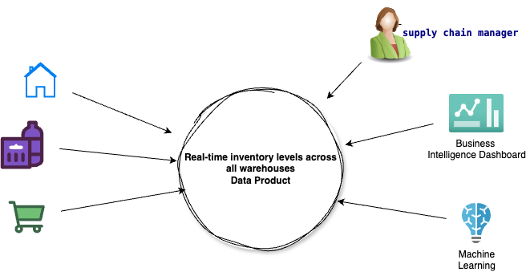
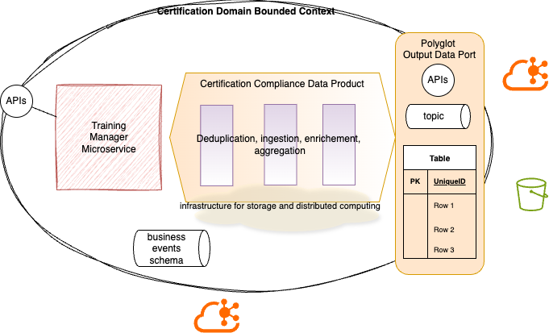

# Moving to a data as a product architecture

This chapter provides a practical overview of current data lake and lakehouse challenges, discusses the implementation of 'data as a product' principles, and demonstrates how real-time streaming can be effectively integrated into modern data architectures.

## Context

### Operational Data and Analytical data

The classical data landscape is split between operational data, which powers real-time applications, and analytical data, which provides historical insights for decision-making and machine learning. This separation has created complex and fragile data architectures, marked by problematic ETL processes and intricate data pipelines. The challenge lies in effectively bridging these two distinct data planes to ensure seamless data flow and integration.

<figure markdown="span">

<figcaption>Two data planes: real-time applications, and analytical data</figcaption>
</figure>


 
The initial data platform architecture comprised a database on one side and a data warehouse on the other, with ETL jobs facilitating data movement between them. This setup can lead to bottlenecks, especially when different teams are working on various parts of an application but all relying on the same data source. It might also complicate scalability and flexibility.

To address scaling challenges and support unstructured data, the second generation of data platforms, emerging in the mid-2000s, adopted distributed object storage, leading to the development of the Data Lake.

The medallion architecture, a three-layered approach, is a common framework for organizing data lakes. This structure, as illustrated in the figure below, is driven by several key motivations:

<figure markdown="span">

<figcaption>Medaillion Architecture</figcaption>
</figure>

* Leveraging cloud object storage to accommodate large volumes of both structured and unstructured data.
* Implementing data pipelines to transform data progressively, from raw landing zones to business-level aggregates.
* Facilitating data management and governance through data cataloging and distributed query tools.
* Organizing data based on its transformation stage, rather than business domains or specific use cases.

Data product and its extension with **Data Mesh** helps to restructure those two planes with a domain and use case centric approach, and not a technology stack.

### Current Challenges

In Lakehouse or data lake architecture: 

* We observe complex ETL jobs landscape, with high failure rate.
* Not all data needs the three layers architecture, but a more service contract type of data usage. Data becoming a product like a microservice.
* There is a latency issue to get the data, we talk about T + 1 to get fresh data. The + 1 can be one day or one hour, but it has latency that may not what business requirements need.
* Simple transformations need to be done with the ETL or ELT tool with the predefined staging. Not specific use-case driven implementation of the data retrieval and processing. 
* Data are **pulled** from their sources and between layers. It could be micro-batches, or long-running batches. At the bronze layer, the data are duplicated, and there is minimum of quality control done.
* In the silver layer the filtering and transformations are also generic with no specific business context.
* The gold layer includes all data of all use cases. This is where most of the work is done for data preparation and develop higher quality level. This is the layer with a lot of demands from end-user and continuous update and new aggregation developments. 
* This is the final consumer of the data lake gold layer that are pulling the data with specific Service Level Objectives. 
* Data created at the gold level, most likely needs to be reingected to the operational databases to be visible to operation applications. This introduces the concept of **reverse ETL**. 
* Each layer may have dfferent actors responsible to process the data: data platform engineer, analytic engineers and data modelers, and at the application level, the application developers.
* Storing multiple copies of data across layers inflates cloud storage expenses. Data become quickly stale and unreliable.
* Constant movement of data through layers results in unnecessary processing and query inefficiencies.
* The operational estate is also continuously growing, by adding mobile applications, serverless functions, cloud native apps, etc...

### Core principles for Data Mesh

To address the concerns of siloed and incompatible data, while addressing scaling to constant change of data landscape, adding more data source and consumers, adding more transformations and processing resources, the data mesh is based on four core principles:

1. Domain-oriented decentralized **data ownership** and architecture. The components are the analytical data, the metadata and the computer resources to serve it. Data ownership is linked to the DDD bounded context. For a product management use case, the bounded context of a `Product`, supports operational APIs and analytical data endpoints to address *active users, feature usage, and conversion rates*, for example: 

    <figure markdown="span">
    { width=500 }
    <figcaption>Data as a product  - Bounded context</figcaption>
    </figure>

    Also multiple bounded contexts could be presented via their dependencies to other domain operational and analytical data endpoints.

1. **Data as a product**, includes clear scope definition, product ownership and metrics to ensure data quality, user acceptance, lead time for data consumption. Data as a product includes documenting the users, how they access the data, and for what kind of operations. The accountability of the data quality shifts to the source of the data. It encapsulates three structural components: **1/ code** (data pipelines, schema definitions, APIs, event processing, monitoring metrics, access control), **2/ data and metadata** in a polyglot form (events, REST, tables, graphs, batch files...), **3/ infrastructure** (to run code, store data and metadata).

    <figure markdown="span">
    
    <figcaption>Data as a product: component view</figcaption>
    </figure>

1. **Self-serve data infrastructure as a platform**, to enable domain autonomy, as microservices are defined and orchestrated. It includes callable polyglot data storage, data products schema, data pipeline declaration and orchestration, data products lineage, compute and data locality. The capabilities includes 1/ **infrastructure provisioning** via code for storage, service accounts, access policies, server provisioning for running code and jobs, 2/ **data product interface**, declarative interfaces to manage the life cycle of a data product, 3/ **supervision plane** to present the relation between data products, support discovery, build data catalog, to execute semantic query.

    <figure markdown="span">
    
    <figcaption>Data as a product: infrastructure platform</figcaption>
    </figure>

1. Federated governance to address interoperability of the data products. This needs to support decentralized and domain self-sovereignty, interoperability through standardization. 


???- warning "Moving to Kafka and real-time processing is not the full story"

    Changing the batch pipeline processing technologies to real-time processing using the medallion architecture does not solve the previously mentionned problems. We still need to shift paradign and adopt a data as a product centric architecture. The following diagram illustrates the mediallon layers, done with Flink processing and Kafka topics for storage.

    <figure markdown="span">
    
    <figcaption>Real-time intgration</figcaption>
    </figure>

    Using topics as data record storage and Flink statements for transforming, filtering and enriching to the silver layer, also using kafka topics is the same ETL approach but with different technologies. 

    Another, more detailed view, using Kafka Connectors will look like in the diagram below, where the three layers are using the Kimdall practices of source processing, intermediates and sinks.

    <figure markdown="span">
    
    <figcaption>Generic source to sink pipeline</figcaption>
    </figure>

    Even if append-logs are part of the data as a product architecture, there are more to address and to organize the component development.

## A data product approach

As seen previously, domains need to host and serve their domain datasets in an easily consumable way, rather than flowing the data from domains into a centrally owned data lake or platform. Dataset from one domain may be consumed by another domains in a format suitable for its own application. Consumer pulls the dataset.

<figure markdown="span">

 <figcaption>Data product reused by other domains</figcaption>
</figure>

So developing data as a product means shifting from push and ingest of ETL and ELT processes to serving and pull model across all domains. 

### Data as a product

Data products serve analytical data, they are self-contained, deployable, valuable and exhibit eight characteristics:

* **Discoverable**: data consumers can easily find the data product for their use case.  A common implementation is to have a registry, a data catalogue, of all available data products with their meta information. Domain data products need to register themselves to the catalog.
* **Addressable**: with a unique address accessible programmatically. This implies to define naming convention and may be SDK code.
* **Self describable**: Clear description of the purpose and usage patterns as well as the semantics and syntax. The schema definition and registry are used for that purpose. 
* **Trustworthy**: clear definition of the [Service Level Objectives](https://en.wikipedia.org/wiki/Service-level_objective) and Service Level Indicators conformance. 
* **Native access**: adapt the data access interface to the consumer: APIs, events, SQL views, reports, widgets
* **Composable**: integrate with other data products, for joining, filtering and aggregation. Nedd to define standards for field type formatting, identifying polysemes across different domains, datasets address conventions, common metadata fields, event formats such as CloudEvents. Federated identity may also being used to keep unique identifier cross domain for a business entity.
* **Valuable**: represent a cohesive concept within its domain. Sourced from unstructured, semi-structured and structured data. To maximize value within a data mesh, data products should have narrow, specific definitions, enabling reusable blueprints and efficient management.
* **Secure**: with access control rules and enforcement, and single sign on capability.

To support the implementation of those characteristics, it is relevant to name a *domain data product owner*, who is also responsible to measure data quality, the decreased lead time of data consumption, and the data user satisfaction, or net promoter score. The most important questions a product owner should be able to answer are:

1. Who are the data users?
1. How do they use the data?
1. What are the native methods that they are comfortable with to consume the data?

Data products are not data applications, data warehouses, PDF reports, dashboards, tables (without proper metadata), or kafka topics. The data products may, and should be shared using streams, to be able to replay from sources of events and scale the consumption. 

### Elements of a Data Product

The following elements are part of a data product owner to develop and manage, with application developers:

* Metadata of what the data product is, human readable, parseable for tool to build and deploy data product to orchestration layer. This includes using naming convention, and poliglot definition. 
* API definition for request-response consumptions
* Event model definition for asynch consumptions
* Storage definition, service account, roles and access policies
* Table definitions
* Flink statement definitions for deduplication, enrichment, aggregation, and deployment definitions
* Microservice code implementation, packaging and deployment definitions

All those elements can be defined as code in a git repository or between a gitops repo and a code repository. It is recommended to keep one bounded context per repository.

???- info "Data lake, lakehouse and data warehouse"
    Data lake is no more a central piece of the architecture with complex pipelines, they are becoming a node in the data mesh, to expose a dataset. It may not be used as the source of truth is becoming the immutable distributes logs and storage that holds the dataset available for replayability. Datawarehouse for business intelligence is also a node, and consumer of the data product.

### Methodology

Defining, designing and implementing data products follow the same principles as other software development and should start by the end goal and use case. This should solidify clear product objectives. Domain discovery is part of the DDD methodology, and in the data product a domain may be more oriented to source and some to consumers. But use cases and what needs to be created as analytical data should be the main goals of the design and implementation activities. Source domain datasets represent the **facts of the business**. The source domain datasets capture the data that is mapped very closely to what the operational systems of their origin, generate.

Consumer domain datasets, on the other hand, are built to serve a tightly coupled group of use cases. Distinct from source domain datasets, they undergo more structural modifications as they process source domain events into aggregated formats optimized for a specific access model.

#### Formalize the use cases / user stories

The following table illustrates some use cases:

<style>
table th:first-of-type {
    width: 60%;
}
table th:nth-of-type(2) {
    width: 40%;
}
</style>
| User Story| Data as a Product |
| --- | --- |
| As a **marketing strategist**, I need to provide predictive churn scores and customer segmentation based on behavior and demographics. This will allow me to proactively target at-risk customers with personalized retention campaigns and optimize marketing spend. | <ul><li>Churn probability scores for each customer.</li><li>Customer segments based on churn risk and value.</li> <li>Key factors influencing churn.</li></ul> |
| As a **product manager**, I need to visualize key product usage metrics and performance indicators. This will enable me to monitor product adoption, identify usage patterns, and make data-driven decisions for product improvements. |  <ul><li>Active users, feature usage, and conversion rates.</li><li>Historical trends and comparisons of product performance.</li><li>Breakdowns of product usage by customer segment</li><li>Alerts for anomalies or significant changes in product usage</li></ul>
| As a **supply chain manager**, I need to get real-time visibility into inventory levels, supplier performance, and delivery timelines. This will help me proactively identify potential disruptions, optimize inventory management, and ensure timely product delivery. | <ul><li>Real-time inventory levels across all warehouses.</li><li>Supplier performance metrics, such as on-time delivery rates and quality scores.</li><li>Predictive alerts for potential stockouts or delivery delays.</li><li>Visualizations of delivery routes and timelines.</li><li>Historical data that can be used to perform trend analysis, and find bottlenecks.</li></ul>| 
| As a **Consultant Director**, I need to be able to continuously access a holistic view of each consultant, including their skill level, matching resume, current training and skill levels, and certification status, so that I can effectively staff projects, identify skill gaps, plan professional development, and ensure compliance. | <ul><li>Aggregated and real-time data on consultant skill levels</li> <li>Matching resumes (potentially key skills extracted)</li><li>Current training completions and skill levels derived from training</li><li>Certification statuses</li><li>Visualization of skill gaps by practice area or project type</li></ul>

Using a classical system context diagram for the supply chain management use case, we may define the high level view of a data product as:

<figure markdown="span">

 <figcaption>Data as a product: system context view</figcaption>
</figure>

The skill analysis use case may define the following data product:

* Certification Compliance Tracker:

    * Data: Real-time status of all consultant certifications, including expiration dates and renewal progress.
    * Value Proposition: Ensures the organization maintains necessary certifications for compliance and client engagements, mitigating potential risks and penalties.
    * Potential Features: Automated alerts for upcoming expirations; reporting on certification coverage by practice area or client; integration with certification management platforms.

#### Using bounded context

Data as a product is designed with a domain-driven model combined with analytical and operational use cases. 

The methodology to define data product may be compared to the event-driven microservice adoption. Business, operational application, manages their aggregates but also are responsible to publish the business events, as facts, to share their datasets. Aggregation processing is considered as a service pushing data product to other consumers. The aggregate models make specific queries on other data products and serve the results with SLOs.

The design starts by the user input, which are part of a business domain and bounded context. The data may be represented as DDD aggregate with a semantic model. [Entities and Value objects](https://jbcodeforce.github.io/eda-studies/methodology/ddd/#entities-and-value-objects) are represented to assess the need to reuse other data product and potentially assess the need for anti-corruption layer. 

???- info "What should be part of a bounded context for data as a product"
    A Bounded Context should encapsulate everything needed to model and implement a specific business capability or set of related capabilities. This typically includes:

    * **Entities**: Domain objects with identity that persist over time and represent core concepts of the subdomain. Their behavior and attributes are specific to this context.
    * **Value Objects**: Immutable objects that describe characteristics of entities. Their meaning is specific to the context.
    * **Aggregates**: Clusters of related entities and value objects that are treated as a single unit for data changes. One entity within the aggregate serves as the root and is responsible for maintaining the consistency of the entire aggregate. Transactions should operate on aggregates.
    * **Domain Services**: Operations that don't naturally belong to an entity or value object but are still part of the domain logic within this context. They often involve interactions between multiple aggregates or external systems.
    * **Domain Events**: Significant occurrences within the domain that the business cares about. They are immutable records of something that has happened and can trigger actions within the same or other bounded contexts.
    * **Repositories**: Interfaces for persisting and retrieving aggregates within the bounded context. The actual implementation of the repository might use a specific database technology.
    * **Factories**: Objects responsible for creating complex domain objects, often encapsulating complex instantiation logic.
    * **Use Cases/Application Services**: (Sometimes considered outside the core domain but within the Bounded Context) These orchestrate interactions between domain objects to fulfill specific user requests or system behaviors. They reside at the application layer and interact with repositories and domain services.
    * **Data Transfer Objects (DTOs)**: Objects used to transfer data across boundaries (e.g., between layers or bounded contexts). Their structure is often optimized for transport rather than representing the domain model directly.
    * **Infrastructure Concerns**: Code related to persistence, messaging, external service integrations, and UI specific to this bounded context.

In data products, DDD bounded context, translates to defining clear boundaries for the data products, ensuring each product serves a specific business domain. A `customer data product` and a `product inventory data product` would be distinct bounded contexts, each with its own data model and terminology.

Data pushed to higher consumer are part of the semantic model, and of the event-driven design. Analytics Engineers and Data Modellers building aggregate Data Products know exactly what to collect and what quality metrics to serve. The aggregation may use lean-pull mechanism, focusing on their use case needs only. The data is becoming a product as close to the operational source, so shifting the processing to the left of the architecture. This Shift-Left approach where quality controls, validation, and governance mechanisms are embedded as early in the data lineage map as possible. The consumption patterns are designed as part of the data product, and may include APIs, events, real-time streams or even scheduled batch. 

Source data domains need to make easily consumable historical snapshots of their datasets available, not just timed events. These snapshots should be aggregated based on a time frame that matches the typical rate of change within their domain.

Even though domains now own their datasets instead of a central platform, the essential tasks of cleansing, preparing, aggregating, and serving data persist, as does the use of data pipelines, which are now integrated into domain logic.


<figure markdown="span">

 <figcaption>Data product within bounded context</figcaption>
</figure>

Each domain dataset must establish Service Level Objectives for the quality of the data it provides: timeliness, error rates...

Moving from technical data delivery to product thinking requires changes in how organizations approach data management. The data product is decomposed of real-time events exposed on event streams, and aggregated analytical data exposed as serialized files on an object store.

New requirements are added to the context of the source semantic model.

### 

## Motivations for moving to data stream processing

The Data integration adoption is evolving with new needs to act on real-time data and reduce batch processing cost and complexity. The following table illustrates the pros and cons of data integration practices for two axes: time to insights and data integity

<style>
table th:first-of-type {
    width: 20%;
}
table th:nth-of-type(2) {
    width: 40%;
}
table th:nth-of-type(3) {
    width: 40%;
}
</style>
| Time to insights | | Data integrity | 
| --- | --- | --- |
| | **Low**  | **High**       |
| **High** | **Lakehouse or ELT:** <ul><li>+ Self-service</li><li>- Runaway cost</li><li>- No knowledge of data lost</li><li>- complext data governance</li><li>- data silos.</li></ul> | **Data Stream Platform:** <ul><li>+ RT decision making</li><li>+ Operation and analytics on same platform</li><li>+ Single source of truth</li><li>+ Reduced TCO</li><li>+ Governance</li></ul> | 
| **Low** | **Hand coding:** <ul><li>+ customized solution specific to needs.</li><li>- Slow</li><li>- difficult to scale</li><li>- opaque</li><li>- challenging governance.</li></ul> | **ETL:**<ul><li>+ Rigorous</li><li>+ data model design</li><li>+ governed</li><li>+ reliable</li><li>- Slow</li><li>- Point to point</li><li>- Difficult to scale.</li></ul> | 

### Assessment questions

Try to get an understanding of the data integration requirements by looking at:

* Current data systems and data producers to a messaging system like Kafka
* Development time to develop new streaming logic or ETL job
* What are the different data landing zones and for what purpose. Review zone ownership.
* Level of Lakehouse adoption and governance, which technology used (Iceberg?)
* Is there a data loop back from the data lake to the OLTP?
* Where data cleaning is done?
* Is there any micro-batching jobs currently done, at which frequency, for which consuners?
* What data governance used?
* How data quality control is done?

## Migration Context

A direct "lift and shift" approach—where SQL scripts are converted to Flink statements on a one-to-one basis—is not feasible. Refactoring is essential, as SQL processing often differs significantly in cases involving complexity and stateful operators, such as joins.

Most of the filtering and selection scripts can be ported 1 to 1. While most stateful processing needs to be refactorized and deeply adapted to better manage states and complexity.

There is [a repository](https://jbcodeforce.github.io/shift_left_utils/) with tools to process existing dbt project to find dependencies between tables, use local LLM to do some transformations, and create target pipelines per sink table.

## Time condiderations

## Some implementation challenges

### Git project organization

For closely related Bounded Contexts within the same application we can have a repository with different folders per bounded context.

The internal structure of each Bounded Context folder typically follows a layered or modular architecture:

* domain/: Contains the core domain logic: entities, value objects, aggregates, domain services, and domain events. This layer should be independent of any infrastructure concerns.
* application/: Contains use cases or application services that orchestrate interactions with the domain layer to fulfill specific business requirements. It often handles transactions and authorization.
* infrastructure/: Contains the implementation details for interacting with the outside world:

    * persistence/: Repository implementations using specific database technologies.
    * messaging/: Implementations for sending and receiving domain events or commands using message queues or kafka topics.
    * external-services/: Clients for interacting with other systems or APIs.

* interfaces/ (or api/, web/): Contains the entry points to the Bounded Context, such as REST API controllers, GraphQL resolvers, or UI-specific code. It's responsible for request handling and response formatting, often using DTOs to translate between the interface and the application layer.
* tests/: Contains unit tests, integration tests, and potentially end-to-end tests for the Bounded Context.
* shared/ (within a Bounded Context): Might contain utilities or helper classes specific to this Bounded Context.

This structure can be in `src/main/java` for Java project, or src for python/ Fast API project.

### Joins considerations


The SQL, LEFT JOIN, joins records that match and don’t match on the condition specified. For non matching record the left columns are populated with NULL. SQL supports LEFT ANTI JOIN, but not Flink. So one solution in Flink AQL is to use a null filter on the left join condition:

```sql
from table_left
left join table_right
    on table_left.column_used_for_join = table_right.column_used_for_join
    where table_right.column_used_for_join is NULL;
```

## Source of information - go deeper

* [Martin Fowler - Designing Data Product](https://martinfowler.com/articles/designing-data-products.html)
* [Data Mesh Principals - Zhamak Dehghani](https://martinfowler.com/articles/data-mesh-principles.html)
* [How to Move Beyond a Monolithic Data Lake to a Distributed Data Mesh](https://martinfowler.com/articles/data-monolith-to-mesh.html)