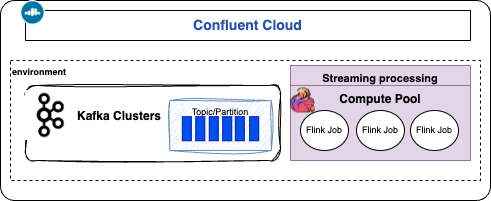
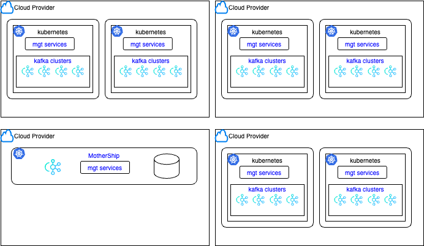
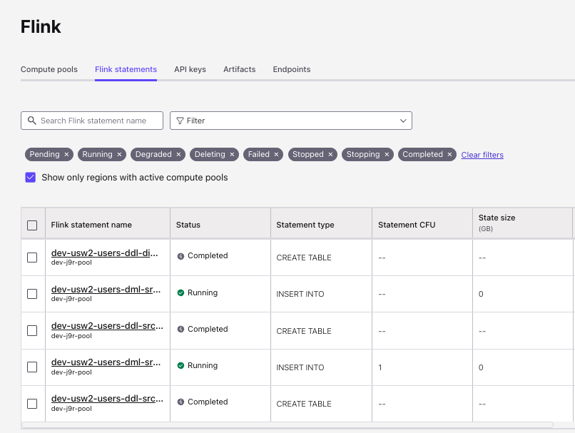
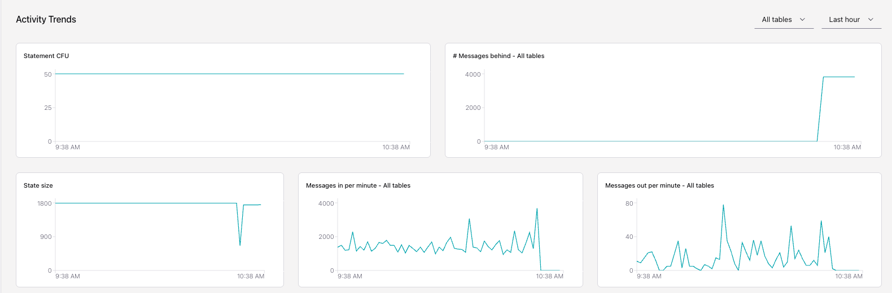
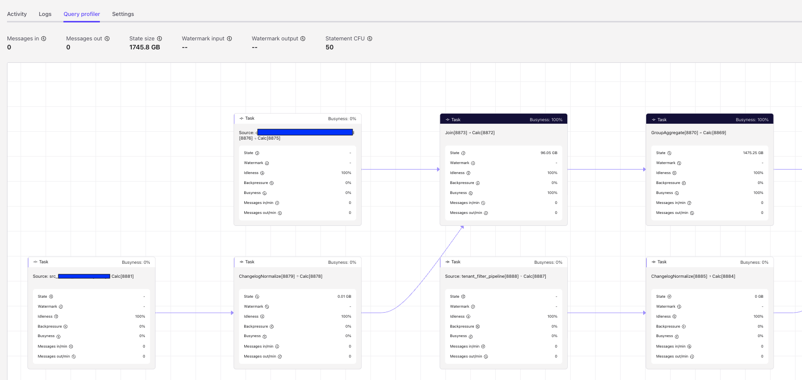
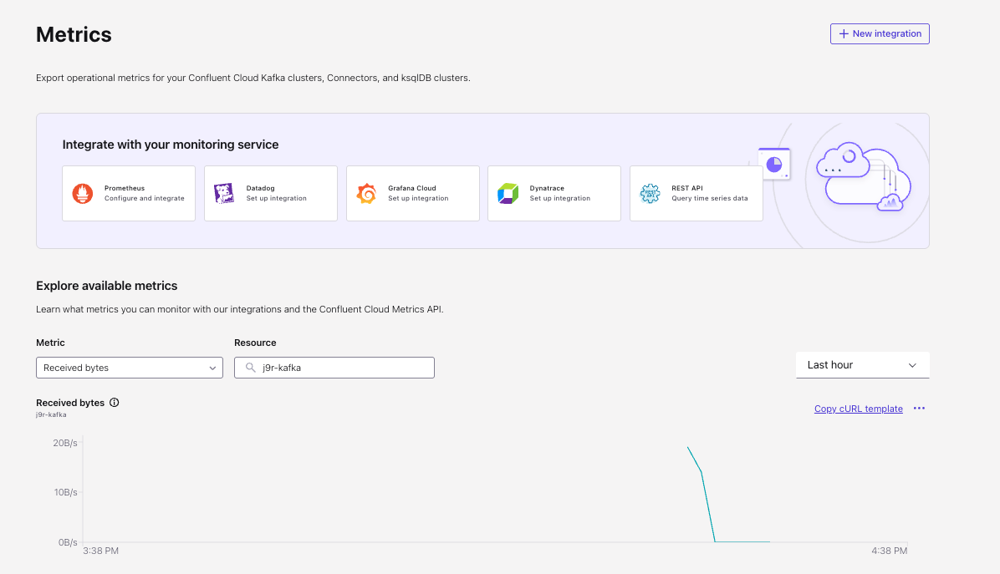

# Confluent Cloud for Apache Flink

???- info "Chapter updates"
    * Created 10/2024 
    * Review 10/31/24 Updated 4/08/2025

[Confluent Cloud for Apache Flink®](https://docs.confluent.io/cloud/current/flink/overview.html) is a cloud-native, managed service, for Flink, strongly integrated with the Confluent Cloud Kafka managed service. It is a simple, serverless and scalable way to build real-time, reusable data products over streams.

{ width=800 }

Confluent Cloud Flink is built on the same open-source version as Apache Flink® with additional features:

* Regional service to run Flink in a serverless offering
* Auto-inference of the Confluent Cloud environment, Kafka cluster , topics and schemas, to Flink SQL constructs of catalog, databases and tables.
* Autoscaling capabilities, up and down
* Default system column for timestamps using the `$rowtime` column.
* Default watermark strategy based on `$rowtime`.
* Support for Avro, JSON Schema, and Protobuf.
* CREATE TABLE statements provision resources as Kafka topics and schemas (temporary tables not supported).
* Read from and write to Kafka in two modes: append-stream or update-stream (upsert and retract).

Some **limitations**:

* No support for DataStream apps.
* No support or Flink connectors, only Kafka

## Key Concepts

* This is a **regional service**, in one of the three major cloud providers. It is defined in a context of a Confluent's environment.
* **Compute pools** groups resources for running Flink clusters, which may scale down to zero. They run SQL **statements**. Maximum pool size is defined at creation. Statements, in different compute pools, are **isolated** from each other. 
* Capacity is measured in Confluent Flink Unit, [CFU](https://docs.confluent.io/cloud/current/flink/concepts/flink-billing.html#cfus). Each statement is at least 1 CFU-minute.
* A statement may be structural (DDL) and stop once completed, or runs in background to write data to table (DML).
* Supports multiple Kafka clusters within the same Confluent Cloud organization in a single region.s
* Any table created in CC Flink appears as a topic in CC Kafka. Kafka Topics and schemas are always in synch with Flink.
* The differences with the OSS version, is that the DDL statements of catalog, database, table are mapped to physical Kafka objects. Table is a schema and a topic, catalog is an environment, and database is a Kafka cluster.
* Developers work in a [**workspace**](https://www.confluent.io/blog/flink-sql-workspaces/), to manage their Apache Flink® streaming applications, allowing them to easily write, execute, and monitor real-time data processing queries using a user-friendly SQL editor. Workspaces are not mandatory, as Developers may also deploy Flink statements via CLI or REST API.
* CC offers the **Autopilot** feature, to automatically adjusts resources for SQL statements based on demand. When messages processing starts to be behind, **Autopilot** adjusts resource allocation.
* Supports [role-based access control](#role-base-access-control) for both user and service accounts.
* **Stream lineage** provides insights at the topic level about data origin to destinations. 
* For **Watermark** configuration, Confluent Cloud for Apache Flink® manages it automatically, by using the `$rowtime` column, which is mapped to the Kafka record timestamp, and by observing the behavior of the streams to dynamically adapt the configuration.
* [Service accounts](https://docs.confluent.io/cloud/current/security/authenticate/workload-identities/service-accounts/overview.html#service-accounts) are used for production deployment to enforce security boundaries. Permissions are done with ACL and role binding. They can own any type of API keys that can be used for CLI or API access.
* [Snapshot query](https://docs.confluent.io/cloud/current/flink/how-to-guides/run-snapshot-query.html#flink-sql-run-snapshot-query) helps to do a**point-in-time**/snapshot query, to get a result at the moment of query submission, and that query would transition to Completed once done. Generates only one final result set. It will query from kafka topic earliest record, until now, or can mix with Tableflow parquet table. This is a combination of Flink batch + time constraint query. 
    ```sql
    SET 'sql.snapshot.mode' = 'now';
    SELECT count(*) as nb_records from tablename;
    ```

    See [simple demo](https://github.com/jbcodeforce/flink-studies/tree/master/code/flink-sql/08-snapshot-query)

* [External lookups](https://docs.confluent.io/cloud/current/ai/external-tables/overview.html)

???- info "Statement life cycle"
    Use a service account for background statements.
    Submit a SQL statement using the client shell:

    ```sh
    confluent flink shell --compute-pool ${COMPUTE_POOL_ID} --environment ${ENV_ID} --service-account ${account_id}
    ```

    It is possible to pause and resume a SQL statement. [See cookbook](../architecture/cookbook.md#query-evolution) for the best practices and process to update existing statements. 

???- question "How to change the CFU limit?"
    CFU can be changed via the console or the cli, up to the limit of 50. Going above developers need to open a ticket to the Confluent support.

???- question "What is behind a compute pool?"
    A compute pool groups 1 job manager and n task manager. Task manager resource configuration is not configurable and is designed to support small usage as well as moderate traffic. The limit to 50 CFUs is to address trade-off between coordination overhead and scaling needs. A Flink dag with source and sink operators impact the throughput of task manager so it is always challenging to assess how many task manager to be support by a job manager. 
    Large states are persisted to disk and this impact the compute pool resources too. 
    
    * Statement can be moved between compute pools


### Confluent Cloud Architecture

The Confluent Cloud for Kafka and for Flink is based on the SaaS pattern of control and data planes. [See this presentation - video from Frank Greco Jr](https://youtu.be/ss5OEBejFCs).



* Each data plane is made of a VPC, a kubernetes cluster, a set of Kafka clusters and some management services to support platform management and communication with the control plane.
* The control plane is called  the *mothership*, and refers to VPC, services, Database to manage the multi-tenancy platform, a kubernetes cluster, Kafka cluster, and other components. This is where the Confluent console runs for users to administer the Kafka clusters. 
* For each data plane VPC, outbound connections are allowed through internet gateways.
* There is a scheduler service to provision resources or assign cluster to existing resources. Target states are saved in a SQL database, while states are propagated from the different data planes to the mothership. This communication is async and leverage a global Kafka cluster.
* There are the concepts of physical Kafka clusters and logical clusters. Logical clusters are groupings of topics on the physical clusters isolated from each other via a prefix. Professional Confluent Cloud organization can only have logical clusters. Enterprise can have physical clusters.

## Getting Started

Install the [Confluent CLI](https://docs.confluent.io/confluent-cli/current/overview.html) and get an Confluent Cloud account. 

See those tutorials for getting started.

* [Quickstart with Console](https://docs.confluent.io/cloud/current/flink/get-started/quick-start-cloud-console.html)
* [Apache Flink® SQL](https://developer.confluent.io/courses/flink-sql/overview/)
* [Confluent github, Flink workshop](https://github.com/confluentinc/confluent-cloud-flink-workshop/tree/master/flink-getting-started)
* [Java Table API Quick Start](https://docs.confluent.io/cloud/current/flink/get-started/quick-start-java-table-api.html)

There is also a new confluent cli plugin: `confluent-flink-quickstart` to create an environment, a Flink compute pool, enable a schema registry, create a Kafka cluster and starts a Flink shell. 

```sh
confluent flink quickstart --name my-flink-sql --max-cfu 10 --region us-west-2 --cloud aws
```

### Some common commands to manage Confluent Cloud environment

```sh
# Create an environment
confluent environment create my_environment --governance-package essentials
# Set the active environment.
confluent environment use <environment id>
# Create a cluster
confluent Kafka cluster create my-cluster --cloud gcp --region us-central1 --type basic
# Create Kafka API key
confluent Kafka cluster list
export CLID=<Kafka cluster id>
confluent api-key create --resource $CLID
# Create a compute pool (adjust cloud and region settings as required).
confluent flink compute-pool create my-compute-pool --cloud gcp --region us-central1 --max-cfu 10
# Create a Flink api key which is scoped in an environment + region pair
confluent api-key create --resource flink --cloud gcp --region us-central1
# Define an api key for schema registry
confluent schema-registry cluster describe
confluent api-key create --resource <schema registry cluster>
# Get the user id
confluent iam user list
# To shutdown everything:
confluent environment list
confluent environment delete <ENVIRONMENT_ID>
```

For study and demonstration purpose, there is a read-only catalog named [`examples`](https://docs.confluent.io/cloud/current/flink/reference/example-data.html) with database called `marketplace` which has data generators for different SQL tables. 

Set the namespace for future query work using:

```sql
use catalog examples;
use marketplace;
show tables;
```

To use your dedicated environment use the following syntax:

```sql
use catalog my-flink-sql_environment;
use  my-flink-sql_Kafka-cluster;
```

### Use the Flink SQL shell

Using the confluent cli, we can access to the client via:

```sh
#  
confluent environment list

# Get the compute pool id
confluent flink compute-pool list
export ENV_ID=$(confluent environment list -o json | jq -r '.[] | select(.name == "aws-west") | .id')
export COMPUTE_POOL_ID=$(confluent flink compute-pool list -o json | jq -r '.[0].id')
confluent flink shell --compute-pool $COMPUTE_POOL_ID --environment $ENV_ID
```

### Using the Flink editor in Confluent Cloud

Nothing special to mention, except that users need to recall that once the job is started, they cannot modify it:they need to stop before any future edition. Restarting may mean reprocess from the earliest records. It is recommended to persist the Flink statement in a git repository and manage the deployment using Confluent CLI or the [shift_left CLI tool](https://jbcodeforce.github.io/shift_left_utils/blue_green_deploy/).

## Using the Flink Table API

Confluent Cloud for Flink [supports the Table API, in Java](https://docs.confluent.io/cloud/current/flink/get-started/quick-start-java-table-api.html) or [Python](https://docs.confluent.io/cloud/current/flink/get-started/quick-start-python-table-api.html).

The Table API code is a client SDK to send SQL statement to the job manager and is interpreted by the SQL engine, and so the code runs on an external systems, but uses an specific Flink environment for Confluent Cloud to submit the DAG to the remote engine.

When running TableAPI with Confluent Cloud for Flink, there are some specifics code to have:

1. Set the environment variables to connect to Confluent Cloud:
    ```sh
    ```

1. Create a Table environment in the Java or Python code like:
    ```java
    ConfluentSettings.Builder settings = ConfluentSettings.newBuilderFromResource("/prod.properties")
    ```

1. Package and run

[Read this chapter](../coding/table-api.md) for more information.

## DLQ support

In production deployment, Flink statements may fail because of serialization errors due to one of the following reasons:

* Schema does not exists
* There are one or more bad messages in the topic that are not compliant with the schema
* Got some connection challenge to the schema registry

Dead Letter Queue is now supported via SQL configuration to the underlying Kafka connector. By integrating Custom Deserialization Error Handling Strategies, data engineers can ensure that only valid, correctly processed messages move downstream, maintaining data quality and integrity. This feature reduces the risk of system crashes and downtime caused by unhandled exceptions, ensuring continuous data processing and availability.

In order to re-process the data, the Data engineer will have to write a specific SQL statement that reads from the DLQ. 
    
For certain queries (like stateful operations, such as joins) data engineers need to consider that reprocessing DLQ data at a later moment will result in incorrect results downstream, because of the order in how data is being processed. If correct results are required, the only solution will be to fully reprocess data from a topic without bad messages.

All Flink tables have `error-handling.mode` as a table option, with the default being `fail`. [See product documentation.](https://docs.confluent.io/cloud/current/flink/reference/statements/create-table.html#flink-sql-create-table-with-error-handling-mode)

* If desired, you can run an ALTER TABLE to change this to `ignore` or `log`. Those alteration should be done to topics created outside of CREATE table done with Flink SQL. The CDC output topics are good candidates for such modifications.

    ```sql
    ALTER TABLE raw_users_table SET ('error-handling.mode' = 'log');
    ```

    The DLQ topic uses a specific generic DLQ schema, which includes information such as the key and value as bytes (since deserialization failed, there’s nothing else to represent), plus the schema ID that was being tried. It includes metadata like error message and the statement ID that triggers the error. 

* or add this config to the created table:
    ```
    create table src_users_table (...) WITH (
        ....
        'error-handling.mode' = 'log'
    )
    ```

???- warning "Potential error"
    It is possible to get the following error when altering table failed registering schemas: unable to register schema on 'error_log-value': schema registry request failed error code: 42205: Subject error_log-value in context  is not in read-write mode.
    In this case, you will run into this error as flink is trying to register a schema for the DLQ and Schema Regisry is being schema-linked as a result the default context is in Read only mode. You need to create your own DLQ table. 


* Or create a special DLQ topic:
    ```sql
    CREATE TABLE `my_error_log` (
        `error_timestamp` TIMESTAMP_LTZ(3) NOT NULL,
        `error_code` INT NOT NULL,
        `error_reason` STRING NOT NULL,
        `error_message` STRING NOT NULL,
        `error_details` MAP<STRING NOT NULL, STRING> NOT NULL,
        `processor` STRING NOT NULL,
        `statement_name` STRING,
        `affected_type` STRING NOT NULL,
        `affected_catalog` STRING,
        `affected_database` STRING,
        `affected_name` STRING,
        `source_record` ROW<`topic` STRING, `partition` INT, `offset` BIGINT, `timestamp` TIMESTAMP_LTZ(3), `timestamp_type` STRING, `headers` MAP<STRING NOT NULL, VARBINARY>, `key` VARBINARY, `value` VARBINARY>
    ) WITH (
        'value.avro-registry.schema-context' = '.flink-stage',
        'value.format' = 'avro-registry'
        )
    ```

    Alter the source table to enable with a DLQ that was created above.

    ```sql
    ALTER TABLE src_users_table SET ('error-handling.mode' = 'log', 'error-handling.log.target' = 'my_error_log' );
    ```


## Networking overview

[See the product documentation for managing Networking on Confluent Cloud.](https://docs.confluent.io/cloud/current/networking/overview.html) 

Kafka clusters have the following properties:

* Basic and standard clusters are multi-tenant and accessible via secured (TLS encrypted) public endpoints.
* Using private link does not expose Kafka clusters to the public.
* Enterprise clusters are accessible through secure AWS PrivateLink or Azure Private Link connections.
* Secure public endpoints are protected by a proxy layer that prevents types of DoS, DDoS, syn flooding, and other network-level attacks.
* A Confluent Cloud network is an abstraction for a single tenant network environment. [See setup CC network on AWS.](https://docs.confluent.io/cloud/current/networking/ccloud-network/aws.html#create-ccloud-network-aws). 
* For AWS and Confluent Dedicated Clusters, networking can be done via VPC peering, transit gateway, inbound and outbound private link (for Kafka and Flink): this is a one-way connection access from a VPC to CC.
* Flink Private Networking requires a [PrivateLink Attachment](https://docs.confluent.io/cloud/current/flink/operate-and-deploy/private-networking.html#create-a-pla-overview) (PLATT) to access Kafka clusters with private networking. It is used to connect clients such as confluent CLI, the console, the rest api or terraform with Flink. Flink-to-Kafka is routed internally within Confluent Cloud.


* PLATT is independant of the network type: PrivateLink, VPC peering or transit GTW.

## Autopilot

[Autopilot](https://docs.confluent.io/cloud/current/flink/concepts/autopilot.html) automatically scales up and down compute pool resources needed by SQL statements. It uses the property of parallelism for operator to be able to scale up and down. `SELECT` always runs a parallelism of 1. Only `CREATE TABLE AS`, `INSERT INTO` and `EXECUTE STATEMENT SET` are considered by Autopilot for scaling. Global aggregate are not parallelized. The main goal of the auto scaler is to maintain optimum  throughput and number of resources (or CFUs). 

The SQL workspace reports the [scaling status](https://docs.confluent.io/cloud/current/flink/concepts/autopilot.html#scaling-status).  It is important that each job has a maximum parallelism, limited by the number of resource available. For source operators within a Flink DAG the limit is the number of partitions in the input topics. 

If there is some data skew and one operator is set with a parallel of 1 then there is no need to scale.

When the compute pool is exhausted, try to add more CFU or stop some running statements to free up resources.

The autoscaler is using historical metrics to take the decision to scale up. 3 to 4 minutes of data are needed. A job should scale up within minutes if the backlog is constantly growing, and scale down if there are no input data and the backlog. The interesting metrics is the pending records. The algorithm needs to take into account the pending records amount, the current processing capacity, the time to scale up, but also the input data rate, the output data rate for each operator in the DAG. There is no way updfront to estimate the needed capacity. This is why it is important to assess the raw input table/kafka size and avoid restarting the first Flink statements that are filtering, deduplicating records to reduce the number of messages to process downstream of the data pipeline.

Autopilot exposes the CFU usage in CFU minutes via the metrics API at the compute pool level.

When multiple statements are in the same compute pool, new statement will not get resource until existing one scales down. Consider looking at Statement in Pending state and reallocated them to other compute pool. The total number of jobs is less than the CFU limit.

???- question "When a statement is not scaling up what can be done?"
        Consider looking at the CFU limit of the compute poolas it may has been reached. The Flink job may have reached it’s effective max parallelism, due to not enough Kafka topic partition from the input tables. Consider looking at the data skew, as a potential cause for scale-ups inefficiency. 
        Internally to Confluent Cloud for Flink, checkpoints may take a long time. The autopilot may rescale only after the current checkpoint has completed or 2 checkpoints have failed in a row.

[See discussion of adaptive scheduler from Flink FLIP-291.](https://cwiki.apache.org/confluence/display/FLINK/FLIP-291%3A+Externalized+Declarative+Resource+Management)

## Cross-region processing

Within an environment, there is one schema registry. We can have multiple Kafka clusters per region and multiple Flink compute pools per region. Any tables created in both region with the same name will have the value and key schemas shared in the central schema registry. The SQL Metastore, Flink compute pools and Kafka clusters are regional. 

## Monitoring and troubleshouting

[The metrics API documentation.](https://docs.confluent.io/cloud/current/monitoring/metrics-api.html)

You must create an API key to authenticate your requests to the Metrics API.

### Statement monitoring

Once the Flink SQL statement runs, Data Engineers may use the Console, (Environment > Flink > Flink page > Flink statements) to assess the list of statements and their state of processing. 



See the [monitoring product documentation](https://docs.confluent.io/cloud/current/flink/operate-and-deploy/monitor-statements.html) for explanations of the different fields. The following fields are important to consider:

| Field | Why to consider |
| --- | --- |
| **Status** | Verify the state of the Flink query |
| **Statement CFU** | Server resource used by the statement |
| **Messages Behind** | Is the query behind, is there some backpressure applied |
| **Message out** | Rate of messages created by the query |
| **State Size** in GB | Keep it low, alert at 300+ GB | 

Look at the statement status, consider failed, pending, degraded. Some issues are recoverables, some not:

| | Recoverable | Non-recoverable |
| --- | --- | --- |
| **User** | Kafka topic deletion, loss of access to cloud resources | De/Serialization exception, arithmetic exception, any exception thrown in user code |
| **System** | checkpointing failure, networking disruption |  |
| **Actions** | If recovery takes a long time or fails repeatedly, and if this is a user execption, the message will be in the status.detail of the statement, else the user may reach to the support. | User needs to fix the query or data. |

Be sure to enable cloud notifications and at least monitor topic consumer lag metric. As a general practices, monitoring for `current_cfus = cfu_limit` to avoid exhaustion of compute pools.  

The `flink/pending.records` is the most important metrics to consider. It corresponds to consumer lag in Kafka and “Messages Behind” in the Confluent Cloud UI. Monitor for high and increasing consumer lag.

At the Statement level we can get the following metrics, over time:



And with the `Query profiler`, which represents the same content as the Flink console UI, we can assess each operator of the query DAG, with CPU utilization, state size, ...




* Confluent Cloud for Apache Flink supports metrics integrations with services like Prometheus, Grafana and Datadog.



 
* DML statement failing, or being degraded, or pending can be notified to external system. [See the notification for CC documentation](https://docs.confluent.io/cloud/current/monitoring/configure-notifications.html#ccloud-notifications)

* [Flink monitoring statement product documentation](https://docs.confluent.io/cloud/current/flink/operate-and-deploy/monitor-statements.html)
* [Docker compose, Prometheus setup and Grafana Dashboard for Confluent Cloud for Flink reporting.](https://github.com/confluentinc/confluent-cloud-flink-workshop/tree/master/flink-monitoring)

### Compute pool monitoring

[Grafana integration](https://docs.confluent.io/cloud/current/monitoring/third-party-integration.html#troubleshoot-grafana)

### Some encountered errors

* Some query with a lot of joins (10+) on static data, do not returns the same results when doind a SELECT from in CC Workspace. This behavior for foreground query, may be possible, as query plan construction may have timedout. When quesry start to be complex and need to process multiple real records and not just some test data, it is recommended to move to INSERT INTO sink_table SELECT ... and then use the Workspace to look at the table inside the sink_table. The query will run in background and may take sometime to deploy, but will run.

## Role Base Access Control

## Understanding pricing

The [CFU pricing is here.](https://docs.confluent.io/cloud/current/flink/concepts/flink-billing.html#cfu-billing) Price per hour computed by the minute. 

Some core principals:

* Flink SQL runs each statement independently of any others.
* Not overpay for processing capacity. Pay for what is used. Increment at the minute level.
* Short live queries cost a real minimum, and can be done in a shared compute pool
* Long running queries cost is aggregated per hour with minute increment. So a statement starting at 1 CFU for 10 minutes then 3 CFUs for 30 and back to 2 for 10 and 1 for 10 will use 10 + 90 + 20 + 10 = 130 CFUs for the hour.
* Statement throughput generally scales linearly in the number of CFUs available to a statement.
* The Max CFU parameter is a just for Budget control

To estimate CFU consumption we need to:

1. Expected record per second (RPS) / throughput 
1. Message size and total number of messages to process
1. Type of SQL, select only, or joins, grouping...

    * simple 1 to 1 select stateless transformation is determined by how much write volume the sink topic can handle.
    * For Joins, aggregates, ... the way in which a statement must access and maintains the state is more influential than the raw quantity of state.
1. The total of all CFU estimates across the workload will provide a rough approximation of total CFUs required

Several factors significantly affect statement throughput so pricing:

* **State Overhead**: The overhead related to maintaining state affects JOINs and aggregations more than the quantity of state itself. 
* **Records in topic**: if there some burst in ingress traffic to Kafka topics, then Flink may need more resources for a short time period to process the lag. 
* **CPU Load:** The complexity of the operations performed by the statement is a major contributor to CPU load.
* **Minimum CFU Consumption:** Every statement will consume at least 1 CFU, and for most workloads, CFU consumption is directly proportional to the number of statements execute.
* VM machine type may also impact throughput metrics

### Scoping workload

* Assess the number of record per seconds
* Be sure to clarrify that Confluent Cloud for Flink is used for streaming not batching. Operations like update, truncate, delete table are not supported.
* For stateless the attainable throughput of the statement per CFU will generally be determined by how much write volume the sink topic can handle.
* Most important throughput factor is the State size, its access and management. 
* Statement throughput generally **scales linearly** in the number of CFUs available to a statement.
* UDF impacts throughtput.
* For each statement, assess the number of records to process per seconds or minutes. Consider ingress message size and egress message size as SQL may generates less data. Also Windowing will generate less messages too. Joins will impact performance depending if they are static or with time window. 
* Look at Kafka message sizes (bytes) as well as message throughput.

As a base for discussion, 10k record/s per CPU is reachable for simple Flink stateless processing.

## Disaster Recovery

* CC Flink is a regional, multi-AZ service.
* In case of Job failure, failed jobs auto-restart using the last known state, last checkpoint.
* Checkpoint is used for in-region fault tolerance. Checkpoints capture the state of a Flink job at regular intervals, including Kafka consumer offsets, operator states, and internal timers. In CC checkpoints are done every minute
* In case of Cloud Provider failure, there is no protection, for a region lost. To address that, architects need to set up cross region DR
* All Flink DR options first require a DR strategy for Kafka & Schema Registry (SR). It needs to have an exact replication of the data (including offsets) and schemas.
* On CC, [cluster link](https://docs.confluent.io/cloud/current/multi-cloud/cluster-linking/index.html) and [schema link](https://docs.confluent.io/cloud/current/sr/schema-linking.html) supports data and schema replication.

As any flink solution, the following need to be deeply assessed:

* Can Flink's state be recreated?  This is driven by the underlying Kafka Clusters RPO and their retention.
* How long is tolerable to recreate that state? This is driven by the overall RTO. 
* What is the semantic expected by consumer apps? This is driven by consuming apps tolerances. Semantics options are: exactly-once, at-least once (duplicate possible), at-most once (data loss and duplicate possible).
* Is the Flink job processing deterministic? will a Flink job always output the same results?

### Active / Active

The approach is to have two identical Flink jobs or pipelines of jobs run in parallel continuously in both regions. They process the same data, with some replication delay in the secondary region.

This is recommended for low RTO requirements, with Flink jobs with large states, or solutions requiring Exactly-Once semantics, or when it is critical that the 2 regions have exactly the same data results.

To consider:

* Setup replication only to the input topics. 
* Mirror configuration like service accounts, RBACs, private networking...
* Ensure Flink jobs have deterministic query results.
* Jobs should support out-of-order arrival between input tables.

### Active / Passive

Flink jobs are started, in second region, only on failover.

This approach is possible for stateless jobs, or when states can be created quickly: Flink Jobs Window Size and time to recompute job state < RTO. Solutions based on at-least once, or at-most-once. Even for stateless jobs, Exactly-Once semantics is not supported.

To consider:

* More complicated to orchestrate as the process needs to recreate tables and jobs during failover
* Topic retention > Time window needed to recreate state (dictated by window size or TTL). Without enough retention, results will be wrong, or only subset of queries would work.
* Any time window and aggregation needs to use event time and not processing time.
* Setup replication only to the input topics. 

## Some FAQs

* Processing time support? It is better to use event time to ensure results are correct, deterministic and reproductible. Using processing time for windowing operations may lead to non-determnistic results. Processing time may be relevant for temporal joins.
* Is Hive load/unload function supported? The Flink OSS has this load/unload Hive functions capability, but all those Hive functions are already available in CC Flink.
* How to add Jar? ADD and REMOVE JAR are meant for testing purposes in OSS Flink. For UDFs, Jars can be uploaded via Confluent Console, CLI, REST API or Terraform.
* How to manage Catalog and Database? In Confluent Cloud Catalog is a Confluent Environment so no direct management from Flink session. Database is a Kafka cluster so the same logic applies.

## VScode extension

[VScode extension](https://github.com/confluentinc/vscode) to manage Confluent Cloud or Platform resources. 

## Deeper dive

* [Confluent Flink workshop](https://github.com/confluentinc/commercial-workshops/tree/master/series-getting-started-with-cc/workshop-flink) to learn how to build stream processing applications using Apache Flink® on Confluent Cloud.
* [Shoe-store workshop](https://github.com/jbcodeforce/shoe-store) with Terraform and SQL demonstration using DataGen.
* [SQL coding practice from this repo.](../coding/flink-sql.md)