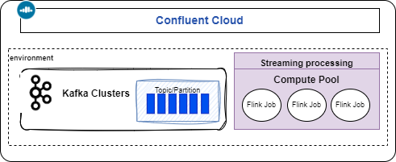

# Confluent Cloud for Apache Flink

???- info "Chapter updates"
    * Created 10/2024 
    * Review 10/31/24 Update 12/06/2024

[Confluent Cloud for Apache Flink®](https://docs.confluent.io/cloud/current/flink/overview.html) is a cloud-native, managed service, for Flink in parallel of the Kafka managed service.

{ width=600 }

Confluent Cloud Flink is built on the same open-source version as Apache Flink® with additional features:

* Auto-inference of the Confluent Cloud environment, including Kafka cluster , topics and schemas, to Flink SQL constructs of catalog, databases and tables.
* Autoscaling capabilities.
* Default system column for timestamps using the `$rowtime` column.
* Default watermark strategy based on $rowtime.
* Support for Avro, JSON Schema, and Protobuf.
* CREATE statements provision resources as Kafka topics and schemas (temporary tables not supported).
* Read from and write to Kafka in two modes: append-stream or update-stream.

## Key Concepts

* This is a **regional service**, in one of the three major cloud providers.
* **Compute pools** groups resources for running Flink clusters, which may scale down to zero. Used to run SQL **statements**. Maximum pool size is defined at creation.
* Capacity is measured in Confluent Flink Unit, [CFU](). Each statement is 1 CFU-minute.
* A statement may be structural (DDL), runs in background to write data to table (DML) , or foreground to present data to client app.
* Supports multiple Kafka clusters within the same Confluent Cloud organization in a single region.
* Kafka Topics and schemas are always in synch with Flink.
* Statements, in different compute pools, are **isolated** from each other. 
* Any table created in CC Flink appears as a topic in CC Kafka.
* A catalog is a collection of databases. A database is a collection of tables.
* The differences with the OSS version, is that the DDL statements of catalog, database, table are mapped to physical kafka objects. Table is a schema and a topic, catalog is an environment, and database is a cluster.
* Developers work in a [**workspace**](https://www.confluent.io/blog/flink-sql-workspaces/), to manage their Apache Flink® streaming applications, allowing them to easily write, execute, and monitor real-time data processing queries using a user-friendly SQL editor. A running SQL Statement run within a workspace. From a Kafka topic it is possible to directly go to the workspace. 
* CC offers the **Autopilot**, to automatically adjusts resources for SQL statements based on demand.
* Supports role-based access control for both user and service accounts.
* **Stream lineage** provides insights at the topic level about data origins.. 
* For **Watermark** configuration, Confluent Cloud for Apache Flink® manages it automatically, by using the `$rowtime` column, which is mapped to the Kafka record timestamp, and by observing the behavior of the streams to dynamically adapt the configuration.
* When messages processing starts to be behind, **Autopilot** adjusts resource allocation.
* [Service accounts](https://docs.confluent.io/cloud/current/security/authenticate/workload-identities/service-accounts/overview.html#service-accounts) are used for production deployment to enforce security boundaries. Permissions are done with ACL and role binding. They can own any type of API keys that can be used for CLI or API access.

???- info "Statement life cycle"
    Use a service account for background statement.
    Submit a SQL statement using the client shell:

    ```sh
    confluent flink shell --compute-pool ${COMPUTE_POOL_ID} --environment ${ENV_ID} --service-account
    ```

    Once running a DML statements will run for ever. it is possible to pause and resume it. See cookbook for the practices and process to update existing statements. 

???- question "How to change the CFU limit?"
    CFU can be changed via the console or the cli, up to the limit of 50. Going above developers need to open a ticket to the Confluent support.


## Getting Started

Install the [Confluent CLI](https://docs.confluent.io/confluent-cli/current/overview.html) and get an Confluent Cloud account. 

See those tutorials for getting started.

* [Quickstart with Console](https://docs.confluent.io/cloud/current/flink/get-started/quick-start-cloud-console.html)
* [Apache Flink® SQL](https://developer.confluent.io/courses/flink-sql/overview/)
* [Java Table API Quick Start](https://docs.confluent.io/cloud/current/flink/get-started/quick-start-java-table-api.html)

There is also a new confluent cli plugin: `confluent-flink-quickstart` to create an environment, a Flink compute pool, enable a schema registry, create a kafka cluster and starts a Flink shell. 

```sh
confluent flink quickstart --name my-flink-sql --max-cfu 10 --region us-west-2 --cloud aws
```

### Some common commands to manage Confluent Cloud environment

```sh
# Create an environment
confluent environment create my_environment --governance-package essentials
# Set the active environment.
confluent environment use <environment id>
# Create a cluster
confluent kafka cluster create my-cluster --cloud gcp --region us-central1 --type basic
# Create Kafka API key
confluent kafka cluster list
export CLID=<kafka cluster id>
confluent api-key create --resource $CLID
# Create a compute pool (adjust cloud and region settings as required).
confluent flink compute-pool create my-compute-pool --cloud gcp --region us-central1 --max-cfu 10
# Create a Flink api key which is scoped in an environment + region pair
confluent api-key create --resource flink --cloud gcp --region us-central1
# Define an api key for schema registry
confluent schema-registry cluster describe
confluent api-key create --resource <schema registry cluster>
# Get the user id
confluent iam user list
# To shutdown everything:
confluent environment list
confluent environment delete <ENVIRONMENT_ID>
```

For study and demonstration purpose, there is a read-only catalog named [`examples`](https://docs.confluent.io/cloud/current/flink/reference/example-data.html) with database called `marketplace` which has data generators for different SQL tables. 

Set the namespace for future query work using:

```sql
use catalog examples;
use marketplace;
show tables;
```

To use your dedicated environment use the following syntax:

```sql
use catalog my-flink-sql_environment;
use  my-flink-sql_kafka-cluster;
```

### Use the Flink SQL shell

Using the confluent cli, we can access to the client via:

```sh
#  
confluent environment list

# Get the compute pool id
confluent flink compute-pool list
export ENV_ID=$(confluent environment list -o json | jq -r '.[] | select(.name == "aws-west") | .id')
export COMPUTE_POOL_ID=$(confluent flink compute-pool list -o json | jq -r '.[0].id')
confluent flink shell --compute-pool $COMPUTE_POOL_ID --environment $ENV_ID
```

### Using the Flink editor in Confluent Cloud

Nothing special, except that once the job is started we cannot modify it, we need to stop before any future edition. The job can run forever. 

### Use Java Table API

The approach is to create a maven Java project with a main class to declare the data flow.  [Read this chapter](../coding/table-api.md).

## Networking overview

[See the product documentation for managing Networking on Confluent Cloud, here.](https://docs.confluent.io/cloud/current/networking/overview.html) includes Kafka cluster access with the following major items:

* Basic and standard clusters are multi-tenant and accessible via secure (TLS encrypted) public endpoints.
* Using private link will not expose Kafka cluster to the public.
* Enterprise clusters are accessible through secure AWS PrivateLink or Azure Private Link connections.
* Secure public endpoints are protected by a proxy layer that prevents types of DoS, DDoS, syn flooding, and other network-level attacks.
* A Confluent Cloud network is an abstraction for a single tenant network environment. [Setup CC network on AWS.](https://docs.confluent.io/cloud/current/networking/ccloud-network/aws.html#create-ccloud-network-aws). 
* For AWS and Confluent Dedicated Clusters, networking can be done via VPC perring, transit gateway, inbound and outbound private link (for kafka and Flink): this is a one-way connection access from a VPC to CC.
* Flink Private Networking requires a [PrivateLink Attachment](https://docs.confluent.io/cloud/current/flink/operate-and-deploy/private-networking.html#create-a-pla-overview) (PLATT) to access Kafka clusters with private networking. It is used to connect a client like confluent CLI, the console, the rest api or terraform and Flink. Flink-to-Kafka is routed internally within Confluent Cloud.


* PLATT is independant of the network type: PrivateLink, VPC peering or transit GTW.

## Autopilot

[Autopilot](https://docs.confluent.io/cloud/current/flink/concepts/autopilot.html) automatically scales up and down compute pool resources needed by SQL statements. It uses the property of parallelism for operator to be able to scale up and down. `SELECT` always runs a parallelism of 1. Only `CREATE TABELE AS`, `INSERT INTO` and `EXECUTE STATEMENT SET` are considered by Autopilot for scaling. Global aggregate are not parallelized. 

The SQL workspace reports the [scaling status](https://docs.confluent.io/cloud/current/flink/concepts/autopilot.html#scaling-status).  

Kafka sources scaling is limited by number of partition in the topic.

If there is some data skewed and one operator is a parallel of 1 then there is no need to scale.

When the compute pool is exhausted, try to add more CFU or stop some running statements to free up resources.

## Cross-region processing

Within an environment there is one schema registry. We can have one Kafka cluster per region and one Flink compute pool per region. Any tables created in both region with the same name will have the value and key schemas shared in the central schema registry. The SQL Metastore, Flink compute pools and Kafka clusters are regional. 

## Deeper dive

* [Confluent Flink workshop](https://github.com/confluentinc/commercial-workshops/tree/master/series-getting-started-with-cc/workshop-flink) to learn how to build stream processing applications using Apache Flink® on Confluent Cloud.
* [Shoe-store workshop](https://github.com/griga23/shoe-store) with Terraform and SQL demonstration using DataGen.