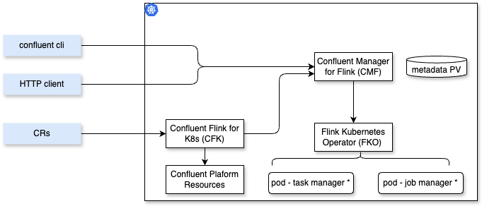

# Confluent Platform for Flink

[The official product documentation after 07/2025 release is here.](https://docs.confluent.io/platform/current/flink/overview.html) 

CP Flink is the Confluent Flink product that is extremely flexible and configurable to address a large set of user's requirements. It is a supported Flink with a subset of Flink components: SQL, Table API, DataStream API, ProcessFunction. Using Kafka, FileSystem, JDBC and CDC connectors, and using a central management feature for Kubernettes deployment and security.

The main features are:

* Fully compatible with open-source Flink. 
* Deploy on Kubernetes using Helm. It is only supported on kube. On Kubernetes, machine or Flink process failures will be recovered by Kubernetes, guaranteeing high uptime, and low latency.
* Define environment, which does a logical grouping of Flink applications with the goal to provide access isolation, and configuration sharing.
* Deploy application with user interface and task manager cluster
* Exposes custom kubernetes operator for specific CRD
* When integrated with Kafka, Kafka CP can run on bare metal while CP Flink on kube.

The figure below presents the Confluent Flink components deployed on Kubernetes:

<figure markdown="span">

<figcaption>Confluent Platform for Flink</figcaption>
</figure>

* CFK supports the management of custom CRD, based on the Flink for Kubernetes Operator. (CFK 3.0.0 supports CP 8.0.0)
* CMF (Confluent Manager for Apache Flink) adds security control, and a REST API server for the cli or a HTTP client
* FKO is the open source Flink for Kubernetes Operator
* Flink cluster are created from command and CRDs and run Flink applications within an environment

Be sure to have [confluent cli.](https://docs.confluent.io/confluent-cli/current/install.html#install-confluent-cli)

## Specific concepts added on top of Flink

* Confluent Manager for Flink (**CMF**) provides:
    * Job life-cycle management for Flink jobs.
    * Integration with Confluent Platform for authentication and authorization (RBAC).
    * Well-defined REST APIs and command-line interfaces (CLIs).
    * Store metadata in its own embedded database
    * It is a kubernetes operator to manage custom resources

* **Environment**: for access control isolation, and Flink configuration sharing
* **Compute pool** represents resources to run Task manager and Job manager. Each Flink SQL statement is associated with exactly one Compute Pool. [See example of pool definition](https://docs.confluent.io/platform/current/flink/configure/compute-pools.html) and in [cmf folder](https://github.com/jbcodeforce/flink-studies/blob/master/deployment/k8s/cmf)
* **SQL catalog** to group database concept for Flink SQL table queries. It references a Schema Registry instance and one or more Kafka clusters.

* [See Product FAQs](https://docs.confluent.io/platform/current/flink/faq.html)

## Product Set Up

* [See my dedicated chapter for Confluent Plaform Kubernetes deployment](../coding/k8s-deploy.md/#confluent-manager-for-flink).
* [See the makefile to deploy CMF](https://github.com/jbcodeforce/flink-studies/blob/master/deployment/k8s/cp-flink/Makefile), and the [product documentation](https://docs.confluent.io/platform/current/flink/installation/overview.html) 

## Deployment architecture

* A Flink cluster always needs to run in one K8s cluster in one region, as the Flink nodes are typically exchanging a lot of data, requiring low latency network.
* For failover between data centers, the approach if to share durable storage (HDFS, S3, Minio) accessible between data centers, get Kafka topic replicated, and being able to restart from checkpoints.
* Recall that Flink can interact with multiple Kafka Clusters at the same time.


## Important Source of Information for Deployment

* [Confluent Platform deployment using kubernetes operator](https://docs.confluent.io/operator/current/co-deploy-cp.html#co-deploy-cp)
* [Deployment overview](https://docs.confluent.io/platform/current/flink/installation/overview.html) and [for Apache Flink.](https://nightlies.apache.org/flink/flink-docs-master/docs/deployment/overview/) 
* [CP Flink supports K8s HA only.](https://nightlies.apache.org/flink/flink-docs-master/docs/deployment/ha/kubernetes_ha/)
* [Flink fine-grained resource management documentation.](https://nightlies.apache.org/flink/flink-docs-master/docs/deployment/finegrained_resource/)
* [CP v8 announcement](https://www.confluent.io/blog/introducing-confluent-platform-8-0/): builds on Kafka 4.0, next-gen Confluent Control Center (integrating with the open telemetry protocol (OTLP),  Confluent Manager for Apache Flink® (CMF)), Kraft native (support significantly larger clusters with millions of partitions), Client-Side field level encryption. CP for Flink support SQL, Queues for Kafka is now in Early Access, 

## Authentication and Authorization

### Authentication

The product documentations for [CP authentication](https://docs.confluent.io/platform/current/security/authentication/overview.html) can be summarized as:

* Kafka brokers accesses from producer/consumer applications can be done using SASL (Simple Authentication Security Layer), mutualTLS to verify clients and server identities to ensure that traffic is secure and trusted in both directions.
* Admin REST API authentication is done via HTTP Basic Auth
* Access to the C3 may be done [via SSO](https://docs.confluent.io/platform/current/security/authentication/sso-for-c3/overview.html)
* It supports using [LDAP for authentication]() or [OAuth/OIDC](https://docs.confluent.io/platform/current/security/authentication/oauth-oidc/overview.html) where all identities across Confluent Platform workloads and interfaces can be hosted on a single identity provider providing for a unified identity management solution. [See a Keycloak docker compose demo](https://github.com/confluentinc/cp-all-in-one/tree/master/cp-all-in-one-security/oauth), and [my keycloak deployment on k8s](https://github.com/jbcodeforce/flink-studies/blob/master/deployment/k8s/keycloak/README.md).
* See [SSL/TLS](https://docs.confluent.io/platform/current/security/authentication/mutual-tls/overview.html#kafka-ssl-authentication) on how to use openssl for cryptography encryption.
* By default inter broker communication is PLAINTEXT, but it can be set to SSL

### Authorization

The product documentations for [CP Authorization](https://docs.confluent.io/platform/current/security/authorization/overview.html) highlights the following major points:

* Access to Confluent Platform resources as clusters, topics, consumer groups, and connectors are controlled via [ACLs](https://docs.confluent.io/platform/current/security/authorization/acls/overview.html#acls-authorization). ACLs are stored in the KRaft-based Kafka cluster metadata.
* Group based authorization can be defined in LDAP

### MetaData Management Service (MDS) for RBAC for Flink

Flink Job represents code. So it is critical to setup authentication and authorization. Flink supports [TLS/SSL for authentication and encryption](https://nightlies.apache.org/flink/flink-docs-release-1.19/docs/deployment/security/security-ssl/) of network traffic between Flink processes, both for internal connectivity (between Flink processes) and external connectivity (From outside to Flink processes).

Recall that, keystore and a truststore must be set up such that the truststore trusts the keystore’s certificates.

CMF supports mTLS authentication and OAuth authentication. As CMF is deployed via kubernetes operator, SREs have control over who may deploy Flink applications. All access should go through CMF to comply with the authentication and authorization requirements.

* For mTLS the approach is to define a mtls-values.yaml and use it when deploying or upgrading the cmf helm chart.
    ```sh
    helm upgrade --install cmf confluentinc/confluent-manager-for-apache-flink -f mtls-values.yaml
    ```

    See and example of [mtls-values.yaml](https://github.com/jbcodeforce/flink-studies/blob/master/deployment/k8s/cmf/mtls-values.yaml) which declares the truststore file to use. The certificates should be defined in a secret.

???- info "Defining SSL certs"
        Use [keytool](https://docs.oracle.com/javase/8/docs/technotes/tools/unix/keytool.html) to create self-certified certificates and keys.
        ```sh
        keytool -genkeypair -alias flink.internal -keystore internal.keystore -dname "CN=flink.internal" \
                -storepass internal_store_password -keyalg RSA -keysize 4096 -storetype PKCS12
        ```
        Define a secret with the base64 string of the certificates:
        ```sh
        cat your_certificate.crt | base64 -w 0
        cat your_private_key.key | base64 -w 0
        ```

        And a secret.yaml
        ```yaml
        apiVersion: v1
        kind: Secret
        metadata:
            name: cmf-certs
        type: kubernetes.io/tls
        data:
            tls.crt: <base64_encoded_certificate>
            tls.key: <base64_encoded_private_key>
        ```

#### Roles

The Flink Kubernetes operator installs two custom roles: **flink-operator** and **flink**:

* `flink-operator` is used to manage `FlinkDeployment` resources: meaning it creates and manages the JobManager deployment for each Flink job (and related resources). 
* `flink` role is used by the jobManager process of each job to create and manage the taskManager and configMap resources.

With FKO, job and task managers are dep loyed together so there is no need for the `flink` service account to have permissions to launch additional pods. K8s handles the TaskManager Pod lifecycle. With native k8s mode, flink code may could inherit the JobManager's Kubernetes permissions, and so being able to launch other pods to access sensitive cluster resoirces.

#### RBAC

* CMF communicates with the MDS to validate whether the principal of the incoming request is allowed to perform a specific action.
* CMF requires its own service principal to authorize user principals.

#### Metdata service (MDS)

[MDS manages](https://docs.confluent.io/platform/current/kafka/configure-mds/index.html) a variety of metadata about your Confluent Platform installation. It is configured on each Kafka broker. It is possible to centralize into a hub and spoke architecture of multiple kafka clusters, Connect and schema registry. MDS maintains a local cache of authorization data that is persisted to an internal Kafka topic named _confluent-metadata-auth.

* [Metadata Service Overview](https://docs.confluent.io/platform/current/kafka/configure-mds/index.html#configure-mds-long-in-cp)
* Single broker [Kafka+MDS Deployment](https://docs.confluent.io/platform/current/kafka/configure-mds/index.html#configure-a-primary-ak-cluster-to-host-the-mds-and-role-binding)
* [Git repo with working CP on K8s deployment using RBAC via SASL/Plain and LDAP](https://github.com/confluentinc/confluent-kubernetes-examples/tree/master/security/production-secure-deploy)
* [Configure CP Flink to use MDS for Auth](https://docs.confluent.io/platform/current/flink/installation/authorization.html)
* [Additional Flink RBAC Docs](https://nightlies.apache.org/flink/flink-kubernetes-operator-docs-release-1.8/docs/operations/rbac/)
* [How to secure a Flink job with RBAC](https://docs.confluent.io/platform/current/flink/flink-jobs/security.html#how-to-secure-a-af-job-with-cmf-long)
* Best Practices for [K8s + RBAC](https://kubernetes.io/docs/concepts/security/rbac-good-practices/)

## SQL specific

As of November 2025 [SQL support is still under-preview.](https://docs.confluent.io/platform/current/flink/jobs/sql-statements/overview.html)

## Applications

Important points:

* After CMF is installed and running, it will continuously watch Flink applications.
* Environment control k8s namespace in which the Flink application is deployed.
* Suspended app, does not consume resource, and may be restored from its savepoint.
* CLI, REST API or the Control Center Console may be used to deploy app.

* [See the getting started with a Java project for Flink](../coding/datastream/#first-programs), see also [the Confluent specific settings](https://docs.confluent.io/platform/current/flink/jobs/applications/packaging.html#set-up-the-project-configuration)

## Understanding Sizing

The observed core performance rule is that Flink can process ~10,000 records per second per CPU core. This baseline may decrease with larger messages, bigger state, key skew, or high number of distinct keys.

There are a set of characteristics to assess before doing sizing:

### Statement Complexity Impact

Statement complexity reflects the usage of complex operators like:

* Joins between multiple streams
* Windowed aggregations
* Complex analytics functions

*More complex operations require additional CPU and memory resources.*

### Architecture Assumptions

* Source & Sink latency: Assumed to be minimal
* Key size: Assumed to be small (few bytes)
* Minimum cluster size: 3 nodes required
* CPU limit: Maximum 8 CPU cores per Flink node

### State Management & Checkpointing

* Working State: Kept locally in RocksDB
* Backup: State backed up to distributed storage
* Recovery: Checkpoint size affects recovery time
* Frequency: Checkpoint interval determines state capture frequency
* Aggregate state size consumes bandwidth and impacts recovery latency.

### Resource Guidelines

Typical Flink node configuration includes:

* 4 CPU cores with 16GB memory
* Should process 20-50 MB/s of data
* Jobs with significant state benefit from more memory

*Scaling Strategy: Scale vertically before horizontally*

### Latency Impact on Resources
Lower latency requirements significantly increase resource needs:

* Sub-500ms latency: +50% CPU, frequent checkpoints (10s), boosted parallelism
* Sub-1s latency: +20% CPU, extra buffering memory, 30s checkpoints
* Sub-5s latency: +10% CPU, moderate buffering, 60s checkpoints
* Relaxed latency (>5s): Standard resource allocation
*Stricter latency requires more frequent checkpoints for faster recovery, additional memory for buffering, and extra CPU for low-latency optimizations.*

### Estimation Heuristics

The estimator increases task managers until there are sufficient resources for:

* Expected throughput requirements
* Latency-appropriate checkpoint intervals
* Acceptable recovery times
* Handling data skew and key distribution

???- warning "Important Notes"
    * These are estimates - always test with your actual workload
    * Start with conservative estimates and adjust based on testing
    * Monitor your cluster performance and tune as needed
    * Consider your specific data patterns and business requirements

[See this Flink estimator project](https://github.com/jbcodeforce/flink-estimator) for a tool to help estimating cluster sizing.

## Monitoring

## Troubleshouting

### Submitted query pending

When submitting SQL query from the Flink SQL, it is possible it goes in pending: the job manager pod is created and running, but the task manager is pending. Assess what is going on with `kubectl describe pod <pod_id> -n flink`, which gives error message like insufficient cpu. Adding compute pool cpu is worse as the compute pool spec for task manager and job manager is for the default settings to create those pods.
