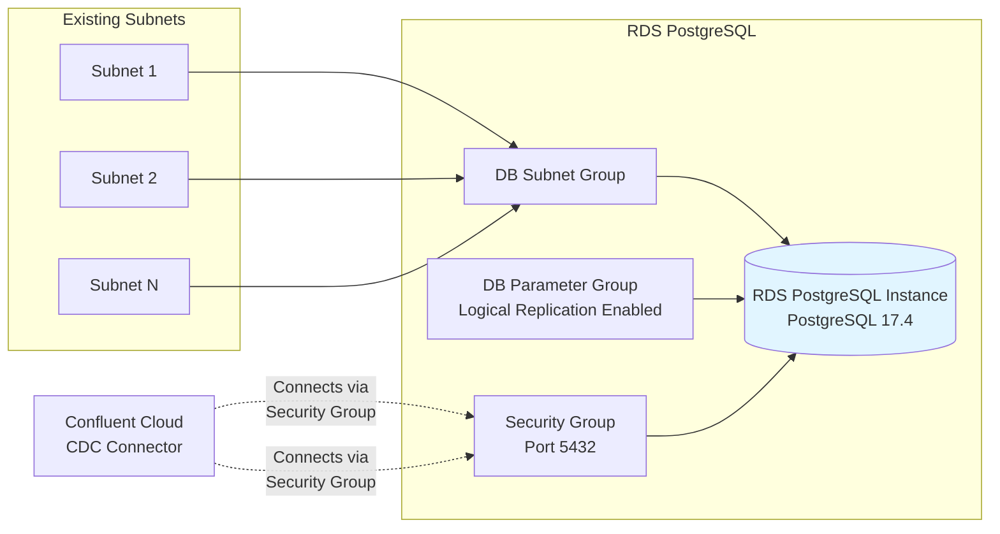
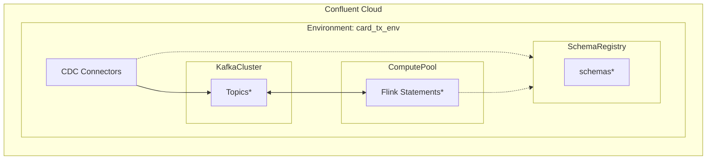

# Step-by-Step Deployment Guide

This guide shows how to deploy the infrastructure incrementally using Terraform's `-target` flag.

## AWS Infrastructure Overview

The following diagram shows all AWS resources created by this Terraform configuration:

AWS  resources:

```mermaid
graph TB
    subgraph VPC["Existing VPC"]
        subgraph Subnets["Existing Subnets"]
            Subnet1[Subnet 1]
            Subnet2[Subnet 2]
            SubnetN[Subnet N]
        end

        
        subgraph ECS["ECS/Fargate ML Inference"]
            ECSCluster[ECS Cluster]
            ECSTask[ECS Task Definition]
            ECSService[ECS Service]
            ECSSG[Security Group<br/>Ports 8080, 443]
            ECRRepo[ECR Repository<br/>ML Inference Container]
            CloudWatchLogs[CloudWatch Log Group]
        end
        
        subgraph Redshift["Redshift Serverless (Optional)"]
            RedshiftNS[Redshift Namespace]
            RedshiftWG[Redshift Workgroup]
            RedshiftSG[Security Group<br/>Port 5439]
        end
    end
    
    subgraph S3["S3 Storage"]
        S3Bucket[(S3 Bucket<br/>Iceberg Sink)]
        S3Versioning[S3 Versioning]
        S3Encryption[S3 Encryption<br/>AES256]
    end
    
    subgraph IAM["IAM Resources"]
        S3User[IAM User<br/>S3 Sink User]
        S3AccessKey[IAM Access Key]
        S3UserPolicy[IAM User Policy<br/>S3 Access]
        ECSTaskExecRole[ECS Task Execution Role]
        ECSTaskRole[ECS Task Role<br/>S3 Access]
        RedshiftSpectrumRole[Redshift Spectrum Role<br/>S3 & Glue Access]
    end
    
    
    %% ECS relationships
    Subnet1 --> ECSService
    Subnet2 --> ECSService
    SubnetN --> ECSService
    ECSSG --> ECSService
    ECRRepo --> ECSTask
    ECSTask --> ECSService
    ECSCluster --> ECSService
    CloudWatchLogs --> ECSTask
    ECSTaskExecRole --> ECSTask
    ECSTaskRole --> ECSTask
    
    %% Redshift relationships
    Subnet1 --> RedshiftWG
    Subnet2 --> RedshiftWG
    SubnetN --> RedshiftWG
    RedshiftSG --> RedshiftWG
    RedshiftNS --> RedshiftWG
    RedshiftSpectrumRole --> RedshiftNS
    
    %% S3 relationships
    S3Versioning --> S3Bucket
    S3Encryption --> S3Bucket
    S3UserPolicy --> S3User
    S3AccessKey --> S3User
    S3User --> S3Bucket
    ECSTaskRole --> S3Bucket
    RedshiftSpectrumRole --> S3Bucket
    
    %% External connections
    ConfluentCloud[Confluent Cloud<br/>CDC Connector] -.->|Connects via<br/>Security Group| RDSSG
    Flink[Flink SQL<br/>Statements] -.->|HTTP/HTTPS| ECSSG
    
    style RDSInstance fill:#e1f5ff
    style S3Bucket fill:#fff4e1
    style ECSCluster fill:#e8f5e9
    style RedshiftNS fill:#f3e5f5
    style IAM fill:#fff9c4
```



## Prerequisites

1. Copy `terraform.tfvars.example` to `terraform.tfvars` and fill in your values
2. Run `terraform init` to initialize the providers
    ```bash
    cd IaC
    terraform init
    ```
3. Verify the plan
    ```sh
    terraform plan
    ```
    
## Deployment Steps

### Step 1: Deploy Random ID and VPC Data Sources

These are always needed first as they're dependencies for everything else.

```bash
terraform apply -target=random_id.env_display_id \
                -target=data.aws_vpc.existing \
                -target=data.aws_subnets.existing \
                -target=data.aws_subnet.primary
```

### Step 2: Deploy RDS Infrastructure

Deploy the RDS database and its dependencies:



```bash
# Security groups first
terraform apply -target=aws_security_group.card_tx_db_sg \
                -target=aws_security_group_rule.allow_inbound_postgres \
                -target=aws_security_group_rule.allow_outbound_all

# RDS subnet group
terraform apply -target=aws_db_subnet_group.card_tx_db_subnet_group

# RDS parameter group
terraform apply -target=aws_db_parameter_group.card_tx_pg_params

# RDS instance (this takes ~5-10 minutes)
terraform apply -target=aws_db_instance.card_tx_db

# Create database tables (requires psql to be installed)
terraform apply -target=null_resource.create_tables

# OR if psql is not installed, create tables manually:
# psql -h $(terraform output -raw rds_address) -U postgres -d cardtxdb -f schema.sql
```

**Verify RDS is ready:**
```bash
terraform output rds_endpoint
# Test connection (requires psql):
psql -h $(terraform output -raw rds_address) -U postgres -d cardtxdb
```

**Note:** If you don't have `psql` installed, you can:
1. Set `create_tables_automatically = false` in `terraform.tfvars` to skip automatic table creation
2. Manually run the schema: `psql -h <rds-endpoint> -U postgres -d cardtxdb -f schema.sql`
3. Or install psql:
   - macOS: `brew install postgresql`
   - Ubuntu: `sudo apt-get install postgresql-client`
   - RHEL: `sudo yum install postgresql`

**Troubleshooting Connection Timeouts:**

If you get "connection timed out" errors, check:

1. **RDS must be in public subnets** with Internet Gateway routes
   - **Note:** Terraform automatically validates this during `terraform plan`/`apply`
   - If validation fails, you'll see an error message with specific subnets that need fixing
2. **Verify RDS is publicly accessible:**
   ```bash
   aws rds describe-db-instances --db-instance-identifier <instance-id> \
     --query 'DBInstances[0].PubliclyAccessible'
   ```
3. **Check security group rules:**
   ```bash
   aws ec2 describe-security-groups --group-ids <sg-id>
   ```
4. **Verify subnet has Internet Gateway route:**
   ```bash
   aws ec2 describe-route-tables --filters "Name=vpc-id,Values=<vpc-id>"
   ```

See [NETWORKING.md](./NETWORKING.md) for detailed networking troubleshooting.

### Step 3: Deploy Confluent Cloud Infrastructure




Deploy Confluent Cloud resources (can be done in parallel with RDS):

```bash
# Environment
terraform apply -target=confluent_environment.card_tx_env

# Kafka cluster (takes ~5 minutes)
terraform apply -target=confluent_kafka_cluster.card_tx_cluster

# Schema Registry (auto-provisioned, just need data source)
terraform apply -target=data.confluent_schema_registry_cluster.card_tx_sr

# Flink compute pool
terraform apply -target=confluent_flink_compute_pool.card_tx_flink_pool \
                -target=data.confluent_flink_region.card_tx_flink_region
```

**Verify Confluent resources:**
```bash
terraform output kafka_bootstrap_endpoint
terraform output schema_registry_endpoint
terraform output flink_compute_pool_id
```

### Step 4: Deploy Service Accounts and Access Control

```bash
# Service accounts
terraform apply -target=confluent_service_account.app_manager \
                -target=confluent_service_account.connectors \
                -target=confluent_service_account.flink

# Role bindings
terraform apply -target=confluent_role_binding.app_manager_env_admin \
                -target=confluent_role_binding.flink_developer \
                -target=confluent_role_binding.flink_cluster_admin

# API keys
terraform apply -target=confluent_api_key.app_manager_kafka_key \
                -target=confluent_api_key.app_manager_sr_key \
                -target=confluent_api_key.app_manager_flink_key

# Tableflow API key (if enable_tableflow = true)
terraform apply -target=confluent_api_key.app_manager_tableflow_key

# ACLs for connectors
terraform apply -target=confluent_kafka_acl.connectors_create_topic \
                -target=confluent_kafka_acl.connectors_write_topic \
                -target=confluent_kafka_acl.connectors_read_topic \
                -target=confluent_kafka_acl.connectors_describe_cluster \
                -target=confluent_kafka_acl.connectors_read_group -auto-complete
```

### Step 5: Deploy CDC Connector

**Prerequisites:** RDS must be ready and tables created.

```bash
terraform apply -target=confluent_connector.card_tx_cdc_source
```

**Verify CDC connector:**
- Check connector status in Confluent Cloud UI
- Verify topics are created: `card-tx.public.customers`, `card-tx.public.transactions`

**Important Notes:**
1. **Tables must exist in RDS before deploying the connector**
   ```bash
   # Verify tables exist
   ./verify-cdc-setup.sh
   
   # Or manually check:
   psql -h $(terraform output -raw rds_address) -U postgres -d cardtxdb -c '\dt'
   ```

2. **CDC topics are created when:**
   - The connector first starts and captures the initial snapshot of tables
   - OR when there are changes (INSERT/UPDATE/DELETE) to the tables
   
   If tables are empty, topics may not appear until you insert data or the connector performs an initial snapshot.

3. **If topics don't appear:**
   - Check connector status in Confluent Cloud UI (should be "Running")
   - Check connector logs for errors
   - Verify tables exist: `psql -h <rds-endpoint> -U postgres -d cardtxdb -c '\dt'`
   - Verify table.include.list matches your schema: `public.customers,public.transactions`
   - Try inserting test data to trigger topic creation:
     ```sql
     INSERT INTO customers (account_number, customer_name) VALUES ('TEST001', 'Test Customer');
     INSERT INTO transactions (txn_id, account_number, amount) VALUES ('txn-001', 'TEST001', 100.00);
     ```

### Step 5.5: Deploy Tableflow (Optional)

**Prerequisites:** 
- Topics must exist (especially `txp_fct_hourly_tx_metrics` and `txp_dim_enriched_tx` topics). They will be created by Flink create tables, or created upfront.
- Set `enable_tableflow = true` in `terraform.tfvars` (default is `true`)
- Set `create_tableflow_topics = true` if you want Terraform to create topics, or `false` if topics are created by Flink (default is `true`)

Tableflow enables topics to be accessed as Iceberg tables, providing a unified view between operational data (Kafka) and analytical data (Iceberg).

**Tableflow-enabled topics:**
- `txp_fct_hourly_tx_metrics` - Hourly transaction metrics fact table
- `txp_dim_enriched_tx` - Enriched transactions dimension table

**Configuration Options:**

1. **If topics are created by Flink** (recommended):
   ```hcl
   enable_tableflow = true
   create_tableflow_topics = false  # Topics created by Flink DDL statements
   ```

2. **If you want Terraform to create topics**:
   ```hcl
   enable_tableflow = true
   create_tableflow_topics = true  # Terraform will create topics
   ```

**Deploy Tableflow:**

```bash
# Option 1: If topics are created by Flink (create_tableflow_topics = false)
# Just deploy Tableflow - topics should already exist
terraform apply -target=confluent_tableflow_topic.txp_fct_hourly_tx_metrics \
                -target=confluent_tableflow_topic.txp_dim_enriched_tx

# Option 2: If Terraform creates topics (create_tableflow_topics = true)
# Deploy Kafka topics first, then Tableflow
terraform apply -target=confluent_kafka_topic.txp_fct_hourly_tx_metrics \
                -target=confluent_kafka_topic.txp_dim_enriched_tx

terraform apply -target=confluent_tableflow_topic.txp_fct_hourly_tx_metrics \
                -target=confluent_tableflow_topic.txp_dim_enriched_tx
```

**Note:** If topics already exist (created by Flink), Terraform will handle them gracefully. The `create_tableflow_topics` variable controls whether Terraform attempts to create the topics or assumes they already exist.

**Verify Tableflow is enabled:**
```bash
# Check Tableflow topic outputs (shows both topics)
terraform output tableflow_topic_names
terraform output tableflow_topic_ids

# Legacy outputs (for backward compatibility)
terraform output tableflow_topic_name
terraform output tableflow_topic_id

# Verify in Confluent Cloud UI:
# 1. Navigate to Topics → txp_fct_hourly_tx_metrics
# 2. Check for "Tableflow" tab or indicator
# 3. Verify Iceberg table format is enabled
# 4. Repeat for txp_dim_enriched_tx topic
```

**Important Notes:**
1. **Tableflow requires the topic to exist first** - Make sure topics are created before enabling Tableflow. Topics can be created by:
   - Terraform (via `confluent_kafka_topic` resources when `create_tableflow_topics = true`)
   - Flink (when the table DDL statements are executed - set `create_tableflow_topics = false`)
2. **Handling Existing Topics**: 
   - **If topics already exist** (created by Flink): Set `create_tableflow_topics = false` in `terraform.tfvars`. Terraform will use the existing topics and won't attempt to create them.
   - **If topics don't exist yet**: Set `create_tableflow_topics = true` to have Terraform create them.
   - **If you get errors about topics already existing**: You can import existing topics into Terraform state:
     ```bash
     # Get cluster ID
     CLUSTER_ID=$(terraform output -raw kafka_cluster_id)
     
     # Import existing topics
     terraform import confluent_kafka_topic.txp_fct_hourly_tx_metrics[0] ${CLUSTER_ID}/txp_fct_hourly_tx_metrics
     terraform import confluent_kafka_topic.txp_dim_enriched_tx[0] ${CLUSTER_ID}/txp_dim_enriched_tx
     ```
     Then set `create_tableflow_topics = true` to manage them with Terraform.
3. **Storage**: Uses Confluent-managed storage by default (no additional AWS setup required)
4. **Table Format**: Configured for Iceberg format
5. **Topic Names**: Tableflow is enabled on:
   - `txp_fct_hourly_tx_metrics` - Fact table for hourly metrics
   - `txp_dim_enriched_tx` - Dimension table for enriched transactions

**Accessing the Iceberg Tables:**
Once Tableflow is enabled, the topic data is automatically materialized as Iceberg tables. You can:
- Query the tables using analytics tools that support Iceberg (e.g., Spark, Trino, Dremio)
- Access table metadata and schema from the Confluent Cloud UI
- Use the tables for downstream analytics without additional ETL processes

**Disabling Tableflow:**
To disable Tableflow, set `enable_tableflow = false` in `terraform.tfvars` and run:
```bash
terraform apply
```

### Step 6: Deploy Topics (if not created by Flink)

If topics are not created automatically by Flink CREATE TABLE statements, deploy them manually:

```bash
# Topics for enriched transactions and aggregations
terraform apply -target=confluent_kafka_topic.card_tx_enriched \
                -target=confluent_kafka_topic.card_tx_aggregations
```

**Note:** These topics are typically created by Flink SQL statements, but are defined here for use by connectors (like S3 sink) that need them before Flink deployment.

### Step 7: Deploy S3 Infrastructure

**Deploy S3 bucket and IAM resources independently:**

```bash
# S3 bucket with versioning and encryption
terraform apply -target=aws_s3_bucket.card_tx_iceberg \
                -target=aws_s3_bucket_versioning.card_tx_iceberg_versioning \
                -target=aws_s3_bucket_server_side_encryption_configuration.card_tx_iceberg_encryption

# IAM user and access key for S3 sink
terraform apply -target=aws_iam_user.s3_sink_user \
                -target=aws_iam_access_key.s3_sink_access_key \
                -target=aws_iam_user_policy.s3_sink_policy
```

**Or deploy all S3 resources at once:**

```bash
# Deploy all S3 resources (bucket, versioning, encryption, IAM)
terraform apply -target=aws_s3_bucket.card_tx_iceberg \
                -target=aws_s3_bucket_versioning.card_tx_iceberg_versioning \
                -target=aws_s3_bucket_server_side_encryption_configuration.card_tx_iceberg_encryption \
                -target=aws_iam_user.s3_sink_user \
                -target=aws_iam_access_key.s3_sink_access_key \
                -target=aws_iam_user_policy.s3_sink_policy
```

**Deploy S3 sink connector (requires S3 bucket and IAM user to exist first):**

```bash
terraform apply -target=confluent_connector.card_tx_s3_sink
```

### Step 8: Deploy ML Inference (Optional)

```bash
# Security group
terraform apply -target=aws_security_group.card_tx_ecs_sg

# ECR repository
terraform apply -target=aws_ecr_repository.card_tx_ml_inference_repo

# ECS cluster
terraform apply -target=aws_ecs_cluster.card_tx_ecs_cluster

# IAM roles
terraform apply -target=aws_iam_role.ecs_task_execution_role \
                -target=aws_iam_role_policy_attachment.ecs_task_execution_policy \
                -target=aws_iam_role.ecs_task_role \
                -target=aws_iam_role_policy.ecs_task_s3_policy

# CloudWatch log group
terraform apply -target=aws_cloudwatch_log_group.card_tx_ml_inference_logs

# ECS task definition and service
terraform apply -target=aws_ecs_task_definition.card_tx_ml_inference_task \
                -target=aws_ecs_service.card_tx_ml_inference_service
```

**Note:** You'll need to build and push a Docker image to ECR before the service can start.

### Step 9: Deploy Redshift (Optional)

Only if `enable_redshift = true` in your `terraform.tfvars`:

```bash
terraform apply -target=aws_security_group.card_tx_redshift_sg \
                -target=aws_iam_role.redshift_spectrum_role \
                -target=aws_iam_role_policy.redshift_spectrum_s3_policy \
                -target=aws_iam_role_policy_attachment.redshift_spectrum_glue_policy \
                -target=aws_redshiftserverless_namespace.card_tx_namespace \
                -target=aws_redshiftserverless_workgroup.card_tx_workgroup
```

## Quick Reference: Deploy Everything

If you want to deploy everything at once (after initial setup):

```bash
terraform apply
```

## Verify Deployment

After deployment, check all outputs:

```bash
terraform output
```

**Note:** If you've added new outputs to existing infrastructure, you may need to refresh the state:
```bash
# Refresh state from AWS (doesn't modify resources)
terraform refresh

# Or apply changes (will update outputs)
terraform apply
```

Key outputs to verify:
- `rds_endpoint` - PostgreSQL connection string
- `rds_subnet_group_subnets` - Subnet IDs in RDS subnet group
- `rds_subnet_group_subnet_details` - Detailed subnet information (CIDR, AZ, route tables)
- `rds_availability_zone` - AZ where RDS is deployed
- `kafka_bootstrap_endpoint` - Kafka broker endpoint
- `schema_registry_endpoint` - Schema Registry endpoint
- `flink_compute_pool_id` - Flink compute pool ID
- `s3_bucket_name` - S3 bucket for Iceberg
- `tableflow_topic_name` - Tableflow-enabled topic name (if `enable_tableflow = true`)
- `tableflow_topic_id` - Tableflow topic ID (if `enable_tableflow = true`)

**To find which specific subnet RDS is deployed to:**
```bash
RDS_ID=$(terraform output -raw rds_instance_id)
aws rds describe-db-instances --db-instance-identifier $RDS_ID \
  --query 'DBInstances[0].DBSubnetGroup.Subnets[?SubnetStatus==`Active`].SubnetIdentifier' \
  --output text
```

See [NETWORKING.md](./NETWORKING.md) for more details on RDS subnet configuration.

## Troubleshooting

### RDS not accessible
- Check security group rules allow your IP
- Verify `publicly_accessible = true` if needed
- Check VPC routing and internet gateway

### CDC Connector failing

**Verify prerequisites:**
```bash
# 1. Check RDS is running and accessible
terraform output rds_endpoint
nc -zv $(terraform output -raw rds_address) 5432

# 2. Verify tables exist in RDS
./verify-cdc-setup.sh

# Or manually:
psql -h $(terraform output -raw rds_address) -U postgres -d cardtxdb -c '\dt'
```

**Expected output should show:**
```
 public | customers    | table | postgres
 public | transactions | table | postgres
```

**If tables don't exist:**
```bash
# Create tables using schema.sql
psql -h $(terraform output -raw rds_address) -U postgres -d cardtxdb -f schema.sql

# Or let Terraform create them:
terraform apply -target=null_resource.create_tables
```

**Check connector status:**
- Go to Confluent Cloud UI → Connectors
- Find connector: `$(terraform output -raw cdc_connector_name)`
- Check Status (should be "Running")
- Review Logs for errors

**Common issues:**
1. **Tables don't exist** → Create them with `schema.sql`
2. **Topics not created** → CDC topics are created when connector captures changes. Insert test data to trigger topic creation
3. **Connection timeout** → Check RDS security group allows Confluent Cloud IPs
4. **Logical replication not enabled** → Verify RDS parameter group has `rds.logical_replication = 1`
5. **Wrong table names** → Verify `table.include.list` in connector config matches your schema

**Verify logical replication is enabled:**
```bash
RDS_ID=$(terraform output -raw rds_instance_id)
aws rds describe-db-parameters \
    --db-parameter-group-name $(aws rds describe-db-instances --db-instance-identifier $RDS_ID \
        --query 'DBInstances[0].DBParameterGroups[0].DBParameterGroupName' --output text) \
    --query 'Parameters[?ParameterName==`rds.logical_replication`]'
```

### Flink statements failing
- Verify topics exist (created by CDC connector or Flink)
- Check API keys have correct permissions
- Verify Flink compute pool is running

### Tableflow not enabled or failing

**Verify Tableflow is enabled:**
```bash
# Check if Tableflow topic exists
terraform output tableflow_topic_name

# Should output: card-tx-tx-aggregations (or your prefix)
```

**Common issues:**
1. **Tableflow topic not created** → Verify `enable_tableflow = true` in `terraform.tfvars`
2. **Topic doesn't exist** → Tableflow requires the topic to exist first. Deploy topics before Tableflow
3. **API key missing** → Ensure `confluent_api_key.app_manager_tableflow_key` is deployed
4. **Storage issues** → Check Confluent Cloud UI for storage configuration errors

**Check Tableflow status in Confluent Cloud:**
- Navigate to Topics → `txp_fct_hourly_tx_metrics` → Tableflow tab
- Verify materialization status
- Check for any error messages in the Tableflow UI
- Repeat for `txp_dim_enriched_tx` topic

**Re-enable Tableflow:**
If Tableflow was disabled and you want to re-enable it:
```bash
# Set enable_tableflow = true in terraform.tfvars
terraform apply -target=confluent_api_key.app_manager_tableflow_key \
                -target=confluent_tableflow_topic.txp_fct_hourly_tx_metrics \
                -target=confluent_tableflow_topic.txp_dim_enriched_tx
```

## Cleanup

To destroy everything:

```bash
terraform destroy
```

Or destroy specific components:

```bash
# Destroy just RDS
terraform destroy -target=aws_db_instance.card_tx_db

# Destroy just Confluent resources
terraform destroy -target=confluent_environment.card_tx_env
```
