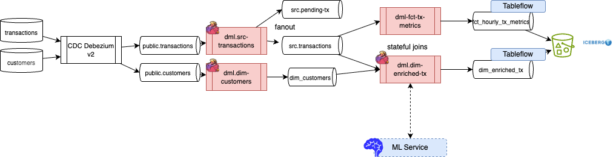
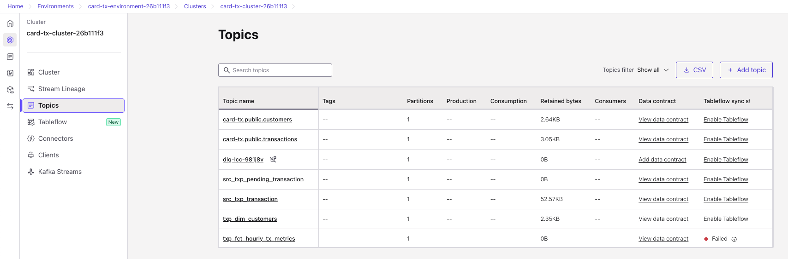
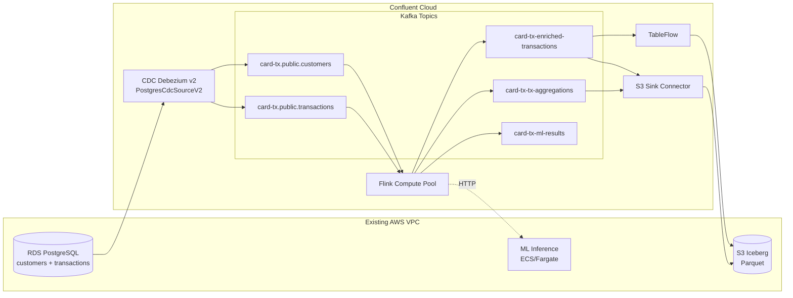
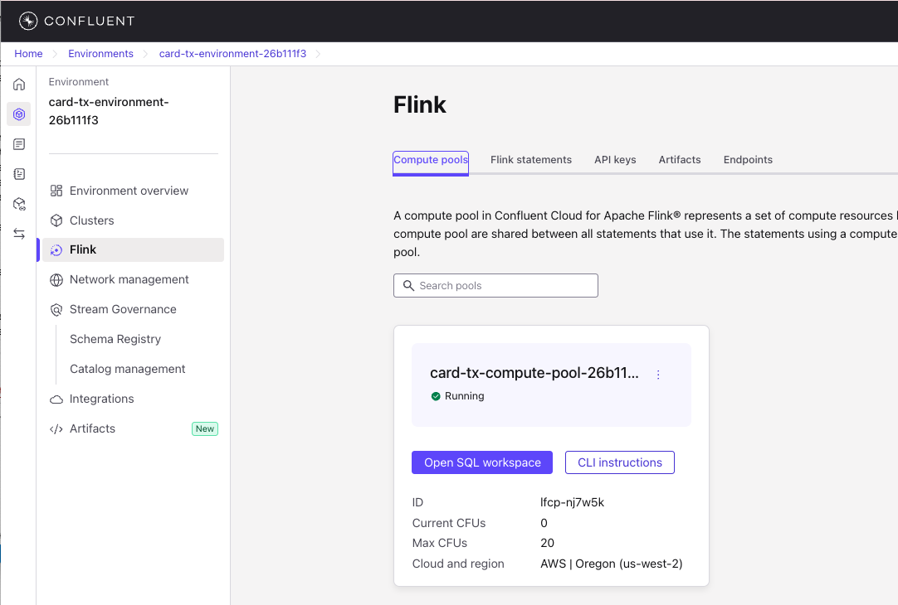
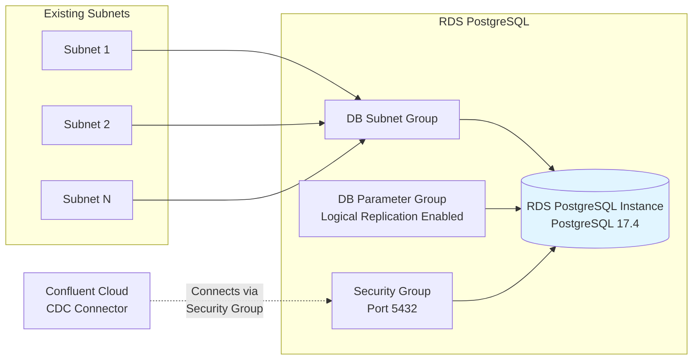
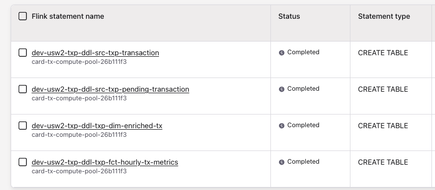
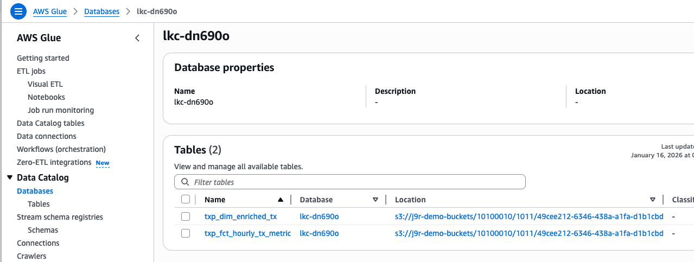
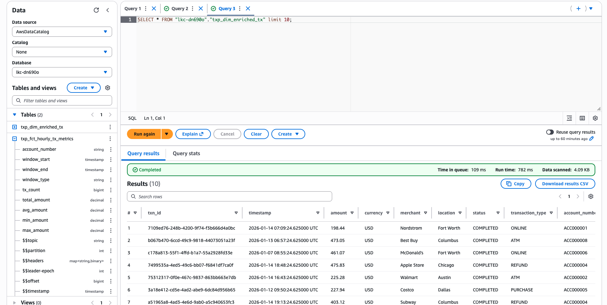
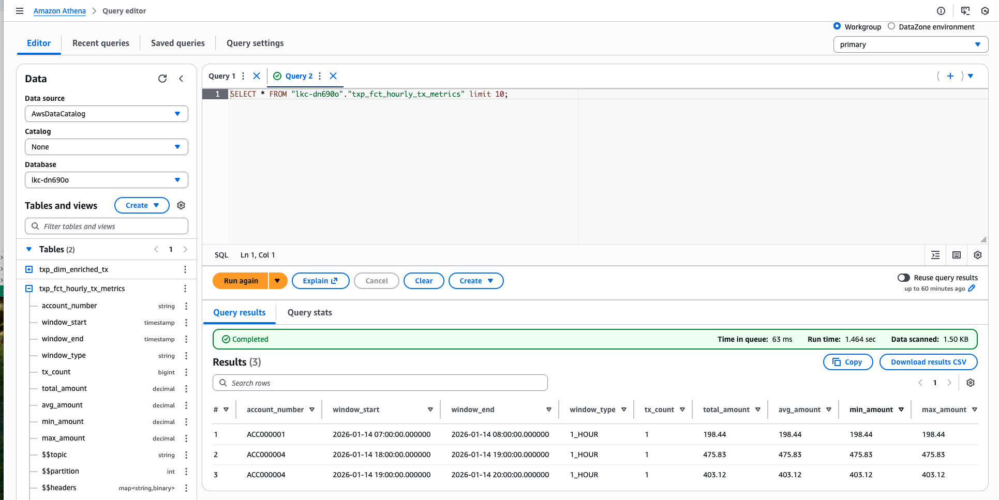

# A Confluent Cloud Demo for Transaction Processing using CDC

## Goals

The demonstration presents a hands-on guidance for the following requirements:

* [x] Integrate with AWS RDS Postgres and CDC Debezium v2 Kafka Connector deployed as managed service on Confluent Cloud (CC)
* [x] Decoding Debezium message envelope using Flink or using the json-debezium-registry setting in CC Flink. [See Flink processing](./cc-flink-sql/README.md)
* [x] Understanding how to replace existing ETL processes with Flink. [Explanation in this section.](#from-etl-to-flink)
* [x] Sliding window aggregations over transactions grouped by cardholder (1 minute to 1 day windows). [See chapter](./cc-flink-sql/README.md#sliding-window-aggregations)
* [x] How to propagate delete operations to sink bucket [See section](./cc-flink-sql/README.md#propagating-the-operation-delete-too)
* [x] Maintain data order for transactional systems. [See below section on end to end ordering](#end-to-end-ordering).
* [x] Fanout to different topics using statement set. [See statement set of tx](./cc-flink-sql/sources/txp/src_transaction/sql-scripts/dml.src_txp_transaction.sql)
* [x] Data enrichment with joins. [See joins transaction and customer](./cc-flink-sql/dimensions/txp/dim_enriched_tx/sql-scripts/dml.txp_dim_enriched_tx.sql)
* [x] Tableflow set up for aggregation and enriched_transaction topics - Messages in S3 Buckets and Iceberg Tables
* [x] Tableflow Catalog in sync with AWS Glue Catalog
* [x] AWS Athena integrated with AWS Glue Catalog for the Kafka Cluster defined and then being able to see and query the Iceberg tables. 
* [x] Integrate with a [ML scoring service](./tx_scoring/README.md). The scoring is deployed as a task in AWS ECS. Docker image in ECR.
* [x] What monitoring and observability requirements exist? (#monitoring)
* [x] How to handle microservices that produce/consume Kafka data without going through Debezium? ([Outbox pattern](#outbox-pattern))
* [x] Flink statement deployment with Terraform. [See the terraform folder](./cc-flink-sql/terraform/README.md)

### To Do

* [x] Terraform to get VPC, subnets, configure service accounts, role binding,  deploy RDS, create tables, specify inbound rules for security group, Debezium connector, 
* [x] Terraform for S3 bucket, iam role and access policy
* [ ] Athena, Glue Catalog
* [x] Add sample data generator code to support the demonstration
* [x] Create ML inference code with  Docker container and ECS deployment
* [ ] Add monitoring dashboards (Grafana)
* [ ] Add end-to-end integration tests
* [ ] Create Athena SQL scripts


## Architecture

Classical context for data transformation is to move, transform and load data from operational data plane to analytical data plane


The medallion architecture, a three-layered approach, is a common framework for organizing data lakes.


Most of the transformation, enrichment, filtering from bronze to gold can be done in real-time processing, combined with query engine on lake house capabilties. To illustrate this appraoch the demonstration illustrates the following architecture.


### Component List

| Component | Description | Resource Naming |
|-----------|-------------|-----------------|
| RDS PostgreSQL | Database with customers and transactions tables | `card-tx-db-{id}` |
| VPC | Existing VPC (passed via terraform variable) | N/A |
| CDC Debezium v2 | Source connector capturing changes from PostgreSQL | `card-tx-cdc-source` |
| Flink Compute Pool | Processing Debezium messages, enrichment, aggregations | `card-tx-compute-pool-{id}` |
| ML Inference | ECS/Fargate container for fraud scoring | `card-tx-ml-inference-service` |
| TableFlow | Automatic Iceberg table management | Enabled on enriched tx and aggregates topics |
| TableFlow Catalog | Source of truth for all tables sync to object storage | |
| AWS Glue Catalog | Catalog in Cloud Provider | |
| AWS Athena | Query Engine on Iceberg Table | |


### Topics

The following figure presents the Flink pipeline, including CDC connectors and tableflow.



| Topic | Owner | Description |
| ----- | ----- | ----------- |
| `card-tx.public.customers` | CDC Debezium | customer records consumed from Postgresql DB |
| `card-tx.public.transactions` |CDC Debezium | transaction records consumed from Postgresql DB |
| `dim_customers` | Flink | Customer dimension - from debezium envelop - no duplicate |
| `src_transaction` | Flink | Transaction filtering, dedup, transformed |
| `src_pending_tx` | Flink | Transaction with pending state. Illustrate Fan out |
| `dim_enriched_tx` | Flink | Transaction enriched with customer data |
| `hourly_tx_metrics` | Flink | Compute stateful aggregates for the transactions |

Which once the Terraform deployment and the Flink Statements are executed will look like:




### Project Structure

```
├── cc-flink-sql
│   ├── common.mk
│   ├── dimensions
│   │   └── txp
│   │       ├── dim_customers
│   │       │   ├── Makefile
│   │       │   ├── sql-scripts
│   │       │   │   ├── alter_src_customer.sql
│   │       │   │   ├── ddl.txp_dim_customers.sql
│   │       │   │   └── dml.txp_dim_customers.sql
│   │       │   └── tests
│   │       └── dim_enriched_tx
│   │           ├── Makefile
│   │           ├── sql-scripts
│   │           │   ├── ddl.txp_dim_enriched_tx.sql
│   │           │   └── dml.txp_dim_enriched_tx.sql
│   │           ├── tests
│   │           └── tracking.md
│   ├── facts
│   │   └── txp
│   │       └── hourly_tx_metrics
│   │           ├── Makefile
│   │           ├── sql-scripts
│   │           │   ├── ddl.txp_fct_hourly_tx_metrics.sql
│   │           │   └── dml.txp_fct_hourly_tx_metrics.sql
│   │           └── tests
│   ├── sources
│   │   └── txp
│   │       └── src_transaction
│   │           ├── Makefile
│   │           ├── README.md
│   │           ├── sql-scripts
│   │           │   ├── alter_src_transactions.sql
│   │           │   ├── ddl.src_txp_pending_transaction.sql
│   │           │   ├── ddl.src_txp_transaction.sql
│   │           │   └── dml.src_txp_transaction.sql
│   │           └── tests
│   ├── staging
│   ├── terraform
│   │   ├── data.tf
│   │   ├── flink_statements.tf
│   │   ├── outputs.tf
│   │   ├── providers.tf
│   │   ├── README.md
│   │   ├── tableflow.tf
│   │   ├── terraform.tfstate
│   │   ├── terraform.tfstate.backup
│   │   ├── terraform.tfvars
│   │   ├── terraform.tfvars.example
│   │   └── variables.tf
│   └── views
├── data-generators
│   ├── generate_test_data.py
│   ├── pyproject.toml
│   ├── README.md
├── IaC
│   ├── aws.tf
│   ├── confluent.tf
│   ├── connectors.tf
│   ├── get-ecs-task-url.sh
│   ├── ml-inference.tf
│   ├── outputs.tf
│   ├── providers.tf
│   ├── README.md
│   ├── s3.tf
│   ├── schema.sql
│   ├── service-accounts.tf
│   ├── terraform.tfstate
│   ├── terraform.tfstate.backup
│   ├── terraform.tfvars
│   ├── terraform.tfvars.example
│   ├── variables.tf
│   └── verify-cdc-setup.sh
└── tx_scoring
    ├── deploy.sh
    ├── Dockerfile
    ├── main.py
    ├── pyproject.toml
    ├── README.md
    └── requirements.txt
```


### Domain Data Model

The transaction processing domain consists of two core source tables:

#### customers
Customer master data with deduplication support (upsert mode).

| Column | Type | Description |
|--------|------|-------------|
| `account_number` | VARCHAR | Primary key - unique customer identifier |
| `customer_name` | VARCHAR | Full name of the customer |
| `email` | VARCHAR | Customer email address |
| `phone_number` | VARCHAR | Contact phone number |
| `date_of_birth` | TIMESTAMP(3) | Customer birth date |
| `city` | VARCHAR | Customer city location |
| `created_at` | TIMESTAMP_LTZ(3) | Record creation timestamp (watermark) |

#### transactions
Financial transaction records with deduplication support (upsert mode).

| Column | Type | Description |
|--------|------|-------------|
| `txn_id` | VARCHAR(36) | Primary key - unique transaction identifier |
| `account_number` | VARCHAR(255) | Foreign key to customer |
| `timestamp` | TIMESTAMP_LTZ(3) | Transaction timestamp (watermark) |
| `amount` | DECIMAL(10,2) | Transaction amount |
| `currency` | VARCHAR(5) | Currency code (e.g., USD) |
| `merchant` | VARCHAR(255) | Merchant name |
| `location` | VARCHAR(255) | Transaction location |
| `status` | VARCHAR(255) | Transaction status |
| `transaction_type` | VARCHAR(50) | Type of transaction |

### Outbox pattern

[The outbox pattern](https://jbcodeforce.github.io/eda-studies/patterns/#transactional-outbox) is a classical design pattern for event-driven microservice. 


The approach is to have a dedicated table to persist business events designed for asynchronous consumers. As the consumers may not be known upfront the approach is to use pub/sub with long persistence, so Kafka is a technology of choice. Existing code sample presents this pattern [in this repository](https://github.com/jbcodeforce/vaccine-order-mgr?tab=readme-ov-file) using Java Quarkus and Debezium outbox extension.

Any microservice that wants to implement the outbox pattern needs to design the business events to represent the change of state of the business entity the service manages. It is recommended to adopt [event-storming](https://jbcodeforce.github.io/eda-studies/methodology/event-storming/)  and [domain-driven design](https://jbcodeforce.github.io/eda-studies/methodology/ddd/) to model the business events and microservice together. 

[Future implementation](./oubox-customer-service/README.md) will demonstrate the method for the customer microservice.

## From ETL to Flink

When ETL processing is done with ANSI SQL, Spark and even in some way Snowflake SQL, it is possible to run the same processing as a medaillon architecture. The approach is to build analytics data product. We recommend [reading this chapter](https://jbcodeforce.github.io/flink-studies/methodology/data_as_a_product/) and may use [this tool](https://github.com/jbcodeforce/shift_left_utils/tree/main) to jump start your Kimball Flink project. 

In this demonstration the [./cc-flink-sql/](./cc-flink-sql/) folder has the Kimball structure built with 'shift_left' CLI.

## End-to-end ordering

Debezium ensures that all changes for a single database row are sent to the same Kafka partition. Debezium uses the table's Primary Key as the Kafka message key. Kafka guarantees total order of messages within a single partition.

All updates to the account_number = 'ACC0005' go to the same kafka partition. With one partition, Flink will have one source operator and order will be kept. Flink partitioning use the key defined for the sink table, or the joins condition.

Flink uses a set of internal mechanisms to ensure that the logical order of database changes is preserved, even when performing complex operations like joins or windowing. As input streams are upserts, Flink maintains a materialized state and uses retraction logic to keep state per key.

CDC streams contain INSERT, UPDATE (often split into UPDATE_BEFORE and UPDATE_AFTER), and DELETE operations. If a record in the left table is updated, Flink sends a "retraction" (a -D or -U message) to the join operator to "undo" the previous join result before emitting the new one.

Flink often inserts a hidden operator called ChangelogNormalize. This operator keeps the latest state of each primary key in memory. If Debezium sends updates out of order (due to a rare Kafka retry), this operator can reconcile them to ensure only the "latest" version is joined.

For time window, ordering may not be that critical. Still, Flink may use the timestamp of the source.ts_ms or the kafka $rowtime. Flink reorders record internally based on the used timestamp before putting them into a window. A late event may go out of the window. The watermark settings are important. 

A watermark is a "marker" in the stream that tells Flink: "I am confident no more messages with a timestamp earlier than X will arrive." Flink waits for the watermark to pass the end of a window before it calculates and emits the result.

Flink 1.19+ introduced direct support for Changelog Window Aggregation. This allows the window to subtract the "old" values and add the "new" values if an update arrives for a record already counted in a window.

## Infrastructure as Code (Expect around 15+ minutes deployment)

The [IaC](./IaC/) folder includes the Terraform to deploy the infractructure of the solution on AWS and Confluent Cloud. 

1. Confluent Cloud Infrastructure components:
   1. Environment
   2. Cluster
   3. Topics and Schemas
   4. RBAC role-bindings
   5. Debezium CDC Connector and Data Quality Rules.
   6. Flink Compute Pool




Here is an example of compute pool deployed via terraform, with MAX CFU of 20:

    

2. AWS Infrastructure components:
   1. Amazon RDS for PostgreSQL Database - holds information about Product, Orders and Customers
   1. Glue Catalog
   1. Athena



### Prerequisites

* **Confluent Cloud API Keys** - [Cloud resource management API Keys](https://docs.confluent.io/cloud/current/security/authenticate/workload-identities/service-accounts/api-keys/overview.html#resource-scopes) with Organisation Admin permissions are needed by Terraform to deploy the necessary Confluent resources.
* **Terraform (v1.14.3+)** - The demo resources are automatically created using [Terraform](https://www.terraform.io). Besides having Terraform installed locally, will need to provide your cloud provider credentials so Terraform can create and manage the resources for you.
* **AWS account** - This demo runs on AWS
* **AWS CLI** - Terraform script uses AWS CLI to manage AWS resources
* **PSQL** - Make sure psql is installed locally.
* **Confluent CLI** - Used in the destroy script to delete resources created outside terraform. Run `brew install confluent`.
* **Unix machine** - The Terraform script requires a Unix environment. If you're using a Windows machine, consider deploying an EC2 instance with CentOS and run the deployment steps from there.

### Deployment Flow

**Deploy Infrastructure**

1. Configure terraform.tfvars
2. `terraform init`
3. `terraform plan   # fix any issues`
4. `terraform apply`  
5. Wait for RDS + CDC to be provisioned
6. Insert sample data using [Data Generator](./data-generators/README.md)
7. Deploy Flink SQL statements using another set of terraform for [Flink SQLs](./cc-flink-sql/terraform/README.md)
7. Can validate in Confluent Cloud User Interface the state of the Flink Statements
8. Verify enriched transactions and hourly_aggregate topics
9. Query Iceberg tables with Athena

**Option 2: Step-by-Step Deployment**

For incremental deployment (e.g., RDS first, then Confluent Cloud), see the detailed [Deployment Guide](./IaC/README.md).


### Key Terraform Variables

| Variable | Description | Default |
|----------|-------------|---------|
| `prefix` | Resource naming prefix | `card-tx` |
| `existing_vpc_id` | Your existing VPC ID | (required) |
| `cloud_region` | AWS region | `us-east-2` |
| `confluent_cloud_api_key` | Confluent Cloud API key | (required) |
| `confluent_cloud_api_secret` | Confluent Cloud API secret | (required) |
| `enable_tableflow` | Enable TableFlow for Iceberg | `true` |
| `enable_redshift` | Deploy Redshift Serverless | `false` |
| `confluent_cloud_cidr_blocks` | IP Addresses for CC to access RDS | (required) |

## Flink Processing

[See dedicated note](./cc-flink-sql/README.md) for the details on how to process Debezium envelop, addressing deduplication, sliding window aggregation, ML Scoring calls...

## Demonstration Script

1. As a preparation to the demonstration deploy all the infrastructure using Terraform in one shot (it can take 10 to 20 minutes):
    ```sh
    # under IaC folder
    terraform init
    terraform plan
    terraform apply
    ```

    or [step-by-step with detail instructions](./IaC/README.md). This is recommended the first time to understand what is done.

1. Once RDS in place and Source Connector running, use the data generator to create 10 base customers and transactions. ([See Data Generator readme for more details](./data-generators/README.md))
    * Getting RDS Endpoint and send 10 records in each table:
        ```bash
        cd IaC
        terraform output rds_address
        # Install dependencies (using uv)
        cd ../data-generators
        uv sync
        # Generate 10 customers and 10 transactions (one-shot)
        uv run generate_test_data.py \
        --db-host <rds-endpoint> \
        --db-name cardtxdb \
        --db-user postgres \
        --db-password <password>
        # last is the same as run.sh
        ```

1. [Execute the steps in the Flink table analysis](./cc-flink-sql/README.md#table-analysis) to explain the envelop processing. 

1. Aggregation deployment is done using separate Terraform under [cc-flink-sql/terraform](./cc-flink-sql/terraform/README.md). The DDL scripts complete:

    

    While the DML are continusouly running:

    

1. Start the data generator with infinite loop
    ```sh
    # Generate transactions continuously (for live demo)
    uv run generate_test_data.py \
    --db-host <rds-endpoint> \
    --db-name cardtxdb \
    --db-user postgres \
    --db-password <password> \
    --run-forever \
    --interval 5
    ```

    See [data-generators/README.md](./data-generators/README.md) for detailed usage and options.

1. Review Tablelow configuration
1. Validate Catalogs are synchronized. The following image is the table list from AWS Glue Catalog: `tx_dim_enriched_tx` and `txp_fct_hourly_tx_metrics` are the two Iceberg tables:

    

    `lkc-dn690o` is the databae name which maps to the Kafka Cluster id.

1. Query the tables in Athena
    

    and the aggregation

    


## ML Scoring

The scoring service may be exposed as a web service deployed as a container on Kubernetes or lightweight container management like AWS ECS-Fargate. Confluent Cloud Flink supports a set of [new operations to integrate to remote AI services](https://docs.confluent.io/cloud/current/flink/reference/functions/model-inference-functions.html).

> 
* Create a connection to the ECS service
    ```sql
    create connection `ml-tx-scoring-cn`  WITH (
        'type' = 'REST',
        'endpoint' = 'https://....:8080/predict',
        'token'= 'zutalors'
    );
    ```

* Create a model to specify input and ouput parameters:
    ```sql
    create model tx_scoring
    INPUT(txn_id STRING, amount  DECIMAL(10, 2), account_number STRING, merchant STRING, location STRING, tx_time TIMESTAMP(3) WITH LOCAL TIME ZONE)
    OUPUT(txn_id STRING, fraud_score DECIMAL(2,2), fraud_category STRING, risk_level STRING, inference_timestamp   TIMESTAMP(3))
    ```

## Monitoring

TBC 

## Clean Up

> [!WARNING]
> **Don't skip this!**
>
> Avoid unexpected charges by cleaning up when you're done.

## Sources of knowledge

* [This book for changelog mode explanations](https://jbcodeforce.github.io/flink-studies/concepts/flink-sql/#changelog-mode)
* [confluent networking overview](https://docs.confluent.io/cloud/current/networking/overview.html#cloud-networking)
* [Connect to RDS using psql](https://docs.aws.amazon.com/AmazonRDS/latest/UserGuide/USER_ConnectToPostgreSQLInstance.psql.html)
* [Troubleshooting connections to your RDS for PostgreSQL instance](https://docs.aws.amazon.com/AmazonRDS/latest/UserGuide/USER_ConnectToPostgreSQLInstance.Troubleshooting.html)
* [Event-driven architecture and design patterns - JBoyer's book](https://jbcodeforce.github.io/eda-studies/)
