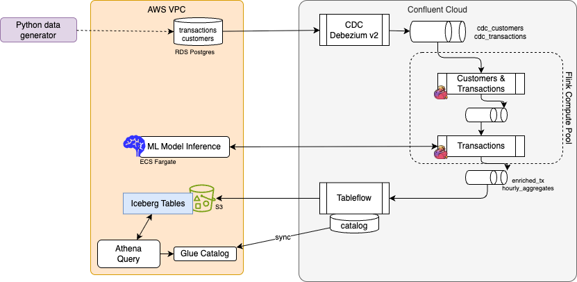

# A Confluent Cloud Demo for Transaction Processing using CDC

## Goals

The demonstration presents a hands-on guidance for the following requirements:

* [x] Integrate with AWS RDS Postgres and CDC Debezium v2 Kafka Connector deployed as managed service on Confluent Cloud (CC)
* [x] Decoding Debezium message envelope using Flink or using the json-debezium-registry setting in CC Flink. [See Flink processing](./cc-flink-sql/README.md)
* [x] Understanding how to replace existing ETL processes with Flink. [Explanation in this section.](#from-etl-to-flink)
* [x] Sliding window aggregations over transactions grouped by cardholder (1 minute to 1 day windows). [See chapter](./cc-flink-sql/README.md#sliding-window-aggregations)
* [x] How to propagate delete operations to sink bucket [See section](./cc-flink-sql/README.md#propagating-the-operation-delete-too)
* [x] Maintain data order for transactional systems. [See below section on end to end ordering](#end-to-end-ordering).
* [x] Fanout to different topics using statement set. []()
* [ ] Data enrichment with joins.
* [ ] How TableFlow + Flink ensure ordered delivery
* [ ] Integrate with a [ML scoring service](./tx_scoring/README.md)
* [ ] What monitoring and observability requirements exist?
* [x] How to handle microservices that produce/consume Kafka data without going through Debezium? ([Outbox pattern](#outbox-pattern))
* [ ] Flink statement deployment with Terraform

### To Do

* [x] Terraform to get VPC, subnets, configure service accounts, role binding,  deploy RDS, create tables, specify inbound rules for security group, Debezium connector, 
* [ ] Terraform for Redshift and S3 buckets, S3 Sink connector.
* [x] Add sample data generator code to support the demonstration
* [x] Create ML inference code with  Docker container and ECS deployment
* [ ] Add monitoring dashboards (Grafana)
* [ ] Add end-to-end integration tests
* [ ] Create Redshift external schema SQL scripts


## Architecture



### Component List

| Component | Description | Resource Naming |
|-----------|-------------|-----------------|
| RDS PostgreSQL | Database with customers and transactions tables | `card-tx-db-{id}` |
| VPC | Existing VPC (passed via terraform variable) | N/A |
| CDC Debezium v2 | Source connector capturing changes from PostgreSQL | `card-tx-cdc-source` |
| Flink Compute Pool | Processing Debezium messages, enrichment, aggregations | `card-tx-compute-pool-{id}` |
| ML Inference | ECS/Fargate container for fraud scoring | `card-tx-ml-inference-service` |
| S3 Sink Connector | Writes enriched data to S3 in Parquet format | `card-tx-s3-sink` |
| TableFlow | Automatic Iceberg table management | Enabled on enriched topics |
| Redshift Serverless | Query layer for S3 Iceberg tables (optional) | `card-tx-workgroup-{id}` |


### Topics

| Topic | Owner | Description |
| ----- | ----- | ----------- |
| `card-tx.public.customers` | CDC Debezium | customer records consumed from Postgresql DB |
| `card-tx.public.transactions` |CDC Debezium | transaction records consumed from Postgresql DB |
| `dim_customers` | Flink | Customer dimension - from debezium envelop - no duplicate |
| `src_transaction` | Flink | Transaction filtering, dedup, transformed |
| `dim_transactions` | Flink | |


### Project Structure

```
cc-cdc-tx-demo/
├── AGENTS.md                    # This file
├── images/
│   └── proposed_arch.drawio.png # Architecture diagram
├── IaC/                         # Terraform Infrastructure
│   ├── providers.tf             # AWS, Confluent providers
│   ├── variables.tf             # Input variables (card-tx prefix)
│   ├── outputs.tf               # Connection strings, endpoints
│   ├── aws.tf                   # VPC data source, RDS, Security Groups, S3
│   ├── confluent.tf             # Environment, Cluster, SR, Flink Pool, Topics
│   ├── service-accounts.tf      # Service accounts, API keys, ACLs
│   ├── connectors.tf            # CDC Debezium v2, S3 Sink connectors
│   ├── ml-inference.tf          # ECS cluster, ECR, task definition, service
│   ├── redshift.tf              # Optional Redshift Serverless
│   ├── terraform.tfvars.example # Example variables file
│   └── README.md            # Step-by-step deployment guide
├── data-generators/             # Test Data Generation
│   ├── generate_test_data.py   # CLI tool to generate customers/transactions
│   ├── pyproject.toml          # Python project config (uv)
│   └── README.md                # Usage instructions
└── cc-flink-sql/                # Flink SQL Statements organized as Kimball structure
```


### Domain Data Model

The transaction processing domain consists of two core source tables:

#### customers
Customer master data with deduplication support (upsert mode).

| Column | Type | Description |
|--------|------|-------------|
| `account_number` | VARCHAR | Primary key - unique customer identifier |
| `customer_name` | VARCHAR | Full name of the customer |
| `email` | VARCHAR | Customer email address |
| `phone_number` | VARCHAR | Contact phone number |
| `date_of_birth` | TIMESTAMP(3) | Customer birth date |
| `city` | VARCHAR | Customer city location |
| `created_at` | TIMESTAMP_LTZ(3) | Record creation timestamp (watermark) |

#### transactions
Financial transaction records with deduplication support (upsert mode).

| Column | Type | Description |
|--------|------|-------------|
| `txn_id` | VARCHAR(36) | Primary key - unique transaction identifier |
| `account_number` | VARCHAR(255) | Foreign key to customer |
| `timestamp` | TIMESTAMP_LTZ(3) | Transaction timestamp (watermark) |
| `amount` | DECIMAL(10,2) | Transaction amount |
| `currency` | VARCHAR(5) | Currency code (e.g., USD) |
| `merchant` | VARCHAR(255) | Merchant name |
| `location` | VARCHAR(255) | Transaction location |
| `status` | VARCHAR(255) | Transaction status |
| `transaction_type` | VARCHAR(50) | Type of transaction |

### Outbox pattern

[The outbox pattern](https://jbcodeforce.github.io/eda-studies/patterns/#transactional-outbox) is a classical design pattern for event-driven microservice. The approach is to have a dedicated table to persist business events designed for asynchronous consumers. As the consumers may not be known upfront the approach is to use pub/sub with long persistence, so Kafka as a technology of choice. Existing code sample presents this pattern [in this repository](https://github.com/jbcodeforce/vaccine-order-mgr?tab=readme-ov-file) using Java Quarkus and Debezium outbox extension.

Any microservice that wants to implement the outbox pattern needs to design the business events to represent the change of state of the business entity the service manages. It is recommended to adopt [event-storming](https://jbcodeforce.github.io/eda-studies/methodology/event-storming/)  and [domain-driven design](https://jbcodeforce.github.io/eda-studies/methodology/ddd/) to model the business events and microservice together. 

[Future implementation](./oubox-customer-service/README.md) will demonstrate the method for the customer microservice.

## From ETL to Flink

When ETL processing is done with ANSI SQL, Spark and even in some way Snowflake SQL, it is possible to run the same processing as a medaillon architecture. The approach is to build analytics data product. We recommend [reading this chapter](https://jbcodeforce.github.io/flink-studies/methodology/data_as_a_product/) and may use [this tool]() to jump start your project. 

In this demonstration the [](./cc-flink-sql/) folder has the Kimball structure.

## End to end ordering

Debezium ensures that all changes for a single database row are sent to the same Kafka partition. Debezium uses the table's Primary Key as the Kafka message key. Kafka guarantees total order of messages within a single partition.

All updates to the account_number = 'ACC0005' go to the same kafka partition. With one partition, Flink will have one source operator and order will be kept. Flink partitioning use the key defined for the sink table, or the joins condition.

Flink uses a set of internal mechanisms to ensure that the logical order of database changes is preserved, even when performing complex operations like joins or windowing. As input streams are upserts, Flink maintains a materialized state and uses retraction logic to keep state per key.

CDC streams contain INSERT, UPDATE (often split into UPDATE_BEFORE and UPDATE_AFTER), and DELETE operations. If a record in the left table is updated, Flink sends a "retraction" (a -D or -U message) to the join operator to "undo" the previous join result before emitting the new one.

Flink often inserts a hidden operator called ChangelogNormalize. This operator keeps the latest state of each primary key in memory. If Debezium sends updates out of order (due to a rare Kafka retry), this operator can reconcile them to ensure only the "latest" version is joined.

For time window, ordering may not be that critical. Still, Flink may use the timestamp of the source.ts_ms or the kafka $rowtime. Flink reorders record internally based on the used timestamp before putting them into a window. A late event may go out of the window. The watermark settings are important. 

A watermark is a "marker" in the stream that tells Flink: "I am confident no more messages with a timestamp earlier than X will arrive." Flink waits for the watermark to pass the end of a window before it calculates and emits the result.

Flink 1.19+ introduced direct support for Changelog Window Aggregation. This allows the window to subtract the "old" values and add the "new" values if an update arrives for a record already counted in a window.

## Infrastructure as Code

The [IaC](./IaC/) folder includes the Terraform to deploy the solution on AWS and Confluent Cloud.

1. Confluent Cloud Infrastructure components:
   1. Environment
   2. Cluster
   3. Topics and Schemas
   4. RBAC role-bindings
   5. Debezium CDC Connector and Data Quality Rules.
2. AWS Infrastructure components:
   1. Redshift Cluster
   > Note: only if Amazon Redshift is selected as a data warehouse
   2. Amazon RDS for PostgreSQL Database - holds information about Product, Orders and Customers
   
### Deployment Flow

**Option 1: Deploy Everything at Once**

1. Configure terraform.tfvars
2. terraform init
3. terraform plan
4. terraform apply]
5. Wait for RDS + CDC
6. Insert sample data using [Data Generator](./data-generators/README.md)
7. Run Flink SQL statements [Flink SQL](./cc-flink-sql/README.md)
8. Verify enriched topics
9. Query S3/Redshift

**Option 2: Step-by-Step Deployment**

For incremental deployment (e.g., RDS first, then Confluent Cloud), see the detailed [Deployment Guide](./IaC/README.md).


### Key Terraform Variables

| Variable | Description | Default |
|----------|-------------|---------|
| `prefix` | Resource naming prefix | `card-tx` |
| `existing_vpc_id` | Your existing VPC ID | (required) |
| `cloud_region` | AWS region | `us-east-2` |
| `confluent_cloud_api_key` | Confluent Cloud API key | (required) |
| `confluent_cloud_api_secret` | Confluent Cloud API secret | (required) |
| `enable_tableflow` | Enable TableFlow for Iceberg | `true` |
| `enable_redshift` | Deploy Redshift Serverless | `false` |
| `confluent_cloud_cidr_blocks` | IP Addresses for CC to access RDS | (required) |

## Flink Processing

[See dedicated note](./cc-flink-sql/README.md) for the processing of Debezium envelop, addressing deduplication, sliding window aggregation...

## Demonstration Script

1. As a preparation to the demonstration deploy all the infrastructure using Terraform in one shot:
    ```sh
    terraform init
    terraform plan
    terraform apply
    ```

    or [step-by-step with detail instructions](./IaC/README.md). This is recommended the first time to understand what is done.

1. Once RDS in place and Source Connector running, use the data generator to create 10 base customers and transactions. ([See Data Generator readme for more details](./data-generators/README.md))
    * Getting RDS Endpoint and send 10 records in each table:
        ```bash
        cd IaC
        terraform output rds_address
        # Install dependencies (using uv)
        cd ../data-generators
        uv sync
        # Generate 10 customers and 10 transactions (one-shot)
        uv run generate_test_data.py \
        --db-host <rds-endpoint> \
        --db-name cardtxdb \
        --db-user postgres \
        --db-password <password>
        ```

1. [Execute the steps in the Flink table analysis](./cc-flink-sql/README.md#table-analysis) to explain the envelop processing. 


1. Aggregation deployment and 
    ```sh
    # Generate transactions continuously (for live demo)
    uv run generate_test_data.py \
    --db-host <rds-endpoint> \
    --db-name cardtxdb \
    --db-user postgres \
    --db-password <password> \
    --run-forever \
    --interval 5
    ```

See [data-generators/README.md](./data-generators/README.md) for detailed usage and options.


## Sources of knowledge

* [This book for changelog mode explanations](https://jbcodeforce.github.io/flink-studies/concepts/flink-sql/#changelog-mode)
* [confluent networking overview](https://docs.confluent.io/cloud/current/networking/overview.html#cloud-networking)
* [Connect to RDS using psql](https://docs.aws.amazon.com/AmazonRDS/latest/UserGuide/USER_ConnectToPostgreSQLInstance.psql.html)
* [Troubleshooting connections to your RDS for PostgreSQL instance](https://docs.aws.amazon.com/AmazonRDS/latest/UserGuide/USER_ConnectToPostgreSQLInstance.Troubleshooting.html)
* [Event-driven architecture and design patterns - JBoyer's book](https://jbcodeforce.github.io/eda-studies/)
