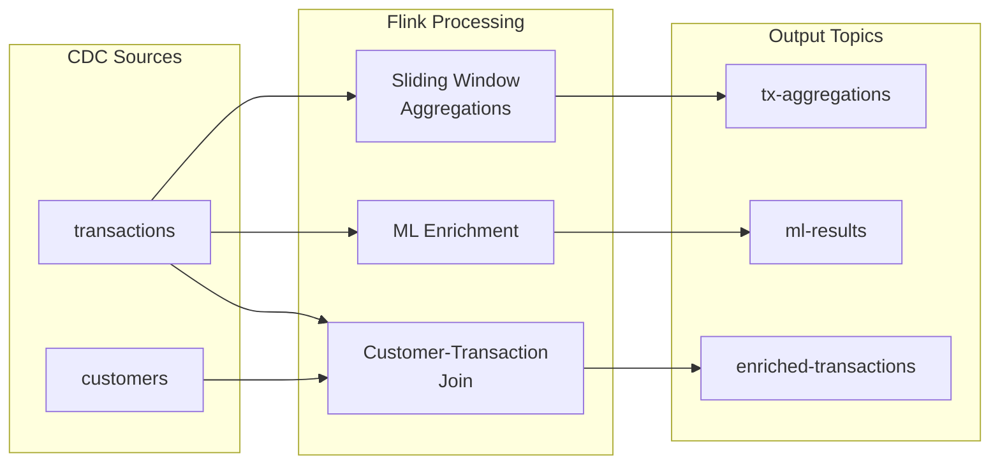
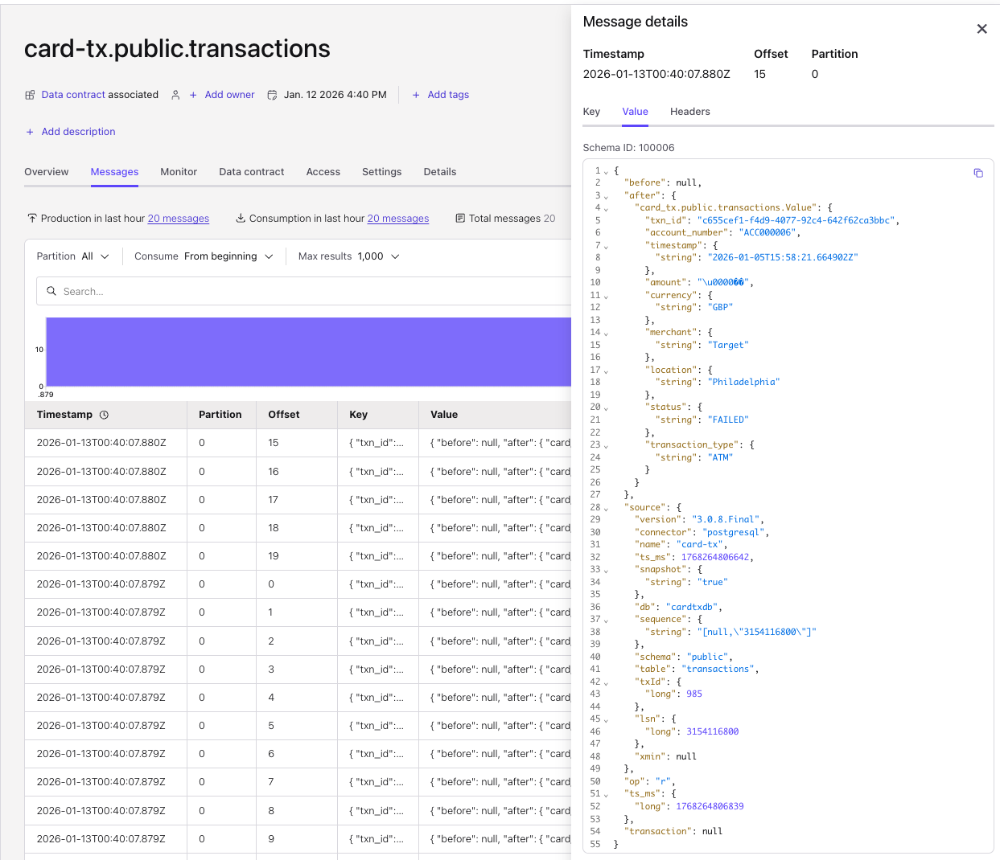
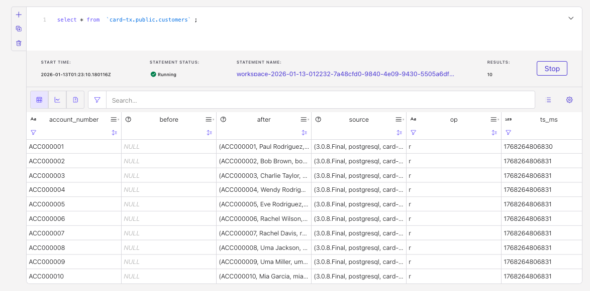
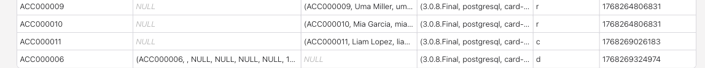

# Flink SQL Processing

This section goes into the details of:

* [x] Debezium messages with envelop decoding
* [x] Debezium messages flatten with CC Flink capability: ('value.format' = 'avro-debezium-registry')
* [x] Deduplication
* [x] Accessing kafka metadata
* [x] Data transformation, filtering and fanout
* [ ] Time window aggregation

## Pipeline Overview



## Debezium message decoding

When CDC Debezium v2 connector is configured, it will define the topics and the key and value schemas in schema registry. 

To get the full Debezium envelope, the connector was set with the following option: 
```sh
 "after.state.only"  = "false"  
```

The key schema looks like:
```json
{
  "connect.name": "card-tx.public.transactions.Key",
  "fields": [
    {
      "name": "txn_id",
      "type": "string"
    }
  ],
  "name": "Key",
  "namespace": "card-tx.public.transactions",
  "type": "record"
}
```

and values has []`source`,`before`,`after`] element definitions:

```json
{
  "connect.name": "card-tx.public.transactions.Envelope",
  "connect.version": 1,
  "fields": [
    {
      "default": null,
      "name": "before",
      "type": [
        "null",
        {
          "connect.name": "card-tx.public.transactions.Value",
          "fields": [
            {
              "name": "txn_id",
              "type": "string"
            },
            {
              "name": "account_number",
              "type": "string"
            },
            ...
     {
      "default": null,
      "name": "after",
      "type": [
        "null",
        "Value"
      ]
    },
    {
      "name": "source",
      "type": {
        "connect.name": "io.debezium.connector.v2.postgresql.Source",
        "fields": [
          {
            "name": "version",
            "type": "string"
          },
          ...
```

Once deployed, the messages in the topic have the `after` and `before` in the envelop:



### Table analysis

* Analysing the messages with the following query, we get a nice table view of the records. No envelop.
    ```sql
    SELECT * FROM `card-tx.public.customers` LIMIT 10;
    ```

    The reason is that by default the Flink materialized table on top of the topic has the [`'value.format' = 'avro-debezium-registry'`](https://docs.confluent.io/cloud/current/flink/reference/statements/create-table.html#value-format) (result of the `show create table `card-tx.public.customers`) :
    ```sql
    WITH (
        'changelog.mode' = 'retract',
        'connector' = 'confluent',
        'kafka.cleanup-policy' = 'delete',
        'kafka.compaction.time' = '0 ms',
        'kafka.max-message-size' = '8 mb',
        'kafka.retention.size' = '0 bytes',
        'kafka.retention.time' = '7 d',
        'key.format' = 'avro-registry',
        'scan.bounded.mode' = 'unbounded',
        'scan.startup.mode' = 'earliest-offset',
        'value.fields-include' = 'all',
        'value.format' = 'avro-debezium-registry'
        )
    ```

    Changing the table with the following command will get a table view with Debezium format
    ```sql
    ALTER TABLE `card-tx.public.customers` SET ('value.format' = 'avro-registry');
    ```

    

    The data type for before and after is Object. Example for the before column of the customer table:

    ```sql
    `before` ROW<`account_number` VARCHAR(2147483647) NOT NULL, `customer_name` VARCHAR(2147483647) NOT NULL, `email` VARCHAR(2147483647), `phone_number` VARCHAR(2147483647), `date_of_birth` TIMESTAMP(3) WITH LOCAL TIME ZONE, `city` VARCHAR(2147483647), `created_at` VARCHAR(2147483647)>,
  
    ```

* When update is desired, the changelog mode of the table is set to `retract`. `retract` mode only works if Debezium contains before messages. 

* If a primary key is present and retract mode is not an option, use upsert mode.
    ```sql
    ALTER TABLE `card-tx.public.transaction` ADD (PRIMARY KEY (txn_id) NOT ENFORCED);
    ALTER TABLE `card-tx.public.transaction` SET ('changelog.mode' = 'upsert');
    ```

### Working with envelop

The usecase to demonstrate is how to extract data from the after or before envelop depending of the operation type.
* The customers table is set with `avro-registry` for the value.format
* For the records loaded the first time into the topic the `op = r`. Once the connector is running, we can add a new customer 
* In Flink Workspace run: `select * from `card-tx.public.customers`;`
* Add a customer with the data-generator tool
    ```sh
     uv run generate_test_data.py --db-host card-tx-dbXXXXXXX.cnXXXXX.us-west-2.rds.amazonaws.com  --db-name cardtxdb --db-user postgres   --db-password ZutAlors123! --add-customer
    ```

    We can see a new record aith the `op=c`

* Delete one of the existing customer: (the demo script also deletes existing transactions to avoid postgres foreign key violation - this is okay in the context of a demo)
    ```sh
    uv run generate_test_data.py --db-host card-tx-dbXXXXXXX.cnXXXXX.us-west-2.rds.amazonaws.com  --db-name cardtxdb --db-user postgres   --db-password ZutAlors123! --delete-customer ACC000006
    ```

    Looking at the records in the table we can see now a new customer added, and a `op=d` for a previously created customer, with after field in the envelop with the account_number with NULL other field.  

    


* At this stage we have 3 use cases: records loaded from the source table snapshot, new record added while the debezium connector is running, and delete an existing record.

## Deduplication and Flatten Table

For the  `card-tx.public.transactions` the approach is to do the following settings:

```
alter table `card-tx.public.transactions` add ( `partition` INT METADATA VIRTUAL);
alter table `card-tx.public.transactions` add ( `offset` BIGINT METADATA VIRTUAL);
alter table `card-tx.public.transactions` SET ('value.format' = 'avro-debezium-registry');
alter table `card-tx.public.transactions` SET ('changelog.mode' = 'append');
```

With this approach, the table has no more Debezium envelop.

Then to remove duplicates, using the upsert model, will do so. Create a source table that will have deduplication and maybe some light transformation and filtering.

As an example there is a string date transformation to a datetime:

```sql
  TO_TIMESTAMP(REGEXP_REPLACE(COALESCE(`timestamp`, '2000-01-01T00:00:00.000000Z'),'T|Z',' '), 'yyyy-MM-dd HH:mm:SSSSSS') AS `timestamp`,
```


[DDL is here](./sources/txp/src_transaction/sql-scripts/ddl.src_txp_transaction.sql) and [DML](./sources/txp/src_transaction/sql-scripts/dml.src_txp_transaction.sql)

### Another pattern for deduplication

While Confluent Cloud Flink with the upsert changelog will keep the last record per key, the time will be the $rowtime so the kafka event time. We could imaging applying  multi-level deduplication strategies to ensure idempotency.

1. By transaction ID
2. By source timestamp
3. Use Kafka offset when timestamps are identical

It may be relevant to handle cases where the same record appears multiple times because of CDC connector reload. Or to handle some events that arrive out of order related to the source timestamp. The goal is to ensure only the most recent version of each record is processed. The row_number() function is used for that.

```sql
WITH ranked_by_timestamp AS (
    SELECT *,
        ROW_NUMBER() OVER (
            PARTITION BY account_number
            ORDER BY source_timestamp DESC
        ) AS deduplication_rank
    FROM customers_staging
)
SELECT * FROM ranked_by_timestamp WHERE deduplication_rank = 1;
```

## Accessing kafka metadata

To propagate metadata like partition and offset from a source Kafka topic to a downstream Flink SQL table, we need to declare the metadata in the source,

```sql
alter table `card-tx.public.transactions` add ( `partition` INT METADATA VIRTUAL)
alter table `card-tx.public.transactions` add ( `offset` INT METADATA VIRTUAL)
```

and then explicitly select it into a standard column in the sink.

```sh
select *,`partition`, `offset` from `card-tx.public.transactions`
```

So a downstream table can keep this metadata for future processing:

```sql
CREATE TABLE IF NOT EXISTS src_txp_transactions (
    -- ...
    src_timestamp TIMESTAMP_LTZ(3),
    src_partition INT,
    src_offset BIGINT,
```

and 

```sql
select *,   
  `partition` AS src_partition,
  `offset` AS src_offset 
from  `card-tx.public.transactions`
```

## Propagating the operation (delete too)

The common use cases for this behavior include: 
* Maintain historical data even after deletes
* Keep deleted records for compliance
* Allow downstream systems to handle deletes gracefully
* Ability to restore deleted records for recovery


When a delete operation is encountered, preserve the existing values in the target table rather than overwriting with NULLs

Extracting the payload from debezium envelop using SQL - propagating the operation for downstream processing:
```sql
insert into `dim_customers` select 
    account_number,
    coalesce(if (op = 'd', before.customer_name, after.customer_name), 'NULL') as customer_name,
    coalesce(if (op = 'd', before.email, after.email), 'NULL') as email,
    coalesce(if (op = 'd', before.phone_number, after.phone_number), 'NULL') as phone_number,
    DATE_FORMAT(if (op = 'd', before.date_of_birth, after.date_of_birth), 'YYYY-MM-DD') as date_of_birth,
    coalesce(if (op = 'd', before.city, after.city), 'NULL') as city,
    coalesce(if (op = 'd', before.created_at, after.created_at), 'NULL') as created_at,
    op as src_op,
    (op = 'd') as is_deleted,
    TO_TIMESTAMP_LTZ(source.ts_ms, 3) AS src_timestamp
from `card-tx.public.customers` 
```

To do not propagating delete operation add a `where op <> 'd'` condition.

* With upsert mode, Flink will consume and digest CDC delete events.
    ```sql
    alter table `card-tx.public.transactions` set ('value.format' = 'avro-debezium-registry');
    alter table `card-tx.public.transactions` set ('changelog.mode' = 'append');
    ```

### Some Common Practices
* For append-only sinks (S3, Iceberg), explicitly track deletes or use Confluent Tableflow with upsert support.
* Consider data retention policies - how long to keep deleted records
* Use separate delete tracking tables for audit purposes:
  ```sql
  CREATE TABLE IF NOT EXISTS customer_deletes (
    account_number STRING,
    deleted_at TIMESTAMP_LTZ(3),
    deleted_by_operation STRING,
    source_timestamp TIMESTAMP_LTZ(3),
    PRIMARY KEY (account_number) NOT ENFORCED
  )
  -- in dml
  INSERT INTO customer_deletes
  SELECT 
      before.account_number AS account_number,
      TO_TIMESTAMP_LTZ(source.ts_ms, 3) AS deleted_at,
      op AS deleted_by_operation,
      TO_TIMESTAMP_LTZ(source.ts_ms, 3) AS source_timestamp
  FROM `card-tx.public.customers`
  WHERE op = 'd' AND before.account_number IS NOT NULL;
  ```

* Filter deleted records in downstream queries using `is_deleted` flag


## Sliding Window Aggregations

The demo implements multiple window sizes for transaction analysis:

| Window Type | Size | Slide | Use Case |
|-------------|------|-------|----------|
| 1_MINUTE | 1 min | 30 sec | Real-time fraud detection |
| 15_MINUTE | 15 min | 5 min | Short-term spending patterns |
| 1_HOUR | 1 hour | 15 min | Hourly spending limits |
| 1_DAY | 1 day | N/A (tumbling) | Daily transaction summaries |


```sql
-- 1-Minute Sliding Window (slide every 30 seconds)
with completed_tx as (
  select * from `src_txp_transaction` where status = 'COMPLETED'
)
SELECT 
    account_number,
    window_start,
    window_end,
    '1_MINUTE' AS window_type,
    COUNT(*) AS tx_count,
    SUM(amount) AS total_amount,
    AVG(amount) AS avg_amount,
    MIN(amount) AS min_amount,
    MAX(amount) AS max_amount
FROM TABLE(
    HOP(TABLE completed_tx, DESCRIPTOR(`timestamp`), INTERVAL '30' SECOND, INTERVAL '1' MINUTE)
)
GROUP BY account_number, window_start, window_end;
```

```sql
-- 15-Minute Sliding Window (slide every 5 minutes)
with completed_tx as (
  select * from `src_txp_transaction` where status = 'COMPLETED'
)
SELECT 
    account_number,
    window_start,
    window_end,
    '15_MINUTE' AS window_type,
    COUNT(*) AS tx_count,
    SUM(amount) AS total_amount,
    AVG(amount) AS avg_amount,
    MIN(amount) AS min_amount,
    MAX(amount) AS max_amount
FROM TABLE(
    HOP(TABLE completed_tx, DESCRIPTOR(`timestamp`), INTERVAL '5' MINUTE, INTERVAL '15' MINUTE)
)
GROUP BY account_number, window_start, window_end;
```

```sql
-- 1-Hour Sliding Window (slide every 15 minutes)
with completed_tx as (
  select * from `src_txp_transaction` where status = 'COMPLETED'
)
SELECT 
    account_number,
    window_start,
    window_end,
    '1_HOUR' AS window_type,
    COUNT(*) AS tx_count,
    SUM(amount) AS total_amount,
    AVG(amount) AS avg_amount,
    MIN(amount) AS min_amount,
    MAX(amount) AS max_amount
FROM TABLE(
    HOP(TABLE completed_tx, DESCRIPTOR(`timestamp`), INTERVAL '15' MINUTE, INTERVAL '1' HOUR)
)
GROUP BY account_number, window_start, window_end;
```

```sql
-- 1-Day Tumbling Window
with completed_tx as (
  select * from `src_txp_transaction` where status = 'COMPLETED'
)
SELECT 
    account_number,
    window_start,
    window_end,
    '1_DAY' AS window_type,
    COUNT(*) AS tx_count,
    SUM(amount) AS total_amount,
    AVG(amount) AS avg_amount,
    MIN(amount) AS min_amount,
    MAX(amount) AS max_amount
FROM TABLE(
    TUMBLE(TABLE completed_tx, DESCRIPTOR(`timestamp`), INTERVAL '1' DAY)
)
GROUP BY account_number, window_start, window_end;
```

This last query is implemeted as [fact table](./facts/txp/hourly_tx_metrics/sql-scripts/dml.txp_fct_hourly_tx_metrics.sql)