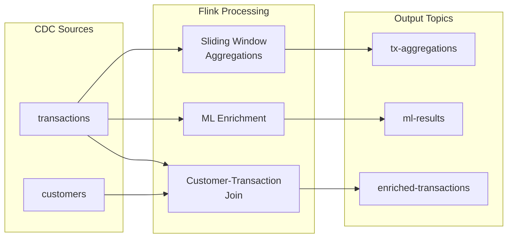

# Flink SQL Processing

## Pipeline Overview



## Debezium message decoding

When CDC Debezium v2 connector is configured, it will define the topics and the key and value schemas in schema registry. 

To get the full Debezium envelope, the connector was set with the following option: 
```sh
 "after.state.only"  = "false"  
```

The key schema looks like:
```json
{
  "connect.name": "card-tx.public.transactions.Key",
  "fields": [
    {
      "name": "txn_id",
      "type": "string"
    }
  ],
  "name": "Key",
  "namespace": "card-tx.public.transactions",
  "type": "record"
}
```

and values has []`source`,`before`,`after`] element definitions:

```json
{
  "connect.name": "card-tx.public.transactions.Envelope",
  "connect.version": 1,
  "fields": [
    {
      "default": null,
      "name": "before",
      "type": [
        "null",
        {
          "connect.name": "card-tx.public.transactions.Value",
          "fields": [
            {
              "name": "txn_id",
              "type": "string"
            },
            {
              "name": "account_number",
              "type": "string"
            },
            ...
     {
      "default": null,
      "name": "after",
      "type": [
        "null",
        "Value"
      ]
    },
    {
      "name": "source",
      "type": {
        "connect.name": "io.debezium.connector.v2.postgresql.Source",
        "fields": [
          {
            "name": "version",
            "type": "string"
          },
          ...
```

Once deployed, the messages in the topic have the `after` and `before` in the envelop:


### Table analysis

* Analysing the messages with the following query, we get a nice table view of the records. No envelop.
    ```sql
    SELECT * FROM `card-tx.public.customers` LIMIT 10;
    ```

    The reason is that by default the Flink materialized table on top of the topic has the [`'value.format' = 'avro-debezium-registry'`](https://docs.confluent.io/cloud/current/flink/reference/statements/create-table.html#value-format) (result of the `show create table `card-tx.public.customers`) :
    ```sql
    WITH (
        'changelog.mode' = 'retract',
        'connector' = 'confluent',
        'kafka.cleanup-policy' = 'delete',
        'kafka.compaction.time' = '0 ms',
        'kafka.max-message-size' = '8 mb',
        'kafka.retention.size' = '0 bytes',
        'kafka.retention.time' = '7 d',
        'key.format' = 'avro-registry',
        'scan.bounded.mode' = 'unbounded',
        'scan.startup.mode' = 'earliest-offset',
        'value.fields-include' = 'all',
        'value.format' = 'avro-debezium-registry'
        )
    ```

    Changing the table with the following command will get a table view with Debezium format
    ```sql
    ALTER TABLE `card-tx.public.customers` SET ('value.format' = 'avro-registry');
    ```

    

    The data type for before and after is Object. Example for the before column of the customer table:

    ```sql
    `before` ROW<`account_number` VARCHAR(2147483647) NOT NULL, `customer_name` VARCHAR(2147483647) NOT NULL, `email` VARCHAR(2147483647), `phone_number` VARCHAR(2147483647), `date_of_birth` TIMESTAMP(3) WITH LOCAL TIME ZONE, `city` VARCHAR(2147483647), `created_at` VARCHAR(2147483647)>,
  
    ```

* When update is desired, the changelog mode of the table is set to `retract`. `retract` mode only works if Debezium contains before messages. 

* If a primary key is present and retract mode is not an option, use upsert mode.
    ```sql
    ALTER TABLE `card-tx.public.transaction` ADD (PRIMARY KEY (txn_id) NOT ENFORCED);
    ALTER TABLE `card-tx.public.transaction` SET ('changelog.mode' = 'upsert');
    ```

### Working with envelop

The usecase to demonstrate is how to extract data from the after or before envelop depending of the operation type.
* The customers table is set with `avro-registry` for the value.format
* For the records loaded the first time into the topic the `op = r`. Once the connector is running, we can add a new customer 
* In Flink Workspace run: `select * from `card-tx.public.customers`;`
* Add a customer with the data-generator tool
    ```sh
     uv run generate_test_data.py --db-host card-tx-dbXXXXXXX.cnXXXXX.us-west-2.rds.amazonaws.com  --db-name cardtxdb --db-user postgres   --db-password ZutAlors123! --add-customer
    ```

    We can see a new record aith the `op=c`

* Delete one of the existing customer: (the demo script also deletes existing transactions to avoid postgres foreign key violation - this is okay in the context of a demo)
    ```sh
    uv run generate_test_data.py --db-host card-tx-dbXXXXXXX.cnXXXXX.us-west-2.rds.amazonaws.com  --db-name cardtxdb --db-user postgres   --db-password ZutAlors123! --delete-customer ACC000006
    ```

    Looking at the records in the table we can see now a new customer added, and a `op=d` for a previously created customer, with after field in the envelop with the account_number with NULL other field.  

    


* At this stage we have 3 use cases: records loaded from the source table snapshot, new record added while the debezium connector is running, and delete an existing record.

* Extracting the payload using SQL
    ```sql
    ```


## Sliding Window Aggregations

The demo implements multiple window sizes for transaction analysis:

| Window Type | Size | Slide | Use Case |
|-------------|------|-------|----------|
| 1_MINUTE | 1 min | 30 sec | Real-time fraud detection |
| 15_MINUTE | 15 min | 5 min | Short-term spending patterns |
| 1_HOUR | 1 hour | 15 min | Hourly spending limits |
| 1_DAY | 1 day | N/A (tumbling) | Daily transaction summaries |
