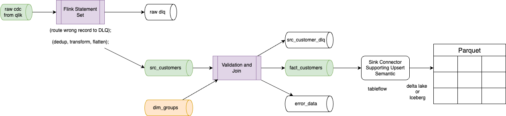
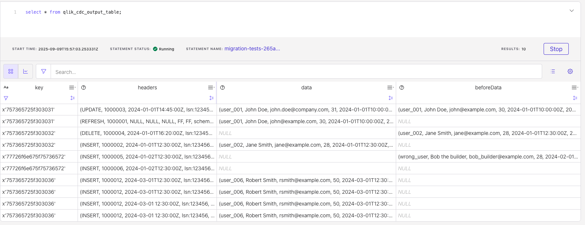
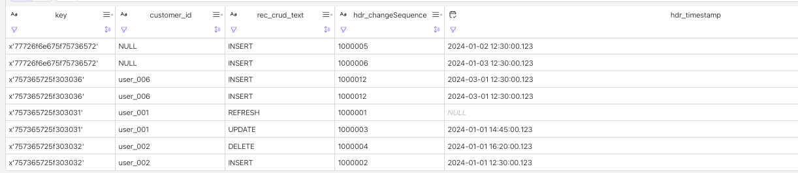
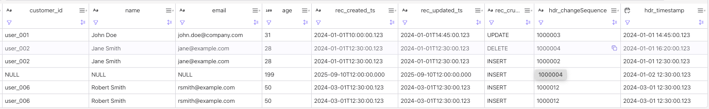
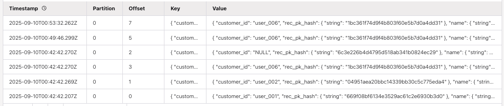

# A simple PoC to emulate CDC processing


The goal of this demonstration is to process Qlik CDC records, and implement the following pipeline:



1. The raw input topic is the outcome of the Qlik CDC with key, data, beforeData, and headers envelop
1. The First Flink queries are filtering out, rejecting records in errors, process deduplication, and perform data extraction to flatten the data model. This statement creates the source table: `src_customers`  . The goal is to fail fast, capture everything, and provide actionable information for debugging and recovery.
1. The Second Flink queries are also applying some business logic to reject some src records, and apply other validation and joining with other sources or dimensions. The goal is to create a dimension table to be consumed by other Flink statements to build a star model or going directly to a sink kafka connector that supports upsert semantic and write to a target format.
1. The target format could be a parquet file with DeltaLake or Iceberg metadata.

## Context

In log-based CDC, when a new transaction comes into a database, it gets logged into a log file with no impact on the source system.  

The qlik_cdc_output_table represents the output of Qlik CDC output as raw topic in kafka. The envelop and metadata are important.

When using CDC connectors to Kafka, most of them, are creating schema into the schema registry with an envelop to track the data before and after. 

The Qlix CDC data structure is described in this document: [https://help.qlik.com/en-US/replicate/November2024/pdf/Replicate-Setup-and-User-Guide.pdf](https://help.qlik.com/en-US/replicate/November2024/pdf/Replicate-Setup-and-User-Guide.pdf), for this PoC we will use key, headers, data, beforeData envelop.

The data and beforeData schemas follow the source table schema. In this example it will be:

```sql
id STRING,
name STRING,
email STRING,
age INT,
created_at STRING,
updated_at STRING,
group_id STRING
```

The headers.operation can take the following values: REFRESH, INSERT, UPDATE, DELETE

## Setup

In Confluent Cloud for Flink, create the `qlik_cdc_output_table` to mockup Qlik CDC output:

* Open a workspace into your development environment. You need to have at least DataDiscovery and FlinkDeveloper roles. It may be needed to have OrganizationAdmin.

* In `raw_topic_for_tests` folder, execute the `ddl.cdc_raw_table.sql`, by copy paste inside the Wordspace (or use makefile see below). It should result to get a table, a kafka topic and two schemas in the schema registry as illustrated by (`show create table qlik_cdc_output_table`)
    ```sql
    CREATE TABLE qlik_cdc_output_table (
    `key` VARBINARY(2147483647),
        `headers` ROW<`operation` VARCHAR(2147483647), `changeSequence` VARCHAR(2147483647), `timestamp` VARCHAR(2147483647), `streamPosition` VARCHAR(2147483647), `transactionId` VARCHAR(2147483647), `changeMask` VARCHAR(2147483647), `columnMask` VARCHAR(2147483647), `externalSchemaId` VARCHAR(2147483647), `transactionEventCounter` BIGINT, `transactionLastEvent` BOOLEAN>,
    `data` ROW<`id` VARCHAR(2147483647), `name` VARCHAR(2147483647), `email` VARCHAR(2147483647), `age` INT, `created_at` VARCHAR(2147483647), `updated_at` VARCHAR(2147483647), `group_id` VARCHAR(2147483647)>,
    `beforeData` ROW<`id` VARCHAR(2147483647), `name` VARCHAR(2147483647), `email` VARCHAR(2147483647), `age` INT, `created_at` VARCHAR(2147483647), `updated_at` VARCHAR(2147483647), `group_id` VARCHAR(2147483647)>
    )
    DISTRIBUTED BY HASH(`key`) INTO 1 BUCKETS
    WITH (
    'changelog.mode' = 'append',
    ```

    It is important to note the table does not define any primary key, which is the normal behavior with CDC.

    it is also possible to use the Makefile under the `raw_topic_for_tests` folder to create the table and insert test records using Confluent Cloud cli:
    ```sh
    make create_raw_table
    make insert_raw_data
    ```

* Insert first sample data in this raw table for testing: There will be duplicate and one record being wrong: `insert_raw_test_data.sql` from `raw_topic_for_tests`  folder

| operation | beforeData | Data | Comment |
| --- | --- | --- | --- |
| REFRESH | N/A | 'user_001', 'John Doe', 'john@example.com', 30, '2024-01-01T10:00:00Z' | Loaded from DB snapshot, it represents insert of a record during Full Load stage|
| INSERT |  N/A  | 'user_002', 'Jane Smith', 'jane@example.com', 28, '2024-01-01T12:30:00Z' | data will be used|
| UPDATE | 'user_001', 'John Doe', 'john@example.com', 30, '2024-01-01T10:00:00Z' |'user_001', 'John Doe', 'john.doe@company.com', 31, '2024-01-01T10:00:00Z' |  data will be used|
| INSERT |  N/A | 'wrong_user', 'Bob the builder', 'bob_builder@example.com', 28, '2024-02-01T12:30:00Z'| For testing DLQ |
| DELETE | 'user_002', 'Jane Smith', 'jane@example.com', 28, '2024-01-01T12:30:00Z'| N/A | beforeData may be used|


Here is the reported table content (with some duplicates to test dedup processing):



## Pipeline end-to-end logic

The requirements to support and demonstrate are:

* Process raw_data coming from CDC ingestion layer
* Check for NULLs for primary keys and null in Not-Null columns
* Remove Duplicate records
* Join with a reference table
* Propagate DELETE to sink
* Integrate with S3 Sink Kafka connector to S3 bucket on AWS

## First Statement: Filter, transform, route first level of error, deduplicate

We want to:

* extract data from the good path (data, beforeData) depending of the source database operation (INSERT, UPDATE, DELETE, REFRESH)
* de-duplicate records with the same key, same operation taking the last records
* Filter out unnecessary records
* Route to error table any records we may have identified in error

### Working on the transformation

The approach is to use the Confluent Cloud Console, and Flink workspace environment to build the sql per steps:
1. Validate the input data: `select * from qlik_cdc_output_table limit 100;`
1. Write the SQL to extract information from the CDC record using the operation: The logic is to extract the `data` or `beforeData` to a new schema with some reformatted metadata depending of the operation type:

| operation | Which field to use |
| --- | --- |
| insert | data |
| update | data |
| delete | beforeData |

* The classical approach is to use condition on the headers.operation like:
    ```sql
    select
    key,
    coalesce(if(headers.operation in ('DELETE'), beforeData.id, data.id), 'NULL') as customer_id,
    headers.operation as rec_crud_text,
    headers.changeSequence as hdr_changeSequence,
    to_timestamp(headers.`timestamp`, 'yyyy-MM-dd''T''HH:mm:ss.SSS') as hdr_timestamp
    from qlik_cdc_output_table;
    ```

    This should return:

    


    We can now complete data extraction with other coalesce and if functions:
    ```sql
    coalesce(if(headers.operation in ('DELETE'), beforeData.name, data.name), 'NULL') as name,
    coalesce(if(headers.operation in ('DELETE'), beforeData.email, data.email), 'NULL') as email,
    coalesce(if(headers.operation in ('DELETE'), beforeData.age, data.age), 199) as age,
    coalesce(if(headers.operation in ('DELETE'), beforeData.created_at, data.created_at), '2025-09-10T12:00:00.000') as rec_created_ts,
    coalesce(if(headers.operation in ('DELETE'), beforeData.updated_at, data.updated_at), '2025-09-10T12:00:00.000') as rec_updated_ts,
    ```

* As the target is to get a src_customers table, a new ddl is needed, which can be executed in a workspace cell, or using make
    ```sql
    create table src_customers(
        customer_id string,
        rec_pk_hash string,
        name string,
        email string,
        age int,
        rec_created_ts timestamp_ltz,
        rec_updated_ts timestamp_ltz,
        rec_crud_text string,
        hdr_changeSequence string,
        hdr_timestamp string,
        primary key(customer_id) not enforced
    ) distributed by hash(customer_id) into 1 buckets with (
        'changelog.mode' = 'upsert'
    );
    ```

    Under the customers/src_customers folder run:
    ```sh
    make create_flink_ddl
    ```


### Example of filtering records

As an example to filter out some records that has some null value. The approach is to add a CTE, named `relevant_records` to filter out those records, and to wrap the transformation logic into another CTE, named `extracted_data`

```sql
with relevant_records as (
-- demonstrate data filtering with CTE: verify data and beforeData are at least present
select
  *
  from qlik_cdc_output_table  where not (data is null and beforeData is null)
),
-- transformation of the data
extracted_data as (
select
  key,
  coalesce(if(headers.operation in ('DELETE'), beforeData.id, data.id), 'NULL') as customer_id,
  coalesce(if(headers.operation in ('DELETE'), beforeData.name, data.name), 'NULL') as name,
  coalesce(if(headers.operation in ('DELETE'), beforeData.email, data.email), 'NULL') as email,
  coalesce(if(headers.operation in ('DELETE'), beforeData.age, data.age), 199) as age,
  coalesce(if(headers.operation in ('DELETE'), beforeData.created_at, data.created_at), '2025-09-10T12:00:00.000') as rec_created_ts,
  coalesce(if(headers.operation in ('DELETE'), beforeData.updated_at, data.updated_at), '2025-09-10T12:00:00.000') as rec_updated_ts,
  headers.operation as rec_crud_text,
  headers.changeSequence as hdr_changeSequence,
  to_timestamp(headers.`timestamp`, 'yyyy-MM-dd''T''HH:mm:ss.SSS') as hdr_timestamp
from relevant_records)
select * from extracted_data;
```

The results look like:




### Deduplication

The src_customers table changelog.mode is set to 'upsert', this means that Flink will keep the last message per key, and generates two records to the downstream topic when a new record for a given key arrives. This is noted -U, +U, to stipulate to retract previous value and replace with new one. The figure below illustrates that the last record for user_006 is in the table.


Looking at the records in the topic, we can see there are multiple records, as flink created those records while they arrived




* Deduplicate records
    ```sql
    select *  from (
        select *,  ROW_NUMBER() OVER (
                PARTITION BY customer_id, operation, changeSequence
                ORDER
                    BY ts DESC
                ) AS row_num from extracted_data
    ) where row_num = 1;
    ```

* Create a src_customers (see file ddl.src_customers.sql)
* Putting the selection together

---

### Grouping error and main processing to create src_customers

In Flink, when we need to have two outputs: the src_customers and the raw data DLQ,  we can use a statement set:

```sql
execute statement set
begin
insert into raw_error_table ....;

insert into src_customers .... ;
end;
```


* verify if data.id or beforeData.id were not null, if not route to a dead letter queue table.

    * create raw_error_table
    * user statement set to generate output to two tables

    ```sql
    select * from qlik_cdc_output_table where (data is null and headers.operation <> 'DELETE') or (data is not null and data.id is null);
    ```


### Logic to route to error table/queue

* Create a raw_error_table to be generic enough to get any type of data:
    ```sql
    create table raw_error_table(
        key bytes,
        headers bytes,
        data bytes,
        beforeData bytes

    ) distributed by hash(key) into 1 buckets with (
        'changelog.mode' = 'append',

    );
    ```

    - Uses `BYTES` columns for data payload storage
    - No need to modify error table when source schemas change
    - Single error table can handle multiple source tables
    - Future-proof against schema evolution
    - Preserves the original `key`, `headers` (structured), and raw `data`/`beforeData` (bytes)
    - Enables potential reprocessing of failed messages after fixing issues

* A basic logic could be by looking at the presence of data with specific operation type:
    ```sql
    insert into `raw_error_table` 
    select * from qlik_cdc_output_table where (data is null and headers.operation <> 'DELETE') or (data is not null and data.id is null);
    ```

This can be enhanced by adding new condition like on the headers null


## Business validation

This time we can filter records with some NULL value in important columns, and malformed emails.


## Sink to S3

Most of S3 Sink connectors do not support upserts and deletes as a JDBC to a database sink connectors do. The connector reads messages from Kafka topics and writes them as objects (files) to an S3 bucket, new data is appended or new objects are created. It may partition data in S3 based on Kafka topic, partition.

To achieve an "upsert" effect, you typically need a downstream process that consumes the data from S3, identifies records with the same key, and applies the latest version.

Apache Iceberg may be used to define tables with primary keys and use SQL or other query languages to merge or update data based on the S3 files.

Within Confluent Cloud the fully-managed Amazon S3 Sink connector periodically polls data from Kafka and in turn uploads it to S3. If you are not using a dedicated Confluent Cloud cluster, the flush size is 1000 records. Files start to be created in storage after more than 1000 records exist in each partition. The key and Kafka header can be saved as metadata.

[Confluent Cloud S3 Sink connector documentation](https://docs.confluent.io/cloud/current/connectors/cc-s3-sink/cc-s3-sink.html), and the [Build an ETL Pipeline With Confluent Cloud, example](https://docs.confluent.io/cloud/current/get-started/tutorials/cloud-etl.html).

### Supporting Delete

Similar to upserts, direct deletion of specific records within an S3 object is not a native function of the S3 Sink Connector. If you need to represent deletes, you can send "tombstone" messages (e.g., a record with a null value for a key) to Kafka, a downstream process consuming from S3 would then need to interpret these tombstone records and remove corresponding data in a target system.