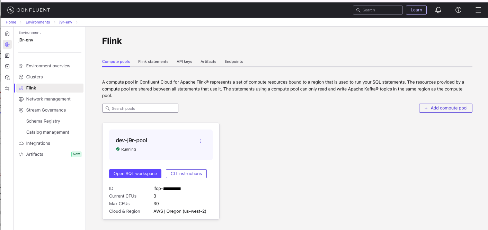

# Real-time Qlik CDC Data Processing with Apache Flink

## Overview

This demonstration showcases an approach to processing Change Data Capture (CDC) records from Qlik Replicate using Apache Flink. Change Data Capture is a critical pattern in modern data architectures that enables real-time data synchronization by capturing and streaming database changes as they occur

We assume the reader to have basic knowledge of Confluent Cloud environment, Kafka, Schema Registry. For [Flink SQL introduction](https://developer.confluent.io/courses/apache-flink/intro/ ) and tutorial [follow these videos](https://developer.confluent.io/courses/flink-sql/overview/).

## Business Problem

Organizations often struggle with processing raw CDC streams that contain:
- **Duplicate records** from network retries and CDC tool behavior
- **Invalid or malformed data** that can break downstream pipelines 
- **Complex nested structures** requiring transformation for analytics consumption
- **Mixed operation types** (REFRESH, INSERT, UPDATE, DELETE) that may need different handling logic, one being to propagate soft delete

## Solution Architecture

This proof-of-concept demonstrates a robust pipeline that transforms raw Qlik CDC output into clean, analytics-ready data streams. The solution implements:


### Pipeline Stages

1. **Raw CDC Ingestion**: Processing Qlik CDC output containing key, data, beforeData, and headers envelope structure
2. **Data Quality & Deduplication**: First-stage Flink processing that filters invalid records, removes duplicates, and extracts data to create the `src_customers` table with proper error handling and observability
3. **Business Logic & Validation**: Second-stage processing applying business rules, additional validation, and joining with reference data to create analytics-ready dimension tables
4. **Sink Integration**: Output to various formats including Parquet with Apache Iceberg metadata for downstream analytics consumption. If you’re not familiar with Apache Iceberg, you can learn about it [here](https://iceberg.apache.org/spark-quickstart/). It’s an open table format that has wide support among many compute engines, including Trino, Snowflake, and Databricks.

### Key Features

- **Fail-fast error handling** with dedicated dead letter queues
- **Exactly-once processing** with Flink's upsert semantics  
- **Schema evolution support** using flexible error table design
- **Production observability** with comprehensive logging and monitoring
- **Scalable architecture** supporting high-throughput CDC streams

## Context

In log-based CDC, when a new transaction comes into a database, it gets logged into a log file with no impact on the source system.  

The `qlik_cdc_output_table` represents the output of Qlik CDC output as raw topic in kafka. The envelop and metadata are important.

Most CDC connectors to Kafka, are creating schema into the schema registry with an envelop to track the data before and after. 

The Qlix CDC data structure is described in this document: [https://help.qlik.com/en-US/replicate/November2024/pdf/Replicate-Setup-and-User-Guide.pdf](https://help.qlik.com/en-US/replicate/November2024/pdf/Replicate-Setup-and-User-Guide.pdf), for this PoC we will use key, headers, data, beforeData envelop.

The `data` and `beforeData` schemas follow the source table schema. In this example it will be:

```sql
id STRING,
name STRING,
email STRING,
age INT,
created_at STRING,
updated_at STRING,
group_id STRING
```

The `headers.operation` may take the following values: REFRESH, INSERT, UPDATE, DELETE

## Setup

* We can use the Confluent Cloud for Flink console to write Flink SQL: Once logged to the [Confluent Cloud](https://confluent.cloud/environments), go to Environment > Flink
    

* You need to have at least RBAC DataDiscovery and FlinkDeveloper roles, and OrganizationAdmin to create new compute pool.

* We may also use the SQL Client to write SQL scripts:
    ```sh
    confluent login 
    confluent flink shell --compute-pool lfcp-XXXX --environment env-nXXXXX
    # Once in the shell use your environment
    use j9r-env;
    # Then your database which is a the kafka cluster env
    use `j9r-kafka`;
    # See the tables / topics
    show tables;
    # you are ready to work on tables....
    ```

* "Flink SQL Workspace"    
    * Open a `Flink SQL Workspace` from one of the compute pool you use for development. 
    * Create the `qlik_cdc_output_table` to mockup Qlik CDC output:

* In `raw_topic_for_tests` folder, execute the `ddl.cdc_raw_table.sql`, by copy/paste inside the Workspace (or use the Makefile in this folder see below). It should result in a kafka topic created in the Cluster and two schemas in the schema registry as illustrated by running `show create table qlik_cdc_output_table;`:

    ```sql
    CREATE TABLE qlik_cdc_output_table (
    `key` VARBINARY(2147483647),
        `headers` ROW<`operation` VARCHAR(2147483647), `changeSequence` VARCHAR(2147483647), `timestamp` VARCHAR(2147483647), `streamPosition` VARCHAR(2147483647), `transactionId` VARCHAR(2147483647), `changeMask` VARCHAR(2147483647), `columnMask` VARCHAR(2147483647), `externalSchemaId` VARCHAR(2147483647), `transactionEventCounter` BIGINT, `transactionLastEvent` BOOLEAN>,
    `data` ROW<`id` VARCHAR(2147483647), `name` VARCHAR(2147483647), `email` VARCHAR(2147483647), `age` INT, `created_at` VARCHAR(2147483647), `updated_at` VARCHAR(2147483647), `group_id` VARCHAR(2147483647)>,
    `beforeData` ROW<`id` VARCHAR(2147483647), `name` VARCHAR(2147483647), `email` VARCHAR(2147483647), `age` INT, `created_at` VARCHAR(2147483647), `updated_at` VARCHAR(2147483647), `group_id` VARCHAR(2147483647)>
    )
    DISTRIBUTED BY HASH(`key`) INTO 1 BUCKETS
    WITH (
    'changelog.mode' = 'append',
    ```

    It is important to note the table does not define any primary key, which is the normal behavior with CDC. Below is an exampe of output using the Shell:

    


* Using a makefile to encapsulate confluent cli to deploy Flink statement: it is also possible to use the Makefile under the `raw_topic_for_tests` folder to create the table and insert test records using Confluent Cloud cli:
    ```sh
    make create_raw_table
    make insert_raw_data
    ```

* Insert a set of sample data in this raw table: There will be duplicates and one record being wrong: See the `insert_raw_test_data.sql` script from the `raw_topic_for_tests` folder

| operation | beforeData | Data | Comment |
| --- | --- | --- | --- |
| REFRESH | N/A | 'user_001', 'John Doe', 'john@example.com', 30, '2024-01-01T10:00:00Z' | Loaded from DB snapshot, it represents insert of a record during Full Load stage|
| INSERT |  N/A  | 'user_002', 'Jane Smith', 'jane@example.com', 28, '2024-01-01T12:30:00Z' | data will be used|
| UPDATE | 'user_001', 'John Doe', 'john@example.com', 30, '2024-01-01T10:00:00Z' |'user_001', 'John Doe', 'john.doe@company.com', 31, '2024-01-01T10:00:00Z' |  data will be used|
| INSERT |  N/A | 'wrong_user', 'Bob the builder', 'bob_builder@example.com', 28, '2024-02-01T12:30:00Z'| For testing DLQ |
| DELETE | 'user_002', 'Jane Smith', 'jane@example.com', 28, '2024-01-01T12:30:00Z'| N/A | beforeData may be used|


Here is the reported table content (with some duplicates to test dedup processing):


## Pipeline end-to-end logic

The requirements to support and demonstrate are:

* Process raw_data coming from CDC ingestion layer
* Check for NULLs for primary keys and null in Not-Null columns
* Remove Duplicate records
* Join with a reference table
* Propagate DELETE to sink
* Integrate with S3 Sink Kafka connector to S3 bucket on AWS

## First Statement: Filter, transform, route first level of error, deduplicate

We want to:

* extract data from the good path (data, beforeData) depending of the source database operation (INSERT, UPDATE, DELETE, REFRESH)
* de-duplicate records with the same key, same operation taking the last records
* Filter out unnecessary records
* Route to error table any records we may have identified in error


### Working on the transformation

1. Validate the input data: `select * from qlik_cdc_output_table limit 100;`
1. Write the SQL to extract information from the CDC record using the `headers.operation`: The logic is to extract the `data` or `beforeData` to a new schema with some reformatted metadata depending of the operation type:

| operation | Which field to use |
| --- | --- |
| refresh | data |
| insert | data |
| update | data |
| delete | beforeData |

* The classical approach is to use condition on the `headers.operation` like:
    ```sql
    select
    key,
    coalesce(if(headers.operation in ('DELETE'), beforeData.id, data.id), 'NULL') as customer_id,
    headers.operation as rec_crud_text,
    headers.changeSequence as hdr_changeSequence,
    to_timestamp(headers.`timestamp`, 'yyyy-MM-dd''T''HH:mm:ss.SSS') as hdr_timestamp
    from qlik_cdc_output_table;
    ```

    This should return:

    


    We can now complete data extraction with other coalesce and if functions:
    ```sql
    coalesce(if(headers.operation in ('DELETE'), beforeData.name, data.name), 'NULL') as name,
    coalesce(if(headers.operation in ('DELETE'), beforeData.email, data.email), 'NULL') as email,
    coalesce(if(headers.operation in ('DELETE'), beforeData.age, data.age), 199) as age,
    coalesce(if(headers.operation in ('DELETE'), beforeData.created_at, data.created_at), '2025-09-10T12:00:00.000') as rec_created_ts,
    coalesce(if(headers.operation in ('DELETE'), beforeData.updated_at, data.updated_at), '2025-09-10T12:00:00.000') as rec_updated_ts,
    ```

* As the target is to get a `src_customers` table, a new ddl is needed, which can be executed in a workspace cell, or using the makefile
    ```sql
    create table src_customers(
        customer_id string,
        rec_pk_hash string,
        name string,
        email string,
        age int,
        rec_created_ts timestamp_ltz,
        rec_updated_ts timestamp_ltz,
        rec_crud_text string,
        hdr_changeSequence string,
        hdr_timestamp string,
        primary key(customer_id) not enforced
    ) distributed by hash(customer_id) into 1 buckets with (
        'changelog.mode' = 'upsert'
    );
    ```

    Under the customers/src_customers folder run:
    ```sh
    make create_flink_ddl
    ```

* Transform the query from running in interactive mode: writing the result on the user interfacce. to writing results to the new table: see the `dml.src_customers_no_dedup,sql`
    ```sql
    insert into src_customers
    with extracted_data as (
            select
                ...
    select -- last projection to reduce columns
        customer_id,
        MD5(CONCAT_WS('||', customer_id)) AS rec_pk_hash,
        name,
        email,
        age,
        to_timestamp(rec_created_ts, 'yyyy-MM-dd''T''HH:mm:ss.SSS') as rec_created_ts,
        to_timestamp(rec_updated_ts, 'yyyy-MM-dd''T''HH:mm:ss.SSS') as rec_updated_ts,
        rec_crud_text,
        hdr_changeSequence,
        hdr_timestamp,
        group_id
    from extracted_data;
    ```

    Deploy to Confluent Cloud:

    ```sh
    make create_cutomers_no_dedup
    ```

Now that the data are inside of a new topic we can see messages using Topic messages user interface or `select * from src_customers`.

### Example of filtering records

As an example to filter out some records that has some null value. The approach is to add a CTE, named `relevant_records` to filter out those records, and to wrap the transformation logic into another CTE, named `extracted_data`

```sql
with relevant_records as (
-- demonstrate data filtering with CTE: verify data and beforeData are at least present
select
  *
  from qlik_cdc_output_table  where not (data is null and beforeData is null)
),
-- transformation of the data
extracted_data as (
select
  key,
  coalesce(if(headers.operation in ('DELETE'), beforeData.id, data.id), 'NULL') as customer_id,
  coalesce(if(headers.operation in ('DELETE'), beforeData.name, data.name), 'NULL') as name,
  coalesce(if(headers.operation in ('DELETE'), beforeData.email, data.email), 'NULL') as email,
  coalesce(if(headers.operation in ('DELETE'), beforeData.age, data.age), 199) as age,
  coalesce(if(headers.operation in ('DELETE'), beforeData.created_at, data.created_at), '2025-09-10T12:00:00.000') as rec_created_ts,
  coalesce(if(headers.operation in ('DELETE'), beforeData.updated_at, data.updated_at), '2025-09-10T12:00:00.000') as rec_updated_ts,
  headers.operation as rec_crud_text,  -- keep the operation for soft delete processing downstream
  headers.changeSequence as hdr_changeSequence,
  to_timestamp(headers.`timestamp`, 'yyyy-MM-dd''T''HH:mm:ss.SSS') as hdr_timestamp
from relevant_records)
select * from extracted_data;
```

The results look like:


### Deduplication

The `src_customers` table has a `changelog.mode` set to 'upsert', this means that Flink will keep the last message per key, and generates two records to the downstream topic when a new record for a given key arrives. [See this study on changelog mode](../../code/flink-sql/05-changelog/) This is noted -U, +U, to stipulate to retract previous value and replace with new one. The figure below illustrates that the last record for user_006 is in the table.


Looking at the records in the topic, we can see there are multiple records, as flink created those records while they arrived


* Deduplicate records
    ```sql
    select *  from (
        select *,  ROW_NUMBER() OVER (
                PARTITION BY customer_id, operation, changeSequence
                ORDER
                    BY ts DESC
                ) AS row_num from extracted_data
    ) where row_num = 1;
    ```

* Create a src_customers (see file ddl.src_customers.sql)
* Putting the selection together

---

### Grouping error and main processing to create src_customers

In Flink, when we need to have two outputs: the src_customers and the raw data DLQ,  we can use a statement set:

```sql
execute statement set
begin
insert into raw_error_table ....;

insert into src_customers .... ;
end;
```

### Logic to route to error table/queue

* To route to the DLQ, we can verify if data.id or beforeData.id were not null, if there are issues, route to a dead letter queue table.


* Create a raw_error_table to be generic enough to get any type of data:
    ```sql
    create table raw_error_table(
        key bytes,
        headers bytes,
        data bytes,
        beforeData bytes

    ) distributed by hash(key) into 1 buckets with (
        'changelog.mode' = 'append',

    );
    ```

    - Uses `BYTES` columns for data payload storage
    - No need to modify error table when source schemas change
    - Single error table can handle multiple source tables
    - Future-proof against schema evolution
    - Preserves the original `key`, `headers` (structured), and raw `data`/`beforeData` (bytes)
    - Enables potential reprocessing of failed messages after fixing issues

* A basic logic could be by looking at the presence of data with specific operation type:
    ```sql
    insert into `raw_error_table` 
    select * from qlik_cdc_output_table where (data is null and headers.operation <> 'DELETE') or (data is not null and data.id is null);
    ```

This can be enhanced by adding new condition like on the headers null

## Business validation

This time we can filter records with some NULL value in important columns, and address more business rule type of valiation, like malformed emails.

This logic is implemented in the Fact customer table, see code in the customers/fact_customers folder.

## Sink to S3

Most of S3 Sink connectors do not support upserts and deletes as a JDBC to a database sink connectors do. The connector reads messages from Kafka topics and writes them as objects (files) to an S3 bucket, new data is appended or new objects are created. It may partition data in S3 based on Kafka topic, partition.

To achieve an "upsert" effect, you typically need a downstream process that consumes the data from S3, identifies records with the same key, and applies the latest version.

Apache Iceberg may be used to define tables with primary keys and use SQL or other query languages to merge or update data based on the S3 files.

Within Confluent Cloud the fully-managed Amazon S3 Sink connector periodically polls data from Kafka and in turn uploads it to S3. If you are not using a dedicated Confluent Cloud cluster, the flush size is 1000 records. Files start to be created in storage after more than 1000 records exist in each partition. The key and Kafka header can be saved as metadata.

Here is an example of topic mapped to S3 bucket


[Confluent Cloud S3 Sink connector documentation](https://docs.confluent.io/cloud/current/connectors/cc-s3-sink/cc-s3-sink.html), and the [Build an ETL Pipeline With Confluent Cloud, example](https://docs.confluent.io/cloud/current/get-started/tutorials/cloud-etl.html).

### Supporting Delete

Similar to upserts, direct deletion of specific records within an S3 object is not a native function of the S3 Sink Connector. If you need to represent deletes, you can send "tombstone" messages (e.g., a record with a null value for a key) to Kafka, a downstream process consuming from S3 would then need to interpret these tombstone records and remove corresponding data in a target system.