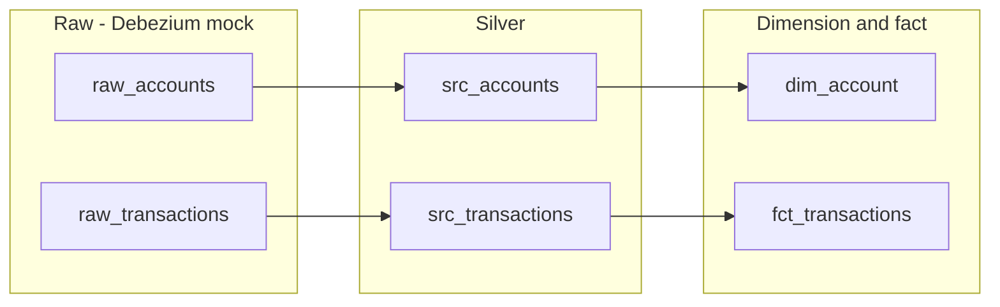

# CDC processing using Flink Table API to prepare dimensions and facts

## Goals

Demonstrates the Flink Table API programming model to prepare a data pipeline from OLTP-like tables. The approach mocks a Debezium envelope as raw sources for **transactions** and **accounts**  in Kafka topics, then builds silver tables, a dimension (**dim_account**), and a fact (**fct_transactions**).

## Pipeline overview

## Debezium envelope (mock)

Raw tables use a Debezium-style envelope:

- **source**: `ROW(ts_ms BIGINT)` – event time in milliseconds
- **before** / **after**: row with business columns (for accounts: account_id, account_name, region, created_at; for transactions: txn_id, account_id, amount, currency, ts, status)
- **op**: `'r'` (read/snapshot), `'c'` (create), `'u'` (update), `'d'` (delete)

Silver DML uses `IF(op = 'd', before.x, after.x)` and `source.ts_ms` for event time.

## Red/Green TDD

Tests are defined first; the pipeline is implemented until they pass.

1. **Red**: Run tests with no pipeline (or only raw tables). Validations fail (dim_account and fct_transactions missing or empty).
2. **Green**: Apply DDL and DML in order (raw → silver → dim_account, raw → silver → fct_transactions). Re-run tests until both validations return PASS.

## Quick start

### Prerequisites

- Confluent Cloud environment with Flink compute pool and Kafka cluster (or equivalent), or local Kafka + Flink with schema registry as needed.
- Confluent CLI for deploying Flink statements (optional; you can run SQL in the Flink SQL workspace).

### Apply pipeline (order matters)

1. **Raw tables**: Run `raw_topic_for_tests/ddl.raw_accounts.sql` and `raw_topic_for_tests/ddl.raw_transactions.sql`.
2. **Silver**: Run `sources/src_accounts/sql-scripts/ddl.src_accounts.sql`, then `dml.src_accounts.sql`; then `sources/src_transactions/sql-scripts/ddl.src_transactions.sql`, then `dml.src_transactions.sql`.
3. **Dimension**: Run `dimensions/dim_account/sql-scripts/ddl.dim_account.sql`, then `dml.dim_account.sql`.
4. **Fact**: Run `facts/fct_transactions/sql-scripts/ddl.fct_transactions.sql`, then `dml.fct_transactions.sql`.
5. **Test data**: Run `raw_topic_for_tests/insert_raw_accounts_1.sql` and `raw_topic_for_tests/insert_raw_transactions_1.sql`.
6. Wait for processing (e.g. 10–30 seconds), then run the validation SQL under `tests/`.

### Run tests

- Set `FLINK_VALIDATE_CMD` to a command that executes a SQL file (e.g. Confluent Flink statement create with `--sql "$(cat tests/validate_dim_account_1.sql)"`), then run `./run_tests.sh`.
- Or run the validation SQL manually in the Flink SQL workspace:
  - `tests/validate_dim_account_1.sql` – expects one row with `test_result = 'PASS'` for dim_account (acc_001, Acme North Ltd, NORTH).
  - `tests/validate_fct_transactions_1.sql` – expects one row with `test_result = 'PASS'` for fct_transactions (txn_1, txn_2).

### Directory layout

| Area       | Path |
|-----------|------|
| Raw + DDL | `raw_topic_for_tests/ddl.raw_accounts.sql`, `ddl.raw_transactions.sql` |
| Raw data  | `raw_topic_for_tests/insert_raw_accounts_1.sql`, `insert_raw_transactions_1.sql` |
| Silver    | `sources/src_accounts/`, `sources/src_transactions/` |
| Dimension | `dimensions/dim_account/` |
| Fact      | `facts/fct_transactions/` |
| Tests     | `tests/validate_dim_account_1.sql`, `validate_fct_transactions_1.sql`, `run_tests.sh` |
