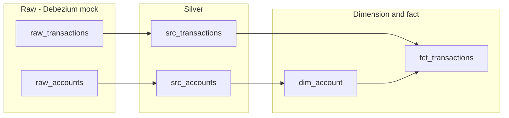
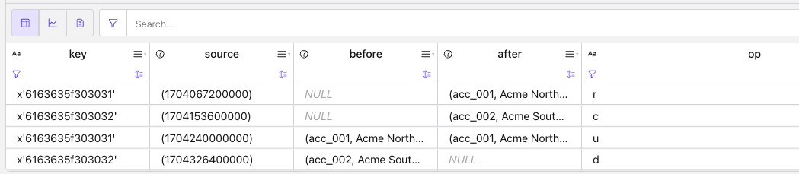
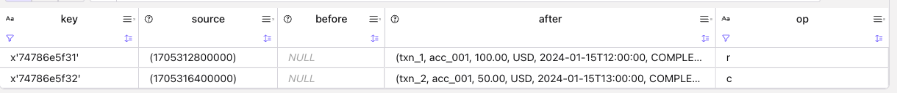
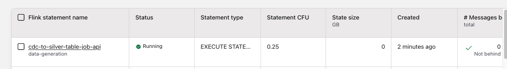
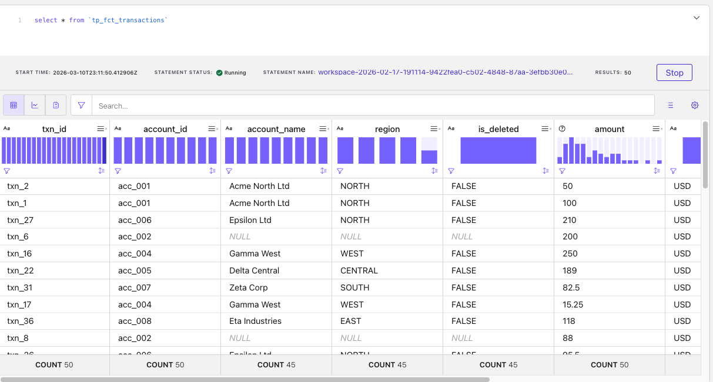

# CDC processing using Flink Table API to prepare dimensions and facts

## Goals

Demonstrates the Flink Table API programming model to prepare a data pipeline from OLTP-like tables to Iceberg Tables. The approach mocks a Debezium envelope as raw sources for **transactions** and **accounts** in Kafka topics, then builds silver tables, a dimension (**dim_account**), and a fact (**fct_transactions**). The pipeline is implemented as a **single Java Table API program** (`java/`) that runs all four flows in one job; SQL DDL/DML in the repo remain as reference and for the SQL-only workflow.

## Pipeline overview



## Debezium envelope (mock)

Raw tables use a Debezium-style envelope:

- **source**: `ROW(ts_ms BIGINT)` – event time in milliseconds
- **before** / **after**: row with business columns (for accounts: account_id, account_name, region, created_at; for transactions: txn_id, account_id, amount, currency, ts, status)
- **op**: `'r'` (read/snapshot), `'c'` (create), `'u'` (update), `'d'` (delete)

Silver DML uses `IF(op = 'd', before.x, after.x)` and `source.ts_ms` for event time.

## Deployment

- **[cccloud/](cccloud/)** – Confluent Cloud Flink.
- **[oss-flink/](oss-flink/)** – OSS Flink / local Kafka + Flink.


## Quick start

### Prerequisites

- Confluent Cloud environment with Flink compute pool and Kafka cluster (or equivalent), or local Kafka + Flink with schema registry as needed.
- For the Java job: Java 17+, Maven; set `FLINK_ENV_NAME` and `FLINK_DATABASE_NAME` (and Confluent credentials) for the target catalog/database. See the [code/table_api/set_confluent_env](../../code/table-api/set_confluent_env)

As of now as the WITH part of each SQL will be different according to the target environment, the Apache Flink and CP Flink are not completed.

### Java Table API job

The pipeline is implemented as a single Flink Table API job in Java. It creates all table DDL and runs the four pipelines (raw → silver → dim/fact) in one StatementSet.

1. **Deploy RAW tables and test data** (Confluent Cloud Flink via REST API). From this demo root, with Confluent env vars set (see below):
   ```sh
   # Under cccloud
   uv sync
   uv run python cc_deploy_raw_data.py
   ```
   Options: `--ddl-only` (tables only), `--insert-only` (inserts only), `--drop-tables` (drop raw_accounts / raw_transactions). Env: `FLINK_API_KEY`, `FLINK_API_SECRET`, `ORGANIZATION_ID`, `ENVIRONMENT_ID`, `COMPUTE_POOL_ID`, `FLINK_BASE_URL` (or `REGION` + `CLOUD`).

   * Raw data for account in Debezium format
   

   * Raw transactions:
   

2. **Build the JAR**: From the demo root, run 
    ```
    # under cdc-tableapi-to-silver
    mvn -f table-api-java package
    ```
    The fat JAR is produced at `table-api-java/target/cdc-tableapi-to-silver-1.0.jar`.
3. **Run the job**: Submit the JAR to your Flink deployment

  * Confluent Cloud: Ensure `FLINK_ENV_NAME` and `FLINK_DATABASE_NAME` are set so the job uses the correct catalog and database.
    ```sh
    java -jar target/cdc-tableapi-to-silver-1.0.jar 
    ```

    In Confluent Console, a new statement should be running:
    

  * Apache Flink:
    ```sh
    flink run target/cdc-tableapi-to-silver-1.0.jar
    ```

    TO BE CONTINUED
  * CP Flink

    TO BE CONTINUED

* Once the jobs are started you should see results in the fact table:

    

4. **Validate**: After the job is running, wait for processing (e.g. 10–30 seconds), then run the validation SQL under `tests/` (see *Run tests* below).
    ```sh
    # Under cccloud
    uv run python cc_run_validate_tests.py
    ```

    Results will look like:
    ```sh
    /statements/validate-fp-dim-accounts
    JSON body: None
    Timeout: 60
    Row 1: ['PASS', '1', '1']
    Test result: PASS

    And 
    statements/validate-fp-fct-transactions
    Timeout: 60
    Row 1: ['PASS', '1', '1']
    Test result: PASS
    ```

5. Clean up
    ```sh
    # Under cccloud
    uv run python cc_clean_all.py
    ```

