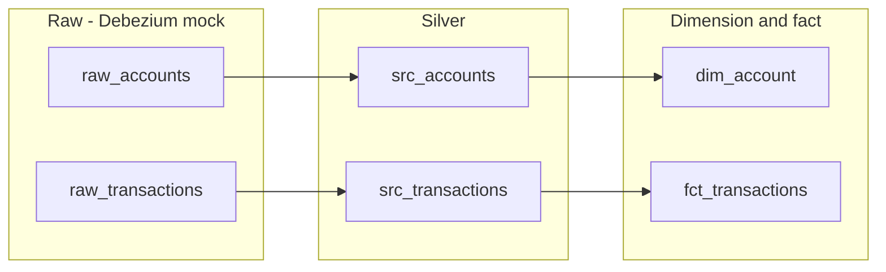

# CDC processing using Flink Table API to prepare dimensions and facts

## Goals

Demonstrates the Flink Table API programming model to prepare a data pipeline from OLTP-like tables. The approach mocks a Debezium envelope as raw sources for **transactions** and **accounts** in Kafka topics, then builds silver tables, a dimension (**dim_account**), and a fact (**fct_transactions**). The pipeline is implemented as a **single Java Table API program** (`java/`) that runs all four flows in one job; SQL DDL/DML in the repo remain as reference and for the SQL-only workflow.

## Pipeline overview

## Debezium envelope (mock)

Raw tables use a Debezium-style envelope:

- **source**: `ROW(ts_ms BIGINT)` – event time in milliseconds
- **before** / **after**: row with business columns (for accounts: account_id, account_name, region, created_at; for transactions: txn_id, account_id, amount, currency, ts, status)
- **op**: `'r'` (read/snapshot), `'c'` (create), `'u'` (update), `'d'` (delete)

Silver DML uses `IF(op = 'd', before.x, after.x)` and `source.ts_ms` for event time.

## Deployment

- **[cccloud/](cccloud/)** – Confluent Cloud Flink.
- **[oss-flink/](oss-flink/)** – OSS Flink / local Kafka + Flink.

Shared: sources/, dimensions/, facts/, raw_topic_for_tests/, run_tests.sh.

## Red/Green TDD

Tests are defined first; the pipeline is implemented until they pass.

1. **Red**: Run tests with no pipeline (or only raw tables). Validations fail (dim_account and fct_transactions missing or empty).
2. **Green**: Apply DDL and DML in order (raw → silver → dim_account, raw → silver → fct_transactions). Re-run tests until both validations return PASS.

## Quick start

### Prerequisites

- Confluent Cloud environment with Flink compute pool and Kafka cluster (or equivalent), or local Kafka + Flink with schema registry as needed.
- For the Java job: Java 17+, Maven; set `FLINK_ENV_NAME` and `FLINK_DATABASE_NAME` (and Confluent credentials) for the target catalog/database.

### Option 1: Java Table API job (recommended)

The pipeline is implemented as a single Flink Table API job in Java. It creates all table DDL and runs the four pipelines (raw → silver → dim/fact) in one StatementSet.

1. **Build the JAR**: From the demo root, run `mvn -f java package`. The fat JAR is produced at `java/target/cdc-tableapi-to-silver-1.0.jar`.
2. **Create raw tables and test data**: Run the raw DDL and insert scripts in the Flink SQL workspace (or via Confluent CLI): `raw_topic_for_tests/ddl.raw_accounts.sql`, `raw_topic_for_tests/ddl.raw_transactions.sql`, then `raw_topic_for_tests/insert_raw_accounts_1.sql` and `raw_topic_for_tests/insert_raw_transactions_1.sql`. The Java job also executes the same raw DDL on startup (CREATE TABLE IF NOT EXISTS), so if the catalog is empty, the job will create the raw table descriptors; you still need to create the underlying Kafka topics and/or insert test data as needed for your environment.
3. **Run the job**: Submit the JAR to your Flink deployment (e.g. Confluent Cloud Flink or `flink run java/target/cdc-tableapi-to-silver-1.0.jar`). Ensure `FLINK_ENV_NAME` and `FLINK_DATABASE_NAME` are set so the job uses the correct catalog and database.
4. **Validate**: After the job is running, wait for processing (e.g. 10–30 seconds), then run the validation SQL under `tests/` (see *Run tests* below).

### Option 2: SQL-only (legacy)

Apply pipeline DDL and DML manually in order:

1. **Raw tables**: Run `raw_topic_for_tests/ddl.raw_accounts.sql` and `raw_topic_for_tests/ddl.raw_transactions.sql`.
2. **Silver**: Run `sources/src_accounts/sql-scripts/ddl.src_accounts.sql`, then `sources/src_accounts/sql-scripts/dml.src_accounts.sql`; then `sources/src_transactions/sql-scripts/ddl.src_transactions.sql`, then `sources/src_transactions/sql-scripts/dml.src_transactions.sql`.
3. **Dimension**: Run `dimensions/dim_account/sql-scripts/ddl.dim_account.sql`, then `dimensions/dim_account/sql-scripts/dml.dim_account.sql`.
4. **Fact**: Run `facts/fct_transactions/sql-scripts/ddl.fct_transactions.sql`, then `facts/fct_transactions/sql-scripts/dml.fct_transactions.sql`.
5. **Test data**: Run `raw_topic_for_tests/insert_raw_accounts_1.sql` and `raw_topic_for_tests/insert_raw_transactions_1.sql`.
6. Wait for processing, then run the validation SQL under `tests/`.

### Run tests

- Set `FLINK_VALIDATE_CMD` to a command that executes a SQL file (e.g. Confluent Flink statement create with `--sql "$(cat tests/validate_dim_account_1.sql)"`), then run `./run_tests.sh`.
- Or run the validation SQL manually in the Flink SQL workspace:
  - `tests/validate_dim_account_1.sql` – expects one row with `test_result = 'PASS'` for dim_account (acc_001, Acme North Ltd, NORTH).
  - `tests/validate_fct_transactions_1.sql` – expects one row with `test_result = 'PASS'` for fct_transactions (txn_1, txn_2).

### Directory layout

| Area       | Path |
|-----------|------|
| Java job   | `java/` – Maven module; main class `flink.studies.e2e.cdc.CdcToSilverTableJob` |
| Raw + DDL | `raw_topic_for_tests/ddl.raw_accounts.sql`, `ddl.raw_transactions.sql` |
| Raw data  | `raw_topic_for_tests/insert_raw_accounts_1.sql`, `insert_raw_transactions_1.sql` |
| Silver    | `sources/src_accounts/`, `sources/src_transactions/` (SQL reference; pipeline logic in Java job) |
| Dimension | `dimensions/dim_account/` (SQL reference; pipeline logic in Java job) |
| Fact      | `facts/fct_transactions/` (SQL reference; pipeline logic in Java job) |
| Tests     | `tests/validate_dim_account_1.sql`, `validate_fct_transactions_1.sql`, `run_tests.sh` |
