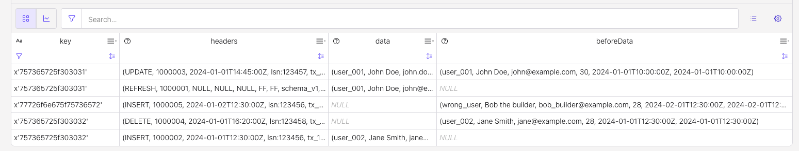
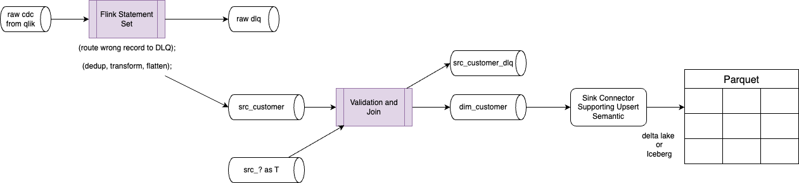

# A simple PoC to emulate CDC processing

The qlik_cdc_output_table represents the output of Qlik CDC output as raw topic in kafka. The envelop and metadata are important.

When using CDC connector to Kafka, most of them are creating schema into the schema registry with an envelop to track the data before and after. 

The Qlix data structure is describe in this document: [https://help.qlik.com/en-US/replicate/November2024/pdf/Replicate-Setup-and-User-Guide.pdf](https://help.qlik.com/en-US/replicate/November2024/pdf/Replicate-Setup-and-User-Guide.pdf)

## Setup

In Confluent Cloud for Flink, create the qlik_cdc_output_table to mockup Qlik CDC output:

* Open a workspace into your development environment
* Execute the `create_raw_table.sql` which should result as (`show create table qlik_cdc_output_table`)
    ```sql
    CREATE TABLE qlik_cdc_output_table (
    `key` VARBINARY(2147483647),
    `headers` ROW<`operation` VARCHAR(2147483647), `changeSequence` VARCHAR(2147483647), `timestamp` VARCHAR(2147483647), `streamPosition` VARCHAR(2147483647), `transactionId` VARCHAR(2147483647), `changeMask` VARCHAR(2147483647), `columnMask` VARCHAR(2147483647), `externalSchemaId` VARCHAR(2147483647), `transactionEventCounter` BIGINT, `transactionLastEvent` BOOLEAN>,
    `data` ROW<`id` VARCHAR(2147483647), `name` VARCHAR(2147483647), `email` VARCHAR(2147483647), `age` INT, `created_at` VARCHAR(2147483647), `updated_at` VARCHAR(2147483647)>,
    `beforeData` ROW<`id` VARCHAR(2147483647), `name` VARCHAR(2147483647), `email` VARCHAR(2147483647), `age` INT, `created_at` VARCHAR(2147483647), `updated_at` VARCHAR(2147483647)>
    )
    DISTRIBUTED BY HASH(`key`) INTO 1 BUCKETS
    WITH (
    'changelog.mode' = 'append',
    ```

* Insert first sample data, with one record being wrong: `insert_raw_test_data.sql`

| operation | beforeData | Data | Comment |
| --- | --- | --- | --- |
| REFRESH | N/A | 'user_001', 'John Doe', 'john@example.com', 30, '2024-01-01T10:00:00Z' | Loaded from DB snapshot, used in this demonstration as an example to filter out data |
| INSERT |  N/A  | 'user_002', 'Jane Smith', 'jane@example.com', 28, '2024-01-01T12:30:00Z' | data will be used|
| UPDATE | 'user_001', 'John Doe', 'john@example.com', 30, '2024-01-01T10:00:00Z' |'user_001', 'John Doe', 'john.doe@company.com', 31, '2024-01-01T10:00:00Z' |  data will be used|
| INSERT |  N/A | 'wrong_user', 'Bob the builder', 'bob_builder@example.com', 28, '2024-02-01T12:30:00Z'| For testing DLQ |
| DELETE | 'user_002', 'Jane Smith', 'jane@example.com', 28, '2024-01-01T12:30:00Z'| N/A | |


Here is the reported table content:



## Pipeline end to end logic

The final pipeline looks like:



1. The raw input topic is the outcome of the Qlik CDC with key, data, beforeData, and headers envelop
1. The First Flink queries are filtering out, rejecting records in errors, process deduplication, and data extraction. This create the `src_` or source table. The goal is to fail fast, capture everything, and provide actionable information for debugging and recovery.
1. The Second Flink queries are also applying some business logic to reject some src records, and apply other validation and joining with other sources or dimension. The goal is to create a dimension table to be consumed by other Flink statement to build a star model or going directly to a sink kafka connector that supports upsert semantic and write to a target format.
1. The target format could be a parquet file with DeltaLake or Iceberg metadata.

## First Statement: Filter, transform, route first level of error, deduplicate

In Flink when we need to have two outputs: the src_customer and the DLQ we can use a statement set:

```sql
execute statement set
begin
insert into raw_error_table ....;

insert into src_customers .... ;
end;
```

To make this working we need to create the DLQ and the `src_customers`:

```sql
create table src_customers(
    customer_id string,
    rec_pk_hash string,
    name string,
    rec_create_user_name string,
    rec_update_user_name string,
    email string,
    age int,
    rec_created_ts timestamp_ltz,
    rec_updated_ts timestamp_ltz,
    rec_crud_text string,
    hdr_changeSequence string,
    hdr_timestamp string,
    tx_ts timestamp_ltz,
    delete_ind int,
    rec_row_hash string,
    primary key(customer_id) not enforced
) distributed by hash(customer_id) into 1 buckets with (
    'changelog.mode' = 'upsert'
);
```

### Logic to route to error table/queue

* Create a raw_error_table to be generic enough to get any type of data:
    ```sql
    create table raw_error_table(
        key bytes,
        headers bytes,
        data bytes,
        beforeData bytes

    ) distributed by hash(key) into 1 buckets with (
        'changelog.mode' = 'append',

    );
    ```

    - Uses `BYTES` columns for data payload storage
    - No need to modify error table when source schemas change
    - Single error table can handle multiple source tables
    - Future-proof against schema evolution
    - Preserves the original `key`, `headers` (structured), and raw `data`/`beforeData` (bytes)
    - Enables potential reprocessing of failed messages after fixing issues

* A basic logic could be by looking at the presence of data with specific operation type:
    ```sql
    insert into `raw_error_table` 
    select * from qlik_cdc_output_table where (data is null and headers.operation <> 'DELETE') or (data is not null and data.id is null);
    ```

This can be enhanced by adding new condition like on the headers null

### Deduplication and filtering out wrong records, while transforming data

We want to:

* filter out some records based on the operation type (take all records no in REFRESH)
* extract data from the good path (data, beforeData) depending of the source database operation (INSERT, UPDATE, DELETE)
* add new columns, like hash computation derived from the business data and used for the downstream processing
* de-duplicate records with the same key, same operation taking the last records

The logic is to extract the `data` or `beforeData` to a new schema with some reformatted metadata depending of the operation type:

| operation | Which field to use |
| --- | --- |
| insert | data |
| update | data |
| delete | beforeData |

* The classical approach is to use condition on the headers.operation like:
    ```sql
     coalesce(if(headers.operation in ('DELETE'), beforeData.id, data.id), 'NULL') as customer_id,
    ```

* To demonstrate filtering, we can add a CTE to filter out the REFRESH operation:
    ```sql
    with relevant_records as (select * from qlik_cdc_output_table where headers.operation <> 'REFRESH' )
    select * from relevant_records;
    ```


First the SQL logic to process raw data and create clean sources data, we need to:
* verify if data.id or beforeData.id were not null, if not route to a dead letter queue table.

    * create raw_error_table
    * user statement set to generate output to two tables

    ```sql
    select * from qlik_cdc_output_table where (data is null and headers.operation <> 'DELETE') or (data is not null and data.id is null);
    ```

* The transformation to extract new payload from data or beforeData:
    ```sql
    -- CTE
    with extracted_data as (
    select
        key,
        coalesce(if(headers.operation in ('DELETE'), beforeData.id, data.id), 'NULL') as customer_id,
        coalesce(if(headers.operation in ('DELETE'), beforeData.name, data.name), 'NULL') as name,
        coalesce(if(headers.operation in ('DELETE'), beforeData.email, data.email), 'NULL') as email,
        coalesce(if(headers.operation in ('DELETE'), beforeData.age, data.age), 99) as age,
        headers.operation as operation,
        headers.changeSequence as changeSequence,
        to_timestamp(headers.`timestamp`, 'yyyy-MM-dd HH:mm:ss') as tx_ts,
    from qlik_cdc_output_table
    ```

* Deduplicate records
    ```sql
    select *  from (
        select *,  ROW_NUMBER() OVER (
                PARTITION BY customer_id, operation, changeSequence
                ORDER
                    BY ts DESC
                ) AS row_num from extracted_data
    ) where row_num = 1;
    ```

* Create a src_customers (see file ddl.src_customers.sql)
* Putting the selection together

## Business validation

This time we can filter NULL records, and malformed emails.
