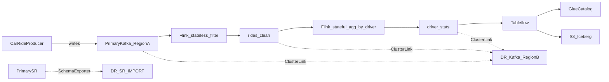

# Design: DR Car Rides Demo (Active/Passive)

Approved brainstorming design for `e2e-demos/dr-car-rides`, updated for dual Schema Registry + Schema Linking.

## Decisions

| Decision | Choice |
|----------|--------|
| DR pattern | Active/passive — Flink only on primary until failover |
| Offsets / state | Hybrid — DR Flink starts with `earliest-offset` rebuild; measure loss via producer `seq` (CC checkpoints are not portable across regions) |
| Failure simulation | Soft failover (default) + promote/mirror failover (optional) |
| Catalog | AWS Glue + Tableflow BYOB S3 in both regions; catalog cutover is part of the teaching story |
| Topology | **Two Confluent environments** — primary reuses existing `j9r-env` / `j9r-kafka` (`us-west-2`); DR env/cluster created in `us-east-1`. Each side has its own Schema Registry and Flink compute pool |
| Schemas | Schema Linking: DR SR in `IMPORT` mode; exporter primary → DR (`subjects = [":*:"]`) preserves schema IDs |
| Scope (v1) | Confluent Cloud only (`cccloud/`) |

## Architecture



### Steady state

- **Primary** reuses existing `j9r-env` / `j9r-kafka`; **DR** is a new environment/cluster so each region has its own Schema Registry (required for Schema Linking on Confluent Cloud).
- Producer writes to primary Kafka + primary SR.
- Flink runs only on primary.
- Tableflow on `driver_stats` → primary S3 + Glue; DR has its own Tableflow provider integration for failover.
- Bidirectional Cluster Linking mirrors `rides_raw`, `rides_clean`, `driver_stats`.
- **Schema Linking:** DR SR mode = `IMPORT`; `confluent_schema_exporter` replicates all subjects from primary → DR so schema IDs match after failover.

### Failover

- Soft / promote as before for Kafka + Flink.
- Schema: pause exporter; set DR SR to `READWRITE` before producers/Flink need to register new versions; existing IDs already imported remain valid.
- Failback: reverse exporter (DR → primary with primary in `IMPORT`), then restore steady-state primary→DR exporter.

## Topics and event model

| Topic | Role | Cluster Link |
|-------|------|--------------|
| `rides_raw` | Source (producer) | Yes (required) |
| `rides_clean` | Stateless Flink sink | Yes (inspect / failback) |
| `driver_stats` | Stateful Flink sink + Tableflow | Yes (inspect / failback) |

Event fields (JSON + Schema Registry `json-registry`): `ride_id`, `seq`, `driver_id`, `rider_id`, `pickup_ts`, `fare_usd`, `status`, `city`.

### Flink stages

1. **Stateless append:** filter `status IN ('completed','cancelled')`, normalize city → `rides_clean`.
2. **Stateful aggregate:** 1-minute tumble on `pickup_ts` by `driver_id` → `ride_count`, `fare_sum`, `max_seq` → `driver_stats`.

### Loss assessment

Same `seq`-based RPO / processing gap measurement as before.

## Terraform / layout

```
e2e-demos/dr-car-rides/
  DESIGN.md
  README.md
  python/
  cccloud/
    IaC/           # reuse j9r primary; create DR + Cluster Link + Schema Linking + AWS
    IaC/import-j9r-env/  # imported j9r-env catalog + remote_state outputs
    flink-sql/
    scripts/
```

Phase 1 adds [`schema-linking.tf`](cccloud/IaC/schema-linking.tf): DR `IMPORT` mode + exporter.

## Success criteria

- DSP coverage includes **schemas with Schema Linking** (not shared single-env SR)
- Soft + promote failover; catalog cutover to DR Glue
- Measurable loss via `seq`

## Out of scope (v1)

oss/cp variants, active/active Flink, automated S3 cross-region replication, Kafka Connect, real AZ kill chaos
