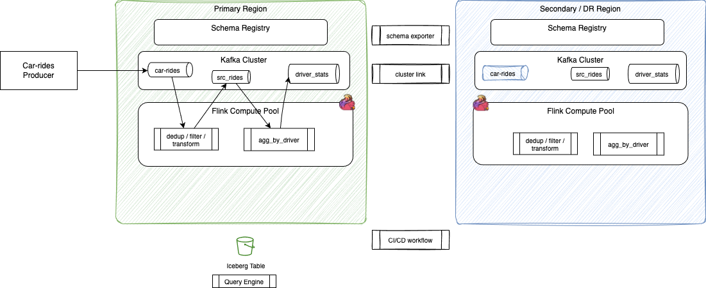

# DR Car Rides — Active/Passive Disaster Recovery Demo

The goal it to demonstrate a data stream processing (DSP) disaster recovery scenario and solution. At the high level, a DSP solution includes the following elements:

1. Two different environments in two separate regions. We use the AWS concept of region as an example, as this demonstration deploy components into AWS.
1. Each region has one schema registry and one to many Kafka Clusters (only one in this demonstration).
1. Flink jobs are deployed with Job Manager and task managers, but as the first demonstrations are done on Confluent solutions, we use the concept of compute pool to represent Flink resources deployed.
1. The kafka topics, can be classified in two folds: 
    * a- the ones created as event sources from Kafka producers, Kafka connectors or CDC connectors. For the demonstration purpose we use a `car-rides` producer application. 
    * b- the topics created as part of the Flink pipelines to prepare analytics data products

1. To get lower level of RTO and RPO, replication of data from topics to topics are setup, as well as schema exports. Not all topics are replicated.
1. We suppose, as most DSP solutions do, a query engine on top of Iceberg tables is used as final client of the pipelines. 
 

[See this DR cookbook](https://jbcodeforce.github.io/flink-studies/cookbook/cluster_mgt/#3-disaster-recovery-multi-region-strategies) for all the details and best practices.

## Supported deployments

| Deployment | Path | Status |
|------------|------|--------|
| Confluent Cloud | [`ccloud/`](./ccloud/) | Ready (IaC + Flink SQL + scripts) |
| OSS Apache Flink | — | Not yet implemented |
| CP Flink | — | Not fully yet implemented; see [`savepoint-demo`](../savepoint-demo/) for CP savepoint DR |

## Confluent Cloud

From Confluent disaster recovery white paper, **active/passive** multi-region DR is the recommended pattern. This includes Kafka cluster, topics and schema registry. For a data streaming processing (DSP) the Flink statements may better support an **active/active** pattern as most of DSP pipelines include stateful processing, and rebuilding state may impact RTO.

The demonstration starts from an existing environment (grey components on the left in figure below): **j9r-env** / **j9r-kafka** (see [deployment/cc-terraform](../../deployment/cc-terraform/))

Then it provisions:

- The primary components of the DSP primary region: flink compute pool, deployed flink statements, and run producer app.
- Materialize aggregates with Tableflow to AWS Glue
- Provision a DR Confluent Cloud environment/cluster (`us-east-1`), mirror source topic with Cluster Linking, replicate schemas with Schema Linking
- practice soft + promote failover with sequence-based loss assessment.

See [`ccloud/README.md`](./ccloud/README.md) for explanation of the demonstration steps done with Terraform.

### What is covered

- Dual-region Kafka across **two environments** with bidirectional Cluster Linking
- Schema Linking: DR SR in IMPORT + exporter primary → DR (schema ID integrity)
- Flink runs as independent regional jobs (no cross-region cluster)
- Source topics replicated: rebuild from earliest + measure loss with `seq`.

| Topic | Role | Cluster Link |
|-------|------|--------------|
| `rides_raw` | Source (producer) | Yes (required) |
| `rides_clean` | Stateless Flink sink | Yes (inspect / failback) |
| `driver_stats` | Stateful Flink sink + Tableflow | Yes (inspect / failback) |

Event fields (JSON + Schema Registry `json-registry`): `ride_id`, `seq`, `driver_id` (key + value via `value.fields-include=all`), `rider_id`, `pickup_ts` (epoch millis), `fare_usd`, `status`, `city`. Producer uses `use.latest.version` (no auto-register).

- Soft vs promote failover runbooks (Kafka + schemas + Tableflow/Glue)

### Steady state

- **Primary** reuses existing `j9r-env` / `j9r-kafka`; **DR** is a new environment/cluster so each region has its own Schema Registry (required for Schema Linking on Confluent Cloud).
- Producer writes to primary Kafka + primary SR.
- Flink runs only on primary.
- Tableflow on `driver_stats` → primary S3 + Glue; DR has its own Tableflow provider integration for failover.
- Bidirectional Cluster Linking mirrors `rides_raw`, `rides_clean`, `driver_stats`.
- **Schema Linking:** DR SR mode = `IMPORT`; `confluent_schema_exporter` replicates all subjects from primary → DR so schema IDs match after failover.

### Failover

- Soft / promote as before for Kafka + Flink.
- Schema: pause exporter; set DR SR to `READWRITE` before producers/Flink need to register new versions; existing IDs already imported remain valid.
- Failback: reverse exporter (DR → primary with primary in `IMPORT`), then restore steady-state primary→DR exporter.

### Loss assessment

Same `seq`-based RPO / processing gap measurement as before.

## Confluent Platform

## Apache Flink and Kafka