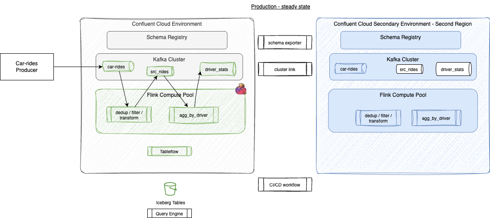
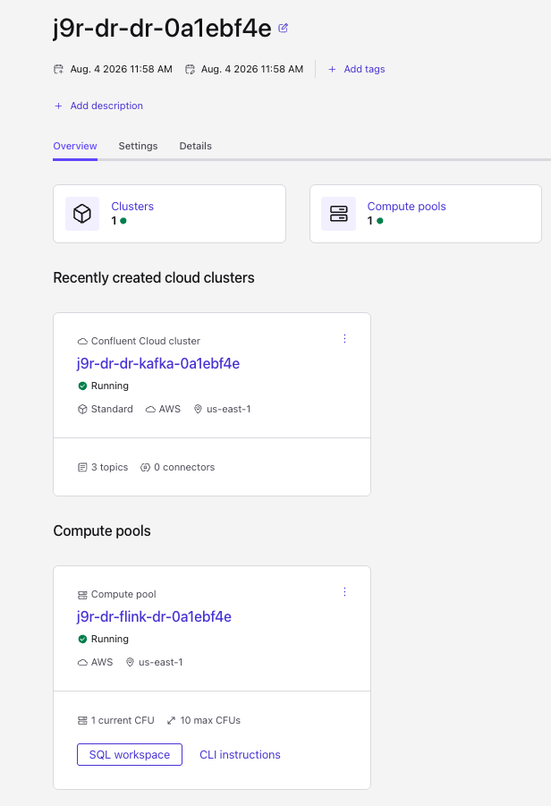

# Confluent Cloud — DR Car Rides

## Goal

Provision **DR** Confluent Cloud environment/cluster (primary reuses existing `j9r-env` / `j9r-kafka`), run an active/active Flink pipeline on car-ride events, mirror topics with Cluster Linking, **replicate schemas with Schema Linking**, materialize aggregates with Tableflow/Glue, and practice soft + promote failover with sequence-based loss assessment.



## Status

Requires CC org + AWS credentials. **Attention**, dual Standard clusters, dual Stream Governance, and Tableflow incur cost.

## Implementation approach

| Phase | Location | What |
|-------|----------|------|
| 0 — Primary catalog | [`IaC/import-j9r-env/`](./IaC/import-j9r-env/) | Imported `j9r-env` / `j9r-kafka` + outputs for remote state |
| 1 — IaC | [`IaC/`](./IaC/) | Terraform (incremental): reuse primary; create DR env/Kafka/SR/SAs/Flink pools first |
| 2 — App | [`flink-sql/`](./flink-sql/) | Flink DDL/DML via tools based on confluent-sql python library |
| 4 - Run continuous producer | [`../python/`](../python/) | Continuous producer + `assess_loss` |
| Ops | [`scripts/`](./scripts/) | Soft/promote failover, failback (incl. schema reverse), `export-env.sh` (Kafka + SR per site) |
| Data | |


### Prerequisites

- Terraform `>= 1.3`, Confluent Cloud API key with org access
- Confluent Cloud [terraform provider](https://registry.terraform.io/providers/confluentinc/confluent/latest) - version 2.81.0+
- Existing `j9r-env` primary (imported under `IaC/import-j9r-env/`; apply that stack first so outputs exist)
- AWS credentials (S3 + Glue + IAM for Tableflow BYOB)
- Python 3.12+ with `uv` or `pip` (`confluent-kafka[schema-registry,json]`, `pydantic`)
- Optional: Confluent CLI for promote / statement stop / exporter pause

### 1. Refresh import outputs (once)

* Be sure the terraform variables are set to false:

```sh
enable_schema_linking
enable_tableflow
enable_cluster_link
```

Defaults: `primary_region = us-west-2` (j9r-kafka), `dr_region = us-east-1`.

* Run
```bash
cd ccloud/IaC/import-j9r-env
# SET ONLY THOSE ENV VARIABLES
export CONFLUENT_CLOUD_API_KEY=...
export CONFLUENT_CLOUD_API_SECRET=...
terraform init && terraform apply
cd ..
```

### 2. Set DR env and cluster

```bash
cp terraform.tfvars.example terraform.tfvars   # or edit existing tfvars
# ensure: enable_cluster_link=false, enable_schema_linking=false, enable_tableflow=false
terraform init && terraform apply
terraform output -json > ../scripts/iac-outputs.json
```




### 3. Deploy Flink statements

```bash
cd ../flink-sql
# one time:
make sync

# Primary only (default)
make deploy

# DR / secondary only
make deploy SITE=dr
# or: make deploy SITE=secondary

# Both sites (active/active prep)
make deploy-both
```

You should see statements created on each site, for example:

```sh
Creating statement: flink-sql-facts-ddl-driver-stats
Creating statement: flink-sql-seed-ddl-rides-raw
Creating statement: flink-sql-dims-pipeline-rides-clean
Creating statement: flink-sql-facts-pipeline-driver-stats
```

Single groups: `make deploy-ddl SITE=dr`, `make undeploy SITE=secondary`, `make undeploy-both`.


### 4. Produce records to car-rides topic

* Set environment variables to reach primary cluster
  ```sh
  cd ccloud/scripts/
  source export-env.sh primary 
  ```
* Be sure to have ORGANIZATION_ID environment variable too
* Run continuous producer
  ```sh
  cd python
  uv run python produce_rides.py  --max-events 10
  ```

### 5. Enable cluster links

* Modify the terraform variables to set: `enable_cluster_link   = true`
* Be sure to start a new terminal with only the 
  ```
  export CONFLUENT_CLOUD_API_KEY=...
  export CONFLUENT_CLOUD_API_SECRET=...
  ```
2. Deploy primary Flink + Tableflow (`cccloud/flink-sql/`).
4. Soft or promote failover (`cccloud/scripts/`) — retarget producer to DR Kafka + DR SR.
5. Assess loss (`python/assess_loss.py`).


## How to run


### 3. Produce rides (primary Kafka + primary SR)

Producer does **not** auto-register schemas. It uses `use.latest.version` against
`rides_raw-key` / `rides_raw-value` created by Flink DDL (`value.fields-include=all`
so `driver_id` is in key and value; `pickup_ts` is epoch millis).

If you already deployed without `value.fields-include=all`, realign schemas:

1. Undeploy Flink statements (`make undeploy` / drop tables).
2. Soft-delete Schema Registry subjects `rides_raw-key` and `rides_raw-value`
   (and `rides_clean-*` / `driver_stats-*` if those tables are recreated).
3. Redeploy DDL (`make deploy`), then produce.

```bash
source ../scripts/export-env.sh primary
cd ../../python
uv sync
uv run produce_rides.py --interval 0.5
```

Verify Schema Linking: DR SR mode is `IMPORT`, exporter `schema_exporter_name` is running.

### 4. Soft failover

```bash
cd ../cccloud/scripts
./failover-soft.sh
# Pause exporter; set DR SR to READWRITE before new registrations if needed
source ./export-env.sh dr
cd ../../python && uv run produce_rides.py --interval 0.5
uv run assess_loss.py --producer-log /tmp/dr-car-rides-seq.log \
  --pre-failover-max-seq <N> --post-mirror-max-seq <M>
```

### 5. Promote failover (optional)

```bash
./failover-promote.sh
```

## Catalog cutover

After DR Tableflow is enabled, query Athena against Glue DB `dr_car_rides_dr`. Do not assume Iceberg continuity from the primary bucket without separate storage replication.
