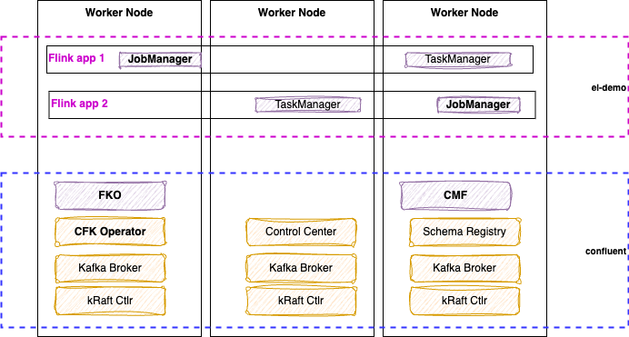
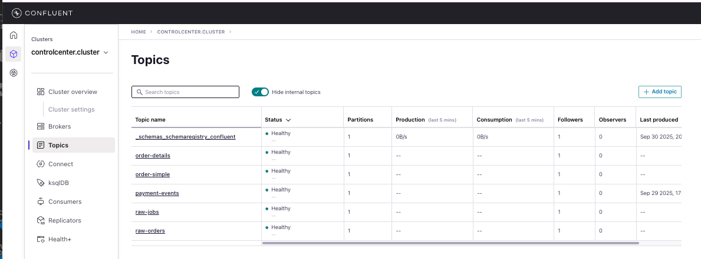
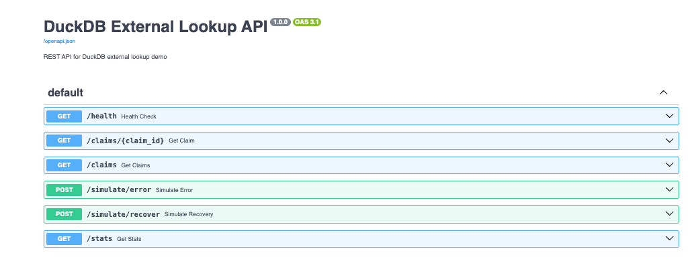
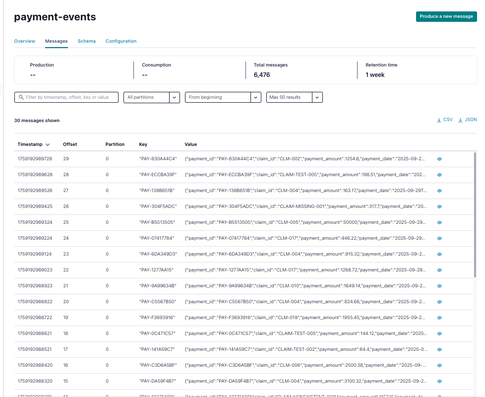

# An external lookup in OSS Flink or CP Flink

The goal of this demonstration is to have an external database that includes insurance claim metadata to do a join with stream events representing payment event with claim id. The expected output in kafka topic will be an enriched event with claim_amount, member_id.

The demonstration needs to be able to simulate lookup failure for invalid claim_id, DB unavailable.

The Database can be a simple postgresql or duckdb database. The processing is done via Flink, and the stream of events are in Kafka topic.

## Design

### Architecture Overview


This demonstration implements a streaming enrichment pattern where:
- **Payment** events flow through Kafka topic and containing a `claim_id` as a foreign key to the Claims table
- An external database stores insurance claim metadata (claim_id, claim_amount, member_id...)
- A Flink streaming job performs real-time lookups to enrich payment events by doing a left joins on the claim_id key
- Enriched events are written to an output Kafka topic, to be processed by another Flink job, which may filter-in large claims only. 
- Error handling manages lookup failures and database unavailability

#### Physical deployment

Here is a potential physical deployment using two namespaces, and two Flink Applications deployed.



### Data Models

#### Input: Payment Event Schema
```json
{
  "payment_id": "string",
  "claim_id": "string", 
  "payment_amount": "decimal",
  "payment_date": "timestamp",
  "processor_id": "string"
}
```

#### External Database: Claims Metadata Table
```sql
CREATE TABLE claims (
  claim_id VARCHAR PRIMARY KEY,
  member_id VARCHAR NOT NULL,
  claim_amount DECIMAL(10,2) NOT NULL,
  claim_status VARCHAR,
  created_date TIMESTAMP
);
```

#### Output: Enriched Payment Event Schema  
```json
{
  "payment_id": "string",
  "claim_id": "string",
  "payment_amount": "decimal", 
  "payment_date": "timestamp",
  "processor_id": "string",
  "member_id": "string",
  "claim_amount": "decimal",
  "enrichment_status": "SUCCESS|CLAIM_NOT_FOUND|DB_ERROR",
  "enrichment_timestamp": "timestamp"
}
```

### System Components

1. [x] **Data Generator**: Simulates payment events with valid/invalid claim_ids. [see deployment](./event-generator/README.md)
2. [x] **External Database**: DuckDB with claims metadata. [See database readme for details.](./database/README.md)
3. [x] **Kafka Topics**: 
   - `payment-events`: Input stream
   - `enriched-payments`: Successfully enriched events
   - `failed-payments`: Events that couldn't be enriched
4. **Flink Application**: Streaming job with async database lookups. [See Flink readme.](./flink/README.md)
5. **Monitoring**: Metrics for lookup success/failure rates

### Data Flow

1. Payment events arrive in `payment-events` topic
2. Flink job reads events and extracts `claim_id`  
3. Async lookup to external database using `claim_id`
4. On successful lookup: merge claim metadata with payment event
5. On lookup failure: mark with error status and reason
6. Route enriched events to appropriate output topics
7. Update metrics and logs for monitoring

### Error Handling Strategy

#### Lookup Failure Scenarios
- **Invalid claim_id**: Claim not found in database
  - Action: Route to `failed-payments` topic with status `CLAIM_NOT_FOUND`
  - Metrics: Track invalid claim rate
  
- **Database unavailable**: Connection timeout or database down
  - Action: Route to `failed-payments` topic with status `DB_ERROR` 
  - Retry: Implement exponential backoff retry logic
  - Circuit breaker: Temporarily disable lookups if error rate too high

- **Database performance issues**: Slow response times
  - Timeout: Configure reasonable lookup timeout (e.g., 5 seconds)
  - Fallback: Mark as `DB_TIMEOUT` and route to failed topic

## Implementation 

- Leverage Confluent Manager for Flink service capabilities
- Integration with Confluent Platform Schema Registry
- The Database implementation is documented in [database/README.md](./database/README.md) with how to build and deploy the docker container. The image starts and populates test records.
- The Event producer is done and documented in the [event-generator/README.md](./event-generator/README.md).
- The First Flink application is doing the external lookup is done in flink folder, [see the readme](./event-generator/README.md)

### Testing Scenarios

#### Happy Path Tests
1. Valid payment events with existing claim_ids get enriched successfully
2. Enriched events contain correct claim_amount and member_id
3. Throughput testing with high volume of valid events

#### Error Scenario Tests  
1. Payment events with non-existent claim_ids route to failed topic
2. Database connection failures trigger circuit breaker
3. Slow database responses trigger timeout handling
4. Recovery testing when database comes back online

#### Load Testing
1. Measure lookup latency under various loads
2. Test backpressure handling when database is slow
3. Validate memory usage with different cache configurations

### Success Metrics
- Lookup success rate > 95%
- P95 enrichment latency < 100ms  
- Zero data loss during failure scenarios
- Automatic recovery from transient failures

## Demonstration script

### Build & Deploy

See each component's readme for more information. Here is a summary of an end-to-end demonstration:

#### Setup

* Start Kubernetes via colima VM (See command in `deployment/k8s` folder)
* Basic demo settings
  ```sh
  # under the external-lookup folder
  make prepare
  ```

* To get access to checkpoints saved in s3 type object storage, wwe use Minio. Minio is deployed on kubernetes and exposed with a service so it can have a DNS name. See [deployment/k8s/minio]
* A dedicated bucket for Flink checkpoints (e.g., flink-checkpoints) must be created in MinIO.
* Obtain the Access Key and Secret Key for a user that has read/write access to the MinIO bucket.
* Flink requires the S3 filesystem plugin to interact with MinIO (or any S3-compatible store). For Confluent Platform Flink, you should enable the built-in S3 plugin on your Flink environment, compute pool or application CR. [see environment manifest](../../deployment/k8s/cp-flink/flink-dev-env.yaml).

#### 1- Claim Database and service

[See instructions in the readme](./database/README.md#):

* Modify the [PV declaration](./database/k8s/persistent-volume.yaml) to refect the absolute path where you want the claim database to be persisted. The volume is mounted to the pod via PVC but hosted on local server.
  ```yaml
  spec:
    capacity:
      storage: 2Gi
    volumeMode: Filesystem
    accessModes:
    - ReadWriteOnce
    persistentVolumeReclaimPolicy: Retain
    storageClassName: hostpath
    hostPath:
      path: TO CHANGE and need to be an absolute path /tmp/database/data
      type: Directory
  ```

* build and deploy
  ```sh
  cd database
  make build
  make deploy
  # Verify the deployment
  make status
  ```

#### 2- Event Generator

[See also details in README](./event-generator/README.md)

* Event Generator is a Python app to produce transaction events to Kafka, deployable on kubernetes and supporting 3 deployment models. The deployment steps are
  ```sh
  cd event-generator
  make build
  make publish_schema
  make deploy
  make status
  ```

* For future runs, it is not necessary to restart the event generator, as messages are in the input topic already.

#### Flink Application


* The first flink application
  ```sh
  cd flink
  make build-image
  ```

#### Expose services

* Start the different port-forwarding processes (Confleuent Manager for Flink REST API, database url, Confluent Platform Console):
  ```sh
  make expose_services
  ```

* Verify the content of the Kafka environment:
  ```sh
  chrome http://localhost:9021/home/clusters
  ```

  

* Verify the records in the database:
  ```sh
  chrome http://localhost:8080/docs
  ```

  

* Review messages in the payment-events topic from Confluent Console:

  

  or using the python consumer:
  ```sh
  make install_consumer_deps
  make deploy_kafka_consumer_k8s
  make consume_payment_events_cluster
  ```

* Deploy Claim Enrichment Flink application:

  


### clean up

* Stop the event generation at any time
  ```sh
  cd event-generator
  make undeploy
  ```

* At the external-lookup folder
  ```sh
  make clean-up
  ```