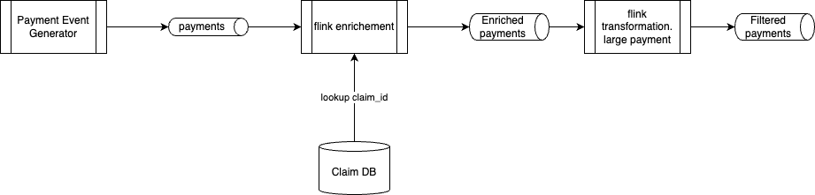

# An external lookup in OSS Flink or CP Flink

The goal of this dmeonstration is to have an external database that includes insurance claim metadata to do a join with stream events representing payment event with claim id. The expected output in kafka topic will be an enriched event with claim_amount, member_id.

The demonstration needs to be able to simulate lookup failure for invalid claim_id, DB unavailable.

The Database can be a simple postgresql or duckdb database. 

## Design

### Architecture Overview



This demonstration implements a streaming enrichment pattern where:
- Payment events flow through Kafka containing `claim_id` references
- An external database stores insurance claim metadata (claim_amount, member_id)
- A Flink streaming job performs real-time lookups to enrich payment events
- Enriched events are written to an output Kafka topic
- Error handling manages lookup failures and database unavailability

### Data Models

#### Input: Payment Event Schema
```json
{
  "payment_id": "string",
  "claim_id": "string", 
  "payment_amount": "decimal",
  "payment_date": "timestamp",
  "processor_id": "string"
}
```

#### External Database: Claims Metadata Table
```sql
CREATE TABLE claims (
  claim_id VARCHAR PRIMARY KEY,
  member_id VARCHAR NOT NULL,
  claim_amount DECIMAL(10,2) NOT NULL,
  claim_status VARCHAR,
  created_date TIMESTAMP
);
```

#### Output: Enriched Payment Event Schema  
```json
{
  "payment_id": "string",
  "claim_id": "string",
  "payment_amount": "decimal", 
  "payment_date": "timestamp",
  "processor_id": "string",
  "member_id": "string",
  "claim_amount": "decimal",
  "enrichment_status": "SUCCESS|CLAIM_NOT_FOUND|DB_ERROR",
  "enrichment_timestamp": "timestamp"
}
```

### System Components

1. [ ] **Data Generator**: Simulates payment events with valid/invalid claim_ids
2. [x] **External Database**: DuckDB with claims metadata
3. **Kafka Topics**: 
   - `payment-events`: Input stream
   - `enriched-payments`: Successfully enriched events
   - `failed-payments`: Events that couldn't be enriched
4. **Flink Application**: Streaming job with async database lookups
5. **Monitoring**: Metrics for lookup success/failure rates

### Data Flow

1. Payment events arrive in `payment-events` topic
2. Flink job reads events and extracts `claim_id`  
3. Async lookup to external database using `claim_id`
4. On successful lookup: merge claim metadata with payment event
5. On lookup failure: mark with error status and reason
6. Route enriched events to appropriate output topics
7. Update metrics and logs for monitoring

### Error Handling Strategy

#### Lookup Failure Scenarios
- **Invalid claim_id**: Claim not found in database
  - Action: Route to `failed-payments` topic with status `CLAIM_NOT_FOUND`
  - Metrics: Track invalid claim rate
  
- **Database unavailable**: Connection timeout or database down
  - Action: Route to `failed-payments` topic with status `DB_ERROR` 
  - Retry: Implement exponential backoff retry logic
  - Circuit breaker: Temporarily disable lookups if error rate too high

- **Database performance issues**: Slow response times
  - Timeout: Configure reasonable lookup timeout (e.g., 5 seconds)
  - Fallback: Mark as `DB_TIMEOUT` and route to failed topic

### Implementation Options

#### Option 1: OSS Flink with JDBC Async I/O
- Use Flink's AsyncDataStream for non-blocking database lookups
- Deployment: Docker Compose or Kubernetes

#### Option 2: Confluent Platform Flink
- Leverage managed Flink service capabilities
- Built-in monitoring and scaling
- Integration with Confluent Schema Registry

### Testing Scenarios

#### Happy Path Tests
1. Valid payment events with existing claim_ids get enriched successfully
2. Enriched events contain correct claim_amount and member_id
3. Throughput testing with high volume of valid events

#### Error Scenario Tests  
1. Payment events with non-existent claim_ids route to failed topic
2. Database connection failures trigger circuit breaker
3. Slow database responses trigger timeout handling
4. Recovery testing when database comes back online

#### Load Testing
1. Measure lookup latency under various loads
2. Test backpressure handling when database is slow
3. Validate memory usage with different cache configurations

### Success Metrics
- Lookup success rate > 95%
- P95 enrichment latency < 100ms  
- Zero data loss during failure scenarios
- Automatic recovery from transient failures

## Demonstration script

### Setup

* Start Kubernetes via colima VM (in deployment/k8s)
* Start the duckdb database service: 
  ```sh
  cd database
  ./deploy.sh
  ./status.sh
  ```

* Start the different port-forwarding
  ```
  make expose_services
  ```
