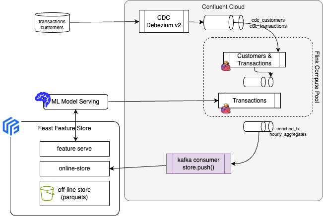

# Online Feature Store update via Real-Time windowed aggregation feature

This folder is to demonstrate preparing a time window feature to be pushed to Feast on-line feature store and consumed by a ML deployed model. The model is called by another Flink SQL processing.  

## Architecture



### Calling a ML model from Flink

On Confluent Cloud for Flink the [ML_PREDICT](https://docs.confluent.io/cloud/current/flink/reference/functions/model-inference-functions.html#flink-sql-ml-predict-function) function can be used to call a remote ML model for inference.

1. [Create a connection](https://docs.confluent.io/cloud/current/flink/reference/statements/create-connection.html#flink-sql-create-connection). Connections include endpoint and authentication information. Usable by any Confluent AI functions and UDFs.
1. [Create a model](https://docs.confluent.io/cloud/current/flink/reference/statements/create-model.html#flink-sql-create-model)
   ```sh
   CREATE MODEL risk_scoring
   INPUT()
   OUTPUT(risk DECIMAL(8,2))

   ```
1. Use ML_PREDICT in a Flink
   ```sql
   SELECT * FROM `db1`.`tb1`, LATERAL TABLE(ML_PREDICT('md1', key, map['async_enabled', true, 'client_timeout', 60, 'max_parallelism', 20, 'retry_count', 5]));
   ```

## Feast Concepts

[Feature Store](https://docs.feast.dev/) is an OSS feature store to manage ML features and serve them for Model inference. It uses two foundational components: 
1. an offline store for historical feature extraction used in model training 
1. an online store for serving features at low-latency in production systems and applications.

* At inference time, the server reads the latest feature values for different entities (like the taxi driver) from the online feature store using `get_online_features()`. 
* Independant Kafka Consumer - Push  to Online store component using Kafka Consumer API/ schema registry and Feast SDK 
* Model inference does not wait for fetch data from kafka.
* If Kafka lags, the model still gets the last known feature value from the Online Store rather than crashing.
* You can do heavy aggregations (like "average price over 24 hours") in Flink processing before pushing to Feast, keeping your inference-time logic (on_demand) very lightweight.
* Feature View allows to serve feature data to the model online.


Using feast init the following was created:
ben 
* `data/` contains raw demo parquet data
* `feature_repo/feature_definitions.py` contains demo feature definitions
* `feature_repo/feature_store.yaml` contains a demo setup configuring where data sources are
* `feature_repo/test_workflow.py` showcases how to run all key Feast commands, including defining, retrieving, and pushing features. 

You can run the overall workflow with `python test_workflow.py`.

*  `feature_store.yaml` points to a local file as a registry. You'll want to setup a remote file (e.g. in S3/GCS) or a SQL registry. See [registry docs](https://docs.feast.dev/getting-started/concepts/registry) for more details. 
* This example uses a file [offline store](https://docs.feast.dev/getting-started/components/offline-store) to generate training data. It does not scale. We recommend instead using a data warehouse such as BigQuery,  Snowflake, Redshift.
* Deploy feature server instances with `feast serve` to expose endpoints to retrieve online features.
   - See [Python feature server](https://docs.feast.dev/reference/feature-servers/python-feature-server) for details.
   - Use cases can also directly call the Feast client to fetch features as per [Feature retrieval](https://docs.feast.dev/getting-started/concepts/feature-retrieval)


## Source of information

* [Feast Getting Started](https://docs.feast.dev/getting-started/quickstart)
* [Confluent ML_PREDICT]()