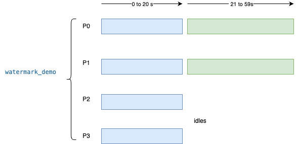

# Flink watermark and idle Kafka partitions

This demonstration shows stalled event-time progress when some Kafka partitions go idle, and how Flink Table/SQL idle settings let a tumble window for a fixed time range complete. 

## What is implemented

- Docker Compose: Confluent `cp-kafka:8.2.0` in KRaft mode (single combined broker+controller, no ZooKeeper), same pattern as [../kafka-topic-consumer-offsets/docker-compose.yaml](../kafka-topic-consumer-offsets/docker-compose.yaml). Host bootstrap `localhost:9092`; in-stack bootstrap for Flink is `broker:29092`. Flink 2.2.0 JobManager and TaskManager with the Kafka SQL connector fat JAR (see [Dockerfile](Dockerfile)).
- SQL: [sql/01_baseline.sql](sql/01_baseline.sql) (idle handling off) and [sql/02_mitigation.sql](sql/02_mitigation.sql) (global and scan idle timeouts). The basic is to count the number of elements in time windows:
    ```sql
    INSERT INTO print_wm
    SELECT
        window_start,
        window_end,
        COUNT(*) AS cnt
    FROM TABLE(
        TUMBLE(TABLE events, DESCRIPTOR(event_time), INTERVAL '10' SECONDS)
    ) GROUP BY window_start, window_end;
    ```
- Python (uv): Kafka producer to four partitions with phase one writes event time 0–20s on all partitions; phase two writes 21–59s only on partitions 0 and 1 so 2 and 3 go idle. The story window is [50s, 60s) on the fixed base time `2020-01-01T00:00:00Z` (10-second tumbles in SQL).



The producer sends 1 message for each event second. 

## Prerequisites

- Docker Compose v2 and enough disk for images.
- [uv](https://github.com/astral-sh/uv) for the producer.

## Run (short path)

```text
cd research/flink-watermark
docker compose up -d --build
./scripts/wait_for_flink.sh
./scripts/load_kafka.sh
# In another terminal, print sink output (TaskManager stdout):
docker logs -f flink_wm_taskmanager
# Then start the baseline job (streaming; stop with Ctrl+C or cancel the job in the UI):
./scripts/run_sql.sh 01_baseline.sql
```

Expect: early windows may print; the [50s, 60s) row is missing or does not appear in the observation window while idle partitions hold back the merged watermark. The trace looks like:

```
wm-baseline> +I[2020-01-01T00:00, 2020-01-01T00:00:10, 40]
wm-baseline> +I[2020-01-01T00:00:10, 2020-01-01T00:00:20, 40]
```

Cancel the Flink job before the next step ([Flink UI](http://localhost:8081/#/job) or `flink` CLI if installed in the container).

```text
./scripts/run_sql.sh 02_mitigation.sql
```

Expect: after idle sources time out, the same data can yield the [50s, 60s) aggregate in the print sink (see TaskManager logs for `wm-mitigation`).

```sh
wm-mitigation> +I[2020-01-01T00:00, 2020-01-01T00:00:10, 40]
wm-mitigation> +I[2020-01-01T00:00:10, 2020-01-01T00:00:20, 40]
wm-mitigation> +I[2020-01-01T00:00:20, 2020-01-01T00:00:30, 22]
wm-mitigation> +I[2020-01-01T00:00:30, 2020-01-01T00:00:40, 20]
wm-mitigation> +I[2020-01-01T00:00:40, 2020-01-01T00:00:50, 20]
```

## Tear down

```sh
docker compose down
```

## Tests

```text
uv sync --group dev
uv run pytest
```
