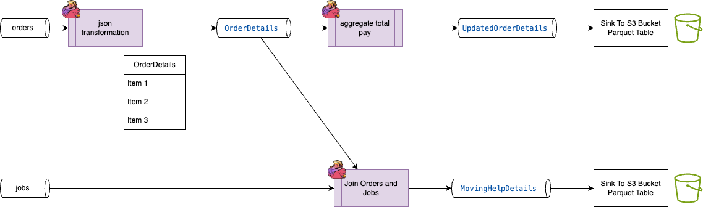
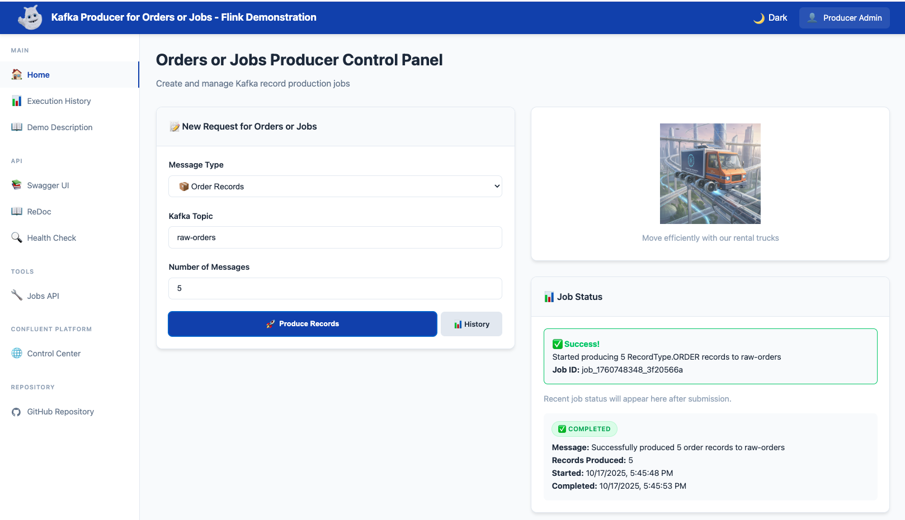
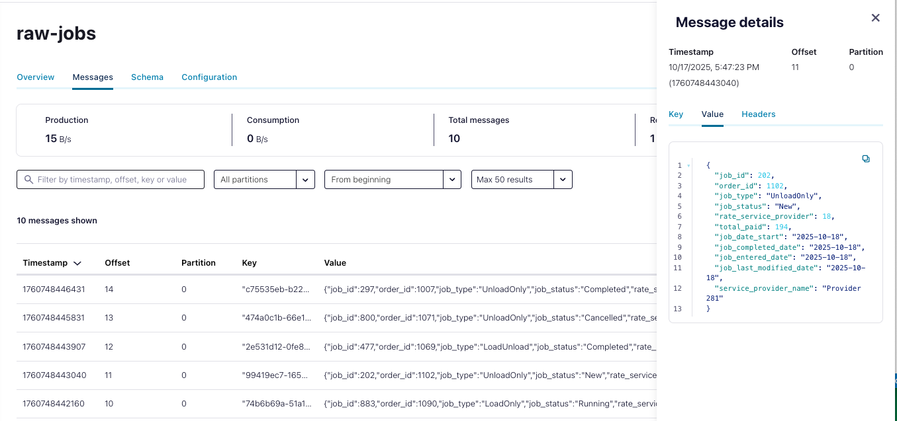

# Order and Jobs processing with Confluent Platform Flink

## Overview

This is a simple demo using Confluent Platform with Flink, or Confluent Cloud for Flink and Kafka to demonstrate a json schema mapping, a join and an aggregation with Flink SQL queries. The example is about a fictitious mover truck rental company, in 2190. This demonstration covers all the components to create and deploy for a Flink application consuming from 2 Kafka topics and generating records to one topic.

The processing logic, we need to implement, has the following basic data pipeline architecture:

  

The input are:
* Industrial vehicle rental events within `orders` kafka topic, 
* Human Job demand, which in the context of a Mover, a move demand, helping to move furniture,..

The jobs are related to a move `order`, so the join key is the `OrderId`.

## Use Case

* Truck rental orders continuously arrive to the `raw-contracts` kafka topic, while job demands are sent to `raw-jobs` topic. 
    
    *Image generated with Google Gemini*

* The raw-orders json payload looks like:
    ```json
    {
      "OrderId": 123456,
      "Status": "Return",
      "Equipment": [
        {
          "ModelCode": "TK-01",
          "Rate": "34.95"
        }
      ],
      "TotalPaid": 37.4,
      "Type": "InTown",
      "Coverage": null,
      "Itinerary": {
        "PickupDate": "2020-09-21T18:14:08.000Z",
        "DropoffDate": "2020-09-21T20:47:42.000Z",
        "PickupLocation": "41260",
        "DropoffLocation": "41260"
      },
      "OrderType": "Move",
      "AssociatedContractId": null
    }
    ```

* The raw-job json is:
  ```json
  {
    "job_id": 1234567,
    "order_id": 123456,  -- used to join to order
    "job_type": "LoadUnload",
    "job_status": "Completed",
    "rate_service_provider": "85.0000",
    "total_paid": "170.0000",
    "job_date_start": "2020-07-17",
    "job_completed_date": "2020-07-17",
    "job_entered_date": "2020-07-14",
    "job_last_modified_date": "2020-07-14",
    "service_provider_name": "ArizonaDream"
  }
  ```


* The first transformation takes the raw source records and builds a JSON with nested structure: the `OrderDetails` which includes two main objects: the `EquipmentRentalDetails` and the `MovingHelpDetails`
  ```json
  {
      "OrderDetails": {
         "OrderId": 396404719,
        "EquipmentRentalDetails": [
          {
            "OrderId": 396404719,
            "Status": "Return",
            "Equipment": [
              {
                "ModelCode": "HO",
                "Rate": "34.95"
              }
            ],
            "TotalPaid": 37.4,
            "Type": "InTown",
            "Coverage": null,
            "Itinerary": {
              "PickupDate": "2020-09-21T18:14:08.000Z",
              "DropoffDate": "2020-09-21T20:47:42.000Z",
              "PickupLocation": "41260",
              "DropoffLocation": "41260"
            },
            "OrderType": "Umove",
            "AssociatedContractId": null
          }
        ],
        "MovingHelpDetails": null
      },
      ...
  }
  ```

* The second real-time processing is doing a join with the `raw_jobs` topic, to enrich the `OrderDetails.MovingHelpDetails` with the jobs information:
  ```json
      "MovingHelpDetails": [
        {
            "job_id": 1234567,
            "job_type": "LoadUnload",
            "job_status": "Completed",
            "rate_service_provider": "85.0000",
            "total_paid": "170.0000",
            "job_date_start": "2020-07-17",
            "job_completed_date": "2020-07-17",
            "job_entered_date": "2020-07-14",
            "job_last_modified_date": "2020-07-14",
            "service_provider_name": "ArizonaDream"
          }
      ]
  ```

* Finally the equipment rental details can be used to compute aggregations and business analytics data products.

## Architecture

The components involved in this demonstration are depicted in the following figure:


* Confluent Platform with Kafka Brokers, Schema registry and Kafka Connectors cluster (not in this demo)
* Different topics to persist events: raw-orders, raw-jobs, and order-details topics
* Confluent Manager for Flink to manage Flink Environments, Compute Pools, Flink Applications
* Schema Registry for schema governance
* Flink Applications in the form of TableAPI application with SQL scripts or SQL statements created with Flink SQL shell.
* WebApp to support the demonstation and to produce the different event types.

---

## Demonstration Script

### Prerequisites

* Clone this repository and work in the `flink-studies/e2e-demos/json-transformation` folder.
* We assume a Kubernetes cluster is up and running with the Confluent Platform and Confluent Manager for Flink deployed. Use at least version 8.0.x. See [deployments readme and Makefiles](https://github.com/jbcodeforce/flink-studies/tree/master/deployment/k8s) for the platform deployment.
* The project uses `make` tool
* Look at the available demonstration targets:
    ```
    make help
    ```

### Build and Deploy the components

* All the demonstration components are deployed under the `rental` namespace, and will have the following metadata:
  ```yaml
  metadata:
    labels:
      name: rental-demo
      app: json-xform
      component: <specific_name>
  ```

* Build and deploy all
  ```sh
  make build_all
  make deploy_all
  ```

*Remarks* all the components can be built individually using the Makefile under each component folder.

* Verify all components run successfully
  ```sh
  make status_all 
  ```

* Start the Demo Web App:
  ```sh
  make open_demo_web_page
  ```

* [optional] Start the CP Console browser. It can be accessed via the Demo console too.
  ```sh
  make open_cp_console
  ```

### Demonstration from the user interface

The demonstration user interface includes the form and controls to drive the demonstration, the scripts is inside the Demo Description section


1. Create input data in the raw order topics: 
  **Select Message Type**
  📦 Order Records: E-commerce order data
  


1. Validate orders records are in topic using the CP Console too:
  

1. Same for jobs, with "💼 Job Records: Job posting data"
  

1. In the CP Console, raw-job topic, messages should be present (be sure to select from beginning).
  

### 🌐 Web Interface Usage

* **Step 1: Select Message Type**
  * 📦 Order Records: Truck Rental portal order data
  * 💼 Job Records: Job posting data
  * 🛠️ Custom JSON: Your own JSON payload

* **Step 2: Configure Production**
  * Topic: Kafka topic name (with smart auto-suggestions)
  * Count: Number of records to produce (1-1000)
  * Custom JSON: Rich editor for custom payloads

* **Step 3: Monitor Progress**
  * Real-time record producer job status updates
  * Automatic polling for completion
  * Success/error notifications
  * Producer job history tracking

### Flink SQL processing

There are multiple approaches for the implementation. The easiest one is to tune the SQL with the Flink SQL shell. For production the approach is to use a jar packaging with the java code which may use DataStream or TableAPI.

#### Flink SQL Shell

During query development the shell is the most efficient to write the complex query incrementally. Ensure the cmf service is exposed via a port forward, using `make expose_services` in this folder.

```sh
cd cp-flink
make start_flink_shell
```

Within the shell verify catalog access and set the database to use:
```sql
show catalogs;
use catalog rental;
use rentaldb;
show tables;
```

1. Verify content for the tables we need to join
  ```sql
  select * from `raw-jobs`;
  select * from `raw-orders`;
  ```

1. Implement the json transformation
  ```sql
  ```

???+ info "Other useful commands"
  The following commands should be available soon in CP Flink:
  ```sql
  show create table `raw-jobs`;
  explain select .... -- your query
  ```

### Validating Results


---
## Code explanation

### Project structure

The approach is to keep component in separate folder, with makefile to build, deploy, get the status of the running pods, and undeploy. Each with its own k8s manifests.

| Folder | Content |
| --- | --- |
| **k8s** | Makefile and common kubernetes elements of the demonstrations. Common to all components, like namespace and config map |
| **cp-flink** | Flink statemens as Table API code |
| **docs** | Some diagrams |
| **Producer** | Web App and CLI to produce demonstration records | 
| **schemas** | Json schema definitions to be deployed by schema registry |
| **cc-flink** | Equivalents Flink SQL for Confluent Cloud Flink |

The `cp-flink` folder includes the configuration to create schemas and topics for the raw input data: `jobs` and `orders` and the OrderDetails topic and schema. When deploying to Kubernetes, the topic and schema are defined as config maps. The following diagram illustrates the relationships with those k8s elements:


The dark blue represents application specific elements, while the light blue elements represent reusable, cross applications, components.

The makefile under the cp-flink folder, helps to deploy those elements to the Confluent Platform.

The Kafka order and job records producer code is under [producer folder](./producer/).

The `cc-flink` folder includes the SQLs to run the demonstration within Confluent Cloud for Flink (see the [README.md](./cc-flink/README.md) for instructions).

### Producer Features

- Support for jobs and orders records creation, with custom JSON record
- Type-safe record definitions with validation using Pydantic
- Command-line interface for easy testing and automation
- Built-in callback handling for message delivery confirmation
- Include a FastAPI Application (api_server.py) which supports the following REST API:
  * POST /produce: Produce predefined record types (job/order), with configurable count
  * POST /produce/custom: Produce custom JSON payloads
  * Health Checks: Dependency verification and service status

* Background Processing: Asynchronous job execution using FastAPI BackgroundTasks

The following figure illustrates the different deployment model:


* CLI based usage examples, to send 5 records to a specific topic
  ```sh
  uv run python kafka_json_producer.py --record-type order --topic raw-orders --count 5
  # 
  uv run python kafka_json_producer.py --record-type job --topic raw-jobs --count 5
  ```

* Webapp based usage: the following command is for development, as the final deployment should be via Kubernetes.  
  ```sh
  uv run api_server.py
  ```

#### Environment Variables

| Variable | Default | Description |
|----------|---------|-------------|
| `KAFKA_BOOTSTRAP_SERVERS` | `kafka.confluent.:9071` | Kafka broker addresses |
| `KAFKA_TOPIC` | `test-records` | Default topic name |
| `KAFKA_USER` | _(empty)_ | SASL username |
| `KAFKA_PASSWORD` | _(empty)_ | SASL password |
| `KAFKA_SECURITY_PROTOCOL` | `PLAINTEXT` | Security protocol |
| `KAFKA_SASL_MECHANISM` | `PLAIN` | SASL mechanism |
| `KAFKA_CERT` | _(empty)_ | SSL certificate path |

Those environment variables are defined in `k8s/kafka_client_cm.yaml`.

### The Flink SQL processing

For Confluent Manager for Flink, the SQL feature is in preview (as of 10/2025). The concepts are the same as in Confluent Cloud for Flink with Environment, and Compute Pools. The manifests are in [deployment/k8s/cp-flink](https://github.com/jbcodeforce/flink-studies/blob/master/deployment/k8s/cp-flink/flink-dev-env.yaml).

Recall the relationship between those elements are illustrated in the figure:


The approach is:
1. Be sure to be unlogged of confluent cloud session when using the confluent cli:
    ```sh
    confluent login
    confluent logout
    ```
1. Be sure port forward to CMF REST api is set up: `make expose-services`
1. Create the environment with: `kubectl apply -f ../../deployment/k8s/cp-flink/flink-dev-env.yaml`
1. `export ENV_NAME=dev-env`  and `export CMF_URL=http://localhost:8084`
1. Create the compute pool with: `confluent flink compute-pool create k8s/compute_pool.yaml --environment $(ENV_NAME) --url $(CMF_URL) `
Defining JSON objects as sink, involves defining the value format, and the table structure. As we want json, the setting is:

```sql
    'value.format' = 'json-registry',
```

#### raw_job mapping

To start the development of the SQL code, we use the simple raw_job as it is a flat input structure. The target one element that will be an array of json objects. This first version of table definition will be defined as:

```sql
create table dim_jobs (
  MovingHelpDetails ARRAY<ROW<
    job_id BIGINT,
    job_type STRING,
    job_status STRING,
    rate_service_provider STRING,
    total_paid DECIMAL(10,2),
    job_date_start STRING,
    job_completed_date STRING,
    job_entered_date STRING,
    job_last_modified_date STRING,
    service_provider_name STRING
  >>) WITH (
    'value.avro-registry.schema-context' = '.dev',
   'kafka.retention.time' = '0',
    'changelog.mode' = 'append',
   'kafka.cleanup-policy'= 'compact',
   'scan.bounded.mode' = 'unbounded',
   'scan.startup.mode' = 'earliest-offset',
   'value.fields-include' = 'all',
    'value.format' = 'json-registry',
    'value.fields-include' = 'all'
);
```

If we want to map raw_jobs to the dim_jobs

```sql
insert into dim_jobs (MovingHelpDetails)  
  SELECT   
    ARRAY[ 
      ROW(
        j.job_id, 
        j.job_type,
        j.job_status,
        j.rate_service_provider,
        j.total_paid,
        j.job_date_start,
       j.job_completed_date,
       j.job_entered_date,
      j.job_last_modified_date,
      j.service_provider_name)
    ] 
  from raw_jobs j;
```

and the results are as expected:

```json
{
  "MovingHelpDetails": [
    {
      "job_id": 1005,
      "job_type": "cleaning",
      "job_status": "cancelled",
      "rate_service_provider": "hourly",
      "total_paid": 0,
      "job_date_start": "2024-01-18 14:00:00",
      "job_completed_date": "",
      "job_entered_date": "2024-01-14 09:20:00",
      "job_last_modified_date": "2024-01-17 16:45:00",
      "service_provider_name": "QuickMover"
    }
  ]
}
```

#### raw_order mapping

The OrderDetails is build in the ddl.order_details.sql


```sql
create table order_details (
   OrderId BIGINT NOT NULL PRIMARY KEY not enforced,
   EquipmentRentalDetails ARRAY<ROW<
      OrderId BIGINT,
      Status STRING,
      Equipment ARRAY<ROW<
        ModelCode STRING,
        Rate STRING
      >>,
      TotalPaid DECIMAL(10,2),
      Type STRING,
      Coverage STRING,
      Itinerary ROW<
        PickupDate TIMESTAMP(3),
        DropoffDate TIMESTAMP(3),
        PickupLocation STRING,
        DropoffLocation STRING
      >,
      OrderType STRING,
      AssociatedContractId BIGINT>>,
  MovingHelpDetails ARRAY<ROW<
    job_id BIGINT,
    job_type STRING,
    job_status STRING,
    rate_service_provider STRING,
    total_paid DECIMAL(10,2),
    job_date_start STRING,
    job_completed_date STRING,
    job_entered_date STRING,
    job_last_modified_date STRING,
    service_provider_name STRING
  >>
  ) distributed by hash(OrderId) into 1 buckets WITH ( 
   'value.avro-registry.schema-context' = '.dev',
   'kafka.retention.time' = '0',
    'changelog.mode' = 'append',
   'scan.bounded.mode' = 'unbounded',
   'scan.startup.mode' = 'earliest-offset',
   'value.fields-include' = 'all',
    'value.format' = 'json-registry',
    'value.fields-include' = 'all'
);
```

```sql
insert into dim_orders(OrderId, EquipmentRentalDetails)
SELECT
  OrderId,
  ARRAY[
    row(
     OrderId,
  Status,
  TotalPaid,
  `Type`,
  Coverage,
  OrderType,
  CAST(AssociatedContractId as BIGINT)
    )
  ]
from raw_orders
```


#### Combining

#### 1. Direct Nested Access

The 
```sql
SELECT OrderDetails.EquipmentRentalDetails[1].OrderId 
FROM OrderDetails;
```

#### 2. Array Unnesting (Recommended)
```sql
SELECT rental_detail.OrderId, equipment_item.ModelCode
FROM OrderDetails
CROSS JOIN UNNEST(OrderDetails.EquipmentRentalDetails) AS t(rental_detail)
CROSS JOIN UNNEST(rental_detail.Equipment) AS e(equipment_item);
```

#### 3. Flattened Output
```sql
INSERT INTO OrderDetails_Flat
SELECT 
  rental_detail.OrderId,
  rental_detail.Status,
  equipment_item.ModelCode,
  equipment_item.Rate,
  rental_detail.TotalPaid,
  rental_detail.Itinerary.PickupDate,
  rental_detail.Itinerary.DropoffDate
FROM OrderDetails
CROSS JOIN UNNEST(OrderDetails.EquipmentRentalDetails) AS t(rental_detail)
CROSS JOIN UNNEST(rental_detail.Equipment) AS e(equipment_item);
```

---


## CMF Setup

The code and/or instructions are NOT intended for production usage. The Kubernetes deployment is done using Colima VM and Confluent Platform. [See the CP deployment readme](../../deployment/k8s/cp-flink/README.md) and use the makefile in `deployment/k8s/cp-flink` to start Colima, deploy Confluent Platform, with Managed Flink and then verify Flink and Kafka are running. 

* Make sure the CMF REST API is accessible on localhost:
```sh
make verify_cp_cfk
make verify_cmf
make port_forward_cmf
```

The `cp-flink` folder in this `e2e-demos/json-transformation` project, includes a makefile to manage port-forwarding, create topics...

* Define orders and jobs topic, json schema using config map and schema registry entry
    ```sh
    make create_topics
    make create_cms
    make create_schemas
    ```

* Validate we can see the catalog and table using Flink SQL shell
    ```sh
    make start_flink_shell
    ```

### Flink Shell common commands

* Setting catalog and databases:
  ```sh
  show catalogs;
  use catalog demo-cat;
  show databases;
  use cluster-1;
  show tables;
  ```

* `show tables;` should return the raw-orders and raw-jobs tables.

* Work on the job content:
  ```sh
  select * from `raw-jobs`;
  ```

* Work on the orders content:
  ```sh
  select * from `raw-orders`;
  ```

### Confluent documentation and limitations

* [Interactive SQL Shell](https://docs.confluent.io/platform/current/flink/jobs/sql-statements/use-interactive-shell.html)
* [Current limitations](https://docs.confluent.io/platform/current/flink/jobs/sql-statements/features-support.html#limitations)


## Troubleshouting

* The flinkApplication status: `make status` from the `cp-flink` folder
* Access the Flink Web UI: `make flink_ui`
* Look at the log of the CMF pod:
  ```sh
  # get the pod id
  kubeclt logs confluent-manager-for-apache-flink-75b97474c9-6k92v -n confluent
  ```

### Multiple planner factory

Error: "Multiple factories for identifier 'default' that implement 'org.apache.flink.table.delegation.ExecutorFactory' 
   found in the classpath. Ambiguous factory classes are: io.confluent.flink.plugin.internal.ConfluentExecutorFactory"

**Reason:** This typically happens when both the Confluent Flink Table API plugin and the default Flink planner are included as dependencies,

**Solution:**: Be sure to do not have the CC FLink plugin in the pom.xml, something like:
  ```xml
        <dependency>
            <groupId>io.confluent.flink</groupId>
            <artifactId>confluent-flink-table-api-java-plugin</artifactId>
            <version>${confluent-plugin.version}</version>
        </dependency>
  ```

### Invalid table name: raw-orders

Most likely the name of the table should include the catalog and database name. One way to verify this is to use the SQL shell.

### Could not delete environment

Need to remove compute pools and Flink statements. The scripts `delete_statements.sh` use the confluent cli to remove all statements.

### KafkaCatalog not found

Do not use kubectl to create Kafka Catalog but confluent cli.

### C3 console cannot connect to Confluent Manager for Apache Flink.