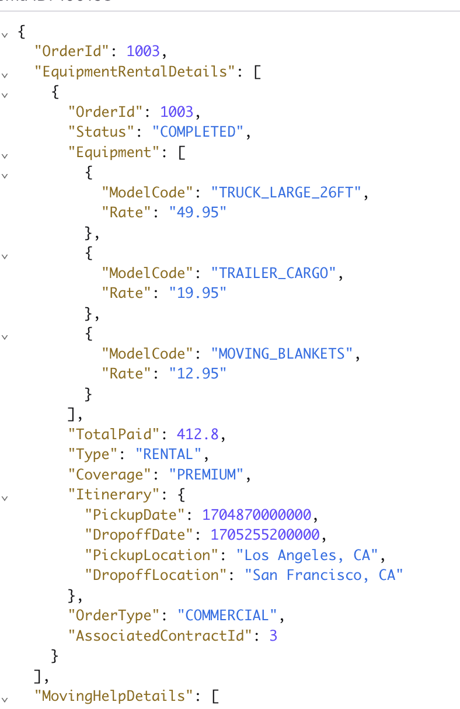
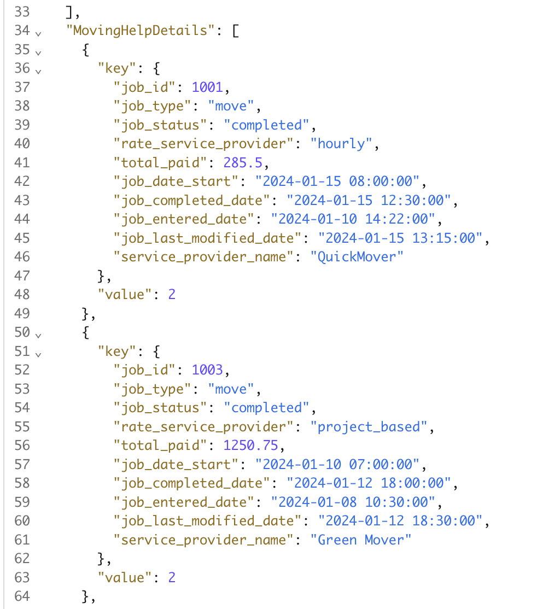

# Json Transformation in CC Flink

This folder includes the SQL statements to deploy for testing the same logic on the managed service: the Confluent Cloud for Flink. This is a good approach to validate the business logic and rules in a self managed environment to reduce platform setup dependencies.

## Steps to demonstrate the Json transformation logic

### Preparation

1. Create the raw input tables:
    * ddl.raw_orders.sql
    * ddl.raw_jobs.sql

1. Create the target sink table:
    * ddl.order_details.sql

1. Insert records to orders
    * dml.insert_raw_jobs.sql
    * dml.insert_raw_orders.sql
1. Verify records are visibles:
    ```sql
    select * from raw_orders
    select * from raw_jobs
    ```

### Build the Transformation logic. 

The OrderDetails is a json with EquipmentRentalDetails, an array of EquipmentRentalDetail, an orderid and the MovingHelpDetails.
1. The first goal is to build EquipmentRentalDetail and no MovingHelpDetails, see the [dml.extract_equipment_details.sql](./dml.extract_equipment_rental_details.sql)

1. Verify join will return results:
    ```sql
    select * from raw_jobs j left join raw_orders o on j.order_id = o.OrderId
    ```

1. Combine the two, by using CTEs:
    ```sql
    SELECT
        o.OrderId,
        ARRAY[
            row(
            o.OrderId,
            o.Status,
            o.Equipment,
            o.TotalPaid,
            o.`Type`,
            o.Coverage,
            o.Itinerary,
            o.OrderType,
            CAST(o.AssociatedContractId as BIGINT)
            )
        ] as EquipmentRentalDetails,
        ARRAY[ 
            ROW(
                j.job_id, 
                j.job_type,
                j.job_status,
                j.rate_service_provider,
                j.total_paid,
                j.job_date_start,
            j.job_completed_date,
            j.job_entered_date,
            j.job_last_modified_date,
            j.service_provider_name)
            ] as MovingHelpDetails
        from `raw-orders` o join raw_jobs j on j.order_id = o.OrderId
    ```

1. Group by and collect the jobdetail in an array: see the [dml.insert.order_details.sql](./dml.insert.order_details.sql)


### Validate the results
In the table view with: `select * from order_details` or with a json format:
    ```sql
    select OrderId, json_array(`EquipmentRentalDetails`), `MovingHelpDetails` from order_details
    ```






### Cleanup
    ```sql
    drop table order_details
    drop table raw_jobs
    drop table raw_orders
    ```