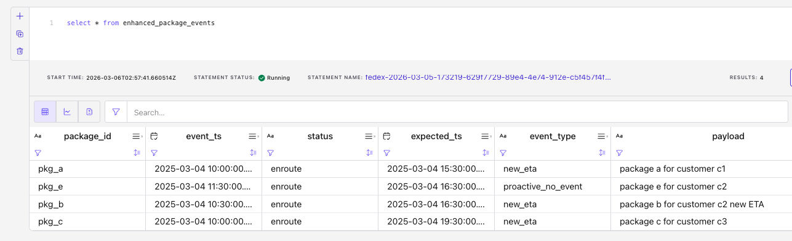

# Package morning cutoff (11:30) – Flink SQL demo

End-to-end demo: shipping package events are sent to the Kafka package_events  topic. There is a package_id as unique key. The major other fields are event_time and expected_delivery time.

## Goals
The demonstration presents:

1. Emit output only when expected_delivery changed
2. In the morning, there will be a  **cut off time at 11:30am**. By cutoff time we either pass through every received events or, for any expected package that had no recent event, proactively publish an event with same expected delivery time but a new event time that will be the cut-off time.

## Approach

### 1- Keep last expected_delivery per package

* One solution is using the last record on package_id, expected_ts:

   ```sql
   SELECT package_id, event_ts, status, expected_ts, payload
   FROM (
   SELECT *,
      ROW_NUMBER() OVER (
         PARTITION BY package_id, expected_ts
         ORDER BY event_ts ASC
      ) AS row_num
   FROM package_events
   )
   WHERE row_num = 1
   ```

   The matching SQLs are:
   - **src DDL**: `sql-scripts/ddl.package_events.sql`
   - **sink DDL**: `sql-scripts/ddl.last_expected_ts_package_events.sql` (sink table).
   - **DML**: `sql-scripts/dml.package_events_on_expected_ts_change.sql` (deduplication by package_id, expected_ts).

* A second approach is to use LAG and OVER time_window. You can also treat “emit when changed” as: emit when expected_ts is different from the previous row’s expected_ts (or there is no previous row):
   ```sql
   SELECT package_id, event_ts, status, expected_ts, payload
   FROM (
   SELECT *,
      LAG(expected_ts) OVER (PARTITION BY package_id ORDER BY event_ts) AS prev_expected_ts
   FROM package_events
   )
   WHERE prev_expected_ts IS NULL OR expected_ts <> prev_expected_ts
   ```

  one row per “change” of expected_ts per package_id. This is the `dml.package_event_expected_ts_with_lag.sql`


### 2- Emit events at cut off time
For the second use case, at cutoff time, for each expected package that had **no** event before cutoff and some time window size, emit one row with `event_type = 'proactive_no_event'` and `event_ts = cutoff_ts`.

Use a stream of cutoff timestamps (`cutoff_ts`). One record per cutoff (e.g. one per day at 11:30). In production an external scheduler or job publishes this; in tests the test data injects it.

All three use **event time** and watermarks so that “before 11:30” is well-defined and tests are deterministic.

```sql
insert into  enhanced_package_events 
with proactive_events as (
  SELECT
    e.package_id,
    c.cutoff_ts as event_ts,
    e.status,
    e.expected_ts,
    'proactive_no_event' as event_type,
    e.payload
  FROM package_events e
  left JOIN cutoff_triggers c
    ON  e.event_ts BETWEEN c.cutoff_ts - INTERVAL '24' HOUR AND c.cutoff_ts - INTERVAL '2' hour
),
dedup_proactive_events as (
 SELECT package_id, event_ts, status, expected_ts, event_type, payload
  FROM (
    SELECT *,
      ROW_NUMBER() OVER (
        PARTITION BY package_id
        ORDER BY event_ts DESC
      ) AS row_num
    FROM proactive_events
  )
  where row_num = 1
 )
select * from dedup_proactive_events
union all
select * from last_expected_ts_package_events

```

Output is a single stream (union of both paths) for downstream consumers.

Below is the results



## Running the demonstration

1. Prerequisites: Have access to Confluent Cloud, Kafka, Flink compute pool and confluent cli.
### Confluent Cloud Flink Workspace
1. If using Confluent Cloud Flink Workspace, just copy past the ddls and insert + dml in the good order:
   1. DDL: `sql-scripts/ddl.package_events.sql`
   1. DDL: `sql-scripts/last_expected_ts_package_events.sql`
   1. Insert: `tests/insert_package_events.sql`
1. Start first use case
   1. DML: `sql-scripts/dml.package_events_on_expected_ts_change.sql`

3. Start the 2nd use case: run 
   1. DDL for cutoff trigger: `sql-scripts/ddl.cutoff_triggers.sql`
   1. insert one record: `tests/insert_cutoff_trigger.sql`
   1. Execute DSP logic: `sql-scripts/dml.package_morning_cutoff.sql`

### Automatic deployment with confluent cli

* Set environment variables:
   ```sh
   export FLINK_DATABASE='kafka-cluster-name'
   export FLINK_COMPUTE_POOL='cpf'
   export FLINK_ENVIRONMENT='env...'
   ```

* `./run_use_case_1.sh`
* Then run second use case
   ```sh
   ./run_user_case_2.sh
   ```

## Terraform deployment

The terraform is under IaC-for-CC
To finish!!!