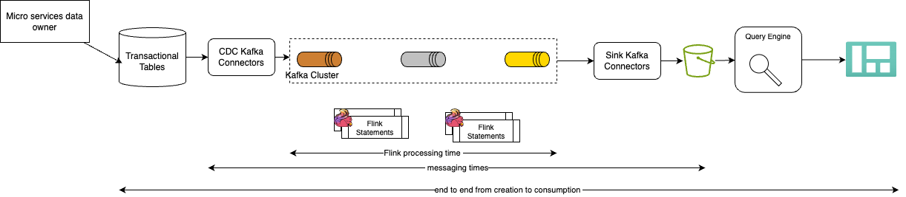

# End-to-End Performance Assessment for Flink Jobs

This demo implements a repeatable approach to measure Flink job performance: from a dedicated Kafka producer (data generator) through one or more Flink jobs to measure. The design follows the performance testing approach (see [cookbook chapter](flink-studies/cookbook/job_lifecycle/#60-establish-a-performance-testing-platform)) and the timing model in depicted in the figure below:



## Goals

- Measure **throughput** (events/second) and **latency** (source to sink) for Flink jobs.
- Compare different job types: Table API + SQL (SqlExecutor-style), DataStream, and pure Flink SQL.
- Keep the **data generator** separate from Flink so producer rate and message size can be tuned independently (see [Optimize Kafka producer throughput](https://developer.confluent.io/confluent-tutorials/optimize-producer-throughput/kafka/)).

## Architecture

```
[Data Generator]  -->  Kafka topic(s)  -->  [Flink Job A / B / C]  -->  Sink(s)
     (producer)         (input)              (jobs under test)         (Kafka/print)
```

- **Data generator**: Standalone Java (or other) process that produces records to Kafka with configurable rate, message size, and payload shape. Inspired by patterns such as Confluent's DataGeneratorJob (e.g. flight or generic event generation).
- **Flink jobs**: Several example jobs under `flink-jobs/` consume from those topics and write to a sink. Each subfolder holds one job variant to assess.
- **Metrics**: Flink processing time, consumer lag, and end-to-end latency from production to consumption (aligned with the diagram: Flink processing time, messaging times, end-to-end from creation to consumption).

## Repository Layout

```
e2e-demos/perf-testing/
├── README.md                 # This file
├── producer/                 # Standalone Kafka data generator
│   └── README.md
├── flink-jobs/               # Flink applications used for performance assessment
│   ├── sql-executor/         # Table API + SQL from file (SqlExecutor-style)
│   │   └── README.md
│   ├── datastream/           # DataStream API job example (optional)
│   │   └── README.md
│   └── flink-sql/            # Pure Flink SQL statements / SQL gateway (optional)
│       └── README.md
└── scripts/                  # Automation: topics, run producer, deploy jobs, collect metrics
    └── README.md
```

## Quick start

Prerequisites: Java 17+, Maven, Kubernetes with Flink and Kafka deployed.

```bash
# Build all components
mvn -f producer clean package -DskipTests
mvn -f flink-jobs/sql-executor clean package -DskipTests
mvn -f flink-jobs/datastream clean package -DskipTests

# Create topics (input perf-input, output perf-output)
./scripts/create-topics.sh

# Run producer (default 1000 msg/s, 60s)
export BOOTSTRAP_SERVERS=localhost:9092
./scripts/run-producer.sh

# Submit Flink job (sql-executor or datastream)
./scripts/run-flink-job.sh sql-executor
```

Producer CLI/env: `topic`, `rate` (msg/s), `messageSize` (bytes), `duration` (s), `threads`. Flink jobs use env `INPUT_TOPIC` (default `perf-input`), `OUTPUT_TOPIC` (default `perf-output`).

## Approach

### 1. Environment

- Provision a Kubernetes cluster with Kafka, Flink, and Prometheus (e.g. [Rick Osowki's confluent-platform-gitops repository](https://github.com/jbcodeforce/confluent-platform-gitops) to get everything runnig on Kubernetes platoform).
- Ensure Kafka bootstrap and (if used) Schema Registry are reachable from the producer and from the Flink job manager/task managers.

### 2. Kafka Topics

- Create and configure input/output topics (partitions, retention) before the run.
- Scripts under `scripts/` can create topics.
    ```sh
    ./scripts/create-topics.sh
    ```

### 3. Calibrate the Data Generator

- Run the producer in `producer/` with different settings:
  - Number of producer threads.
  - Message size and payload type (e.g. JSON with fixed or variable fields).
  - Target rate (messages per second) or maximum throughput.
- Tune Kafka producer settings (batch size, linger, compression) for throughput or latency as needed.

To run the producer, you can use java directly or deploy to the same kubernetes cluster as the Kafka cluster.

### 4. Run the Benchmark

1. Start the data generator; record start time and configuration (rate, size, topic).
2. Deploy and start the Flink job(s) under test from `flink-jobs/` (one variant per run for clear metrics).
3. Let the system reach steady state (e.g. lag stable).
4. Collect metrics over a fixed window (e.g. 5–10 minutes).

### 5. Metrics to Collect

- **Flink**: Processing rate (records in/out per second), backpressure, checkpoint duration, task manager CPU/memory (Flink Web UI and/or Prometheus).
- **Kafka**: Consumer lag per partition for the job’s source topics.
- **End-to-end**: Timestamp at production to timestamp at sink (if payloads carry a creation time and sink is Kafka or another queryable sink).

See also the metrics list in [shift_left_utils perf_test](../../../shift_left_utils/docs/perf_test.md) (e.g. deploy time, lag processing time, messages per second per statement).

### 6. Assess Results

- Use the Flink console and Prometheus/Grafana to assess throughput, latency, and resource usage.
- Compare runs across job types (sql-executor vs datastream vs flink-sql) and across producer configurations.

## Component Details

### Producer (`producer/`)

- **Role**: Standalone Kafka producer that emits records to the input topic(s) used by Flink jobs.
- **Pattern**: Similar to [DataGeneratorJob](https://github.com/confluentinc/cp-flink-labs) style: configurable schema (e.g. key/value), rate, and optional payload size. Implemented in Java (Kafka client) so it can be tuned without touching Flink.
- **Output**: Topics and formats must match what the Flink jobs in `flink-jobs/` expect (e.g. JSON, Avro, keyed by a field for partitioning).

### Flink Jobs (`flink-jobs/`)

- **sql-executor**: Table API + SQL executed from a file (e.g. DDL + DML), analogous to SqlExecutor: create table environment, register Kafka source/sink, run `executeSql` for each statement. Use this to assess Table API/SQL pipeline performance.
- **datastream**: Optional DataStream job (e.g. keyed aggregation, windowing) for comparison with the SQL-based pipeline.
- **flink-sql**: Optional pure Flink SQL (e.g. SQL files or SQL gateway) for environments where only SQL is deployed.

Each subfolder contains the build (Maven/Gradle), a short README, and instructions to point the job at the same Kafka topics and bootstrap used by the producer.

### Scripts (`scripts/`)

- Create/delete Kafka topics for the benchmark.
- Launch the producer with a given profile (rate, size, duration).
- Submit or deploy the chosen Flink job (e.g. `flink run` or platform-specific CLI).
- Optionally export or query metrics (Prometheus, Flink REST) for post-processing.

## References

- [flink-studies – Job lifecycle and state](https://github.com/jbcodeforce/flink-studies/blob/master/docs/cookbook/job_lifecycle.md)
- [Confluent – Optimize producer throughput](https://developer.confluent.io/confluent-tutorials/optimize-producer-throughput/kafka/)
- Apache Flink []()
- Robert Metzger's work on performance testing.
