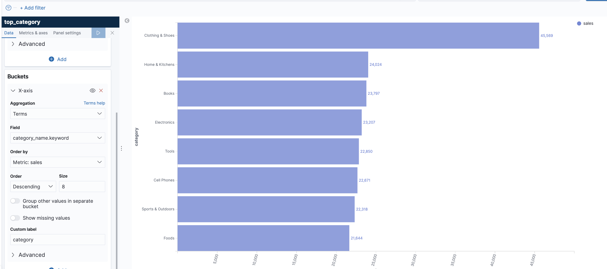

# Flink SQL Demo: Building an End-to-End Streaming Application

This demo takes a closer look at how to quickly build streaming applications with Flink SQL.
It integrates Kafka, MySQL, Elasticsearch, and Kibana with Flink SQL to analyze e-commerce user behavior in real-time.

The demo explanation is [here](https://flink.apache.org/2020/07/28/flink-sql-demo-building-e2e-streaming-application.html).


Source code is [wuchong/flink-sql-demo](https://github.com/wuchong/flink-sql-demo/)

## Demo summary and updates

GenCode component writes events to Kafka, as user's behaviors including “click”, “like”, “purchase” and “add to shopping cart” events.

The dataset is from the Alibaba Cloud Tianchi public dataset.

As of 11/02/2021, there some differences with the commands explained in the demo documentation:

* Access to client SQL

```sh
docker compose sql-client bash
# or
docker-compose exec sql-client ./sql-client.sh
```
* To see message in topic

```sh
 ./console-consumer.sh 
```

* In order to make the events in the Kafka topic accessible to [Flink SQL](https://nightlies.apache.org/flink/flink-docs-release-1.11/dev/table/sql/create.html#create-table), we create a table that connects to the topic:

    ```sql
    CREATE TABLE user_behavior (
        user_id BIGINT,
        item_id BIGINT,
        category_id BIGINT,
        behavior STRING,
        ts TIMESTAMP(3),
        proctime AS PROCTIME(),   -- generates processing-time attribute using computed column
        WATERMARK FOR ts AS ts - INTERVAL '5' SECOND  -- defines watermark on ts column, marks ts as event-time attribute
    ) WITH (
        'connector' = 'kafka',  -- using kafka connector
        'topic' = 'user_behavior',  -- kafka topic
        'scan.startup.mode' = 'earliest-offset',  -- reading from the beginning
        'properties.bootstrap.servers' = 'kafka:29092',  -- kafka broker address
        'format' = 'json'  -- the data format is json
    );
    ```

    * PROCTIME() function to declare a virtual column that generates the processing-time attribute
    * WATERMARK function to declare the watermark strategy on the ts field (tolerate 5-seconds out-of-order).

* See created tables:

```sql
 SHOW TABLES;
 DESCRIBE user_behavior;
```

### Hourly trading volume

Compute the number of buy per hour of a day. The following table is in ElasticSearch. ElasticSearch will automatically create the index if it does not exist.

```sql
CREATE TABLE buy_cnt_per_hour (
    hour_of_day BIGINT,
    buy_cnt BIGINT
) WITH (
    'connector' = 'elasticsearch-7', -- using elasticsearch connector
    'hosts' = 'http://elasticsearch:9200',  -- elasticsearch address
    'index' = 'buy_cnt_per_hour'  -- elasticsearch index name, similar to database table name
);
```

The following query is sent by the client SQL to the Flink cluster, which will start
a job that is continuously writing results into ElasticSearch `buy_cnt_per_hour` index. The TUMBLE window function assigns data 
into hourly windows. use COUNT(*) to count all rows in the 1 hour time window.

```sql
INSERT INTO buy_cnt_per_hour
SELECT HOUR(TUMBLE_START(ts, INTERVAL '1' HOUR)), COUNT(*)
FROM user_behavior
WHERE behavior = 'buy'
GROUP BY TUMBLE(ts, INTERVAL '1' HOUR);
```

It uses the built-in HOUR function to extract the value for each hour in the day from a TIMESTAMP column. HOUR(TUMBLE_START(ts, INTERVAL '1' HOUR)) is mapped to hour_of_day column, and COUNT(*) to buy_cnt

* [Flink UI](http://localhost:8081/#/overview) to see the running job
* [Kibana Dashboard](http://localhost:5601/app/kibana)

  * Configure an index pattern by clicking “Management” in the left-side toolbar and find “Index Patterns”. 
  * Next, click “Create Index Pattern” button and enter the full index name buy_cnt_per_hour to create the index pattern
  * Add Dashboard > Add a Visualization > Area >  with Y axes as Max `Cnt_buy` and X as `Term`, Field: hour_of_the_day, Order by Alphabetical, Ascending size: 24. Use the Run button to see the diagram.

  We can see that during the early morning hours the number of transactions have the lowest value for the entire day.

### Cumulative number of Unique Visitors every 10-min

Visualize the cumulative number of unique visitors (UV). The approach is to count the number of distinct user_id per 10 min. So we need 
a table with a row = 10 mn time + uv = count of distinct userids.

* create another Elasticsearch table in the SQL CLI to store the UV results.

   ```SQL
   CREATE TABLE cumulative_uv (
    date_str STRING,
    time_str STRING,
    uv BIGINT,
    PRIMARY KEY (date_str, time_str) NOT ENFORCED
    ) WITH (
        'connector' = 'elasticsearch-7',
        'hosts' = 'http://elasticsearch:9200',
        'index' = 'cumulative_uv'
    );
    ```

* build a query to insert record using DATE_FORMAT function based on the ts field. we only need to report every 10 minutes. 

   ```SQL
    INSERT INTO cumulative_uv
    SELECT date_str, MAX(time_str), COUNT(DISTINCT user_id) as uv
    FROM (
    SELECT
        DATE_FORMAT(ts, 'yyyy-MM-dd') as date_str,
        SUBSTR(DATE_FORMAT(ts, 'HH:mm'),1,4) || '0' as time_str,
        user_id
    FROM user_behavior)
    GROUP BY date_str;
    ```


    * use SUBSTR and the string concat function `||` to convert the time value into a 10-minute interval time string, such as 12:00, 12:10
    * group data by date_str and perform a COUNT DISTINCT aggregation on user_id to get the current cumulative UV in this day
    * perform a MAX aggregation on time_str field to get the current stream time: the maximum event time observed so far
    * As the maximum time is also a part of the primary key of the sink, the final result is that we will insert a new point into the elasticsearch every 10 minute. 
    * And every latest point will be updated continuously until the next 10-minute point is generated.

* to visualize, create a new index pattern in Kibana to match the `cummulative_uv` collection of Elasticsearch, using `data_str`, then add a LINE GRAPH view to the dashboard. The view is defined as: Y axis as Aggregation: Max Filed: uv, and Bucket: X axis, with Aggregation: terms of time_str:keyword, Order by alphabetical, ascending of size 150.

### Top Categories

Build visualization to present the most popular categories in the e-commerce site.
This is done by joining SQL table to Kafka stream

* Use Flink JDBC connector to create a table view from MySQL table as a reference data, for data enrichment use case

```sql
CREATE TABLE category_dim (
    sub_category_id BIGINT,
    parent_category_name STRING
) WITH (
    'connector' = 'jdbc',
    'url' = 'jdbc:mysql://mysql:3306/flink',
    'table-name' = 'category',
    'username' = 'root',
    'password' = '123456',
    'lookup.cache.max-rows' = '5000',
    'lookup.cache.ttl' = '10min'
);
```

* Elasticsearch table to store the category statistics

```sql
CREATE TABLE top_category (
    category_name STRING PRIMARY KEY NOT ENFORCED,
    buy_cnt BIGINT
) WITH (
    'connector' = 'elasticsearch-7',
    'hosts' = 'http://elasticsearch:9200',
    'index' = 'top_category'
);
```

The underlying JDBC connector implements the LookupTableSource interface, so the created JDBC table `category_dim` can be used as a temporal table in the data_enrichment.

CREATE VIEW syntax is used to register the query as a logical view, allowing us to easily reference this query in subsequent queries and simplify nested queries. Please note that creating a logical view does not trigger the execution of the job and the view results are not persisted. Therefore, this statement is lightweight and does not have additional overhead.

```sql
CREATE VIEW rich_user_behavior AS
SELECT U.user_id, U.item_id, U.behavior, C.parent_category_name as category_name
FROM user_behavior AS U LEFT JOIN category_dim FOR SYSTEM_TIME AS OF U.proctime AS C
ON U.category_id = C.sub_category_id;
```

* The Flink job: group the dimensional table by category name to count the number of buy events and write the result to Elasticsearch’s top_category index.

```sql
INSERT INTO top_category
SELECT category_name, COUNT(*) buy_cnt
FROM rich_user_behavior
WHERE behavior = 'buy'
GROUP BY category_name;
```

* create a top_category index pattern in Kibana. We then create a “Horizontal Bar” (bar graph) on the dashboard, by selecting the top_category index. 

    * Y axis: Agg: Max on buy_cnt, Custom label is sales
    * Bucket: X-Axis, Agg: Terms, category_name.keyword, Order by Metric: sales, ascending order size 8. Custom label is category

