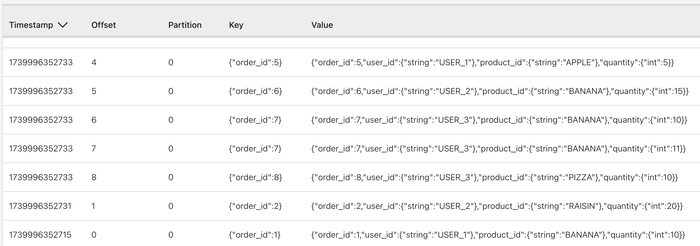

# Deeper understanding of the Append log impact

Those examples are for Confluent Cloud.

## Append mode tests

The append mode is the simplest mode where records are only added to the result stream, never updated or retracted. Like a write-once data. Every insertion can be treated as an independent immutable fact. The $rowtime column and system watermark are added implicitly. It is used for regular SELECT queries without aggregations per key.


```sql
create table if not exists orders (
    order_id STRING primary key not enforced,
    product_id STRING,
    quantity INT
) DISTRIBUTED into 1 BUCKETS 
with (
    'changelog.mode' = 'append',
    'value.fields-include' = 'all'
);
```

This is the default parameters once created:

```
WITH (
  'changelog.mode' = 'append',
  'connector' = 'confluent',
  'kafka.cleanup-policy' = 'delete',
  'kafka.max-message-size' = '2097164 bytes',
  'kafka.retention.size' = '0 bytes',
  'kafka.retention.time' = '7 d',
  'key.format' = 'avro-registry',
  'scan.bounded.mode' = 'unbounded',
  'scan.startup.mode' = 'earliest-offset',
  'value.format' = 'avro-registry'
)
```


* We need to add some records with same keys

```sql
insert into orders 
values  ('ORD_1', 'BANANA', 10),
        ('ORD_2', 'RAISIN', 20),
        ('ORD_1', 'PIZZA', 12),
        ('ORD_2', 'CIDER', 22),
        ('ORD_1', 'BANANA', 13),
        ('ORD_2', 'APPLE', 23)
    ;
```

See kafka topic has all the 6 records in the order of insertion.



* `select * from orders` returns the last 2 records per key. 
* `select product_id, order_id, sum(quantity) as total from orders group by product_id, order_id;` returns:

    ```sql
    product_id, order_id, total
    RAISIN, ORD_2, 20
    PIZZA, ORD_1, 12
    CIDER, ORD_2, 22
    BANANA, ORD_1, 23
    APPLE, ORD_2, 23
    ```

## Upsert table

This mode is similar to retract mode but more efficient for key-based operations. Instead of sending separate retraction and addition records, it sends a single upsert record that replaces the old value for a given key.

* Create an upsert table, the topics has still the 6 records

```sql
create table if not exists orders (
    order_id STRING primary key not enforced,
    product_id STRING,
    quantity INT
) DISTRIBUTED into 1 BUCKETS 
with (
    'changelog.mode' = 'upsert',
    'value.fields-include' = 'all'
);
```

* But the `select product_id, order_id, sum(quantity) as total from orders group by product_id, order_id;` returns now only the last two rows: (same for `select * from orders;`)

    ```sql
    BANANA, ORD_1, 13
    APPLE, ORD_2, 23
    ```

And same result for `select product_id,  sum(quantity) as total from orders group by product_id;`

## Retract mode

For retract mode, Flink emits pairs of retraction and addition records. When updating a value, it first sends a retraction of the old record (negative record) followed by the addition of the new record (positive record). It means a fact can be undone, and the combination of +X and -X are related and must be partitioned together. Records are related by all the columns so the entire row is the key.

```sql
create table if not exists orders (
    order_id STRING primary key not enforced,
    product_id STRING,
    quantity INT
) DISTRIBUTED into 1 BUCKETS 
with (
    'changelog.mode' = 'retract',
    'value.fields-include' = 'all'
);
```

* `select * from orders;` returns the two last rows per key.

* `select product_id, order_id sum(quantity) as total from orders group by product_id, order_id;` returns 

```
    RAISIN, ORD_2, 20
    PIZZA, ORD_1, 12
    CIDER, ORD_2, 22
    BANANA, ORD_1, 23
    APPLE, ORD_2, 23
```

It is useful for aggregations that need to be updated, and queries with GROUP BY clauses

## Combining append -> retract

This is a classical pattern to get data from a CDC layer and apply deduplication with an upsert table. To simulate, first create the orders in append log and then a CTAS to create a dedup table with upsert:

* Create the append as above, and add the 6 orders. Then create a CTAS as:

```sql
create table if not exists order_deduped(
  product_id STRING NOT NULL,
  order_id STRING NOT NULL,
  quantity int,
  primary key(product_id, order_id) not enforced
) distributed by hash(product_id, order_id) into 1 buckets
with (
  'changelog.mode' = 'retract',
  'scan.bounded.mode' = 'unbounded',
  'scan.startup.mode' = 'earliest-offset',
  'value.fields-include' = 'all'
)
as 
    select coalesce(product_id,'NONE') as product_id, order_id, quantity from orders;

```
If the CTAS stop then the results will be wrong. It looks it is better to use as ddl and then an insert into.

The content in the topic looks like:


While the result of `select * from order_deduped;` return only the last record of the pair <product_id, order_id>

BANANA, ORD_1, 13
RAISIN, ORD_2, 20
PIZZA, ORD_1,  12
CIDER, ORD_2,  22
APPLE, ORD_2,  23

* Adding some aggregation, first we want to add 2 records:

```sql
insert into orders 
values  ('ORD_1', 'BANANA', 10),
        ('ORD_2', 'CIDER', 10);
```

and then execute: `select product_id, order_id, sum(quantity) as total from order_deduped group by (product_id, order_id);`. The results are:

RAISIN, ORD_2, 20
PIZZA, ORD_1,  12
CIDER, ORD_2,  22
BANANA, ORD_1, 23
APPLE, ORD_2,  23

instead of BANANA, ORD_1, 33 and CIDER, ORD_2, 32

Lets add a 3nd table:

```
create table if not exists product_sale (
    product_id STRING NOT NULL,
    order_id STRING NOT NULL,
    total INT
)
```