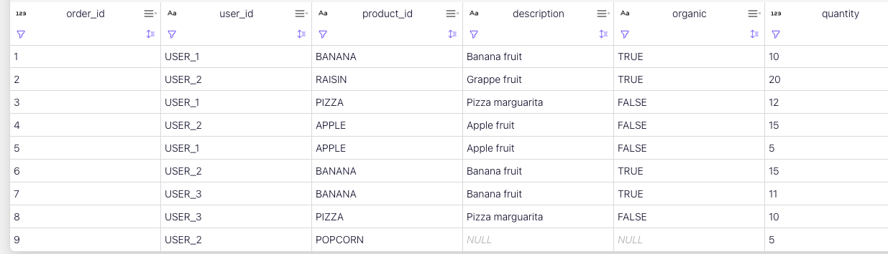
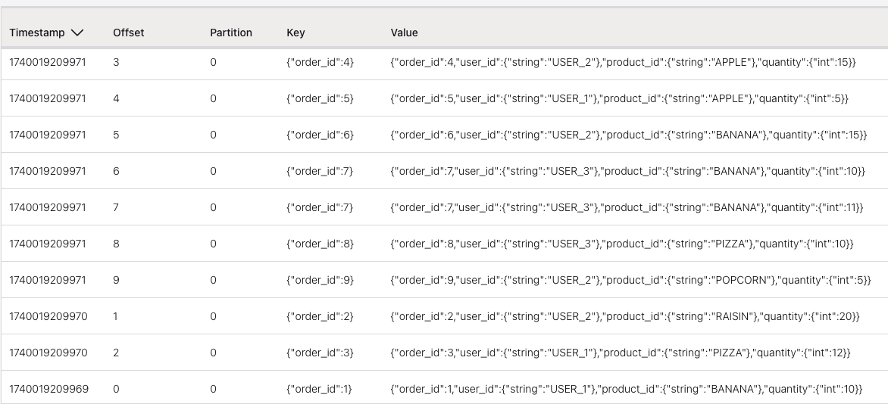

# Deeper understanding of the changelog mode impact

This folder includes a set of sqls to demonstrate the impact of using different changelog mode to different operations like joins and aggregations.

Those examples are for Confluent Cloud and Flink SQL can be deployed using Confluent CLI.

## setup

* Login to Confluent Cloud
* Define the Kafka API Key to use

```sh
confluent api-key use <api_key_name>
```

## Append mode tests

The append mode is the simplest mode where records are only added to the result stream, never updated or retracted. Like a write-once data. Every insertion can be treated as an independent immutable fact. The $rowtime column and system watermark are added implicitly. It is used for regular SELECT queries without aggregations per key.

The `ddl.orders-append-mode.sql` creates such table. 

```sh
make deploy_append_mode
```

* We need to add 10 order records for 3 users, with one duplicate (same order_id)

```sh
make insert_orders
```

The Kafka topic has all the records in the order of insertion, so source topic has duplicate records:


* `select * from orders` returns the last records per key. So giving the impression that the results are good.

* The query: `select product_id, sum(quantity) as total from orders group by product_id;` returns wrong results:

    ```sql
    product_id, total
    RAISIN, 20
    PIZZA, 22
    BANANA, 46
    APPLE, 20
    POPCORN, 5
    ```

as BANANA is counting the duplicates, the right result should be `BANANA, 36`. 

* AS another example to validate JOIN behavior, add a product table. The Products table may be considered as a reference table, quite static per nature: 

```sh
make deploy_products
make insert_products
```

* A join between the two append mode tables, generates all the records, including the duplicates, as the left side has duplicates:

```sql
select 
    o.user_id,
    o.product_id,
    p.description,
    p.organic,
    o.quantity
from orders as o
left join products as p ON o.product_id = p.product_id
```


Same if we insert the results into an output topic: the topic has duplicates, which is expected.

```sql
create table enriched_orders (
  order_id int primary key not enforced
)
distributed by(order_id) into 1 buckets
with (
  'changelog.mode'='append',
   'value.fields-include' = 'all'  -- keep order_id in value schema
) as
select 
    o.order_id,
    o.user_id,
    o.product_id,
    p.description,
    p.organic,
    o.quantity
from orders as o
left join products as p ON o.product_id = p.product_id
```

## Retract mode

For retract mode, Flink emits pairs of retraction and addition records. When updating a value, it first sends a retraction of the old record (negative record) followed by the addition of the new record (positive record). It means, a fact can be undone, and the combination of +X and -X are related and must be partitioned together. Records are related by all the columns so the entire row is the key.

Use the following commands to create the table, after cleaning the orders table:

```sh
make drop_orders
make deploy_orders_retract_mode
make insert_orders
```

The topic has duplicates records as expected.

* `select * from orders;` returns no duplicate and gives good results: the record with order_id =7 has the quantity 11 instead of 10.
* Adding to a dedup table with a CTAS like below, get no duplicate when using `select * from order_deduped`, even if in the topic duplicate records exist. The primary key is the `order_id` as in the source table `orders`.

```sql
create table orders_deduped 
distributed by (order_id) into 1 buckets
with (
    'changelog.mode' = 'retract',
    'value.fields-include' = 'all'
)
as select * from orders;
```

* The aggregation: `select product_id, sum(quantity) as total from orders group by product_id;` returns the same wrong result

    ```sql
    product_id, total
    RAISIN, 20
    PIZZA, 22
    BANANA, 46
    APPLE, 20
    POPCORN, 5
    ```

* Doing the join with products with an output topic in retract mode, we got the good results for a `select * from enriched_orders`. See previous CTAS but with a retract changelog mode:

```sql
create table enriched_orders (
  order_id int primary key not enforced
)
distributed by(order_id) into 1 buckets
with (
  'changelog.mode'='retract',
  ...
```

What is in interresting, are the records in the topics. For 9 records in the input orders topic, the output topic has 19 messages.


Some records have this content with no header

```json
{
  "order_id": 2,
  "user_id": {
    "string": "USER_2"
  },
  "product_id": "RAISIN",
  "description": null,
  "organic": null,
  "quantity": {
    "int": 20
  }
}
```

Then in a higher offset a record with the same key and empty value but with a header representing a DELETE:

```json
[
  { "key": "op",
    "value": "\u0003"
  }
]
```

The next record with the same key has finally the join result and an empty header. 

When performing joins, Flink needs to handle scenarios where joined records become invalid due to updates or deletions in the source tables.

Flink uses these operation flags to track different types of changes:

```properties
\u0001 = INSERT
\u0002 = UPDATE_BEFORE
\u0003 = UPDATE_AFTER
\u0004 = DELETE
```

For the duplicate message, the header has UPDATE_BEFORE for the record with quantity 11.

Finally the last message in the order has no marching product.

With retract mode a consumer outside of Flink need to interpret the header.

## Upsert table

Finally, this mode is similar to retract mode but more efficient for key-based operations. Instead of sending separate retraction and addition records, it sends a single upsert record that replaces the old value for a given key and a tombstone record with value = "".

* Create an upsert table, the topics has still the 11 records with the duplicate, but `select * from orders` is giving good results (the record with order_id =7 has the quantity 11 instead of 10).

```sh
make drop_orders
make drop_enriched_orders
make deploy_orders_upsert_mode
make insert_orders
```

* Also aggregation like `select product_id, sum(quantity) as total from orders group by product_id;` returns now the good results!

    ```sql
       product_id, total
    RAISIN, 20
    PIZZA, 22
    BANANA, 36
    APPLE, 20
    POPCORN, 5
    ```

* The joins is returning the good results as in the figure below:



Adding results to a table via CTAS, gives 12 records as one tombstone record is added for the duplicate message of order_id 7, to remove the record with quantity 10 for a new record with quantity 11.

The tombstone needs to be managed by the consumer of the topic.

## Combining append -> deduped upsert --> enriched upsert

This is a classical pattern to get data from a CDC layer and apply deduplication with an upsert table. To simulate this pattern, first create the orders in append log and then a CTAS to create a dedup table with upsert on the order_id primary key:

* Create the append table without primary key:

```sql
create table if not exists orders (
    order_id INT,
    user_id STRING,
    product_id STRING,
    quantity INT
) DISTRIBUTED into 1 BUCKETS 
with (
    'changelog.mode' = 'append',
    'value.fields-include' = 'all'
);
```

* Add the 9 orders. Then create a CTAS as:

```sql
create table if not exists orders_deduped(
  order_id INT NOT NULL,
  user_id STRING,
  product_id STRING,
  quantity int,
  primary key(order_id) not enforced
) distributed by hash(order_id) into 1 buckets
with (
  'changelog.mode' = 'upsert',
  'scan.bounded.mode' = 'unbounded',
  'scan.startup.mode' = 'earliest-offset',
  'value.fields-include' = 'all'
)
as 
    select coalesce(order_id,0) as order_id, user_id, product_id, quantity from orders;

```

If the CTAS stop then the results will be wrong. It is better to use as ddl and then an dml with insert into.

The content in the topic looks like:



While the result of `select * from order_deduped;` return only the last record of the pair order_id = 7

* Adding aggregation from the order_deduped gives the good result of 36 bananas.
* The last operation is to join with products, using for example a CTAS. If we create a table with append mode for the `enriched_orders` we get the following error:

```sh
enriched_orders doesn't support consuming update and delete changes which is produced by node Join(joinType=[LeftOuterJoin], where=[(product_id = product_id0)], select=[order_id, user_id, product_id, quantity, product_id0, description, organic], leftInputSpec=[HasUniqueKey], rightInputSpec=[JoinKeyContainsUniqueKey])
```

The topic is created and table are created but no records are published by the  CTAS.

So the `enriched_orders` needs to be upsert or retract. With this we got the same results as the previous two sections.

## Append with primary key to enriched append is not possible

For the same reason as above an append mode for a changelog does not support consuming update and delete changes which is produced by a Join.
