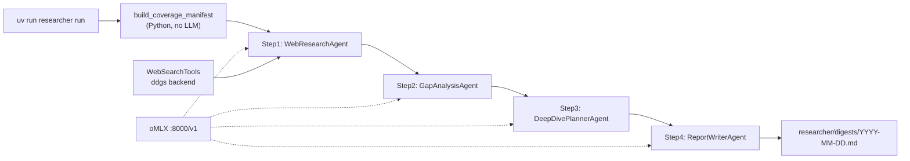

# Local Flink Research Digest for `jbcodeforce/flink-studies`

## Purpose

A **local, ad-hoc** research pipeline that finds recent Apache Flink and Confluent Flink news, compares findings against the existing repository content, and writes a per-run Markdown digest under `researcher/digests/`.

- **Runtime**: [oMLX](https://github.com/jundot/omlx) on Apple Silicon (`http://127.0.0.1:8000/v1`, OpenAI-compatible API)
- **Framework**: [Agno](https://docs.agno.com) `Workflow` with four sequential agent steps
- **Trigger**: Manual CLI run — no cron, no GitHub Actions, no cloud API keys
- **Output**: `researcher/digests/YYYY-MM-DD.md` (draft; human promotes items into the curated News page)

Digests are editorial drafts. The hand-curated [docs/news/index.md](../docs/news/index.md) remains authoritative.

## Key Findings

### 1. What the existing repo already covers

The repository is published as a book at `jbcodeforce.github.io/flink-studies` and is organized (per `mkdocs.yml` and `AGENTS.md`) into four pillars:

- **`docs/`** — the living book. Top-level nav: **News**, **Foundations** (Flink key concepts, Flink SQL concepts, getting started, agentic applications), **Cookbook** (deployment models, cluster management, job lifecycle, FKO & CMF deployment, fit-for-purpose, K8s tuning, project management, Confluent Cloud Terraform), **Flink App Coding** (SQL clients, CREATE TABLE, DML, Materialized Tables, Table API, DataStream API, UDFs, PTFs, dbt, stateful functions, CEP), **Methodology** (data-as-a-product, event storming, center of excellence), and **Related Technologies** (Confluent Cloud Flink, Confluent Platform for Flink, Kafka integration, Confluent Tableflow, dbt, Apache Iceberg).
- **`code/`** — `flink-sql`, `flink-java` (Quarkus app), `table-api` (Java + Python), `tools`.
- **`deployment/`** — `k8s` (Colima/Kubernetes, OSS Flink, CP Flink, MinIO, CFK, CMF, Keycloak), `product-tar` (Flink/Kafka binaries), `cc-terraform` (Confluent Cloud env, Kafka cluster, Flink compute pools).
- **`e2e-demos/`** — restructured demos with consistent `cccloud`/`cp-flink`/`oss-flink` layout (CDC, dedup, e-com-sale, external lookup, flink-to-feast, JSON transformation, savepoint demo, SQL gateway demo, etc.).

Critically, the repo **already has a curated News page** ("Last Flink News", created 03/11/2026, updated 05/17/2026) with three sections:

- **Apache Flink News** (dated): Flink K8s Operator 1.14.0 (Feb 15 2026, Blue/Green deployments); Flink Agents 0.2.0 (Feb 6 2026); Flink 2.2.0 (Dec 4 2025, ML_PREDICT + VECTOR_SEARCH); "From Stream to Lakehouse: Flink Dynamic Iceberg Sink" (Nov 11 2025).
- **Confluent Flink News**: Flink Native Inference, Streaming Agents, Flink Search (vector DB integration), Remote Model Support (Anthropic + Fireworks, "early 2026"), built-in ML functions, Snapshot Queries, Tableflow integration, Python UDFs, Flink SQL Query Profiler, custom error handling / DLQ, improved watermark strategy (180ms), progressive idleness detection, vector search on external DBs.

`AGENTS.md` ("Agent Description for Flink Studies Repository") describes agent responsibilities (maintain MkDocs structure, keep docs in sync with code, keep demos current with latest Flink versions, prioritize working executable examples, keep examples vendor-agnostic where possible) but contains **no commit-message or PR conventions** — the digest workflow should adopt simple, explicit conventions of its own (e.g. `docs(research): add Flink digest YYYY-MM-DD`).

### 2. Recent Flink topics NOT yet in the repo (seed expectations)

Cross-referencing the repo's News page (last updated May 17, 2026) against current sources reveals clear gaps the research agents should surface:

**Apache Flink (open source):**

- **Flink Kubernetes Operator 1.15.0** — Per the official Apache Flink blog (flink.apache.org, May 26, 2026): Kubernetes-native Conditions to FlinkDeployment, Logback logging support, bundled metric reporters, Flink 2.2 compatibility (a `Running` condition usable with `kubectl wait`). The repo only has 1.14.0.
- **Flink bug-fix releases not on the page**: per the Apache Flink Downloads page and release announcements (by Sergey Nuyanzin), **2.2.1** (2026-05-15, 44 fixes), **2.1.2** (2026-05-11, 45 fixes), **2.0.2** (2026-05-11, 34 fixes), and **1.20.4** (2026-04-22).
- **Flink CDC 3.6.0** — Per the official Apache Flink blog (March 30, 2026): bumps Flink version support to 1.20.x and 2.2.x and JDK to 11, adds an Apache Hudi Sink and Oracle Source pipeline connector (FLINK-36313 / FLINK-36796), PostgreSQL schema evolution (FLINK-38959), VARIANT type + PARSE_JSON in pipelines, AWS Glue / BigQuery catalogs for the Iceberg sink, and bumps the Fluss connector to 0.9.0-incubating (FLINK-38726).
- **Apache Flink Agents 0.2.1** — Per the Apache Flink Downloads page: includes 3 bug fixes, vulnerability fixes, and minor improvements for Flink-Agents 0.2. (The repo has 0.2.0.)
- **Delta Join deep-dive (Flink 2.2)** — CDC upsert support (FLINK-38511), built-in LRU caching (FLINK-38495), filter pushdown; plus the experimental `StreamingMultiJoinOperator`. The repo's SQL chapters don't yet cover these.
- **Apache Fluss (Incubating)** — streaming storage that pairs with Flink (Delta Joins externalize state into Fluss tables); 0.8 added Iceberg + Lance support and Flink 2.1 compatibility, with 0.9 and non-Java clients following. Entirely absent from the repo.

**Confluent Flink:**

- **Confluent Cloud Q2 2026 launch** (May 19, 2026): **dbt adapter for Confluent Cloud Flink** and **Materialized Tables GA**; **Real-Time Context Engine GA**; **Streaming Agents GA** (Agent Management Console GA); fully managed **MCP server + Agent Skills**; **AI_DETECT_PII** redaction; **Azure Private Link** to external models; new model support (TimesFM, sentiment analysis, Anthropic, Fireworks AI); **Snapshot Queries** (GA in June); **external connectivity for UDFs** (EA).
- **Confluent Platform 8.2** (built on Apache Kafka 4.2): **Flink SQL GA** in Confluent Manager for Flink, **Queues for Kafka GA**, CPC Gateway 1.2, shared compute pools (session clusters), multi-Kubernetes cluster support in **CMF 2.3.0/2.3.1**, RHEL 10 / OpenShift support.
- **State size limits** (soft/hard) in Confluent Cloud for Apache Flink, and **Process Table Functions** advancing to Open Preview with `@StateHint(ttl=…)`, multi-table inputs (up to 20 `SET_SEMANTIC_TABLE` args), and pass-through columns.
- **Confluent is now "an IBM Company"** — corporate context affecting roadmap (watsonx.data integration), plus FedRAMP 20x Moderate authorization.
- **The `dbt-confluent` adapter** repo and its limitations (no incremental/snapshots/schema management; `streaming_table` materialization) — a concrete coding-chapter opportunity.

These map naturally to repo gaps: a new "Apache Fluss" page under Related Technologies; Delta Join / MultiJoin additions to the SQL chapters; a Flink CDC YAML pipeline chapter; expansion of the dbt chapter; and refresh of the Confluent Cloud Flink and CP-Flink pages for the 8.2 / Q2-2026 features.

## Architecture

The system is a single-shot batch pipeline — not a long-running service. It runs locally on demand via CLI.



### Stage 0 — Coverage manifest (Python utility, not an agent)

Before the Workflow runs, a Python function walks the repository and builds a compact text manifest:

1. Read [docs/news/index.md](../docs/news/index.md) in full (most important signal).
2. Collect all `#` headings under `docs/**/*.md`.
3. List prior files in `researcher/digests/*.md`.

Output is bounded to ~24k characters and injected into agent prompts so later steps can distinguish NEW items from already-covered ones.

### Stages 1–4 — Agno Workflow agents

Four specialized Agno agents run sequentially. Each step receives the prior step's output via Agno workflow context. All agents share one oMLX model via `OpenAILike` (see [Environment](#environment)).

| Agent | Role | Tools | Input | Output |
|-------|------|-------|-------|--------|
| **WebResearchAgent** | Find recent Flink/Confluent/ecosystem news | `WebSearchTools` (ddgs) | `lookback_days`, today's date | Raw findings: title, date, URL, 2–3 sentence summary per item |
| **GapAnalysisAgent** | Compare findings vs repo manifest | None | Manifest + WebResearchAgent output | Each item labeled `[NEW]` / `[PARTIAL]` / `[COVERED]`; `[COVERED]` excluded from final list |
| **DeepDivePlannerAgent** | Propose documentation backlog | None | GapAnalysisAgent output + manifest headings | 3–5 deep-dive topics with target repo path and one-line rationale |
| **ReportWriterAgent** | Render final digest | None | All prior step outputs | GitHub-flavored Markdown with fixed section headings |

### Gap-analysis labels

Each finding receives exactly one label:

- `[NEW]` — not present in the repo at all
- `[PARTIAL]` — related topic exists but this specific update is missing
- `[COVERED]` — already on the news page or in docs (excluded from the digest table)

### Digest Markdown structure

The ReportWriterAgent produces these sections:

- `## TL;DR` (3 bullets)
- `## New & Notable` (table: `| Item | Date | Source | Status | Summary |`)
- `## Gap Analysis vs. flink-studies`
- `## Proposed Deep-Dive Topics`
- `## Sources` (deduplicated URLs)

YAML front-matter on the written file:

```yaml
---
title: "Flink Research Digest YYYY-MM-DD"
date: "YYYY-MM-DD"
generated_by: "flink_researcher_workflow"
model: "<RESEARCHER_LLM_MODEL>"
---
```

## Agent definitions

All agents use the shared oMLX model factory:

```python
import os
from agno.models.openai.like import OpenAILike

def get_omlx_model() -> OpenAILike:
    return OpenAILike(
        id=os.environ.get("RESEARCHER_LLM_MODEL", "qwen3.5-35b-a3b"),
        base_url=os.environ.get("RESEARCHER_LLM_URL", "http://127.0.0.1:8000/v1"),
        api_key=os.environ.get("RESEARCHER_LLM_API_KEY", "none"),
        temperature=0.3,
    )
```

### WebResearchAgent

**Role**: Senior Apache Flink and Confluent Flink research analyst.

**Tools**: `WebSearchTools(backend="google", fixed_max_results=5, timeout=15, region="us-en")` via the `ddgs` package.

**Instructions**:

```
You are a senior Apache Flink and Confluent Flink research analyst.
Your job is to find genuinely NEW developments (releases, blog posts,
release notes, announcements) about Apache Flink, Confluent Cloud for
Apache Flink, Confluent Platform for Flink, and the close ecosystem
(Flink CDC, Flink Kubernetes Operator, Flink Agents, Apache Fluss,
Apache Paimon/Iceberg integration).

Use WebSearchTools aggressively. Bias queries toward primary sources:
flink.apache.org, docs.confluent.io, confluent.io/blog, fluss.apache.org,
nightlies.apache.org.

For every item, capture the exact title, publication date, source URL,
and a 2-3 sentence factual summary. Do NOT speculate; only report what
sources state. Prefer primary sources over secondary coverage.

Search across:
  (a) Apache Flink core releases and blog posts
  (b) Confluent blog + Confluent Cloud / Platform release notes
  (c) ecosystem: Flink CDC, Flink Kubernetes Operator, Flink Agents, Apache Fluss

Output a structured list of findings. Include full source URLs. Do not invent dates or URLs.
```

**User prompt template**:

```
Today is {today}. Research Flink / Confluent Flink news from roughly
the last {lookback_days} days.

Return every finding as a bullet with: title, date, URL, summary.
```

### GapAnalysisAgent

**Role**: Repository coverage analyst.

**Tools**: None (reasoning only).

**Instructions**:

```
You compare web research findings against a repository coverage manifest.
For each finding, assign exactly one label:
  [NEW]      not present in the repo at all
  [PARTIAL]  related topic exists but this specific update is missing
  [COVERED]  already on the news page or in docs

Drop [COVERED] items from the output list. Keep [NEW] and [PARTIAL] only.
For each retained item, explain briefly why it received that label,
referencing specific manifest headings or news entries when possible.
```

**User prompt template**:

```
=== REPOSITORY COVERAGE MANIFEST ===
{manifest}
=== END MANIFEST ===

=== WEB RESEARCH FINDINGS ===
{web_research_output}
=== END FINDINGS ===

Label each finding. Output only [NEW] and [PARTIAL] items with rationale.
```

### DeepDivePlannerAgent

**Role**: Documentation backlog planner.

**Tools**: None.

**Instructions**:

```
Given gap-analysis results, propose 3-5 deep-dive research/documentation
topics that are NOT yet in the repo. For each topic:
  - Name the target repo location (e.g. docs/techno/fluss.md)
  - One sentence on why it matters
  - Link to the [NEW] or [PARTIAL] finding that motivates it

Prioritize topics that close the largest documentation gaps.
Do not propose topics for [COVERED] items.
```

**User prompt template**:

```
=== GAP ANALYSIS ===
{gap_analysis_output}
=== END ===

=== MANIFEST HEADINGS (sample) ===
{manifest_headings_excerpt}
=== END ===

Propose 3-5 deep-dive documentation topics.
```

### ReportWriterAgent

**Role**: Digest author.

**Tools**: None.

**Instructions**:

```
Render a Flink research digest in GitHub-flavored Markdown.
Use these sections exactly:
  ## TL;DR (3 bullets)
  ## New & Notable (table: | Item | Date | Source | Status | Summary |)
  ## Gap Analysis vs. flink-studies
  ## Proposed Deep-Dive Topics

Include full source URLs inline. Do not invent dates or URLs.
Status column uses [NEW] or [PARTIAL] labels only.
End with ## Sources listing every URL deduplicated.
```

**User prompt template**:

```
=== WEB RESEARCH ===
{web_research_output}

=== GAP ANALYSIS ===
{gap_analysis_output}

=== DEEP-DIVE TOPICS ===
{deep_dive_output}

Write the final digest Markdown.
```

### Workflow orchestration

Use Agno `Workflow` + `Step` (sequential, not `Team`, to avoid extra coordinator LLM calls on a local model):

```python
from agno.workflow import Step, Workflow

digest_workflow = Workflow(
    name="Flink Research Digest",
    steps=[
        Step(name="Web Research", agent=web_research_agent),
        Step(name="Gap Analysis", agent=gap_analysis_agent),
        Step(name="Deep-Dive Planning", agent=deep_dive_agent),
        Step(name="Report Writing", agent=report_writer_agent),
    ],
)
```

The CLI builds the manifest, then invokes the workflow with a user message containing `{today}`, `{lookback_days}`, and `{manifest}`.

## Implementation sketch

### File layout

```
researcher/
  SPEC.md              # this document
  pyproject.toml       # agno, ddgs, rich, typer
  researcher/
    __init__.py
    config.py          # oMLX URL, model, paths, lookback_days
    manifest.py        # build_coverage_manifest()
    agents.py          # four agent definitions + instructions
    workflow.py        # Workflow assembly + run_digest()
    cli.py             # typer: run, list-digests
  digests/
    .gitkeep
    YYYY-MM-DD.md      # generated output
```

### config.py

```python
import os
from pathlib import Path

_PROJECT_DIR = Path(__file__).resolve().parent.parent
_DEFAULT_REPO_ROOT = _PROJECT_DIR.parent

def get_repo_root() -> Path:
    env = os.environ.get("STUDIES_ROOT")
    if env:
        return Path(env).expanduser().resolve()
    return _DEFAULT_REPO_ROOT

def get_digests_dir() -> Path:
    return _PROJECT_DIR / "digests"

def get_lookback_days() -> int:
    return int(os.environ.get("RESEARCHER_LOOKBACK_DAYS", "14"))
```

### manifest.py

```python
def build_coverage_manifest(repo_root: Path) -> str:
    parts = []
    news_file = repo_root / "docs" / "news" / "index.md"
    docs_dir = repo_root / "docs"
    digests_dir = repo_root / "researcher" / "digests"

    if news_file.exists():
        parts.append("### Existing docs/news/index.md content:\n")
        parts.append(news_file.read_text(encoding="utf-8", errors="ignore"))

    headings = []
    for md in sorted(docs_dir.rglob("*.md")):
        rel = md.relative_to(repo_root)
        for line in md.read_text(encoding="utf-8", errors="ignore").splitlines():
            if line.startswith("#"):
                headings.append(f"{rel}: {line.strip()}")
    parts.append("\n### Existing documentation headings:\n" + "\n".join(headings))

    if digests_dir.exists():
        prior = sorted(p.name for p in digests_dir.glob("*.md"))
        parts.append("\n### Prior research digests:\n" + "\n".join(prior))

    return "\n".join(parts)[:24000]
```

### agents.py

```python
from agno.agent import Agent
from agno.tools.websearch import WebSearchTools
from researcher.config import get_omlx_model

def web_research_agent() -> Agent:
    return Agent(
        name="Web Research",
        model=get_omlx_model(),
        tools=[WebSearchTools(backend="google", fixed_max_results=5, timeout=15, region="us-en")],
        instructions=WEB_RESEARCH_INSTRUCTIONS,
        markdown=True,
    )

def gap_analysis_agent() -> Agent:
    return Agent(
        name="Gap Analysis",
        model=get_omlx_model(),
        instructions=GAP_ANALYSIS_INSTRUCTIONS,
        markdown=True,
    )

def deep_dive_agent() -> Agent:
    return Agent(
        name="Deep-Dive Planning",
        model=get_omlx_model(),
        instructions=DEEP_DIVE_INSTRUCTIONS,
        markdown=True,
    )

def report_writer_agent() -> Agent:
    return Agent(
        name="Report Writer",
        model=get_omlx_model(),
        instructions=REPORT_WRITER_INSTRUCTIONS,
        markdown=True,
    )
```

### workflow.py

```python
import datetime
import re
from pathlib import Path

from agno.workflow import Step, Workflow

from researcher.agents import (
    deep_dive_agent,
    gap_analysis_agent,
    report_writer_agent,
    web_research_agent,
)
from researcher.config import get_digests_dir, get_lookback_days
from researcher.manifest import build_coverage_manifest

def build_workflow() -> Workflow:
    return Workflow(
        name="Flink Research Digest",
        steps=[
            Step(name="Web Research", agent=web_research_agent()),
            Step(name="Gap Analysis", agent=gap_analysis_agent()),
            Step(name="Deep-Dive Planning", agent=deep_dive_agent()),
            Step(name="Report Writing", agent=report_writer_agent()),
        ],
    )

def run_digest(repo_root: Path, *, dry_run: bool = False) -> Path:
    today = datetime.date.today().isoformat()
    manifest = build_coverage_manifest(repo_root)
    lookback = get_lookback_days()
    prompt = (
        f"Today is {today}. Lookback window: {lookback} days.\n\n"
        f"=== REPOSITORY COVERAGE MANIFEST ===\n{manifest}\n=== END MANIFEST ==="
    )
    workflow = build_workflow()
    response = workflow.run(prompt)
    body = response.content if hasattr(response, "content") else str(response)

    front_matter = (
        f"---\n"
        f'title: "Flink Research Digest {today}"\n'
        f'date: "{today}"\n'
        f'generated_by: "flink_researcher_workflow"\n'
        f'model: "{get_omlx_model().id}"\n'
        f"---\n\n"
        f"> Auto-generated research digest. Review before promoting into the "
        f"curated News page.\n\n"
    )
    urls = sorted(set(re.findall(r"https?://[^\s)\]]+", body)))
    sources = "\n## Sources\n" + "\n".join(f"- {u}" for u in urls) if urls else ""
    full = front_matter + body + sources + "\n"

    if dry_run:
        print(full)
        return get_digests_dir() / f"{today}.md"

    out_dir = get_digests_dir()
    out_dir.mkdir(parents=True, exist_ok=True)
    report_path = out_dir / f"{today}.md"
    report_path.write_text(full, encoding="utf-8")
    return report_path
```

### cli.py

```python
import typer
from researcher.config import get_repo_root
from researcher.workflow import run_digest

app = typer.Typer(help="Local Flink research digest (Agno + oMLX).")

@app.command()
def run(
    lookback_days: int = typer.Option(14, "--lookback-days", "-d"),
    dry_run: bool = typer.Option(False, "--dry-run"),
):
    """Run the digest workflow and write researcher/digests/YYYY-MM-DD.md."""
    import os
    os.environ["RESEARCHER_LOOKBACK_DAYS"] = str(lookback_days)
    path = run_digest(get_repo_root(), dry_run=dry_run)
    if not dry_run:
        typer.echo(f"Wrote {path}")

if __name__ == "__main__":
    app()
```

## Usage

### Prerequisites

1. **oMLX running** with a chat model loaded on Apple Silicon.
   ```sh
   curl http://127.0.0.1:8000/v1/models
   ```
   Set `RESEARCHER_LLM_MODEL` to a model id returned by that endpoint.

2. **uv project** at `researcher/` with dependencies installed.
   ```sh
   cd researcher
   uv sync
   ```

3. **Network access** for `WebSearchTools` / ddgs (no cloud LLM or Anthropic search required).

### Run a digest

```sh
cd researcher
uv sync
uv run researcher run --lookback-days 14
uv run researcher run --lookback-days 21 --dry-run   # print to stdout only
```

### Post-run human workflow

1. Review `researcher/digests/YYYY-MM-DD.md`.
2. Cherry-pick items into `docs/news/index.md` or new doc pages.
3. Commit when satisfied:
   ```sh
   git add researcher/digests/YYYY-MM-DD.md docs/news/index.md
   git commit -m "docs(research): add Flink digest YYYY-MM-DD"
   ```

Optional later: `uv run researcher promote --date YYYY-MM-DD` helper to scaffold News page entries — not part of v1.

## Environment

| Variable | Default | Purpose |
|----------|---------|---------|
| `RESEARCHER_LLM_URL` | `http://127.0.0.1:8000/v1` | oMLX OpenAI-compatible base URL |
| `RESEARCHER_LLM_MODEL` | (must match loaded oMLX model) | Chat model id from `GET /v1/models` |
| `RESEARCHER_LLM_API_KEY` | `none` | oMLX API key if configured |
| `RESEARCHER_LOOKBACK_DAYS` | `14` | CLI default research window |
| `STUDIES_ROOT` | repo root | Override when run outside checkout |

No cloud API keys are required for the digest pipeline.

## Relationship to other assistants

| Tool | Location | Purpose | LLM backend |
|------|----------|---------|-------------|
| **Research digest Workflow** | `researcher/` | Ad-hoc batch digest with gap analysis | oMLX (`:8000/v1`) |
| **Interactive researcher** | [tools/flink_researcher.py](../tools/flink_researcher.py) | REPL-style Q&A, web search, save-to-KB with human confirmation | Ollama (`:11434/v1`) by default |
| **Expert chat (km_agno)** | [assistants/km_agno/](../assistants/km_agno/) | Semantic Q&A over indexed repo content | Ollama (configurable) |

The interactive `flink_researcher.py` is an exploratory chat prototype, not part of the digest Workflow. Do not conflate oMLX (`:8000`) and Ollama (`:11434`) configuration.

MkDocs nav entry for digests is optional future work (e.g. glob under News in `mkdocs.yml`); keep `docs/news/index.md` as the canonical published page.

## Recommendations

1. **Validate oMLX first**: `curl http://127.0.0.1:8000/v1/models` before the first digest run.
2. **Start with `lookback_days=21`** on the first ad-hoc run to populate an initial digest.
3. **Keep per-run digest files** under `researcher/digests/`; do not auto-edit `docs/news/index.md`.
4. **Seed the coverage manifest from `docs/news/index.md`** so gap analysis is accurate from day one — otherwise the agents will re-report Flink 2.2.0 and Streaming Agents, which are already there.
5. **Prioritize genuine gaps** on early runs: Confluent Cloud Q2-2026 launch (dbt adapter, Real-Time Context Engine GA, Streaming Agents GA), Confluent Platform 8.2 (Flink SQL GA in CMF, Queues for Kafka GA), Flink CDC 3.6.0, K8s Operator 1.15.0, the 2.2.1/2.1.2/2.0.2 bug-fix releases, and a brand-new Apache Fluss page.
6. **Web search quality**: ddgs is model-mediated and less domain-restricted than a hard allow-list; the WebResearchAgent instructions bias toward primary sources. Re-run ad-hoc if a digest is thin.
7. **Watch local model limits**: if a Workflow step times out or truncates, split WebResearch into parallel domain searches (Apache / Confluent / ecosystem) using Agno `Parallel` — a resilience option, not a v1 requirement.

## Caveats

- oMLX model names and context windows vary by loaded checkpoint — confirm `RESEARCHER_LLM_MODEL` matches `GET /v1/models`.
- Local inference speed depends on Apple Silicon tier; the full 4-step Workflow may take several minutes.
- Web search via ddgs can rate-limit or return sparse results; re-run ad-hoc if output is incomplete.
- Digest dates and URLs must be reviewer-sanity-checked against primary sources.
- Some Confluent feature dates use soft phrasing in third-party summaries ("early 2026," "Q2 2025"); agents are instructed to prefer primary sources and exact dates, but reviewers should still verify against `docs.confluent.io` release notes.
- The repo's News page is frequently updated by its author, so some gaps the agents find may be closed between runs; the manifest is re-read each run but cannot prevent occasional duplication.
- Verify vendor-published figures before citing externally — e.g. a "four nines (99.99%) SLA" attributed to Confluent Streaming Agents appeared in a blog summary and could not be re-confirmed in the primary Q2-2026 launch post.
